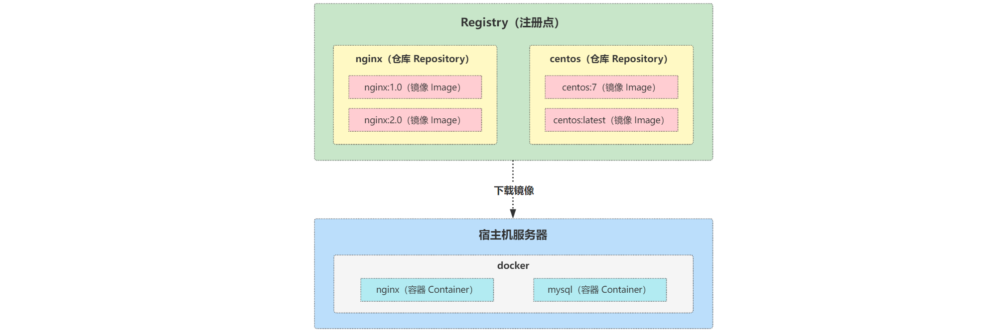

## 发展历程

2008 年，`Solomon Hykes` 和他的朋友 Kamel Founadi、Sebastien Pahl 共同创立了一家名为 `DotCloud` 的公司，目标是利用一种叫做容器的技术来创建一种任何人都可以使用的编程工具。

2010 年，DotCloud 获得了创业孵化器 Y Combinator 的支持，并开始吸引到一些真正的投资，在接下来的 3 年中，dotCloud 内部孵化了一款使用 Go 语言编写，C/S 架构，名为 Docker 的产品。

2013 年 3 月，创始人 Solomon Hykes 在 PyCon 大会上首次公开介绍了 Docker 这一产品。其 `创新式镜像格式` 以及 `容器运行时` 迅速成为社区、客户和更广泛行业的实际标准和基石。可移植的形式和易于使用的工具给应用程序和基础设施之间创造了独立性。容器技术逐渐大众化并成为主流。

docker 最初是在 `Ubuntu 12.04` 上开发实现的，而 `RedHat` 则要从 `6.5` 开始才对其进行支持。

2013 年 3 月 20 日，DotCloud 发布了 Docker 的首个版本，并将 Docker 源码进行了 [开源](https://github.com/docker/)。。

2013 年 9 月，红帽公司成为 Docker 的主要合作伙伴，利用 Docker 来驱动他的 OpenShift 云业务。随后，谷歌、亚马逊以及 DigitalOcean 也迅速的在其云服务平台提供了 Docker 的支持。主流云厂商的加入，加速了 Docker 的发展，Docker 技术也至此开始风靡全球。

2013 年底，Docker 公司名称也由 `DotCloud Inc` 更改为 `Docker Inc`，并全力的主攻到 Docker 项目开发中。

2014 年 6 月，在 `DockerCon` 大会上 Docker 正式发布了 `1.0` 版本。这意味着 Docker 的稳定性和可靠性已经基本满足了生产环境的运行需求。会议上同时也发布 Docker Image 的镜像仓库 [Docker Hub](http://hub.docker.com/)。与此同时，已经有 10 年以上容器管理编排经验的谷歌基于自己内部内部强大的 Borg 系统使用 Go 语言重写出来目前最火的容器编排工具：`Kubernetes`。

2014 年 8 月，Docker Inc 宣布将用于 PaaS 业务服务的 DotCloud 软件出售给德国柏林的 PaaS 服务厂商  CloudControl，自此，DotCloud 正式的和 Docker 分道扬镳。

2014 年 12 月，DockerConEU 大会上，`Docker Swarm` （Docker 集群管理工具）和 `Docker Machine` （部署 Docker 主机的命令工具）同时面世。

> 容器技术不只有 Docker，很早之前 Google 就投资了 CoreOS 来做竞争的容器 `Rocket（rkt）`。那时三家鼎立：Docker / Rocket / Warden。

2015 年 6 月，为了避免惨烈的竞争，由 Docker、IBM、微软、红帽及 Google 等厂商所组成的开放容器项目 `OCP` 联盟成立，隶属 Linux 基金会。该项目旨在建立软件容器的通用标准。Docker 将捐赠其软件容器格式，运行时以及相关规范的代码。应用容器规范（`appc`）计划的领导者，包括创始成员 CoreOS，也将把他们的技术领导力和支持带到 OCP。

2015 年，Docker 发布了 `runC` ，一个轻量级的跨平台的容器运行时命令行小工具。docker 将最初实现由 `LXC，0.7 版本开始去除` 转为自行开发的 `libcontainer`。用户可以直接利用 libcontainer 运行容器，而无需通过 docker engine。这意味着 Docker 真正解决了跨平台的问题，真正做到一次构建到处运行。

2016 年 6 月，DockerCon 大会上，Docker 宣布了 `Open Container Initiative，OCI` 正式成立 。意在业界一起合作，开发一个开放的、标准的容器格式和 Runtime。在 OCI 标准制定后，Docker 也将 `Containerd` 独立拆分，并将其捐赠给了社区。这意味着 Docker 将容器的管理功能移出自身的核心引擎，移入了一个单独的守护进程。

同时，人们也逐渐意识到，容器技术本身的价值是在于容器的编排。然而 Docker 却放弃了自己的 Swarm 项目，想着将容器的编排和集群的管理功能添加到 Docker 自身项目当中。这和 Kubernetes 推进民主化架构，通过暴露 Kubernetes API 让更多的人来不断丰富 Kubernetes 的插件的方案截然相反，当然最终的结果大家也看到了。

2017 年 2 月， 从版本 `1.13` 开始，Docker 版本号开始遵循 `YY.MM-xx` 格式，并以每月发布一个前沿版（Edge），每季度发布一个稳定版（Stable）的进度更新。

2017 年是容器成为主流技术的一年，在 Austin 举办的 DockerCon 上，开源 Docker 项目正式命名为 `Moby` 项目。GitHub 上的 docker/docker 库也被转移到了 moby/moby，并且拥有了项目自己的 Logo。同时，Docker Inc 公司将 Docker 本身拆分为 `Docker-CE` 开源社区免费版和 `Docker-EE` 闭源商业版。

至此，容器天下三分。其中 Moby 由社区维护，Docker-CE 由 Docker 公司维护，Docker-EE 属 Docker 公司闭源商品。

2018 年 3 月，Docker 公司创始人 Solomon Hykes 在 Docker 博客上宣布已正式从 Docker 公司离职，不再担任公司的日常运作工作。未来的身份只是 Docker 的董事会成员、主要股东，以及 Docker 维护者。

2022 年 5 月 3 日， Kubernetes 1.24 版本正式发布，正式移除了内嵌的 `dockershim`，Docker 逐渐走向落幕。

## 为何选择

由于硬件的飞速发展，服务器的性能也随之增强。单个业务的发布无法充分利用硬件资源，导致资源利用率较低。但是如果同一套服务器运行多个业务又可能会互相的影响，产生一系列的问题。

和传统的 VM 虚拟化相比，docker 存在下面的一下优势：

 

**更高效的利用系统资源**

由于 docker 不像传统的 VM 虚拟化需要进行硬件虚拟以及运行完整操作系统，所以系统开销更低，对系统资源的利用率自然更高。无论是应用执行速度、内存损耗还是文件存储速度，都要比传统虚拟化技术更高效。

 

**更快速的启动时间**

传统的虚拟机技术启动应用服务往往需要数分钟，而 Docker 容器应用，由于直接运行于宿主内核，无需启动完整的操作系统，因此可以做到秒级、甚至毫秒级的启动时间。大大的节约了开发、测试、部署的时间。

 

**一致的运行环境**

开发过程中一个常见的问题是环境一致性问题。由于开发环境、测试环境、生产环境的不一致，导致有些 bug 并未在开发过程中被发现。而 Docker 的镜像提供了除内核外完整的运行时环境，确保了应用运行环境一致性。

 

**持续交付和部署**

对开发和运维人员来说，最希望的就是一次创建，到处运行。使用 Docker 可以通过定制应用镜像来实现持续集成、持续交付、部署。开发人员可以通过 Dockerfile 来进行镜像构建测试，而运维人员则可以直接在生产环境中快速部署该镜像。由于 Dockerfile 的构建透明化，不仅开发团队可以理解应用运行环境，运维团队也可以更好的理解应用运行所需条件，帮助更好的在生产环境中部署。

 

**更轻松的迁移**

由于 Docker 确保了执行环境的一致性，使得应用的迁移更加容易。Docker 可以在很多平台上运行，无论是物理机、虚拟机、公有云、私有云，甚至是笔记本，其运行结果是一致的。因此可以很轻易的将应用从一个平台迁移到另一个平台上，而且无需担心运行环境的变化导致应用无法正常运行的情况。

 

**更轻松的维护和扩展**

Docker 使用的分层存储以及镜像的技术，使得应用重复部分的复用更为容易，也使得应用的维护更新更加简单，基于基础镜像进一步扩展镜像也变得非常简单。此外，Docker 团队同各个开源项目团队一起维护了一大批高质量的官方镜像，既可以直接在生产环境使用，又可以作为基础进一步定制，大大的降低了应用服务的镜像制作成本。

## 核心概念

docker 主要包含了四个核心的概念，其关系如图所示：

**镜像（Image）**

操作系统可以分为 `内核` 和 `用户空间`。以 Linux 为例，在内核启动后，会挂载 `root` 文件系统来提供用户空间支持。

镜像其实就相当于一个 root 文件系统。比如 ubuntu 镜像，它本身就包含了一套完整的 ubuntu 最小化文件系统。

当然，镜像是一个特殊的文件系统。除了包含文件以外，还包含了一些为容器运行时准备的配置参数，如：匿名卷，环境变量，用户等。

> 镜像是不包含任何动态数据的，在镜像构建之后里面的内容就不会再发生改变。

作为一个操作系统，即使是最小化，其大小也不小。所以 docker 在设计之时，就利用 `Union FS` 技术，将镜像设计为分层存储。

镜像在构建时会一层一层的叠加。前一层对于后一层都是只读的。这意味着用户想要修改镜像里面的内容，只能自己再加一层，形成一个新的镜像。所以，不管你如何修改新的镜像，其底层的镜像是不会改变的。这样做的好处在于：

> 多个用到相同层级镜像的新镜像可以复用同一层，这样既能节省磁盘空间，也能提升镜像的制作速度，避免每次搞一个新的镜像就得去拉一次底层镜像。毕竟一个操作系统镜像往往都是几百 M 往上。

 

**容器（Container）**

镜像（Image）和容器（Container）的关系就像编程语言中常说的类和实例的关系。镜像属于静态定义，容器是镜像的运行时实体。容器可以被创建，启动，暂停，停止，删除等。

> 容器的实质是进程。

但和宿主机本身运行的进程不同，容器的进程运行在独立的名称空间中。这使得容器可以拥有自己独立的文件系统，网络，进程，用户等。

由于镜像的分层特性，每个运行的容器都相当于在镜像的基础上创建了一个当前容器的存储层用于写入数据。这个存储层会随着容器的销毁而删除。

为了保障数据的安全，同时符合 docker 的设计规范，所有的文件，数据的写入都应该直接写入到额外挂载的 `数据卷（Volume）` 或者 `绑定的宿主机目录` 中。跳过 docker 存储层，直接持久化到宿主机本地或者外部存储，也能提升性能和稳定性。

> 数据卷的生命周期独立于容器，不会随着容器的销毁而删除。

 

**注册点（Registry）**

镜像构建完成之后可以很容易在本机运行，但是如果其他服务器想要使用该镜像，就需要另外一个服务来专门负责集中存储，分发镜像。这个服务就是 `注册点（Registry）`。

> 一个注册点由一个或者多个仓库组成。

常见的注册点分为两类：

* 开放注册点：
  * 网上开放给用户的注册点。用户可以在上面创建自己的仓库，镜像。也可以拉取使用别人的镜像。
  * 最常见的就是 docker 官方提供的 `Docker Hub`，它也是 docker 默认的 registry。上面有着大量的官方镜像供人们使用。
  * 此外还有阿里云，Google 等也提供了自己的 resgistry。
* 私有注册点：
  * 出于数据的安全性考虑，公司使用的注册点一般都是自己搭建或者云厂商们提供的私有服务。其特点在于只有授权的用户才能看到并使用它的镜像。
  * docker 官方开源的 docker registry 镜像能够搭建私有仓库，但是该仓库只有 API 功能，没有图形化界面。
  * 生产中用户一般使用 `Harbor` 或者 `Sonatype Nexus` 搭建自己的私有注册点。

 

**仓库（Repository）**

仓库用于存放同一个镜像不同版本的集合。比如：centos 仓库，它可能包含 centos:7 和 centos:8 镜像。

> 一般通过 `<仓库名称>:<标签>` 这样的格式来区分镜像，如果没有指定标签，则默认使用 `latest` 标签。

仓库名称往往也是由两段组成，比如：dylan/centos 仓库。前者用于区分在多用户的注册点中的用户名，后者一般都是软件名。但这并非绝对，某些仓库就没有用户名，这取决于注册点的配置。

