## 操作说明

查看 container 支持的命令：

```bash
docker container --help
```

支持以下操作：

* `attach`：进入运行的容器。
* `commit`：将运行容器的现状制作成镜像。
* `cp`：容器和宿主机文件之间互相拷贝。
* `create`：创建一个容器。
* `diff`：比较容器不同版本提交的文件差异，列出 3 种容器内文件状态变化（A - Add，D - Delete，C - Change ）的列表清单。
* `exec`：在运行容器中执行命令。
* `inspect`：获取容器的详细信息。
* `kill`：杀死一个或多个容器。
* `logs`：显示容器日志。
* `ls`：列出容器。
* `pause`：暂停容器。
* `port`：列出容器端口映射。
* `prune`：删除所有停止的容器。
* `rename`：重命名容器。
* `restart`：重启容器。
* `rm`：删除容器。
* `run`：创建并运行容器。
* `start`：启动容器。
* `stats`：获取容器资源使用情况。
* `stop`：停止容器。
* `top`：显示容器中运行的进程。
* `unpause`：恢复暂停的容器。
* `update`：更新容器配置。
* `wait`：等待，知道一个或多个容器 stop 才打印退出码。


## 操作示例（常用）

### 创建容器（create）

使用示例：

```bash
# Management Commands（推荐）
docker container create nginx:latest

# Commands
docker create nginx:latest
```

如图所示：

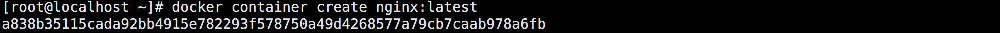

在不指定任何参数的情况下，通过 create 创建的容器不会启动，只会保持 `Created` 状态。

当然，create 这种方式在日常使用中用的比较少，一般会选择使用 `run` 命令进行代替。所以参数也在使用 run 的时候详细说明。


### 查看容器（ps / ls）

使用示例：

```bash
# Management Commands（推荐）
docker container ps
docker container ls

# Commands
docker ps
```

如图所示：

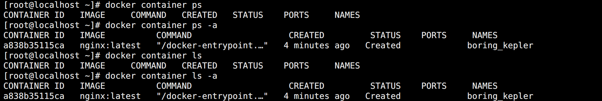

`ps` 和 `ls` 都可以查看运行中的容器，日常 ps 用的比较多。如果不加任何参数，默认只显示 `Up` 状态的容器。

支持以下参数：

* `-a`：查看所有容器 ，最常用的参数。
* `-f 过滤条件`：过滤容器，这一点其实 linux 的 grep 也可以实现类似功能，-f 更全面。
* `-n number`：展示最新创建的 多少个容器。
* `-q`：只显示 Container ID。
* `-s`：显示的时候多显示一栏 SIZE（容器大小）。


### 启动容器（start）

使用示例：

```bash
# Management Commands（推荐）
docker container start boring_kepler

# Commands
docker start boring_kepler
```

如图所示：

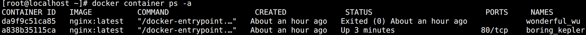

通过 create 创建的容器处于 Created 状态，可以使用 start 启动起来变成 `Up` 状态。


### 查看详情（inspect）

使用示例：

```bash
# Management Commands（推荐）
docker container inspect boring_kepler

# Commands
docker inspect boring_kepler
```

该方法能看到容器运行的详细信息，包括 IP 地址等。


### 停止容器（stop）

使用示例：

```bash
# Management Commands（推荐）
docker container stop boring_kepler

# Commands
docker stop boring_kepler
```

如图所示：

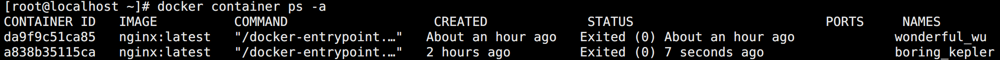

此时容器就变成了 `Exited` 状态，随后将其启动起来，用于后面的测试。


### 暂停容器（pause）

使用示例：

```bash
# Management Commands（推荐）
docker container pause boring_kepler

# Commands
docker pause boring_kepler
```

如图所示：

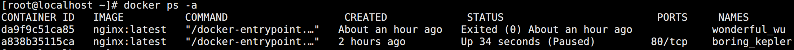

可以看到虽然显示的是 Up 状态，但是后面有个 `Paused` 标记。相比于 stop，这种停止容器的方式更温柔，能够保持容器当前状态。


### 恢复容器（unpause）

使用示例：

```bash
# Management Commands（推荐）
docker container unpause boring_kepler

# Commands
docker unpause boring_kepler
```

如图所示：

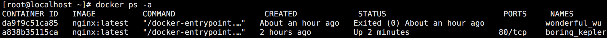


### 杀死容器（kill）

使用示例：

```bash
# Management Commands（推荐）
docker container kill boring_kepler

# Commands
docker kill boring_kepler
```

如图所示：

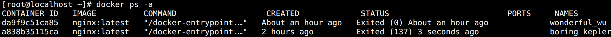

容器变成 `Exited` 状态。


### 重启容器（restart）

使用示例：

```bash
# Management Commands（推荐）
docker container restart boring_kepler

# Commands
docker restart boring_kepler
```

如图所示：


容器恢复 `Up` 状态。


### 进入容器（exec）

在创建启动完成容器后，有时候可能需要进入容器中查看某些配置是否生效或者排查错误，此时就需要交互式进入容器。

目前用的比较多的就是 `exec`，使用示例：

```bash
# Management Commands（推荐）
docker container exec -it boring_kepler /bin/bash

# Commands
docker exec -it boring_kepler /bin/bash
```

如图所示：

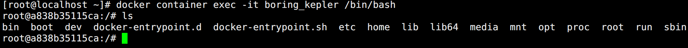

通过 `-it` 参数创建一个交互式 tty 终端进入容器内部，同时还需要指定执行的命令。

一般容器都是有 `/bin/sh` 的，只有部分容器 `/bin/bash`，根据实际情况选择即可。


### 进入容器（attach，不推荐）

使用示例：

```bash
# Management Commands（推荐）
docker container attach boring_kepler

# Commands
docker attach boring_kepler
```

如图所示：

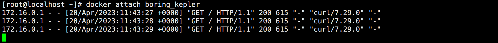

和 exec 不同，如果在创建容器的时候没有使用 `-it` 参数，attach 不会创建交互式终端，而是直接在命令创建 hung 住，此时新开终端访问容器的 nginx 服务，就会直接在命令行界面输出日志信息。如果直接 `Ctrl + C`，容器会直接退出。

如果想要容器不退出，可以使用 `--sig-proxy=false` 参数，那么再次  `Ctrl + C` 就不会退出容器。


### 容器日志（logs）

使用示例：

```bash
# Management Commands（推荐）
docker container logs boring_kepler

# Commands
docker logs boring_kepler
```

如图所示：

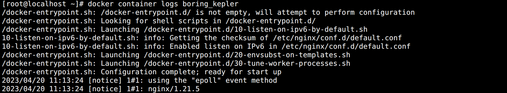

支持以下参数：

* `-f`：相当于 `tail -f`。
* `-n`：指定显示日志的最后多少行数。


### 容器重命名（rename）

使用示例：

```bash
# Management Commands（推荐）
docker container rename boring_kepler demo

# Commands
docker rename boring_kepler demo
```

如图所示：

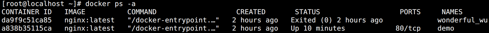


### 容器状态（stats）

使用示例：

```bash
# Management Commands（推荐）
docker container stats demo

# Commands
docker stats demo
```

如图所示：

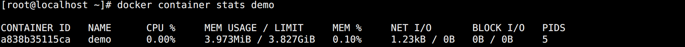

实时动态刷新查看容器的资源使用情况。


### 进程状态（top）

使用示例：

```bash
# Management Commands（推荐）
docker container top demo

# Commands
docker top demo
```

如图所示：

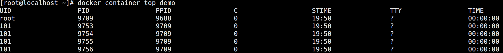

和 linux 的 top 命令类似，能看到容器内各个进程的使用情况。


### 更新容器（update）

使用示例：

```bash
# Management Commands（推荐）
docker container update -c 100 demo
docker container update -m 512M demo

# Commands
docker update -c 100 demo
```

该参数支持直接更新 CPU，内存，IO 配置。


### 删除容器（rm）

使用示例：

```bash
# Management Commands（推荐）
docker container rm -f demo

# Commands
docker rm -f demo
```

如图所示：

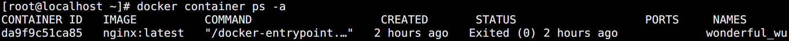

如果容器正在运行，需要使用 `-f` 参数。


### 删除容器（prune）

使用示例：

```bash
# Management Commands（推荐）
docker container prune -f

# Commands
docker prune -f
```

如图所示：

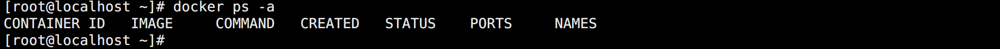

该方法用于删除所有退出状态的容器，通过 `-f` 参数能忽略提示。


### 运行容器（run）

直接运行容器：

```bash
docker container run nginx:latest
```

默认会在前台启动，输出会打印在用户终端，并且 hung 住：

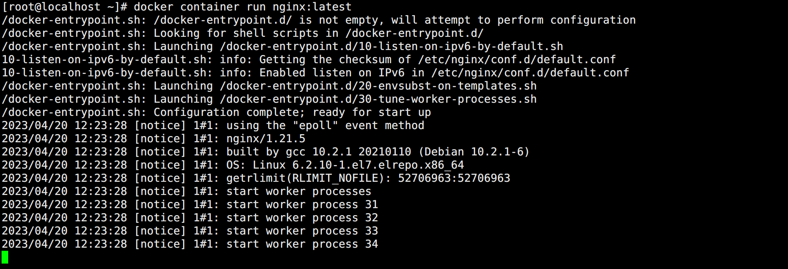

用户可以通过 `Ctrl + C` 退出，容器也会退出，如图所示：

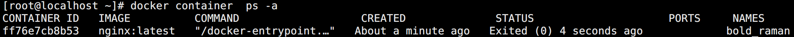

<br>

比较实用的核心参数，红色的为常用的参数：

* `--name`：指定运行的容器名称，默认随机生成的名字。
* `--add-host`：在容器中添加 host 解析。
  * 格式为：`域名:IP`
* --blkio-weight：IO 权重，支持 10-1000，0 禁用。
* `-c，--cpu-shares`：CPU 相对权重。
* `--detach，-d`：守护态运行，将容器运行在后台模式。
  * 所有的 IO 都只能通过网络资源或存储卷来进行交互，容器不再监听执行 docker run 这个命令行窗口。
  * 类似于 Linux 启动程序时候的 `nohup + &` 组合。
* `--dns`：设置容器的 DNS 地址。
* `-e，--env 或 --env-file`：直接设置环境变量或读取文件中变量。
* --expose：声明暴露端口。
* --health-cmd：监控检查命令。
* --health-interval：监控检查间隔。
* --hostname：容器内部主机名。
* --ip：指定容器的 IP 地址。
* `-i，--interactive`：打开一个交互式界面。
* `-t，--tty `：打开一个 TTY 终端。
* --label：给容器打标签。
* --link：连接到其它容器，共享它的网络，Kubernetes 的 Pod 就是这样实现的。
* `-m，--memory`：指定内存。
* `--mount`：挂载文件系统到容器。
  * 挂载 volume 格式：`[type=volume,]source=my-volume,destination=/path/in/container`
  * 创建 bind mount 格式：`type=bind,source=/local/path,destination=/path/in/container`
  * 支持 `readonly` 只读参数。
* --no-healthcheck：禁用健康检查。
* --oom-kill-disable：关闭内存溢出杀死容器。
* `-p，--publish`：暴露端口。
  * 格式为：`宿主机端口:容器端口`
* `-P, --publish-all `：暴露 expose 声明的所有端口。
* --pull：镜像拉取规则：
  * always
  * missing
  * never
* --read-only：只读容器。
* `--restart`：重启策略：
  * `on-failure`：容器停止时，容器出现报错，则容器会被重启。但是如果 docker 服务被重启了该配置就不会生效。
  * `unless-stopped`：容器停止，如果没有报错，则容器会被重启。即使重启了 docker 服务，该配置也生效。
  * `always`：不管如何，容器只要停止就重启。
* `--rm`：容器停止后自动删除，和 --restart 不能同时存在。
* `-v，--volume`：挂载数据卷。
  * 命令格式：`[local-dir:]container-dir[:options]`
  * options 支持 `rw` 和 `ro`。

<br>

一个完善的 run 示例：

```bash
docker container run -d \
    --name nginx-demo \
    --hostname nginx-demo \
    --add-host baidu.com:192.168.2.1 \
    -e ServiceName="nginx" \
    -e ServiceVersion="latest" \
    --label service="nginx" \
    -p 8080:80 \
    --mount type=bind,source=/tmp,destination=/opt,readonly \
    -v /tmp:/data:rw \
    --restart on-failure \
    nginx:latest
```

如图所示：

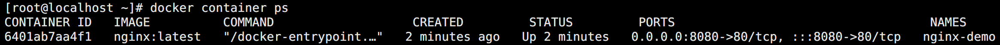


