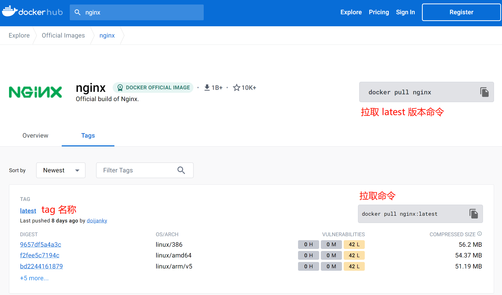

## Docker Hub

Docker Hub 作为默认的注册点，不管是官方还是第三方都上传了很多可以直接拿来使用的镜像。

> https://hub.docker.com

通过搜索功能可以直接搜索到相关的镜像：


<br>

以 nginx 镜像为例：


<br>

镜像信息：


<br>

镜像版本：



<br>

除了在 Docker Hub 页面搜索镜像之外，也可以在命令行字节搜索：

```bash
docker search nginx
```

如图所示：


## 操作说明

docker 所有支持的命令都可以使用 `docker --help` 看到。同时通过该命令也可以发现，docker 的命令分为四大类：

* `Common Commands`

* `Commands`

* `Management Commands` 
* `Swarm Commands`

在 docker 设置之初是没有分类这一概念，到后面因为命令多了加入了分类。所以在学习 docker 命令的时候，建议养成使用 Management Commands 的习惯。虽然命令可能更复杂一点，但是说不定单纯的 Commands 说不定哪天就被删除了。

对于镜像支持的操作，可以使用命令查看：

```bash
docker image --help
```

支持以下操作：

* `build`：通过 Dockerfile 构建镜像。
* `history`：查看镜像历史操作。
* `import`：从导出的镜像压缩包中导入镜像到本机。
* `inspect`：插件镜像的详细信息。
* `load`：从导出的镜像压缩包中导入镜像到本机。
* `ls`：列出镜像。
* `prune`：移除未使用的镜像。
* `pull`：拉取镜像。
* `push`：推送镜像。
* `rm`：删除镜像。
* `save`：保存镜像到压缩文件。
* `tag`：给镜像打标签，相当于复制源镜像生成另外一个镜像（逻辑上），物理上还是同一个镜像。


## 操作示例（常用）

### 拉取镜像（pull）

使用示例：

```bash
# Management Commands（推荐）
docker image pull nginx:latest

# Common Commands
docker pull nginx:latest
```

如图所示：


通过镜像后面不带 tag 则默认拉取 `latest` 版本，同时，拉取命令更推荐使用 Management Commands，意思更明确。

从拉取的过程也可以发现，docker 镜像是分层的，各层在拉取的时候互不影响，各拉各的。


### 列出镜像（ls）

使用示例：

```bash
# Management Commands（推荐）
docker image ls

# Common Commands
docker images
```

如图所示：


通过该命令可以了解镜像的相关信息：

1. 唯一标识一个镜像的方法有两种方法：`<REPOSITORY>:<TAG>` 或 `IMAGE ID`。
2. `IMAGE ID`， 虽然不完整，但是显示的部分一般已经足够区分不同镜像。
3. 镜像的大小。

<br>

ls 常用的参数：

* `镜像名称`：只显示指定镜像。

* `-a`：显示所有。
* `-q`：只显示镜像的 ID。
* `-f`：筛选镜像：
  * since：查看某个版本之后的镜像，例如 `-f since=nginx:1.20`
  * before：查看某个版本之前的镜像，例如 `-f before=nginx:1.20`
  * label：在定义镜像是指定了 label，也可以通过它筛选，例如 `-f label=version=1.0`


### 镜像详情（inspect）

使用示例：

```bash
# Management Commands（推荐）
docker image inspect nginx:latest

# Common Commands
docker inspect nginx:latest
```

如图所示：


包含了镜像的完整 ID，运行参数，环境变量定义，暴露端口，数据持久化等详细信息。


### 导出镜像（save）

使用示例：

```bash
# Management Commands（推荐）
docker image save nginx:latest -o /tmp/image.tar

# Common Commands
docker save nginx:latest -o /tmp/image.tar
```

如图所示：


可以同时导出一个也可以是多个镜像。常用于将一台机器的镜像复制到另外一台上。


### 删除镜像（rm）

使用示例：

```bash
# Management Commands（推荐）
docker image rm nginx:latest

# Common Commands
docker rmi nginx:latest
```

如图所示：


镜像的删除也是分层删除，除此之外，还支持以下参数：

* `-f`：如果有通过该镜像创建的容器正在运行，则无法直接删除镜像。需要使用 `-f` 参数强制删除，容器也会跟着删除。

除此之外，还可以结合其它命令完成复杂的删除操作：

```bash
# 删除 redis 所有镜像
docker image rm $(docker image ls -q redis)

# 删除 mongodb 3.2 之前的所有镜像
docker image rm $(docker image ls -q -f before=mongo:3.2)
```


### 导入镜像（load）

使用示例：

```bash
# Management Commands（推荐）
docker image load -i /tmp/image.tar

# Common Commands
docker load -i /tmp/image.tar
```

如图所示：


### 镜像标签（tag）

使用示例：

```bash
# Management Commands（推荐）
docker image tag nginx:latest ezops.cn/devops/nginx:latest

# Common Commands
docker tag nginx:latest ezops.cn/devops/nginx:latest
```

如图所示：


虽然 tag 命令是给镜像打 TAG，但是也可以对镜像仓库（REPOSITORY）进行修改。

这里的 repository 常常被当作镜像名称来使用，由于 docker 默认的 registry 是 Docker Hub，所以来自 Docker Hub 的镜像都被省略了前缀，它完整的 repository 名称应该是：`docker.io/library/nginx`。

所以用户可以如果拥有私有化部署的 registry，就可以通过该方法修改从其它 registry 拉取的镜像的 repository 到自己的 registry 地址，让后将这个镜像上传到自己的私有 registry。


### 删除未使用镜像（prune）

使用示例：

```bash
# Management Commands（推荐）
docker image prune -a

# Common Commands
docker prune -a
```

如图所示：


如果镜像没被使用就会被删除掉。


### 虚悬镜像（dangling）

本地有一个镜像，然后又拉到了一个同名同标签的镜像，此时新的镜像会占用这个名称个 TAG，那么旧的镜像变成下面这样：

```bash
REPOSITORY          TAG                 IMAGE ID            CREATED             SIZE
<none>              <none>              00285df0df87        5 days ago          342 MB
```

这种情况常常出现在 latest 标签的镜像上，如果它只有 latest 标签，那下一次更新拉取就会被抢占 TAG，从而变成 `虚悬镜像（dangling image）`。

想要删除该类镜像就要使用 IMAGE ID 来删除了：

```bash
# 过滤虚悬镜像
docker image ls -f dangling=true

# 删除镜像
docker image rm -f 00285df0df87
```


### 镜像大小（system）

使用 ls 只能看到单个镜像占用的磁盘空间，并不能知道所有镜像的占用。想要获取所有，可以通过：

```bash
docker system df
```

如图所示：


除了能看到镜像，还能看到容器等数量，容量信息。


