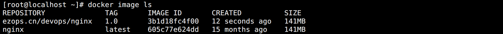
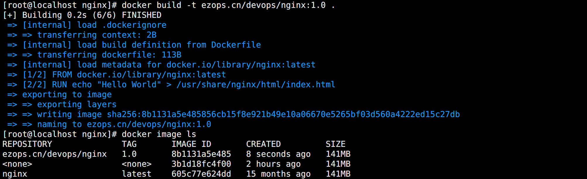

## 利用容器构建镜像

在容器章节有一个方法没说明，就是 `commit` 方法，该方法能帮助用户将当前正在运行的容器的状态打包成镜像。

 ```bash
docker container commit -a dylan -m "container to image" -p nginx-demo ezops.cn/devops/nginx:1.0
 ```

可选参数说明：

* `-a`：作者信息。
* `-m`：commit 信息。
* `-p`：镜像制作过程中暂停镜像。

如图所示：



使用 commit 创建的镜像意味着所有对镜像的操作都是黑箱操作，这样生成的镜像被称为 `黑箱镜像`。

换句话说，除了制作镜像的人知道执行过什么命令、怎么生成的镜像，别人根本无从得知。即使是制作人，过段时间后也可能会忘记。

而且，由于镜像分层存储的特点，除当前层外，之前的每一层都是不会发生改变的，这意味着任何修改的结果仅仅是在当前层进行标记、添加、修改，而不会改动上一层。即使是删除，上一层的东西也并不会丢失。镜像会越来越臃肿。

同时还有另外一个问题，容器中某些进程可能是动态的，过段时间会退出。如果使用 commit 制作镜像，这些进程可能不会保存到镜像中。

所以，由于上面的种种问题，commit 的方式并不适用于生产应用中，此时就需要另一种方式构建镜像，`Dockerfile`。


## Dockerfile

镜像的定制实际上就是定制每一层所添加的配置、文件。如果能把每一层的修改、安装、构建、操作的命令都写入一个脚本，用这个脚本来构建、定制镜像，那之前 Commit 的无法重复、镜像构建透明性、体积的问题就都会解决。这个脚本就是 `Dockerfile`。

Dockerfile 是一个文本文件，其内包含了一条条的 `指令（Instruction）`，每一条指令构建一层。

以创建一个 nginx 镜像为例：

```bash
# 创建存放 Dockerfile 的目录
mkdir /devops/dockerfile/nginx
cd /devops/dockerfile/nginx
```

创建文件 `Dockerfile`：

```bash
FROM nginx:latest
RUN echo "Hello World" > /usr/share/nginx/html/index.html
```

构建镜像：

```bash
docker image build -t ezops.cn/devops/nginx:1.0 .
```

如图所示：



结果说明：

* build 命令最后有一个 `.`，表示构建上下文，后面不会单独说明，不能省略。

* 每一个 Dockerfile 都需要有一个基础镜像，通过 `FROM` 指定。
* 从构建过程可以说明，每一个指令就是一层镜像，这个 Dockerfile 有两个指令，所以输出了两层。
* 由于本地已经有了同名同 TAG 的镜像，所以当这个镜像被打包完成后就抢占了之前镜像的名称和 TAG，之前的镜像就变成了 `虚悬镜像`。


## 镜像构建上下文

关于 build 命令最后那个 `.`，其实不是指 Dockerfile 的路径，而是指定 `上下文路径`。

想要理解上下文，首先要理解 `build` 的工作原理：

Docker 的运行分为服务端 Docker 引擎（守护进程）和客户端工具。服务端 Docker 引擎提供了一组 REST API，称为 `Docker Remote API`。docker 命令这样的客户端工具就是通过这组 API 与 Docker 引擎交互，从而完成各种功能。

当执行 docker 命令时，虽然表面上是在本机执行，但实际上一切都是使用的远程调用形式在服务端（Docker 引擎）完成。这就是典型的 C/S 设计，让操作远程服务器的 Docker 引擎变得轻而易举。

在进行镜像构建时，并非所有定制都会通过 `RUN` 指令完成，经常会需要将一些本地文件复制进镜像，比如通过 `COPY` 指令、`ADD` 指令等。而 build 命令构建镜像，其实并非在本地构建，而是在服务端，也就是 Docker 引擎中构建的。那么在这种客户端/服务端的架构中，如何才能让服务端获得本地文件呢？

这就引入了上下文的概念。当构建的时候，用户会指定构建镜像上下文的路径，build 命令得知这个路径后，会将路径下的所有内容打包，然后上传给 Docker 引擎。这样 Docker 引擎收到这个上下文包后，展开就会获得构建镜像所需的一切文件。这也意味着，上下文路径一定要干净，只存放构建所需的文件，否则其他文件也会被上传到服务端，造成浪费资源。

<br>

以 Dockerfile 为例：

```dockerfile
COPY ./package.json /app/
```

该指定并不是复制当前目录的 package.json 文件，也不是 Dockerfile 所在目录的 package.json 文件，而是上下文目录中的 package.json。

因此，`COPY` 这类指令中的源文件的路径都是相对路径。这也是为何 `COPY ../package.json /app` 或者 `COPY /opt/xxxx /app` 无法工作的原因，因为这些路径已经超出了上下文的范围，Docker 引擎无法获得这些位置的文件。如果真的需要那些文件，应该将它们复制到上下文目录中去。

所以，制作 Dockerfile 的目录尽量满足以下需求：

* 一个空目录。
* 将所有需要的文件都复制一份到当前目录。
* 如果目录下有文件不需要被发送到 Docker 引擎，可以创建一个类似 `.gitignore` 一样语法的文件 `.dockerignore`。

默认情况下，如果不特殊指定 Dockerfile 路径，默认会将上下文路径中的名为 Dockerfile 的文件作为 Dockerfile。

Dockerfile 也并非文件就要叫 Dockerfile，可以通过 `-f` 指定其它文件，但是一般不这样做。


## Dockerfile 指令

### FROM

`FROM` 指令是 Dockerfile 最基础的关键字，用于指定基础镜像。格式为：

* `FROM 镜像名称`

如果想自己做一个基础镜像，则可以使用 `FROM scratch`，scratch 镜像是 Docker 官方提供的一个虚拟空白镜像。

基础镜像不以任何系统为基础，直接将可执行文件复制到镜像中，该文件必须包含运行所需的所有库。这种镜像更小，非常适合 Go 开发的程序。

使用示例：

```bash
FROM nginx:latest

# 创建空白镜像
FROM scratch
```


### LABEL

`LABEL` 指令用来给镜像以键值对的形式添加一些元数据（metadata），以前使用 `MAINTAINER`，现在已经被废弃。格式为：

* `LABEL key1=value1 key2=value2`

如果标签太多，为了方便查看，可以使用 `\` 换行符镜像换行。

使用示例：

```bash
LABEL name="Dylan" age="18" city="ShenZhen"
```


### RUN

`RUN` 指令用来执行命令行命令。由于命令行的强大能力，`RUN` 指令在定制镜像时是最常用的指令之一。其格式有两种：

* shell 格式：`RUN <命令 + 参数>`
* exec 格式：`RUN ["命令", "参数1", "参数2"...]`

执行方式：

- Linux：默认为 `/bin/sh -c`
- Windows：默认为 `cmd /S /C`

特别注意：

> 由于 Dockerfile 中每个关键字就是一层，Union FS 会有最大层数限制，以 AUFS 为例，最大支持 127 层。为了减少镜像的层数，一般使用 `&&` 连接多个命令，`\` 进行换行，提高阅读性。

使用示例：

```bash
RUN cd /devops && yum -y install nginx \
	&& cd /etc/nginx \
	&& rm -f nginx.conf
```


### WORKDIR

`WORKDIR` 指令用于为 Dockerfile 中所有的 RUN、CMD、ENTRYPOINT、COPY 和 ADD 指令设定工作目录。格式为：

* `WORKDIR 目录`

使用 WORKDIR 指定的工作目录，会在构建镜像的每一层中都存在，如果该目录不存在，会自动创建。

在 Dockerfile 文件中，WORKDIR 指令可出现多次，其路径也可以为相对路径，不过，它的路径是相对此前一个 WORKDIR 指令指定的路径。同时，WORKDIR 也可调用由 ENV 指定定义的变量。

使用示例：

```bash
FROM busybox:latest
WORKDIR /a
RUN cd /tmp && echo $(pwd) >> /tmp/1.txt
RUN echo $(pwd) >> /tmp/1.txt
WORKDIR b
RUN echo $(pwd) >> /tmp/1.txt
```

最终查看 1.txt 的内容为：

```bash
/tmp
/a
/a/b
```

这意味着 RUN 执行的 cd 只在当前层生效，其实本该也是这样，下一个指令已经相当于新的容器了。


### COPY

`COPY` 指令用于将上下文目录中的文件或者目录复制到容器里指定路径，类似 RUN 指令，支持两种格式：

* `COPY [--chown=<user>:<group>] <源路径>... <目标路径>`
* `COPY [--chown=<user>:<group>] ["<源路径1>",... "<目标路径>"]`

源文件或者源目录支持通配符表达式，规则要满足 Go 的 `filepath.Match` 规则。且源路径必须是 build 上下文中的路径，不能是其父目录中的文件。

如果源路径是目录，则其内部文件或子目录会被递归复制，但源路径目录自身不会被复制。

如果指定了多个源路径，或在源路径中使用了通配符，则目标路径必须是一个目录，且必须以 `/` 结尾。

目标路径是容器内的指定路径，可以是绝对路径，也可以是 WORKDIR 的相对路径。如果目标路径事先不存在，它将会被自动创建，包括其父目录。

COPY 指令能保留文件的各种元数据，比如创建时间，读写权限等。

使用示例：

```bash
# 拷贝文件
COPY package.json /app/

# 拷贝多个文件
COPY package* /app/

# 拷贝并修改权限
COPY --chown=nobody:nobody package* /app/
```


### ADD

`ADD` 指令和 COPY 类似，使用方式也一样，但不推荐使用，因为没有 COPY 定义明确。格式为：

* `ADD 源文件/URL 目标目录/`

ADD 源路径支持 URL，Docker 会去 URL 下载文件，并保存成 600 权限，如果 URL 是压缩也文件不会解压。

如果本地源文件是 tar，gzip，bzip2，xz 等格式的压缩文件，ADD 会自动解压。如果不想解压，则不能使用 ADD 指令。

使用示例：

```bash
ADD ubuntu.tar.gz /app/
```


### ENV

`ENV` 指令用于设置环境变量，在后面的指令中可以直接使用 `${变量名}` 的方式引用，容器中也可以看到。支持两种格式：

* `ENV <key> <value>`
* `ENV <key1>=<value1> <key2>=<value2>...`

使用示例：

```bash
ENV VERSION="1.0" \
	NAME="Dy1an"
```


### ARG

`ARG` 指令功能和 ENV 类似，用于定义构建参数。不同在于 ARG 设置的是构建环境的环境变量，在容器运行时这些变量不会存在。格式为：

* `ARG <参数名>[=<默认值>]`

该默认值可以在 `docker build` 中使用 `--build-arg <参数名>=<值>` 来覆盖，起到传参构建的目的。

ARG 指令有作用范围，如果是在 FROM 之前使用，则只能 FROM 指令中使用该变量。想要继续使用就得重新定义。

使用示例：

```bash
ARG REGISTRY_URL="ezops.cn" \
	IMAGE_NAME="busybox" \
	IMAGE_TAG="1.0"
FROM ${REGISTRY_URL}/${IMAGE_NAME}:${IMAGE_TAG}
```


### USER

`USER` 指令指定当前用户和用户组，影响范围和 WORKDIR 类似。格式为：

* `USER <用户名>[:<用户组>]`

USER 指令只是切换用户，所以这个用户必须先创建好。

如果脚本是 root 运行，但是容器中启动服务需要使用其他用户，建议下载 `gosu` 代替原本的 su 或者 sudo，可以避免很多问题。 

USER 指令可以被 `docker run` 命令中使用 `-u` 参数覆盖。

使用示例：

```bash
RUN useradd -r -g demo \
	&& wget -O /usr/local/bin/gosu "https://github.com/tianon/gosu/releases/download/1.16/gosu-amd64" \
    && chmod +x /usr/local/bin/gosu \
    && gosu demo true
```


### EXPOSE

`EXPOSE` 指令用于声明容器运行时提供服务的端口，只是声明，在容器运行时并不会因为这个声明应用就会开启这个端口的服务。格式为：

* `EXPOSE <端口1> [<端口2>...]`

在 Dockerfile 中写入这样的声明有两个好处：

* 帮助镜像使用者理解这个镜像服务的守护端口，以方便配置映射。
* 运行时使用随机端口映射时，也就是 `run -P` 时，会自动随机映射 `EXPOSE` 的端口。

使用示例：

```bash
EXPOSE 8080
```


### CMD

`CMD` 指令用于指定容器默认的主进程启动命令。支持两种格式：

* shell 格式：`CMD <命令 + 参数>`
* exec 格式：`CMD ["命令", "参数1", "参数2"...]`

shell 格式最终也会被 docker 转换成 exec 格式。

> exec 格式在解析时会被解析为 JSON 数组，因此一定要使用双引号 `"`，而不要使用单引号。

在容器运行时，可以指定新的命令来替代镜像中设置的 CMD 默认命令。

比如：ubuntu 镜像默认的 CMD 是 /bin/bash，run -it 启动会直接进入容器的 bash。可以在运行时指定其它命令，如 `docker run -d ubuntu sleep 300` 的方式替换掉默认的 /bin/bash 命令。

特别注意：

> docker 不是虚拟机，容器中的应用都应该以前台执行，不能用 `systemd` 去启动后台服务，容器内没有后台服务的概念。

对于容器而言，启动命令就是容器的应用进程，容器为主进程而存在，主进程退出，容器就失去了存在的意义，从而跟着退出，其它进程它不关心。所以通过后台启动服务，启动命令执行后，主进程就结束了，容器就会立即退出。

所以 nginx 的启动方式为：

```bash
CMD ["nginx", "-g", "daemon off;"]
```


### ENTRYPOINT

`ENTRYPOINT` 指令的目的和 CMD 一样，都是在指定容器启动程序及参数。

它的启动命令也是可以被替换的，不过比 CMD 繁琐，需要通过 docker run 的参数 `--entrypoint` 来指定。也支持两种格式。

相较于 CMD，ENTRYPOINT 常用于解决灵活传参的问题，比如以下示例：

```bash
FROM busybox
CMD [ "curl", "-s", "http://myip.ipip.net" ]
```

生成的镜像可以通过 `docker run 镜像名称` 实现类似查询容器公网 IP 的功能。

此时如果想要在输出 IP 地址的同时，也输出请求头信息，则需要在 curl 命令中加入 `-i` 参数。

如果是 CMD，则只能通过修改 Dockerfile，加入参数，重新打包镜像的方式实现。

但如果是 ENTRYPOINT，则可以直接使用 `docker run 镜像名称 -i`。原因在于：

> 运行镜像后面的参数只会覆盖 CMD 中定义的内容，且 CMD 中定义的内容最终会被当成参数传递给 ENTRYPOINT。

<br>

通过用户传参调整镜像功能示例：

```bash
FROM busybox
WORKDIR /
COPY docker-entrypoint.sh /
ENTRYPOINT ["docker-entrypoint.sh"]
```

`docker-entrypoint.sh` 脚本内容为：

```bash
#!/bin/sh
if [ "$1" = 'hello' ]; then
	echo "Hello"
else
	echo "World"
fi
```

由此可见，ENTRYPOINT 的功能比 CMD 更强大，建议使用它结合 docker-entrypoint.sh 脚本使用。

通过脚本，能实现很多复杂的需求，而且阅读性，可维护性更强。

在写 Dockerfile 时，ENTRYPOINT 或 CMD 指令如果写了多条，那么只有最后一条才生效。


### VOLUME

`VOLUME` 指令用于挂在一个或多个存储卷。格式为：

* `VOLUME ["<路径1>", "<路径2>"...]`
* `VOLUME <路径>`

容器运行时应尽量保持容器存储层不发生写操作，但数据写入往往又是不可避免的。为了防止运行时用户忘记将动态文件所保存的目录挂载为卷，可以在 Dockerfile 中事先指定某些目录挂载为匿名卷，这样在运行时如果用户不指定挂载，其应用也可以正常运行，不会向容器存储层写入大量数据，而且能是现实数据的持久化。

使用示例：

```bash
VOLUME /data
```

这里的 `/data` 目录就会在容器运行时自动挂载为匿名卷，任何向 `/data` 中写入的信息都不会记录进容器存储层，从而保证了容器存储层的无状态化。当然，运行容器时可以通过 `-v` 参数覆盖这个挂载设置。

所谓的匿名卷，其实就是 docker 定义的 volume，隐射的就是 docker 宿主机上的对应的目录。后面会单独说明。


### HEALTHCHECK

`HEALTHCHECK` 指令用于告诉 Docker 应该如何进行判断容器的状态是否正常。支持以下格式：

* `HEALTHCHECK [选项] CMD <命令>`：设置检查容器健康状况的命令。
* `HEALTHCHECK NONE`：如果基础镜像有健康检查指令，使用这行可以屏蔽掉其健康检查指令。

在没有 HEALTHCHECK 指令前，Docker 引擎只可以通过容器内主进程是否退出来判断容器是否状态异常。很多情况下这没问题，但是如果程序进入死锁或死循环状态，应用进程并不会退出，但是容器已经无法提供服务，这不符合应用高可用原则。HEALTHCHECK 指令的价值就在于能够比较真实的反应容器实际状态。

当在一个镜像指定了 HEALTHCHECK 后，用其启动容器，初始状态会为 `starting`，在 HEALTHCHECK 检查成功后变为 `healthy`，如果连续一定次数失败，则会变为 `unhealthy`。

HEALTHCHECK 支持下列选项：

- `--interval=<间隔>`：两次健康检查的间隔，默认为 30 秒。
- `--timeout=<时长>`：健康检查运行超时时间，如果超过这个时间，本次健康检查就被视为失败，默认 30 秒。
- `--retries=<次数>`：当连续失败指定次数后，则将容器状态视为 `unhealthy`，默认 3 次。

和 CMD, ENTRYPOINT 一样，HEALTHCHECK 只可以出现一次，如果写了多个，只有最后一个生效。

使用示例：

```bash
HEALTHCHECK --interval=5s --timeout=3s CMD curl -fs http://localhost/ || exit 1
```

容器运行后，使用 docker container ls 就可以看到健康状态。使用 docker container inspect xxx 可以看到检测信息。


### SHELL

`SHELL` 指令用于指定 RUN，ENTRYPOINT，CMD 指令的 shell，Linux 中默认为 `["/bin/sh", "-c"]`。格式为：

* `SHELL ["executable", "parameters"]`

使用示例：

```bash
SHELL ["/bin/sh", "-cex"]
```


### ONBUILD

`ONBUILD` 是一个特殊的指令，它后面跟的是其它指令，比如 RUN, COPY 等，这些指令在当前镜像构建时并不会被执行。只有当以当前镜像为基础镜像，去构建下一级镜像的时候才会被执行。

使用示例：

```bash
FROM node:slim
WORKDIR /hello
ONBUILD RUN mkdir world
CMD [ "/bin/sh", "-c", "echo Hello" ]
```


### STOPSIGNAL

`STOPSIGNAL` 指令用于设置将发送到容器的退出系统信号。

这个信号可以是一个有效的无符号数字，与内核的 `syscall` 表中的位置相匹配，如 `9`，或者是 `SIGNAME` 格式的信号名，如 `SIGKILL` 。格式为：

* STOPSIGNAL signal

默认的停止信号是 `SIGTERM`，在 `docker stop` 的时候会给容器内 PID 为 1 的进程发送这个signal，通过 `--stop-signal` 可以设置自己需要的 signal。

这样做的主要的目的是为了让容器内的应用程序在接收到 signal 之后可以先做一些事情，实现容器的平滑退出。

如果不做任何处理，容器将在一段时间之后强制退出，会造成业务的强制中断，这个时间默认是 10s。


## Dockerfile 编写规范

在制作 Dockerfile 的时候，应该尽可能的遵守一些约定俗称的方法和建议：

* 容器应该是短暂的

  * 通过 Dockerfile 构建的镜像生命周期不宜过长，容器从销毁到创建都应该将工作量降到最小。

* 增加 `.dockerigonre` 文件

  * 每一个项目都应该有一个单独的目录，单独的 .dockerignore 文件用于忽略不需要的文件或目录，构建镜像所需的文件都应该存放到该目录下。

* 避免不必要的文件，使用多阶段构建

  * 在 Dockerfile 的每一层定义中，在进入下一层之前，都需要删除掉其它不需要的文件，以此尽可能的减小镜像的体积。
  * 比如通过 Dockerfile 直接完成打包，运行，打包这一步除了打出来的包其它的文件其实都是没用的，此时就是和多阶段构建。

* 一个容器只运行一个进程

  * 应该保证每个容器只有一个进程，多个进程解耦到不同容器中，便于后续的扩展。

* 将多行参数排序

  * 某些参数太多太长需要换行的，尽可能按照字母顺序排序，这样可以避免重复。

* 使用构建缓存

  * 在镜像的构建过程中，Docker 会遍历 Dockerfile 文件中的指令，然后按顺序执行。在执行每条指令之前，Docker 都会在缓存中查找是否已经存在可重用的镜像，如果有就使用现存的镜像，不再重复创建。如果你不想在构建过程中使用缓存，你可以在 `docker build` 命令中使用 `--no-cache=true` 选项。


## 多阶段构建示例

多阶段构建，前一阶段的镜像会被丢弃，只保留需要的结果：

```bash
# 第一阶段，打包。使用 as 对阶段进行命名，每一个 FROM 就是一个阶段
FROM golang:latest as build
WORKDIR /go/src/github.com/alexellis/href-counter/
RUN go get -d -v golang.org/x/net/html 
COPY app.go .
RUN CGO_ENABLED=0 GOOS=linux go build -a -installsuffix cgo -o app .

# 第二阶段，运行。
FROM alpine:latest
RUN apk --no-cache add ca-certificates
WORKDIR /root/
# 从第一阶段中拷贝打好的包，build 为第一阶段的名称
COPY --from=build /go/src/github.com/alexellis/href-counter/app .
CMD ["./app"] 
```

多阶段构建的好处在于，能够最小化的减小镜像的大小。


## 完整示例

TOMCAT 示例：

```bash
# 基础就像
FROM centos

# 定义元数据
LABEL auhtor="Dy1an" \
	  email="1214966109@qq.com" \
	  desc="TOMCAT Demo Dockerfile"

# 定义环境变量
ENV WORK_PATH=/ops \
	ENV_PATH=${WORK_PATH}/env \
	SERVICE_PATH=${WORK_PATH}/service

# 添加 JDK
ADD jdk-8u11-linux-x64.tar.gz ${ENV_PATH}/

# 添加 TOMCAT
ADD apache-tomcat-9.0.22.tar.gz ${SERVICE_PATH}/

# 拷贝文件
COPY ROOT.war ${SERVICE_PATH}/webapps/

# 进入目录
WORKDIR ${SERVICE_PATH}/webapps/

# 解压安装包
RUN unzip ROOT.war -d ROOT && rm -f ROOT.war

# 定义环境变量
ENV JAVA_HOME=${ENV_PATH}/jdk1.8.0_11 \
	CLASSPATH $JAVA_HOME/lib/dt.jar:$JAVA_HOME/lib/tools.jar \
	CATALINA_HOME=${SERVICE_PATH}/apache-tomcat-9.0.22 \
	PATH $PATH:$JAVA_HOME/bin:$CATALINA_HOME/lib:$CATALINA_HOME/bin

# 声明端口
EXPOSE 8080

# 启动项目
CMD ${CATALINA_HOME}/bin/startup.sh && tail -f ${CATALINA_HOME}/logs/catalina.out
```

