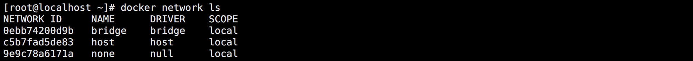
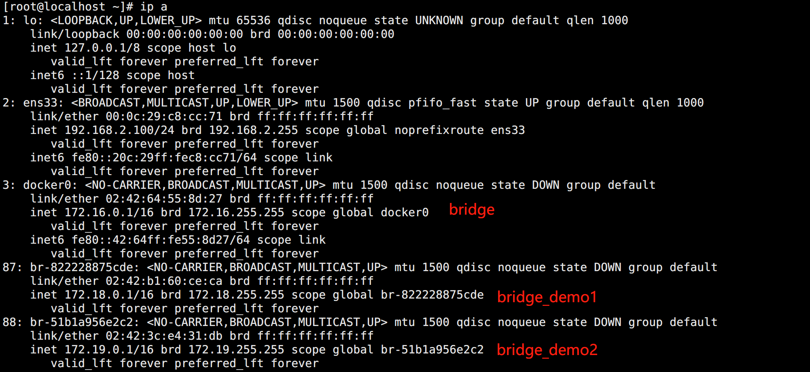
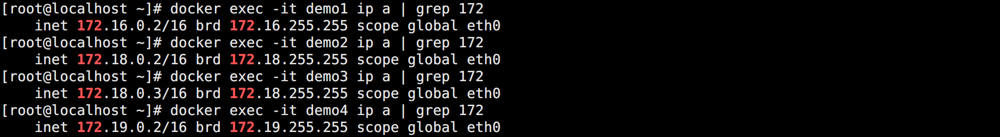
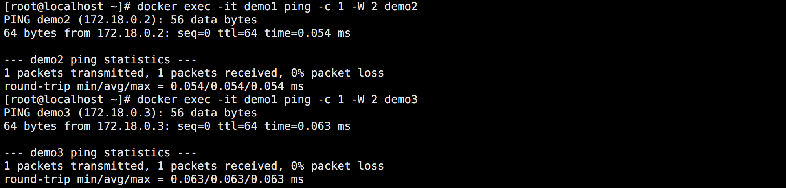
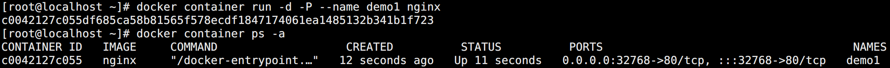
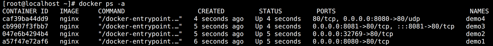

## 网络模式

容器的网络通信可以分为两大方面：`单主机上的容器之间相互通信` 和 `跨主机的容器相互通信`。

docker 的单主机通信基于 Network Namespace 实现，它可以为容器创建隔离的网络环境。

docker 官方本身提供了 5 种网络模式，可以基本满足日常开发中的需求：

| 网络模式   | 说明                                                         |
| ---------- | ------------------------------------------------------------ |
| bridge     | 默认，为每个容器分配一个 IP，该 IP 会连接到 docker 宿主机的 docker0 虚拟网卡 |
| host       | 容器不会拥有自己的虚拟网卡和 IP，而是直接使用宿主机的 IP 和端口 |
| none       | 为容器创建独立网络名称空间，但不做任何网络配置，容器中只有 lo，用户可以就此对容器网络做任意定制 |
| container  | 类似 host，容器不会拥有自己的网卡和 IP，而是和一个指定的容器共享 IP，端口等 |
| 用户自定义 | 在 docker 1.9 以后新增的特性，允许容器使用第三方的网络实现或者创建单独的 bridge 网络，提供网络隔离能力 |


在安装完成 docker 之后，会默认创建三种网络：

```bash
docker network ls
```

如图所示：



在运行容器时，可以使用 `--network` 或者 `--net` 指定容器使用的网络模式，如：`--net bridge`。

同时也可以使用命令查看网络模式下有哪些容器：

```bash
docker network inspect bridge
```


## 桥接网络（bridge）

`bridge` 模式是 docker 默认的网络模式，也是开发者最常使用的网络模式。

创建容器时通过参数 `--net bridge` 或者 `--network bridge` 指定，也可以不指定默认。

在这种模式下，docker 为容器创建独立的网络栈，保证容器内的进程使用独立的网络环境，实现容器与容器之间、容器与宿主机之间的网络栈隔离。

同时，通过宿主机上的 docker0 网桥，容器可以与宿主机乃至外界进行网络通信。其网络模型可以参考下图：


大致流程如下：

1. docker 先创建一对虚拟网卡 `veth pair` 设备（其特征为：成对出现，数据从一个设备进入，就会从另一个设备出来，常用于实现数据通道）。

2. docker 将 veth pair 设备的一端放在新创建的容器中，并命名为 eth0。

3. docker 将 veth pair 设备的另一端放在宿主机中，以 vethxxx 格式命名，并将它加入到 docker0 网桥中（可通过 `brctl show` 命令查看到）。

4. 从 docker0 子网中分配一个 IP 给容器使用，并设置 docker0 的 IP 为容器的默认网关。

`docker0` 虚拟网卡时在 docker 安装完后自动创建的。作用类似网络交换设备，用于实现容器之间，容器与宿主机甚至与外部主机之间的通信。网桥的 IP 一般会是 docker 配置网段的第一个 IP，且这个 IP 会作为 bridge 网络模式的容器的网关使用。

特别注意：

> 由于之前配置 docker 时有另外指定了 IP 网段，所以我们的环境网段为：`172.16.0.0/16` 而不是 docker 默认的网段 `172.17.0.0/16`。


## 主机网络（host）

`host` 网络模式的容器可直接使用宿主机的 IP 与外界通信，同时容器内的端口也直接使用宿主机的端口，无需额外 NAT 转换。

创建容器时通过参数 `--net host` 或者 `--network host` 指定。


使用 host 网络的时候需要注意，因为容器和主机共享端口，所有容器中的端口在宿主机中不能被占用，都在容器起不来。


## 无网络（none）

`none` 网络模式是指禁用网络功能，只有 lo 本地环回接口。

创建容器时通过参数 `--net none` 或 `--network none` 指定。

这种容器的特点是无法和宿主机通信。


## 容器网络（container）

`container` 网络模式是 docker 中一种较为特别的网络的模式。

创建容器时通过参数 `--net container:已运行的容器名称|ID` 或者 `--network container:已运行的容器名称|ID` 指定。

处于这个模式下的容器会共享一个网络栈，这样两个容器之间可以使用 localhost 高效快速通信。

container 网络模式下，新创建的容器不会创建自己的网卡，而是和一个指定的容器共享 IP、端口范围等。除了网络，其它都是隔离的。

这种网络比较有名的应用就是 Kubernetes 的 Pod 设计，通过一个预先定义一个 pause 容器，其它容器都将网络连接到它上面实现网络共享。

如果在使用过程中，删除了被绑定网络的容器，那么连接过去的容器就会只剩下 lo 回环网卡。


## 自定义网络

docker 提供的默认网络模式使用起来比较简单，但是在实际应用中，为了保证应用的安全性，还是更推荐自定义网络来进行容器管理。并启用容器名称到容器 IP 的自动 DNS 解析。

> 从 docker 1.10 版本开始，docker daemon 实现了一个内嵌 DNS Server，但只能在用户自定义的网络模式使用，它可以实现直接使用容器的名称进行通信。


### 创建自定义网络

使用现有的网络创建两个自定义网络：

```bash
# 通过 bridge 网络创建两个网络
docker network create -d bridge bridge_demo1
docker network create -d bridge bridge_demo2
```

`-d，--driver` 参数可以指定网络模式，默认不指定就是 bridge 模式。



可以看到宿主机也创建了两个类似于 docker0 的网桥，网段是 `172.18.0.0/16` 和 `172.19.0.0/16`。

<br>

创建 4 个容器：

```bash
# 使用默认 bridge
docker run -d --name demo1 busybox sleep 3000

# 使用 bridge_demo1
docker run -d --name demo2 --net=bridge_demo1 busybox sleep 3000
docker run -d --name demo3 --net=bridge_demo1 busybox sleep 3000

# 使用 bridge_demo2
docker run -d --name demo4 --net=bridge_demo2 busybox sleep 3000
```

<br>

查看容器网络情况：

```bash
docker exec -it demo1 ip a | grep 172
docker exec -it demo2 ip a | grep 172
docker exec -it demo3 ip a | grep 172
docker exec -it demo4 ip a | grep 172
```

如图所示：



创建的容器都被分配到自己网桥的网段，同时通过进入容器就行网络连通性测试，可以发现：

* 不属于同一网桥的容器是无法进行通信。

* 处于同一网桥的容器之间可以直接通过容器名称进行通信。


### 连接现有网络

将现有容器连接到其它网络中：

```bash
docker network connect bridge_demo1 demo1
```

此时这个容器就会新增一个新的网卡：


同时容器也能和新增网络的容器进行通信：




### 断开现有网络

将现有容器从网络中断开连接：

```bash
docker network disconnect bridge_demo1 demo1
```

如图所示：


如果所有网络都断开，那么容器就属于 none 网络了。


### 删除网络

注意，删除网络需要该网络下面没绑定容器才能进行删除：

```bash
docker network rm bridge_demo1
docker network rm bridge_demo2
```


## 端口映射

当容器内部应用想要暴露给外部访问，就需要使用到 `-P` 或者 `-p` 参数来进行端口映射。


### 随机映射（-P）

使用 `-P` 参数能够随机映射一个 `32768` 以上的端口：

```bash
docker container run -d -P --name demo1 nginx
```

如图所示：



可以直接在浏览器上使用 `http://192.168.2.100:32768` 地址进行访问。


### 指定映射（-p）

使用 `-p` 参数能够指定映射的端口，它的格式为：

* `监听IP:宿主机端口:容器端口`
* `监听IP::容器端口`
* `宿主机端口:容器端口`

使用示例：

```bash
# 完整的监听映射
docker container run -d -p "0.0.0.0:8080:80" --name demo1 nginx

# 随机映射
docker container run -d -p "0.0.0.0::80" --name demo2 nginx

# 普通监听映射
docker container run -d -p "8081:80" --name demo3 nginx

# 指定端口协议
docker container run -d -p "0.0.0.0:8080:80/udp" --name demo4 nginx
```

如图所示：




## 跨主机通信

上面对于 docker 的操作都是单主机的，这在生产应用中显然不合理。如果想要容器之间跨主机通信，目前能做的就只有端口映射，但这种方式配置成本很高。所以此时就需要用到一些新的网络模式。

docker 是原生支持跨主机通信的，主要方案有两种：

* macvlan
* `overlay`（主要）

同样也有第三方方案提供这样的支持：

* `flannel`
* `calico`

这在 Kubernetes 中集群网络插件会用到，云平台的 Kubernetes 一般会提供 flannel 插件，自建一般也可以选择 calico。

<br>

docker 为支持跨主机通信提供了 overlay driver，用户可以创建基于 `VxLAN` 的 overlay 网络（叠加网络）。

VxLAN 可将二层数据封装到 UDP 进行传输，它提供与 VLAN 相同的以太网二层服务，但是拥有更强的扩展性和灵活性。

同时，overlay 网络也需要一个第三方的 key-value 数据库用于保存网络状态信息，包括 Network、Endpoint、IP 等。常见的包含：Consul、`Etcd` 和 ZooKeeper 等，目前包括 Kubernetes，最主流的选择就是 Etcd。

特别注意：

>Standalone (“classic”) Swarm has been deprecated, and with that the use of overlay networks using an external key/value store. The corresponding `--cluster-advertise`, `--cluster-store`, and `--cluster-store-opt` daemon options have been removed.

官方有说明，从 docker v20.10 版本中弃用，v23.0.0 正式移除了对于 overlay 的外部存储支持功能。

所以已经不再推荐使用 docker 的跨主机通信了，直接上 Kubernetes 吧，使用第三方网络插件方案。

