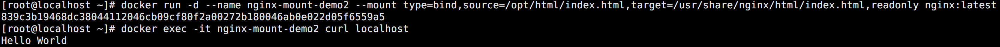

## 数据持久化（--mount Volume）

默认情况下，容器被删除，容器中数据也会随着一起删除。这对于某些重要的数据是绝对不允许的。此时就需要对数据进行持久化。

`数据卷 volume` 是一个可以提供给一个或者多个容器使用的特殊目录，它绕过 UFS，能提供以下特性：

* 多个容器可以共享和重用。
* 对数据卷的修改会马上生效。
* 对数据卷的更新不会影响镜像。
* 数据卷会一直存在，即使删除容器。

<br>

查看数据卷相关操作 ：

```bash
docker volume --help
```

支持如下参数：

* `create`：创建数据卷。
* `inspect`：查看数据卷详细信息。
* `ls`：列出数据卷。
* `rm`：删除数据卷。
* `prune`：删除没用的数据卷。

<br>

操作示例：

```bash
# 创建 volume
docker volume create v-demo

# 列出 volume
docker volume ls

# 查看 volume 详情
docker volume inspect v-demo 

# 删除 volume
docker volume rm v-demo 

# 删除所有没用的 volume
docker volume prune 
```

如图所示：


<br>

数据卷使用示例：

```bash
# 创建一个数据卷
docker volume create v-nginx

# 创建一个容器挂载该数据卷
docker run -d --name nginx-volume-demo --mount source=v-nginx,target=/usr/share/nginx/html nginx:latest
```

参数说明：

* `--mount`：用于标记挂载数据卷到容器中，可以有多个。
* `source`：指定数据卷，如果数据卷不存在，则会自动创建。
* `target`：指定容器内挂载的目录。

创建完成后，进入容器中修改文件。结果如图所示：


<br>

新建另外一个容器也挂载它：

```bash
# 创建新容器
docker run -d --name nginx-volume-demo2 --mount source=v-nginx,target=/usr/share/nginx/html nginx:latest

# 访问查看里面的数据
docker exec -it nginx-volume-demo2 curl localhost
```

如图所示：


这样就能发现通过数据卷，实现了文件的持久化保存。

数据卷生命周期独立于容器之外，如果在删除容器的时候一并删除存储卷，需要执行：

```bash
docker container rm -v 容器名称
```


## 数据持久化（--mount 宿主机目录）

除了使用数据卷，本身宿主机的目录在前面也了解到是可以直接挂载到容器中的。

使用示例：

```bash
# 本地创建用于测试的目录和文件
mkdir /opt/html
echo "Hello World" > /opt/html/index.html

# 挂载目录
docker run -d --name nginx-mount-demo1 --mount type=bind,source=/opt/html,target=/usr/share/nginx/html,readonly nginx:latest 

# 查看挂载效果
docker exec -it nginx-mount-demo1 curl localhost
```

参数说明：

* 默认情况下，--mount 挂载的是数据卷 volume，如果需要挂载目录，需要指定 `type=bind`。
* source 在 bind 挂载中必须事先存在。
* 在挂载最后可以加上 `readonly`，标识容器对该目录只读。

如图所示：


<br>

除了挂载目录，文件也是可以挂载的：

```bash
# 挂载文件
docker run -d --name nginx-mount-demo2 --mount type=bind,source=/opt/html/index.html,target=/usr/share/nginx/html/index.html,readonly nginx:latest 

# 查看挂载效果
docker exec -it nginx-mount-demo2 curl localhost
```

如图所示：



这种方法有一个常见的用途：将容器中的日志文件挂载到本地来，方便查看。


## 数据持久化（-v，推荐）

除了上面的 --mount 以外，`-v，--volume` 也是可以直接挂载数据卷 volume 和宿主机目录文件的。

```bash
# 挂载 volume 并查看
docker run -d --name nginx-v-demo1 -v v-nginx:/usr/share/nginx/html:ro nginx:latest
docker exec -it nginx-v-demo1 curl localhost

# 挂载目录并查看
docker run -d --name nginx-v-demo2 -v /opt/html:/usr/share/nginx/html:ro nginx:latest
docker exec -it nginx-v-demo2 curl localhost

# 挂载文件并查看
docker run -d --name nginx-v-demo3 -v /opt/html/index.html:/usr/share/nginx/html/index.html:ro nginx:latest
docker exec -it nginx-v-demo3 curl localhost
```

参数说明：

* 如果不指定 volume，那么系统会随机创建一个 volume。
* -v 参数也可以设置 `ro` 和 `rw` 权限。

如图所示：


## 资源限制

`Cgroup`（control group，控制组） 是 Linux 内核的一个功能，可以用来限制、控制与分离一个进程组。Docker 就是通过 Cgroup 来控制容器的 CPU、内存、磁盘输入输出等资源。

在默认情况下，Docker 容器是没有资源限制的，它会尽可能地使用宿主机能够分配给它的资源。如果不对容器资源进行限制，容器之间就会相互影响，一些占用硬件资源较高的容器会吞噬掉所有的硬件资源，从而导致其它容器无硬件资源可用，发生停服。

Docker 提供了限制内存，CPU 和磁盘 IO 的方法， 在 docker create 或者 docker run 的时候可以对容器所占用的硬件资源大小以及多少进行限制。


### CPU

默认情况下，所有容器可以平等地使用宿主机的 CPU 资源，如果想要限制 CPU 资源，可以使用以下参数进行限制。

**相对限制**

* `-c` 或 `--cpu-shares`：用于多个容器运行时设置容器对于 CPU 的使用权重比例（共享权值）。
* Docker 默认每个容器的权值为 `1024`。如果不指定或将其设置为 0，都将使用默认值。 
  
* 当系统上运行了两容器，第一个权重是 1024，第二个权重是 512。第二个启动后没运行任何进程，第一个的进程很多。此时，第一个完全可以占用第二个的 CPU 空闲资源，这就是共享式 CPU 资源。如果第二个也跑了进程，那么就会把自己的 512 给要回来，按照正常权重1024:512 划分。
  
* CPU 共享式证明了 CPU 为可压缩性资源。
  
* `--cpus`：用于限制容器运行的核数。
  * 从 1.13 版本之后开始支持限定容器能使用的 CPU 核数，属于常用的限制手段之一。

* `--cpuset-cpus`：用于限制容器运行的 CPU 核心。
  * 例如，主机有 4 个 CPU 核心，CPU 核心标识为 0-3，可以指定容器只在标识 0 和 3 的两个 CPU 核心上运行。

> 通过 -c 设置的并不是 CPU 资源的绝对数量，而是一个相对的权重值。某个容器最终能分配到的 CPU 资源取决于它的分配的权重占所有容器总和的比例。换句话说，通过 -c 参数可以设置容器使用 CPU 的优先级。

使用示例：

```bash
# 指定权重
docker container run -d -c 1024 nginx

# 指定核数，可以是 1.5 之类的小数
docker container run -d --cpus=2 nginx

# 指定容器在 CPU-1 和 CPU-3 上执行
docker container run -d --cpuset-cpus="1,3" nginx

# 指定容器在 CPU-0、CPU-1 及 CPU-2 上执行
docker container run -d --cpuset-cpus="0-2" nginx
```

<br>

**绝对限制**

Linux 通过 `CFS`（Completely Fair Scheduler，完全公平调度器）来调度各个进程对 CPU 的使用。CFS 默认的调度周期是 `100ms`。

可以通过设置每个容器进程的调度周期，以及在这个周期内各个容器最多能使用多少 CPU 时间来达到限制 CPU 的目的。具体参数如下：

* `--cpu-period`：设置每个容器进程的调度周期，单位 us。

* `--cpu-quota`：设置在每个周期内容器能使用的 CPU 时间，单位 us。

使用示例：

```bash
# 将 CFS 调度周期设为 50000，将每个周期内的 CPU 配额设置为 25000
# 表示该容器每 50ms 可以得到 50% 的 CPU 运行时间
docker container run -d --cpu-period=50000 --cpu-quota=25000 nginx

# 将容器的 CPU 配额设置为 CFS 周期的两倍
# 表示给容器分配了两个 CPU，容器可以在每个周期内使用两个 CPU 的 100% 时间
docker container run -d --cpu-period=10000 --cpu-quota=20000 nginx
```

CFS 周期的有效范围是 1ms\~1s，对应的 --cpu-period 的数值范围是 `1000~1000000`。

容器的 CPU 配额必须不小于 1ms，即 --cpu-quota 的值必须 `>= 1000`。

--cpu-quota 设置容器在一个调度周期内能使用的 CPU 时间实际上是一个上限时间，并不是说容器一定会使用这么长的 CPU 时间。


### 内存

在默认的情况下，容器的内存是没有限制的。也是就说，如果不限制，容器将能使用宿主机能够调用的最大内存。

这在生产环境是非常危险的行为，很容易造成宿主机 OOM（内存溢出），然后为了释放内存空间而杀掉一些其它进程，这其中可能包含 docker daemon 进程（docker 对优先级做了调整，一般杀不到它）。但这在生产中是绝对不允许的。

可以通过两个参数限制内存：

* `-m，--memory`：设置内存使用限额，例如：100MB，1GB。
* `--memory-swap`：设置内存 + Swap 的是使用限额。

默认情况下，两个参数的值都是 `-1`。但是如果在启动时指定了 -m，那么 --memory-swap 会是 -m 的两倍。

使用示例：

```bash
# 允许容器使用 100M 内存和 100M Swap
docker container run -d -m 100m nginx

# 允许容器使用 100M 内存和 200M Swap，不过一般不设置 swap
docker container run -d -m 100m --memory-swap 300m nginx
```

如果发生内存溢出错误，内核将 kill 掉容器中的进程。可以使用 `--oom-kill-disable` 参数来禁止  kill。

```bash
docker container run -d -m 100M --oom-kill-disable nginx
```


### IO

Block IO 是另一种可以限制容器使用的资源。Block IO 指的是磁盘的读写，docker 可通过设置权重、限制 bps 和 iops 的方式控制容器读写磁盘的带宽。

* `bps`： byte per second，表示每秒读写的数据量。
* `iops` ：io per second，表示每秒的输入输出量（或读写次数）。

目前 Block IO 限额只对 direct IO（不使用文件缓存）有效。

支持如下参数：

* `--blkio-weight`：用于改变容器的权重，类似于 CPU 限制的 -c 参数，默认值为 500。
* `--device-read-bps`：限制读某个设备的 bps
* `--device-write-bps`：限制写某个设备的 bps
* `--device-read-iops`：限制读某个设备的 iops
* `--device-write-iops`：限制写某个设备的 iops

使用示例：

```bash
# 限制读写权重
docker container run -d --blkio-weight 500 nginx
docker container run -d --blkio-weight 250 nginx

# 限制磁盘 /dev/sda 写带宽为 30M，该方法相对实用一些
docker container run -d --device-write-bps /dev/sda:30MB nginx
```

