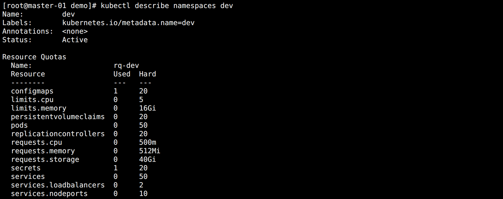
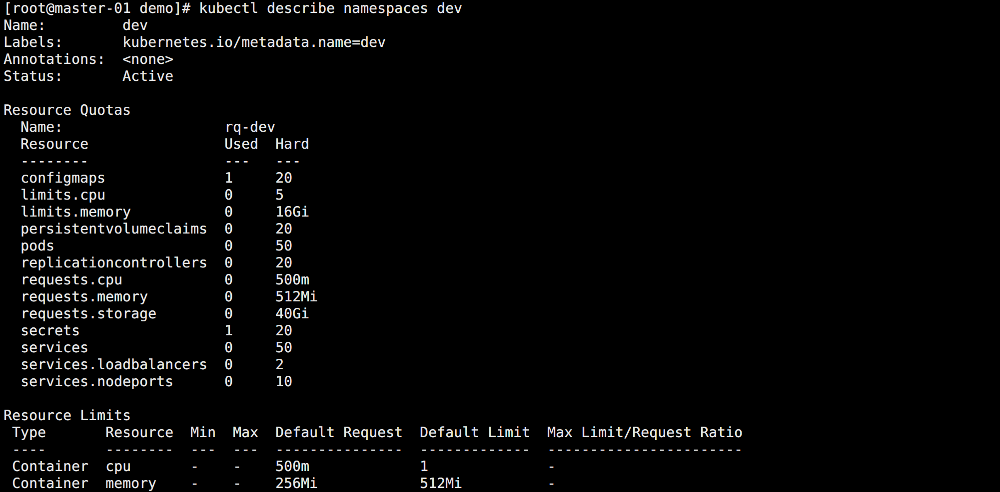

## Admission Controller

Kubernetes 提供了扩展其内置功能的方法，用户可以通过它自定义资源类型和自定义控制器。

除此之外，Kubernetes 还有一些其它的功能，比如 `admission webhooks`，它可以用于扩展 API，修改 Kubernetes 资源的基本行为。

`准入控制器 Admission Controller` 是一段代码，它会在请求通过认证和鉴权之后、对象被持久化之前拦截到达 API 服务器的请求。

在 Kubernetes API Server 中包含两个特殊的准入控制器：`MutatingAdmissionWebhook` 和 `ValidatingAdmissionWebhook`

* `Validating`：验证控制器，用于验证创建对象的请求是否满足自定义规则。
* `Mutating`：变更控制器，可以对请求进行相关的修改。比如增加配额用量，规范提交。

注意：某些控制器可以既是变更准入控制器，又是验证准入控制器。

在配置 API Server 启动文件的时候，指定了一些系统实现的准入控制器：

> --enable-admission-plugins=NamespaceLifecycle,LimitRanger,ServiceAccount,DefaultStorageClass,DefaultTolerationSeconds,NodeRestriction,ResourceQuota

更多具体信息可以查看官方文档：

> https://kubernetes.io/zh-cn/docs/reference/access-authn-authz/admission-controllers/

用户也可以自己开发准入控制器，可以参考示例：

> https://github.com/cnych/admission-webhook-example

下面以两个比较实用的系统自带的准入控制器举例。


## 资源配额 ResourceQuota

在多个团队使用同一个 Kubernetes 集群的时候，一般会按照名称空间分配给单独的团队。

为了避免资源的浪费，可以通过该控制器对指定名称空间的资源配额进行限制，使用示例：

```yaml
apiVersion: v1
kind: ResourceQuota
metadata:
  name: rq-dev
spec:
  hard:
    # Pod 数量限制
    pods: 50
    # 单个 Pod 最高的 CPU 请求限制
    requests.cpu: "0.5"
    # 单个 Pod 最高的内存请求限制
    requests.memory: 512Mi
    # 总 CPU 限制
    limits.cpu: 5
    # 总内存限制
    limits.memory: 16Gi
    # ConfigMap 数量限制
    configmaps: 20
    # 总存储容量限制
    requests.storage: 40Gi
    # PVC 数量限制
    persistentvolumeclaims: 20
    # RC 数量限制
    replicationcontrollers: 20
    # Secret 数量限制
    secrets: 20
    # Service 数量限制
    services: 50
    services.loadbalancers: "2"
    services.nodeports: "10"
```

此时创建要使用限制的名称空间，并应用配置：

```bash
kubectl create namespace dev
kubectl apply -f rq-dev.yaml -n dev
```

查看名称空间的资源信息：

```bash
kubectl describe namespaces dev
```

如图所示：



该命名空间下面的资源就被限制使用了，当资源使用达到上限的时候再次创建就会失败，调度也不会成功。


## 资源限制 LimitRange

光有资源配额是不够的，对于 CPU 和 Memory 这类指标，如果在 Pod 内部没有进行 resources 配置，那么它们对于 CPU 和 Memory 的计算还是 0。所以需要给他们配置一个默认值。

```yaml
apiVersion: v1
kind: LimitRange
metadata:
  name: lr-dev
spec:
  limits:
      # 默认的 limit 限制
    - default:
        cpu: 1
        memory: 512Mi
      # 默认的 requests 限制
      defaultRequest:
        cpu: "0.5"
        memory: 256Mi
      type: Container
```

执行创建，然后查看：

```bash
kubectl apply -f lr-dev.yaml -n dev
kubectl describe namespaces dev
```

如图所示：




