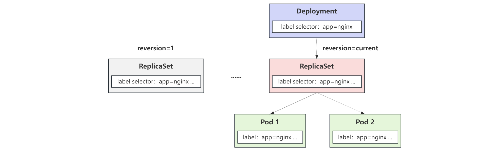

## 控制器

在实际应用中，一般不会直接使用 Pod，而是会使用各种 Pod 的上层封装 `控制器` 来满足使用需求。Kubernetes 中运行了一系列控制器来确保集群的当前状态与期望状态保持一致。

> 控制器会监听资源创建、更新、删除事件触发 `Reconcile` 调谐函数，该过程称为 `Reconcile Loop（调谐循环）` 或 `Sync Loop（同步循环）`。

整个过程就像下面这段伪代码：

```go
for {
  desired := getDesiredState()  // 获取期望状态
  current := getCurrentState()  // 获取实际状态
  if current == desired {       // 如果状态一致则什么都不做
    // nothing to do
  } else {                      // 如果状态不一致则调整编排，到一致为止
    // 调整当前状态到期望状态并更新集群状态
  }
}
```

这个编排模型就是 Kubernetes 项目中的一个通用编排模式：`控制循环（control loop）`。


## ReplicaSet

ReplicaSet，简称 `RS`，翻译成中文就是 `副本集`，它最重要的用途就是控制副本数量。

以生产应用为例，假如现有一个 Pod 正提供服务，可能会遇到以下两种情况：

* 网站访问量突然暴增。

* 运行 Pod 的节点发生故障。

针对第一种情况，可以通过手动多启动几个 Pod 副本，流量降下来之后再将多余的 Pod 杀掉的方法来应对。

针对第二种情况，如果节点挂了，也可以通过在另外的节点上重新启动一个新的 Pod 来应对。

但两种办法都存在一个问题，就是非常多的人工干预。想要减少人的工作量，就需要一种工具来自动管理 Pod。ReplicaSet 就是这种资源对象。它通过持续监听一组 Pod 的运行状态，在 Pod 数量减少或增加时就会触发调谐过程，最终保证副本数量始终如期望一致。


### 资源清单

通过 explain 查看 RS 支持的资源清单配置：

```bash
kubectl explain rs
```

<br>

示例资源清单：

```yaml
apiVersion: apps/v1
kind: ReplicaSet
metadata:
  name: rs-demo
spec:
  # 副本数配置
  replicas: 2
  # 标签选择器，选择需要管理的 Pod
  selector:
    matchLabels:
      app: nginx
  # Pod 的配置，省略了 apiVersion 和 kind 配置
  template:
    metadata:
      # 这里再配置 Pod 的名称不会生效，因为多个副本的原因，名字会重复
      # 最终名字会变成 rs-demo-xxx
      # name: rs-nginx
      labels:
        app: nginx
    spec:
      containers:
        - name: nginx
          image: nginx
          ports:
            - containerPort: 80
```

特别说明：

- 和 Pod 不同，ReplicaSet 的 apiVersion 为 `apps/v1`。
- `replicas` 为 ReplicaSet 的核心配置，用于定义副本数。
- `selector` 标签选择器为必选项，必须和 Pod 中的标签进行匹配，不同的 RS 可以有相同的标签，互不影响。
- ReplicaSet 属于 Pod 的上层封装，其底层还是管理 Pod，所以 Pod 的知识一定要掌握。
- `template` 字段下面定义的其实就是 Pod 的资源清单，一般会对 Pod 的资源清单进行精简，去掉某些重复声明。


### 关系原理

ReplicaSet 控制器会通过定义的 Label Selector 标签去查找集群中的 Pod 对象，然后对其副本数进行管理：


### 常用操作

查看创建的 Pod 和 RS：

```bash
# 获取 RS
kubectl get rs

# 获取 Pod
kubectl get pods

# 查看 Pod 所属资源对象
kubectl describe pod rs-demo-7wdzx | grep "Controlled By"
```

结果如图所示：


<br>

由于 Pod 被上层的资源对象管理，所有直接删除 Pod 是没用的，需要删除 RS 才能删除 Pod。

以下是一些常用的操作：

```bash
# 标签筛选 Pod 或者资源对象
kubectl get pods -l app=nginx

# 查看 pod 的信息，还可以排查 Pod 启动过程中是否报错
kubectl describe pod rs-demo-4g7cb

# 另一种查看 Pod 信息的方法
kubectl get pods rs-demo-4g7cb -o yaml

# 该方法还可以查看其它资源对象
kubectl get rs rs-demo -o yaml

# 删除 Pod
kubectl delete pod rs-demo-7wdzx

# 删除 RS
kubectl delete rs rs-demo

# 也可以通过资源清单进行删除
kubectl delete -f rs.yaml
```


## Replication Controller（了解）

Replication Controller 简称 `RC`，早期的副本控制器，现在已经被新一代 RC 也就是 ReplicaSet（RS）替代。

目前唯一的一个区别就是 RC 只支持基于等式的 selector（env=dev或env!=qa），RS 支持基于集合的 selector。

比如 RC 的 selector 是这样的，只支持单个 Label 的等式：

```yaml
selector:
  app: nginx
```

而 RS 中的 Label Selector 支持 `matchLabels` 和 `matchExpressions` 两种形式：

```yaml
# matchLabels 格式
selector:
  matchLabels:
    app: nginx

# matchExpressions 格式
selector:
  matchExpressions:
    - key: app
      operator: In
      values:
        - nginx
```


## Deployment

ReplicaSet 控制器是用来维护集群中运行的 Pod 数量，但生产中一般不会直接使用它，而是会使用更上层封装的控制器，比如 Deployment（部署），简称 `deploy`。和名字一样，其核心的功能就是实现了 Pod 的滚动更新。这对于线上的服务做到不中断发布非常重要。


### 资源清单

查看 Deployment 资源清单支持的参数：

```bash
kubectl explain deploy
```

示例资源清单：

```yaml
apiVersion: apps/v1
kind: Deployment
metadata:
  name: deploy-nginx-demo
spec:
  # 副本数
  replicas: 2
  # 标签选择器
  selector:
    matchLabels:
      app: nginx
  template:
    metadata:
      labels:
        app: nginx
    spec:
      containers:
      - name: nginx
        image: nginx
        ports:
        - containerPort: 80
```

可以看到，Deployment 的资源清单和 ReplicaSet 除了资源对象名称，其它几乎一模一样。


从名称就可以看出来，Deployment 会先创建一个 RS，然后 RS 再对 Pod 进行管理。

需要注意，在配置的时候使用了和 RS 相同的标签选择器，但是并没有因此在创建 Pod 的时候受到影响，原因在于：


Deployment 创建的 RS 除了资源清单定义的标签选择器，还会生成其它的标签选择器，这样做的好处是，即使两个 Deployment 在资源清单中写的标签选择器实现相同的，但是因为有自动添加的标签选择器，也不会出现管理混乱问题。


### 关系原理

Pod、ReplicaSet、Deployment 关系如图所示：




### 水平伸缩（Scale）

`水平扩展/收缩` 的功能比较简单，使用 Deployment 控制器去修改它控制的 ReplicaSet 的 Pod 副本数量就可以了。

对于用户，修改方式也有两种：`命令行修改（临时）` 和 `修改资源清单（永久）`

使用命令行修改副本数：

```bash
kubectl scale deployment deploy-nginx-demo --replicas=3
```

如图所示：


至于修改资源清单的方式就不再说明了。


### 滚动更新（Rolling Update）

如果只是水平扩展 / 收缩这两个功能，就完全没必要设计 Deployment 这个资源对象了，Deployment 最突出的一个功能是支持 `滚动更新`。

此时对 Deployment 的资源清单进行调整：

```yaml
apiVersion: apps/v1
kind: Deployment
metadata:
  name: deploy-nginx-demo
spec:
  # 副本数
  replicas: 3
  # 等待指定时间后才让升级的 Pod 提供服务，默认 0
  minReadySeconds: 10
  # 历史版本保留数量，用于更新出错回滚
  revisionHistoryLimit: 10
  # 更新策略
  strategy:
    # 滚动更新
    type: RollingUpdate
    rollingUpdate:
      # 滚动更新过程中，不可用的副本数或者占期望值的最大比例，可以是具体值也可以是百分比
      maxUnavailable: 1
      # 滚动更新过程中，副本总数超过期望值的上限，可以是具体值也可以是百分比，两个值不能同时为 0
      maxSurge: 1
  # 标签选择器
  selector:
    matchLabels:
      app: nginx
  template:
    metadata:
      labels:
        app: nginx
    spec:
      containers:
      - name: nginx
        # 调整镜像，用于测试更新
        image: nginx:1.7.9
        ports:
        - containerPort: 80
```

参数说明：

* `minReadySeconds`：等待指定时间后才让升级的 Pod 提供服务，默认 0，立即提供服务。可能会因为容器起来后运行一下就挂，造成服务异常。
* `revisionHistoryLimit`：用于保存回滚的 RS 版本数量，更新的实质就是创建新的 RS 慢慢替换旧的 RS。
* `strategy`：更新策略
  * `type`：更新类型，支持 `Recreate` 杀掉所有重建和 `RollingUpdate` 滚动更新。
  * `rollingUpdate`：滚动更新配置
    * `maxUnavailable`：滚动更新过程中，不可用的副本数或者占期望值的最大比例，可以是具体值也可以是百分比。
    * `maxSurge`：滚动更新过程中，副本总数超过期望值的上限，可以是具体值也可以是百分比，两个值不能同时为 0

<br>

在更新过程中，可以执行相关命令：

```bash
# 查看更新状态
kubectl rollout status deployment deploy-nginx-demo

# 暂停更新
kubectl rollout pause deployment deploy-nginx-demo

# 恢复更新
kubectl rollout resume deployment deploy-nginx-demo
```

如图所示：


### 更新回滚

在滚动更新过程中，实际上是创建了一个新的 RS，然后慢慢地根据更新策略定义的 Pod 一次性允许更新的个数进行逐个更新切换。直到更新完成，旧的 RS 下面不再有 Pod，且这个 RS 因为保存历史策略的原因，不会立即被删除。


这意味着用户可以通过旧的 RS 进行版本的回滚。

查看支持回滚的版本：

```bash
# 查看支持回滚的版本
kubectl rollout history deployment deploy-nginx-demo

# 查看指定版本信息
kubectl rollout history deployment deploy-nginx-demo --revision=1
```

如图所示：


可以看到目前系统中这个 Deployment 有两个 `reversion`。当前处于 reversion=2 的状态，可以指定 reversion 回滚到 1。

```bash
# 回滚到指定版本
kubectl rollout undo deployment deploy-nginx-demo --to-revision=1

# 回滚到上个版本
kubectl rollout undo deployment deploy-nginx-demo
```

如图所示：


## StatefulSet

Deployment 和 ReplicaSet 都适用于无状态应用，但是在实际应用中，虽然不推荐，但是 Kubernetes 在某些时候还是需要用到有状态应用的。

* 无状态服务（Stateless Service）：实例不会在本地存储需要持久化的数据，多个实例对于同一个请求响应的结果是完全一致的。
* 有状态服务（Stateful Service）：和无状态相反，实例需要在本地存储持久化数据。

在以前开发中，由于没有引入 redis 这类存放用户 Session 的中间件，所有 Session 一般都是存在服务器本地，这在多节点部署的时候就会出现问题，当用户下一次请求落在另一台节点上，因为没有 Session 共享的原因，用户会被要求重新登录。这在生产中是绝对不被允许的。

为了解决问题，开始是在负载均衡 nginx 上面配置 ip_hash 的调度策略，让来自某个 IP 的请求保证只落在某台机器上。

该方法解决了部分问题，但是新的问题又出现了。在某些特定的情况下，一个 IP 可能有很多用户都在使用。比如一个公司所有的人都在使用某个系统，他们请求出网的 IP 都是同一个，使得负载均衡失去了意义。

直到后来使用 redis，通过第三方中间件对这类数据进行单独管理，这个问题才得到了解决。

从这个例子中可以看出，有状态服务的部署是非常复杂的，不仅需要考虑上面的问题，可能还需要考虑服务的启动顺序，服务内部是否有某些任务，导致不能多节点部署，任务只能由单节点执行。甚至服务每个节点都需要有一个区别于其它节点的标识等等。根据程序员能力的差异，在系统设计的时候这些问题可能都会存在。

为了解决有状态服务的问题，Kubernetes 引入了一种新的控制器：`StatefulSet`，简称 `sts`。

StatefulSet 类似于 ReplicaSet，但是它具有以下几个功能特性：

- 稳定的、唯一的网络标识符
- 稳定的、持久化的存储
- 有序的、优雅的部署和缩放
- 有序的、优雅的删除和终止
- 有序的、自动滚动更新


### Headless Service

`Service` 是应用服务的抽象，通过 Labels 为应用提供负载均衡和服务发现，简单来说就是为多个 Pod 提供一个统一的入口，相当于 Nginx 配置 upstream 负载均衡。每个 Service 都会自动分配一个 cluster IP 和 DNS 名，在集群内部可以通过该地址或者通过 FDQN 的形式来访问服务。

例如本集群的 Cluster IP 网段就是 `10.10.0.0`，而集群内 CoreDNS 解析的格式则是：`service名称.命名空间.svc.cluster.local`。

而 `Headless Service` 则是一种特殊的 Service，它没有 Cluster IP，而是只有 DNS 解析。且解析访问方式也不一样：

* 对于普通的 Service，访问解析的域名，会被解析到 Cluster IP 上，然后再到后端的 Pod 上。
* 对于 Headless Service，访问解析的域名，则会被直接解析到后端的 Pod 上。

<br>

创建一个 Headless Service：

```yaml
apiVersion: v1
kind: Service
metadata:
  name: svc-demo
spec:
  selector:
    app: nginx
  ports:
  - port: 8080
    targetPort: 80
  # 不设置 Cluster IP，就是 Headless Service
  clusterIP: None
```

创建完成如图所示：


可以看到这个 Service 和 Kubernetes 自带的 Service 相比，Cluster IP 没被分配。

因为 Headless 代理的 Pod 都会被解析的原因，它还为每个 Pod 生成了：`pod名称.service名称.名称空间.svc.cluster.lcoal` 解析。

这个 DNS 记录就是 Kubernetes 集群为 Pod 分配的一个唯一标识，只要知道 Pod 的名字，以及它对应的 Service 名字，就可以组装出这样一条 DNS 记录，然后访问到对应的 Pod 的 IP 地址。

更多关于 Service 的信息后面会单独进行说明。


### 存储卷 PV

既然有状态服务需要持久化数据，那么就还需要用到用来保存持久化数据的地方。在 Kubernetes 中，一般使用存储卷 PV 对数据进行持久化 ，由于还没有到 PV 和 PVC 的章节，也没有部署网络存储，所有这里测试使用前面定义的本地 volume 方式。

创建 PV 资源清单：

```yaml
apiVersion: v1
kind: PersistentVolume
metadata:
  name: pv-demo1
spec:
  capacity:
    storage: 1Gi
  accessModes:
    - ReadWriteOnce
  hostPath:
    path: /data/pv-demo1
---
apiVersion: v1
kind: PersistentVolume
metadata:
  name: pv-demo2
spec:
  capacity:
    storage: 1Gi
  accessModes:
    - ReadWriteOnce
  hostPath:
    path: /data/pv-demo2
```

创建完成如图所示：


可以看到成功创建了两个 PV 对象，状态是：`Available`


### 资源清单

创建一个 StatefulSet 资源清单：

```yaml
apiVersion: apps/v1
kind: StatefulSet
metadata:
  name: sts-nginx-demo
spec:
  selector:
    matchLabels:
      app: nginx
  serviceName: svc-demo
  replicas: 2
  template:
    metadata:
      labels:
        app: nginx
    spec:
      containers:
      - name: nginx
        image: nginx
        ports:
        - containerPort: 80
          name: http
        # 挂载 PVC
        volumeMounts:
        - name: web-path
          mountPath: /usr/share/nginx/html
  # PVC 设置，会自动找集群中格式的 PV 进行绑定
  volumeClaimTemplates:
  - metadata:
      name: web-path
    spec:
      accessModes: [ "ReadWriteOnce" ]
      resources:
        requests:
          storage: 1Gi
```

创建 StatefulSet 后如图所示：


在资源清单中和 `volumeMounts` 进行关联的不是 `volumes`，而是一个新的属性：`volumeClaimTemplates`，该属性会自动创建一个 PVC 对象，然后会自动去关联当前系统中和他合适的 PV 进行绑定。此时的 PV 已经变成了 `Bound` 状态。

使用 PV 和 PVC 的好处在于，即使 Pod 被删除，数据也不会丢失。但是 hostPath 的 PV 也存在一个问题，Pod 重启后可能会被调度到其它节点，那么新节点上其实是没那些数据的。

除此之外，还多了一个 `serviceName: "svc-demo"` 的字段，用于指定 Headless Service，该 Service 必须在 StatefulSet 之前存在。

查看 Pod 和 PVC 的名称可以发现，最后都是有序的数字，Kubernetes 选择这样命名的原因在于，因为 StatefulSet 是有顺序的，所以在扩容或缩容的时候都会按照所以顺序进行处理。 


### 关系原理

StatefulSet，Pod，PV，PVC 关系如图所示：


### 验证解析

创建 Pod 验证解析：

```bash
cat << EOF | kubectl apply -f -
apiVersion: v1
kind: Pod
metadata:
  name: busybox
  namespace: default
spec:
  containers:
  - name: busybox
    image: busybox:1.28
    command:
      - sleep
      - "3600"
    imagePullPolicy: IfNotPresent
  restartPolicy: Always
EOF
```

进入 Pod：

```bash
kubectl exec -it busybox -- sh
```

验证解析：

```bash
# 完整的解析
nslookup sts-nginx-demo-0.svc-demo.default.svc.cluster.local
nslookup sts-nginx-demo-1.svc-demo.default.svc.cluster.local

# 同一名称空间下可以省略后面名称
sts-nginx-demo-0.svc-demo
sts-nginx-demo-1.svc-demo
```

如图所示：


### 管理策略

对于分布式系统，顺序性就显得不那么重要，更重要的则是唯一性标识。所以需要在 StatefulSet 资源清单中加入 Pod 管理策略。

查看支持的配置项：

```bash
kubectl explain sts.spec.podManagementPolicy
```

具体配置内容：

* `podManagementPolicy`：Pod 管理策略，支持以下参数
  * `OrderedReady`：遵循上文演示的顺序性保证。
  * `Parallel`：并行终止所有 Pod，在启动或终止另一个 Pod 前，不必等待这些 Pod 变成 Running 和 Ready 或者完全终止状态。


### 更新策略

查看支持的更新策略：

```bash
kubectl explain sts.spec.updateStrategy
```

和 Deployment 的更新策略有些不同，StatefulSet 支持的更新策略为：

* `updateStrategy`：更新策略
  * `type`：更新类型，支持 `OnDelete` 只有手动删除才支持更新 Pod 和 `RollingUpdate` 滚动更新。
  * `rollingUpdate`：自动删除旧的 Pod 并创建新的 Pod，如果更新发生了错误，则滚动更新停止。注意 StatefulSet 的 Pod 在部署时是顺序从 `0~n` 的，而在滚动更新时，这些 Pod 则是按逆序的方式即 `n~0` 一次删除并创建。
    * `maxUnavailable`：滚动更新过程中，不可用的副本数或者占期望值的最大比例，可以是具体值也可以是百分比。
    * `partition`：序号大于或等于 partition 的 Pod 才会进行滚动升级，而其余的 Pod 保持不变。适用于灰度发布。

<br>

在实际的项目中，其实还是很少会去直接通过 StatefulSet 来部署有状态服务的，除非你自己能够完全能够 hold 住。

对于一些特定的服务，可能会使用更加高级的 Operator 来部署，比如 etcd-operator、prometheus-operator 等等，这些应用都能够很好的来管理有状态的服务，而不是单纯的使用一个 StatefulSet 来部署一个 Pod 就行，因为对于有状态的应用最重要的还是数据恢复、故障转移等等。


## DaemonSet

通过控制器名称可以看出：`Daemon`，简称 `ds`，就是用来部署守护进程的。

DaemonSet 用于在每个 Kubernetes 节点中将守护进程的副本作为后台进程运行，说白了就是在每个节点部署一个 Pod 副本，当新的节点加入到 Kubernetes 集群中，Pod 会被调度到该节点上运行，当节点从集群只能够被移除后，该节点上的这个 Pod 也会被移除。当然，如果删除 DaemonSet，所有和这个对象相关的 Pods 都会被删除。

基于这种特性，DaemonSet 常被用于：

- 集群存储守护程序，如 glusterd、ceph 要部署在每个节点上以提供持久性存储。
- 节点监控守护进程，如 Prometheus 监控集群，可以在每个节点上运行一个 node-exporter 进程来收集监控节点的信息。
- 日志收集守护程序，如 fluentd 或 filebeat，在每个节点上运行以收集日志。
- 节点网络插件，比如 flannel、calico，在每个节点上运行为 Pod 提供网络服务。

> 正常情况下，Pod 运行在哪个节点上是由 Kubernetes 的调度器策略来决定的，然而 DaemonSet 控制器创建的 Pod 实际上提前已经确定了在哪个节点上了，所以即使调度器还没有启动，依旧可以创建 Pod。


### 资源清单

创建一个 DaemonSet 资源清单：

```yaml
apiVersion: apps/v1
kind: DaemonSet
metadata:
  name: ds-nginx-demo
spec:
  selector:
    matchLabels:
      app: nginx
  template:
    metadata:
      labels:
        app: nginx
    spec:
      containers:
      - name: nginx
        image: nginx
        ports:
        - containerPort: 80
```

创建 DaemonSet 如图所示：


由于本集群所有节点都没有打 `污点`，所以都能被调度去，如果是 kubeadm 按照集群，Master 节点默认是有污点的，不会被调度。


### 关系原理

DaemonSet，Pod，Node 关系如图所示：


集群中的 Pod 和 Node 是一一对应d的，而 DaemonSet 会管理全部机器上的 Pod 副本，负责对它们进行更新和删除。

DaemonSet 控制器保证每个 Node 上有且只有一个被管理的 Pod 的实现原理：

- 首先 DaemonSet 从 ETCD 获取到 Node 列表，然后遍历所有的 Node。
- 根据资源对象定义是否有调度相关的配置，然后分别检查 Node 是否符合要求。
- 在可运行 Pod 的节点上检查是否已有对应的 Pod，如果没有，则在这个 Node 上创建该 Pod，如果有不止一个，就删除多余的 Pod ，如果只有一个 Pod，就不管。

同时 DeamonSet 也支持 `OnDelete` 和 `RollingUpdate` 两种更新方式，默认是滚动更新。


## Job

`Job` 负责处理任务，主要为仅执行一次的任务，它保证批处理任务的一个或多个 Pod 成功结束。

创建一个 Job 的资源清单：

```yaml
apiVersion: batch/v1
kind: Job
metadata:
  name: job-demo
spec:
  # 限制任务运行的最长时间
  activeDeadlineSeconds: 100
  # 任务失败重建 Pod 的次数，默认 6，重建 Pod 的间隔呈指数增加，即 10s、20s、40s...
  backoffLimit: 10
  # 定义 Job 最多可以有多少 Pod 同时运行
  parallelism: 2
  # 定义 Job 至少要完成的 Pod 数目
  completions: 5
  template:
    spec:
      containers:
      - name: busybox
        image: busybox
        command: ["/bin/sh",  "-c", "echo 'Hello World'"]
      # 重启策略必须是 Never，设置 OnFailure，则 Job 执行失败后不会创建新的 Pod，只会不断重启 Pod
      restartPolicy: Never
```

创建后如图所示：


查看支持的参数：

```bash
kubectl explain job.spec
```

参数说明：

- `activeDeadlineSeconds`：限制任务运行时间，如果运行超过该时间，这个 Job 的所有 Pod 都会终止，Pod 的终止原因为： `DeadlineExceeded`。
- `backoffLimit`：当重启策略设置为 `Never` 时，Job 在执行失败后会不断创建新 Pod，但不会一直创建下去，可以通过该参数进行限制，默认为 6。同时 Job 重建 Pod 的间隔是呈指数增加的，即 10s、20s、40s… 后。
- `parallelism`：并行控制，定义 Job 能有多少个 Pod 同时运行。
- `completions`：定义 Job 至少要完成的 Pod 数目。
- `RestartPolicy`：重启策略，仅支持 `Never` 和 `OnFailure` 两种，不支持 `Always`。

需要注意的是：Job 和 Deployment、StatefulSet 之类不同的地方在于，Pod 中的容器要求是一个任务，而不是一个常驻前台的进程。执行 apply 之后 Pod 会很快的退出，如果没出错，状态就处于 `Completed`。


## CronJob

`CronJob` 简称 `cj`，相当于在 Job 的基础上加上了时间调度，使得任务可以在给定的时间点运行，也可以周期性地在给定时间点运行。

类似于 Linux 中的 `crontab`。它的时间配置也和 crontab 一样。

时间格式为：`分 时 日 月 周`

- 分：支持 0～59，每分钟配置为 `*/1`。
- 时：支持 0～23
- 日：支持 1～31
- 月：支持 1～12
- 周：支持 0～7，0 和 7 都表示星期天

<br>

创建一个 CronJob 的资源清单：

```yaml
apiVersion: batch/v1
kind: CronJob
metadata:
  name: cronjob-demo
  namespace: default
spec:
  # 定时任务
  schedule: "*/1 * * * * "
  successfulJobsHistoryLimit: 3
  failedJobsHistoryLimit: 3
  # 配置 Job 资源清单，省略了某些重复项
  jobTemplate:
    spec:
      template:
        spec:
          restartPolicy: OnFailure
          containers:
            - name: busybox
              image: busybox
              command: ["/bin/sh",  "-c", "echo 'Hello World'"]
```

创建后如图所示：


Pod 如图所示：


参数说明：

- `schedule`：指定任务运行的周期，格式和 crontab 一样。
- `jobTemplate`：指定需要运行的任务，格式就是 Job 资源清单。
- `successfulJobsHistoryLimit`：历史限制，指定可以保留多少完成的 Pod，默认为 3。
- `failedJobsHistoryLimit`：：历史限制，指定可以保留多少失败的 Pod，默认为 1。

<br>

如果不再需要 CronJob，可以使用 kubectl 命令删除它：

```none
kubectl delete cronjob cronjob-demo
```

不过需要注意：将会终止正在创建的 Job，但是运行中的 Job 将不会被立即终止。


