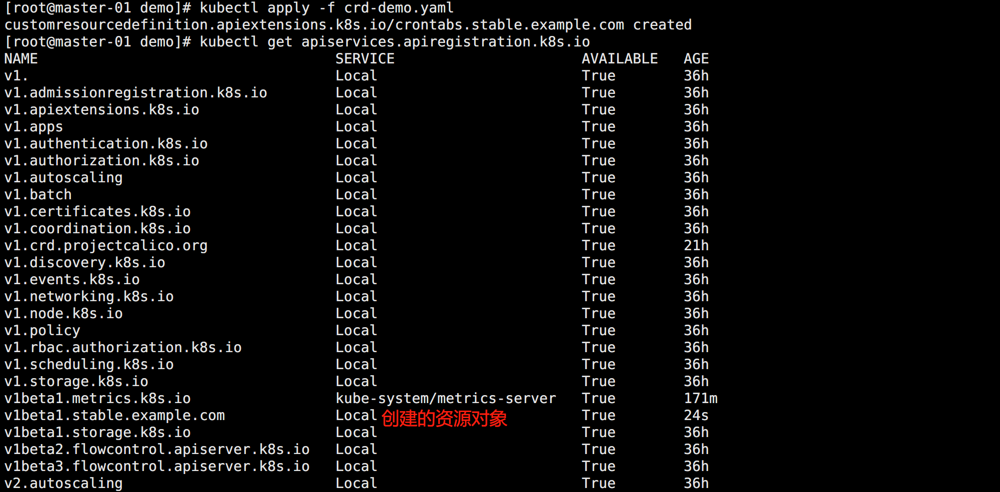
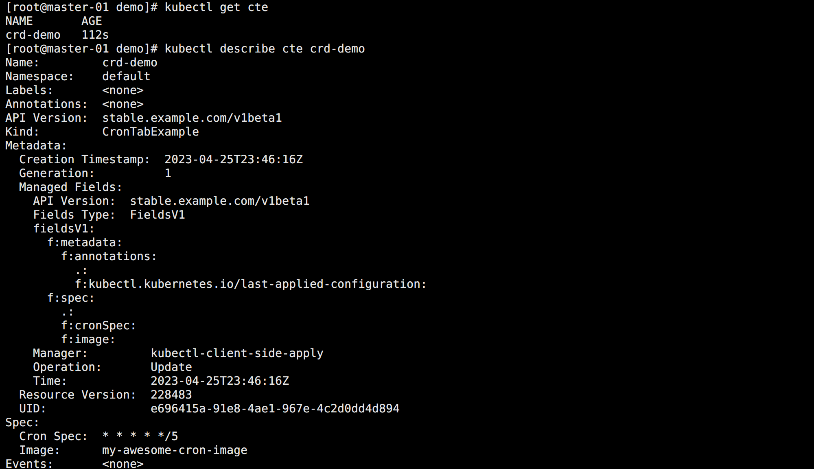

## CRD

`Custom Resource Define` 简称 `CRD`，是 Kubernetes 1.7+ 为提高可扩展性，让开发者去自定义资源的一种方式。

CRD 资源可以动态注册到集群中，注册完毕后，用户可以通过 kubectl 来创建访问这个自定义的资源对象，类似于操作 Pod 一样。

不过需要注意的是 CRD 仅仅是资源的定义而已，需要一个 Controller 去监听 CRD 的各种事件来添加自定义的业务逻辑。


## 定义

如果说只是对 CRD 资源本身进行 CRUD 操作的话，不需要 Controller 也是可以实现的。

该操作的实质相当于就是只有数据存入了 etcd 中，而没有对这个数据的相关操作而已。

资源清单示例：

```yaml
apiVersion: apiextensions.k8s.io/v1
kind: CustomResourceDefinition
metadata:
  # name 必须匹配下面的spec字段：<plural>.<group>
  name: crontabs.stable.example.com
spec:
  # group 名用于 REST API 中的定义：/apis/<group>/<version>
  group: stable.example.com
  # 列出自定义资源的所有 API 版本
  versions:
  # 版本名称，比如 v1、v2beta1 等等
  - name: v1beta1
    # 是否开启通过 REST APIs 访问 `/apis/<group>/<version>/...`
    served: true
    # 必须将一个且只有一个版本标记为存储版本
    storage: true
    # 定义自定义对象的声明规范
    schema:
      openAPIV3Schema:
        description: "CRD示例"
        type: object
        properties:
          spec:
            type: object
            properties:
              cronSpec:
                type: string
              image:
                type: string
              replicas:
                type: integer
  # 定义作用范围：Namespaced（命名空间级别）或者 Cluster（整个集群）
  scope: Namespaced
  names:
    # kind 是 sigular 的一个驼峰形式定义，在资源清单中会使用
    kind: CronTabExample
    # plural 名字用于 REST API 中的定义：/apis/<group>/<version>/<plural>
    plural: crontabs
    # singular 名称用于 CLI 操作或显示的一个别名
    singular: crontabexample
    # shortNames 相当于缩写形式
    shortNames:
    - cte
```

CRD 定义方法和普通的资源对象定义比较类似，创建该资源清单的时候就需要符合定义的条件来编写 YAML。



也可以通过命令查看：

```bash
kubectl get crd | grep example
```


## 使用

在 CRD 创建完成后，用户就可以基于它创建实例对象了。

示例资源清单：

```yaml
apiVersion: stable.example.com/v1beta1
kind: CronTabExample
metadata:
  name: crd-demo
spec:
  cronSpec: "* * * * */5"
  image: my-awesome-cron-image
```

创建查看：

```bash
kubectl get cte
```

如图所示：




## Controller

自定义的资源创建完成，但是也只是单纯的把资源清单数据存到了 etcd 中，并没其他用处，因为没有定义一个对应的 Controller 来处理他。

官方提供了一个自定义 Controller 的示例：

> https://github.com/kubernetes/sample-controller

该示例实现了：

- 如何注册资源 Foo
- 如何创建、删除和查询 Foo 对象
- 如何监听 Foo 资源对象的变化情况

要想了解 Controller 的实现原理和方式，就需要了解下 `client-go` 这个库的实现。

Kubernetes 部分代码也是基于这个库实现的，也包含了开发自定义控制器时可以使用的各种机制，这些机制在 client-go 源码的 `tools/cache` 目录下面有定义。

感兴趣的可以自己去研究一下。


## Operator
`Operator` 就可以看成是 CRD 和 Controller 的一种组合特例。

Operator 是一种思想，它结合了特定领域知识并通过 CRD 机制扩展了 Kubernetes API 资源，使用户管理 Kubernetes 的内置资源（Pod、Deployment 等）一样创建、配置和管理应用程序。

Operator 是一个特定的应用程序的控制器，通过扩展 Kubernetes API 资源以代表 Kubernetes 用户创建、配置和管理复杂应用程序的实例，通常包含资源模型定义和控制器，通过 Operator 通常是为了实现某种特定软件（通常是有状态服务）的自动化运维。

通过编写一个 CRD 对象，然后去手动实现一个对应的 Controller 就可以实现一个 Operator。但是也发现从头开始去构建一个 CRD 控制器并不容易，需要对 Kubernetes 的 API 有深入了解，并且 RBAC 集成、镜像构建、持续集成和部署等都需要很大工作量。

为了解决这个问题，社区就推出了对应的简单易用的 Operator 框架，比较主流的是 `kubebuilder` 和 `Operator Framework`，这两个框架的使用基本上差别不大，可以根据自己习惯选择一个即可。

感兴趣的可以自己去研究一下。


