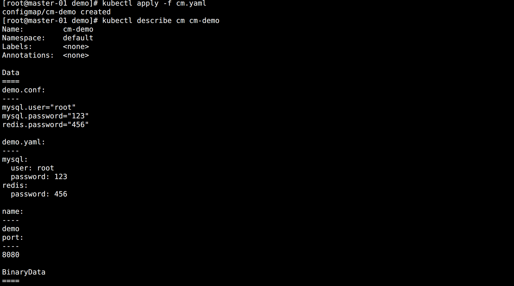
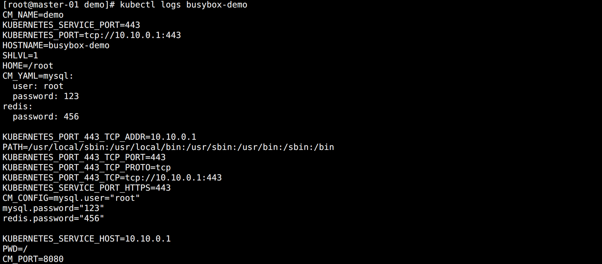

## ConfigMap

为了方便配置的热更新，在传统的开发过程中，一般都会引入一个第三方的配置中心服务，如阿里的 nacos，携程的 Apollo 等。

Kubernetes 自生也提供了一个类似实现这种功能的资源对象：`ConfigMap`，简称 `cm`。


### 资源清单示例

创建一个 ConfigMap 资源清单示例：

```yaml
apiVersion: v1
kind: ConfigMap
metadata:
  name: cm-demo
data:
  name: "demo"
  port: "8080"
  demo.conf: |
    mysql.user="root"
    mysql.password="123"
    redis.password="456"
  demo.yaml: |
    mysql:
      user: root
      password: 123
    redis:
      password: 456
```

配置清单说明：

* 前两项是单个属性配置，以 Key / Value 的格式定义。
* 后面两个字段中的可以看成是两个配置文件，其中的 `|` 的作用在于，保留下面属性的换行符和每行相对于第一行的缩进，多余的缩进和行尾的空白都会被删除。说到底就是保留数据格式，这对于 YAML 这样的配置很重要。
* 除了使用 `|` 输入多行内容，还有使用 `>` 标识折叠。和 `|` 的区别在于只有空白行才会被识别成换行。

<br>

还可以使用竖线和加号或者减号进行配合使用，`+` 表示保留文字块末尾的换行，`-` 表示删除字符串末尾的换行。

```yaml
config: |
  "hello"
# Json 格式：{"config": "hello\n"}  
  
config: |-
  "hello"
# Json 格式：{"config": "hello"}  

config: |+
  "hello"
  
# Json 格式：{"config": "hello\n\n"}
# 有几个换行则加几个
```

<br>
执行创建并查看：

```bash
kubectl apply -f cm.yaml
kubectl describe cm cm-demo
```

如图所示：




### 创建 ConfigMap

创建 ConfigMap 的主要方式有三种：

```bash
# 命令行创建
kubectl create configmap cm-demo --from-literal=key1=value1 --from-literal=key2=value2

# 指定目录创建
kubectl create configmap cm-demo --from-file=/path/dir

# 指定文件创建
kubectl create configmap cm-demo --from-file=key1=/path/dir/file1.txt --from-file=key2=/path/dir/file2.txt
```


### 使用 ConfigMap（环境变量）

在环境变量中使用 ConfigMap：

```yaml
apiVersion: v1
kind: Pod
metadata:
  name: busybox-demo
spec:
  containers:
  - name: busybox
    image: busybox
    env:
      - name: CM_NAME
        valueFrom:
          configMapKeyRef:
            name: cm-demo
            key: name
      - name: CM_PORT
        valueFrom:
          configMapKeyRef:
            name: cm-demo
            key: port
      - name: CM_CONFIG
        valueFrom:
          configMapKeyRef:
            name: cm-demo
            key: demo.conf
      - name: CM_YAML
        valueFrom:
          configMapKeyRef:
            name: cm-demo
            key: demo.yaml
    args: ["/bin/sh", "-c", "env"]
```

查看 Pod 日志输出：

```bash
kubectl logs busybox-demo
```

如图所示：



可以看到，对于配置文件类型依旧被当成一个值赋值给了环境变量。


### 使用 ConfigMap（数据卷挂载）

ConfigMap 在实际使用中大多数时候都是整个配置文件直接塞进去。比如 Prometheus 的配置文件这种。

所以同一可以将 ConfigMap 中的配置以文件的方式挂载到 Pod 中。

```yaml
apiVersion: v1
kind: Pod
metadata:
  name: busybox-demo
spec:
  containers:
  - name: busybox
    image: busybox
    args: ["/bin/sh", "-c", "cd /data/config && cat demo.conf && cat demo.yaml"]
    volumeMounts:
      - name: v-cm-demo
        mountPath: /data/config
  volumes:
    - name: v-cm-demo
      configMap:
        name: cm-demo
        items:
          - key: demo.conf
            # 定义挂载之后的文件名
            path: demo.conf
          - key: demo.yaml
            # 定义挂载之后的文件名
            path: demo.yaml
```

创建后查看日志如图所示：


当使用数据卷的方式挂载到 Pod 中，此时更新 ConfigMap，挂载的数据也是会跟着热更新。

> 只有通过 Kubernetes API 创建的 Pod 才能使用 ConfigMap，其他方式创建的（比如静态 Pod）不能使用，同时 ConfigMap 文件大小限制为 `1MB`（ETCD 的要求）。


