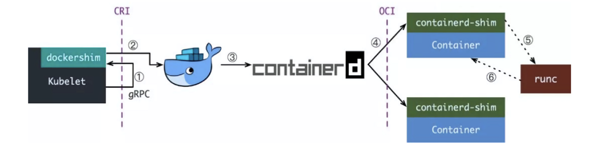

## Docker

Docker 从 1.11 版本开始，其容器的运行就不再是简单的通过 Docker Daemon 来启动，而是通过集成 containerd、runc 等多个组件来协同完成。

* Docker Daemon：守护进程，属于 CS 架构，负责和 Docker Client 端交互，并管理 Docker 镜像和容器。

* Containerd：负责对集群节点上的容器生命周期进行管理，并为 Docker Daemon 提供 gRPC 接口。

工作原理架构图：


<br>

目前 Docker 创建容器的流程主要包含以下 4 步：

1. 用户通过 Docker Daemon 提交容器创建请求。
2. Docker Daemon 请求 Containerd 发起创建。
3. Containerd 收到创建请求后，创建一个 Containerd-shim 进程去操作容器。这样做的原因在于：
   * 容器进程需要一个父进程做状态收集、维持 stdin 等工作，如果父进程直接使用 Containerd 进程，可能会出现因为 Containerd 进程挂掉，整个宿主机所有容器都跟着挂的情况。
   * 而 Containerd-shim 进程就是用来规避这个问题的父进程。
4. Containerd-shim 再通过 RunC 来进行容器的创建。使用 RunC 的原因在于：
   * 容器的创建需要遵循开放容器标准（`OCI`，规定了容器镜像的结构、以及容器需要接收哪些操作指令）做一些 Namespaces，Cgroups 以及挂载 root 文件系统等配置操作。
   * 而 RunC（Docker 捐献的 `libcontainer` 改名而来）则是该标准的一个参考实现。通过 RunC 可以创建一个符合规范的容器，除此之外，同类产品还有 `Kata`、`gVisor` 等。

<br>

整个过程总结起来其实就是：

> Containerd-shim 调用 RunC 创建容器，完成后 RunC 退出，Containerd-shim 进程成为容器的父进程（该进程在宿主机可以直接通过 ps -ef 看到），负责收集容器状态上报给 Containerd。并在容器中 PID 为 1 的进程退出后对容器子进程进行清理，避免出现僵尸进程。

这样看起来 Docker Daemon 完全是多余的东西，还增加了链路长度。

Docker 为了做 Swam 进军 PaaS 市场，将容器操作都迁移到 Containerd。又把 Containerd 项目捐献给了 `CNCF` 基金会（Cloud Native Computing Foundation，云原生计算基金会）。这也导致了因为 Docker Swarm 的失败，Docker 也逐渐被淘汰。


## CRI

Kubernetes 提供了一个叫做 CRI 的容器运行时接口，那么这个 CRI 到底是啥？

在 Kubernetes 早期，当时主流的容器就只有 Docker，所以 Kubernetes 是通过硬编码的方式直接调用 Docker API。

但随着容器技术的不断发展以及 Google 的主导，出现了更多的容器运行时。Kubernetes 为了支持更多更精简的容器运行时，Google 就和红帽主导推出了 CRI，用于将 Kubernetes 平台和特定的容器运行时解耦。

简单的归纳就是：

Google 和红帽联合发布了一个接口标准，大家自己的容器运行时如果想要接入 Kubernetes，就需要按照这个标准提供对应的接口。

<br>

`CRI`（Container Runtime Interface，容器运行时接口），就是 Kubernetes 定义的一组与容器运行时进行交互的接口。

CRI 的发布，意味着 Kubernetes 的角色由：去适配其它容器运行时的接口，到让别的容器运行时去遵循自己的接口标准的转变。

不过 CRI 发布的时候 Kubernetes 还没有现在的统治地位，很多容器运行时自身可能并不会去适配这些 CRI 接口，于是就有了各种各样 shim 垫片。其作用在于适配容器运行时本身的接口到 Kubernetes 的 CRI 接口上。

日常听到比较多的就是 `dockershim`，用于 Kubernetes 和 Docker 进行适配的 `shim 垫片`。其结构如下：


<br>

CRI 定义的 API 主要包含两个 gRPC 服务：

* `ImageService`：镜像管理
* `RuntimeService`：容器运行时管理（容器和 Pod）

<br>

在 2022 年 5 月 3 日，`Kubernetes 1.24` 版本发布，正式移除了内置的 dockershim。从此时开始，新版本的 Kubernetes 还想要以 Docker 作为容器运行时，就需要单独安装适配器垫片 `cri-dockerd` 了。

下面是 1.24 版本之前的 Kubernetes 以 Docker 作为容器运行时的调用流程：



可以发现整个调用链路是很长的，当在 Kubernetes 中想要创建一个 Pod 时：

1. 首先需要 kubelet 通过 CRI 接口调用自身集成的 dockershim。
2. dockershim 在收到请求后，转化成 Docker Daemon 能识别的请求并发给 Docker Daemon。
3. Docker Daemon 收到请求后，再执行上面提到的创建容器流程。

<br>

说到底，通过 Docker 转换这个流程完全就是多余，因为 Containerd 本身就是实现了 CRI 的服务。只是 Docker 在用户交互上做的跟友好而已。但其实在使用 Kubernetes 的时候，直接对于 Docker 的操作几乎很少。所以完全可以不需要它。

所以慢慢的整个创建流程就被精简了：


<br>

在 Containerd 1.1 之后，已经完全消除了中间环节，适配器 shim 也被继承到了 Contained 的主进程中，调用变得更加简洁。

当然用户依旧还是能够使用 Docker 镜像的，但前提是这些镜像必须都是镜像仓库中的。直接使用 Docker 打包在本地的镜像对于 Contained 来说是无法访问到的。

同时，Kubernetes 社区也做了个专门用于 Kubernetes 的容器运行时 `CRI-O`，直接兼容 CRI 和 OCI 规范。但是对于用户来说，Docker 还是更为熟悉，所以更多的还是选择 Containerd 作为容器运行时。


## Containerd

Containerd 是从 Docker Engine 里分离出来的一个独立的开源项目，目标是提供一个更加开放、稳定的容器运行基础设施。分离出来的 Containerd 具有更多的功能，涵盖整个容器运行时管理的所有需求，提供更强大的支持。

作为一个工业级标准的容器运行时，它强调简单性、健壮性和可移植性，可以负责下面这些事情：

* 管理容器的生命周期（从创建容器到销毁容器）
* 拉取/推送容器镜像
* 存储管理（管理镜像及容器数据的存储）
* 调用 RunC 运行容器（与 RunC 等容器运行时交互）
* 管理容器网络接口及网络

<br>

官方架构图：


可以看出 Containerd 采用的也是 C/S 架构，服务端通过 unix domain socket 暴露低层的 gRPC API 接口出去，客户端通过这些 API 管理节点上的容器，每个 Containerd 只负责一台机器。

为了解耦，Containerd 将系统划分成了不同的组件，每个组件都由一个或多个模块协作完成，每一种类型的模块都以插件的形式集成到 Containerd 中，而且插件之间是相互依赖的。

总体来看，Containerd 可以分为三个大块：`Storage`、`Metadata` 和 `Runtime`。


## 安装 Containerd（了解）

由于 Containerd 需要调用 RunC，所以需要先安装 RunC，不过 Containerd 提供了一个包含相关依赖的压缩包 cri-containerd-cni，可以直接使用这个包来进行安装。

本文安装所使用的是 `CentOS 7.9` 的 VM Ware 虚拟机。Containerd 最新版下载地址：

> https://github.com/containerd/containerd/releases

当前 cri-containerd-cni 安装包的最新版本是 `1.6.20`。

```bash
# 版本变量
CRI_CONTAINERD_CNI_VERSION="1.6.20"

# 安装依赖
yum -y install vim lrzsz wget zip unzip tree

# 更新 libseccomp，解决容器启动报错
rpm -e libseccomp-2.3.1-4.el7.x86_64 --nodeps
wget https://vault.centos.org/centos/8/BaseOS/x86_64/os/Packages/libseccomp-2.5.1-1.el8.x86_64.rpm
rpm -ivh libseccomp-2.5.1-1.el8.x86_64.rpm 

# 下载安装包
https://github.com/containerd/containerd/releases/download/v${CRI_CONTAINERD_CNI_VERSION}/cri-containerd-cni-${CRI_CONTAINERD_CNI_VERSION}-linux-amd64.tar.gz

# 直接解压到系统目录
tar -C / -zxf cri-containerd-cni-${CRI_CONTAINERD_CNI_VERSION}-linux-amd64.tar.gz

# 创建配置文件目录，并生成默认配置
mkdir /etc/containerd
containerd config default > /etc/containerd/config.toml

# 启动 Containerd
systemctl enable containerd --now

# 查看安装信息
ctr version
```

可以看到它的用法和 Docker 是有些类似的，但是在生产环境中一般不单独这样安装，而是选择功能更全的 `nerdctl`。


## Nerdctl

和 Docker 类似，Containerd 也有自己类似的客户端工具 `ctr`，不过大部分选择 Containerd 的人都是从 Docker 转过的，ctr 作为全新的客户端工具，在使用方法上和 Docker 是有明显的区别的，这就加剧了大家的学习成本。

为此，社区提供了另外一种解决方案 `nerdctl`。该方法除了和 docker 命令中 `docker` 这个关键字不同以外，其它用法几乎一模一样，甚至还兼容了 docker-compose 的语法。简直离了大谱。那为啥还要用难用的 ctr 命令甚至 docker。

> https://github.com/containerd/nerdctl

官方提供了两种安装包：

* nerdctl：单纯只有 nerdctl 工具，Containerd 需要单独配置安装。
* `nerdctl-full`：包含了所有需要的工具和 Containerd。

目前官方提供的最新版本为 `1.3.1`，它包含一下工具：

- nerdctl: v1.3.1
- containerd: v1.7.0
- runc: v1.1.5
- CNI plugins: v1.2.0
- BuildKit: v0.11.5
- Stargz Snapshotter: v0.14.3
- imgcrypt: v1.1.7
- RootlessKit: v1.1.0
- slirp4netns: v1.2.0
- bypass4netns: v0.3.0
- fuse-overlayfs: v1.11
- containerd-fuse-overlayfs: v1.0.5
- Kubo (IPFS): v0.19.1
- Tini: v0.19.0
- buildg: v0.4.1


### 安装准备

准备一台测试机器用于安装 nerdctl-full，配置如下：

| IP            | 系统                          | CPU  | 内存 | 硬盘 |
| ------------- | ----------------------------- | ---- | ---- | ---- |
| 192.168.2.100 | CentOS Linux release 7.9.2009 | 4    | 4    | 30   |


### 安装服务

基础安装方法如下：

```bash
# 安装依赖
yum -y install vim lrzsz wget zip unzip tree bash-completion

# 更新 libseccomp，解决容器启动报错
rpm -e libseccomp-2.3.1-4.el7.x86_64 --nodeps
wget https://vault.centos.org/centos/8/BaseOS/x86_64/os/Packages/libseccomp-2.5.1-1.el8.x86_64.rpm
rpm -ivh libseccomp-2.5.1-1.el8.x86_64.rpm 

# 下载安装包，国内下载慢可可以使用 Github proxy 加速
cd /usr/local/src/
mkdir nerdctl
cd nerdctl/
wget https://github.com/containerd/nerdctl/releases/download/v1.3.1/nerdctl-full-1.3.1-linux-amd64.tar.gz

# 解压安装
tar -C /usr/local -zxf nerdctl-full-1.3.1-linux-amd64.tar.gz

# 创建 Containerd 默认配置
mkdir /etc/containerd
containerd config default > /etc/containerd/config.toml

# 启动 Containerd
systemctl enable containerd --now

# 查看 Containerd 版本
ctr version

# 查看 Nerdctl 版本
nerdctl version
```

nerdctl-full 安装包解压后有 4 个目录，分别是：

* `bin`：nertctl 的可执行文件，包含 nertdctl 和 ctr 等命令，最终被解压到 /usr/local/bin 下面。
* `lib`：包含了启动服务的 service 文件，最终被解压到 `/usr/local/lib` 下面。
* `libexec`：包含其它不从的命令工具，最终被解压到 `/usr/local/libexec` 下面。
* `share`：文档信息，最终被解压到 `/usr/local/share` 下面。


### 镜像构建（按需）

如果需要像 docker 一样 build Dockerfile，还需要启动 `BuildKit` 服务。

BuildKit 是 docker 公司开发的下一代 docker build 工具，具有更高效、更安全、 易于扩展等特点。由 buildkitd 和 buildctl 组成：

- buildkitd：服务端，连接容器运行时，目前支持 runc 和 containerd 作为镜像构建环境，默认是 runc。
- buildctl：客户端，负责解析 Dockerfile 文件，并向 buildkitd 发出构建请求。由于命令复杂，使用 nerdctl 替代。

直接启动即可：

```bash
systemctl enable buildkit
systemctl start buildkit
```


### 模拟 docker

由于 nerdctl 命令用法和 docker 几乎一模一样，为了更方便的使用它，完全可以给他取个别名，就叫 docker。

```bash
# 配置别名
cat >> ~/.bashrc << EOF
# nerdctl 别名
alias docker=nerdctl
EOF

# 应用配置
source ~/.bashrc
```

现在完全可以像使用 docker 一样使用 Containerd：


### 命令补全

为了方便使用，可以添加上命令 Tab 补全：

```bash
# 配置
nerdctl completion bash > /etc/bash_completion.d/nerdctl
nerdctl completion bash > /etc/bash_completion.d/docker
sed -i "s#nerdctl#docker#g" /etc/bash_completion.d/docker

# 生效配置
source /etc/bash_completion.d/nerdctl
source /etc/bash_completion.d/docker
```

此时最好是退出一次终端再重新连接，就可以看到 tab 已经能实现命令补全了，不管是 docker 命令还是 nerdctl 命令。

后续还有很多配置需要修改，想要了解可以查看 Kubernetes 集群初始化安装的文档。


## CGroup（了解）

`CGroup`（Linux Control Group），其作用是限制一组进程使用的资源（CPU、内存等）上限，是 Containerd 容器技术的核心实现原理之一，首先需要了解几个基本概念：

- Task：CGroup 中的 Task 可以理解为一个进程，但它实际上是进程 ID 和线程 ID 列表。
- CGroup：控制组，一个控制组就是一组按照某种标准划分的 Tasks，可以理解为资源限制是以进程组为单位实现的，一个进程加入到某个控制组后，就会受到相应配置的资源限制。
- Hierarchy：CGroup 的层级组织关系。CGroup 以树形层级组织，每个 CGroup 子节点默认继承其父节点的配置属性，这样每个 Hierarchy 在初始化会有 root CGroup。
- Subsystem：子系统，表示具体的资源配置，如 CPU 使用，内存占用等，Subsystem 附加到 Hierarchy 上后可用。

<br>

CGroup 支持的子系统包含以下几类，即为每种可以控制的资源定义了一个子系统：

- `cpuset`：为 CGroup 中的进程分配单独的 CPU 节点，绑定特定的 CPU。
- `cpu`：限制 CGroup 中进程的 CPU 使用份额。
- `cpuacct`：统计 CGroup 中进程的 CPU 使用情况。
- `memory`：限制 CGroup 中进程的内存使用，并能报告内存使用情况。
- `devices`：控制 CGroup 中进程能访问哪些文件设备（设备文件的创建、读写）。
- `freezer`：挂起或恢复 CGroup 中的 Task。
- `net_cls`：可以标记 CGroup 中进程的网络数据包，然后可以使用 tc 模块对数据包进行控制。
- `blkio`：限制 CGroup 中进程的块设备 IO。
- `perf_event`：监控 CGroup 中进程的 perf 时间，可用于性能调优。
- `hugetlb`：hugetlb 的资源控制功能。
- `pids`：限制 CGroup 中可以创建的进程数。
- `net_prio`：允许管理员动态的通过各种应用程序设置网络传输的优先级。

通过上面的各个子系统，可以看出使用 CGroups 可以控制的资源有：CPU、内存、网络、IO、文件设备等。

查看当前系统支持的子系统：

```bash
cat /proc/cgroups
```

如图所示：


<br>

CGroup 具有以下几个特点：

* CGroup 的 API 以一个伪文件系统（/sys/fs/cgroup/）的实现方式，用户的程序可以通过文件系统实现 CGroup 的组件管理。
* CGroup 的组件管理操作单元可以细粒度到线程级别，用户可以创建和销毁 CGroup，从而实现资源载分配和再利用。
* 所有资源管理的功能都以子系统的方式实现，接口统一子任务创建之初与其父任务处于同一个 CGroup 的控制组。

<br>

查看挂载信息：

```bash
df -h | grep cgroup
```

如图所示：


可以看到 `/sys/fs/cgroup` 被挂载到了系统中，这意味着 cgroup 其实是一种文件系统类型，所有的操作都是通过文件来完成的。

挂载目录下的每个子目录就对应着一个子系统，cgroup 是以目录形式组织的，`/` 是 cgroup 的根目录，但是这个根目录可以被挂载到任意目录。

例如 CGroup 的 memory 子系统的挂载点是 `/sys/fs/cgroup/memory`，那么该目录就是 memory 子系统的根目录。该目录下还包含了 `system.slice` 等目录，进入可以看到正在运行的 containerd 等服务的目录，这些服务所有内存相关的 CGroup 配置都在名称对应的目录下面，如图所示：


<br>

如果 linux 系统使用 systemd 初始化系统，初始化进程会生成一个 root CGroup，每个 systemd unit 都将会被分配一个 CGroup。

容器运行时的 CGroup 是可以配置的，如 containerd 可以选择使用 `cgroupfs` 或 `systemd` 作为 CGroup 驱动，containerd 默认使用的是 cgroupfs。

但这样对于使用了 systemd 的 linux 发行版来说，就同时存在了两个 cgroup 管理器：

* 对于该服务器上启动的容器使用的是 cgroupfs。

* 对于其他 systemd 管理的进程使用的是 systemd。

> 两种驱动可能导致服务器在高负载的情况下变的不稳定。因此对于使用了 systemd 的 linux 系统，推荐将容器运行时的 CGroup 驱动使用 `systemd`。


## Namespace（了解）

`Namespace` 也称命名空间，是 Linux 提供的用于隔离进程树、网络接口、挂载点以及进程间通信等资源的方法

在服务器上启动多个服务的时候，这些服务其实是会相互影响的，每一个服务都能看到其他服务的进程，也可以访问宿主机器上的任意文件，一旦服务器上的某一个服务被入侵，那么入侵者就能够访问当前机器上的所有服务和文件，这是大家不愿意看到的。作为用户，更希望运行在同一台机器上的不同服务能做到完全隔离，就像运行在多台不同的机器上一样。容器其实就通过 Linux 的 Namespace 技术来实现的对不同的容器进行隔离。

linux 共有 6（7）种命名空间:

- `ipc namespace`：管理对 IPC 资源（进程间通信、信号量、消息队列和共享内存）的访问。
- `net namespace`：网络设备、网络栈、端口等隔离。
- `mnt namespace`：文件系统挂载点隔离。
- `pid namespace`：用于进程隔离。
- `user namespace`：用户和用户组隔离（3.8以后的内核才支持）。
- `uts namespace`：主机和域名隔离。
- `cgroup namespace`：用于 cgroup 根目录隔离（4.6以后版本的内核才支持）。

通过 `lsns` 命令可以看到当前系统创建的命名空间：


`/proc/<pid>/ns` 目录下记录指定进程所属的命名空间：


这些 namespace 都是链接文件, 格式为 `namespaceType:[inode number]`，`inode number` 用来标识一个 namespace，可以理解为 namespace id，如果两个进程的某个命名空间的链接文件指向同一个，那么其相关资源在同一个命名空间中，也就没有隔离了。

查看运行的容器使用的 Namespace：


