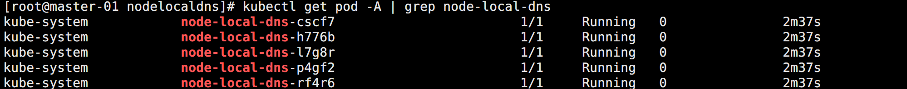
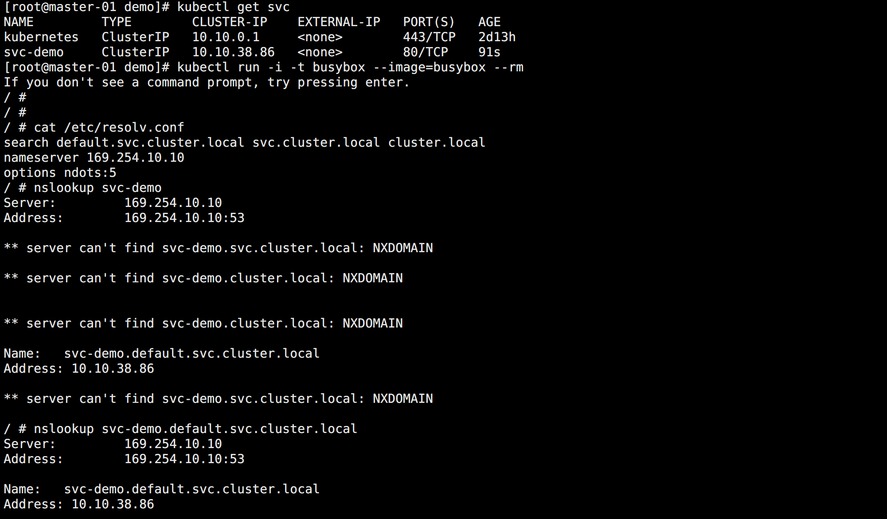

## 服务发现

通过 Service 知道了后端的 Pod 服务可以通过 Cluster IP 代理出来让其他服务能够访问到。但也存在一个问题，Service 可能会被更新或者重建，下一次的 IP 可能就变了，此时服务怎么办？

为了解决这个问题，在早期的 Kubernetes 中，通过设置环境变量的方法，将服务所需的地址注入到 Pod 中。

但是这种方法存在一个问题：被注入的环境变量对应的服务需要事先存在，如果不存在，则不知它的 Cluster IP，也就没法注入。


## DNS

由于环境变量的局限性，所以就需要一种更智能的方式。对于 Service 而言，不管怎么变化，name 是不会变的，如果 name 都变了，那它完全就是一个新的 Service 了。为此可以从 name 下手，将它解析到 DNS 服务上，提供给集群内部访问。

DNS 服务不是一个独立的系统服务，而是作为一种 addon 插件而存在，现在比较推荐的两个插件：`kube-dns` 和 `CoreDNS`。

实际上，在比较新点的版本中已经默认是 CoreDNS 了，因为 kube-dns 默认一个 Pod 中需要3个容器配合使用，CoreDNS 只需要一个容器即可。

CoreDNS 的 Service 地址一般情况下是固定的，在安装的时候就做了指定，比如我的集群就是 `10.10.10.10`。然后在安装 kubelet 的时候会将 DNS 地址配置到配置文件中，这样 Kubelet 在创建 Pod 的时候就能将 DNS 的地址传递给每个容器。

DNS 名称也需要域名，一般在 Kubelet 的配置文件中会配置：`clusterDomain: cluster.local`

对于 Service 而言，一般会在 CoreDNS 中生成以下配置：

* 普通 Service：`<Service名称>.<名称空间>.svc.cluster.local`，解析到 Cluster IP 上。调用可以简写成 `<Service名称>.<名称空间>`，同一名称空间下调用则直接 `<Service名称>` 即可。
* Headless Service：还是 `<Service名称>.<名称空间>.svc.cluster.local`，但是由于没有 Cluster IP，会直接解析到 Pod 列表。所以还可以通过 `<Pod名称>.<Service名称>.<名称空间>.svc.cluster.local` 访问指定 Pod。


### 策略

目前 Kubernetes 支持以下特定 Pod 的 DNS 策略。这些策略可以在 Pod 的 `dnsPolicy` 字段设置：

- `Default`： 让 Kubelet 决定使用何种 DNS 策略。Kubelet 默认使用宿主机的 `/etc/resolv.conf`，可以使用 `–resolv-conf=/etc/resolv.conf` 参数来决定 DNS 解析文件地址。
- `ClusterFirst`：Pod 内的 DNS 使用集群中配置的 DNS 服务，也就是使用 Kubernetes 中 kube-dns 或 CoreDNS 服务进行域名解析。如果解析不成功，才会使用宿主机的 DNS 配置进行解析。
- `ClusterFirstWithHostNet`：在某些场景下 Pod 是用 HostNetwork 模式启动的，这导致 Pod 中的所有容器都使用宿主机的 `/etc/resolv.conf` 配置进行 DNS 查询，如果想用 Kubernetes 的 DNS 服务则需要该策略。
- `None`：空的 DNS 设置，一般用于想自定义 DNS 配置的场景，往往需要和 `dnsConfig` 配合一起使用达到自定义 DNS 的目的。

特别注意：

> Default 并不是默认的 DNS 策略，如果未明确指定 dnsPolicy，则使用 `ClusterFirst`。

<br>

ClusterFirstWithHostNet 使用示例：”

```yaml
apiVersion: v1
kind: Pod
metadata:
  name: dns-demo1
spec:
  # 配置 DNS 策略
  hostNetwork: true
  dnsPolicy: ClusterFirstWithHostNet
  containers:
  - name: nginx
    image: nginx
    ports:
      - containerPort: 80
```

配置 hostNetwork 的 Pod 相当于网络模式使用主机网络，和宿主机共用 IP 和端口。


### 配置

用户可以通过 `dnsConfig` 字段对 Pod 的 DNS 设置进行更多控制。它可以与任何 `dnsPolicy` 设置一起使用。 但是，当 Pod 的 dnsPolicy 设置为 "None" 时，必须指定 dnsConfig 字段。

dnsConfig 支持以下属性：

- `nameservers`：用作于 Pod 的 DNS 服务器的 IP 地址列表。 最多可以指定 3 个。当 dnsPolicy 为 "None" 时，必须至少包含一个 IP 地址。这些地址将合并到指定的 DNS 策略的列表并去重。
- `searches`：用于在 Pod 中查找主机名的 DNS 搜索域的列表。所提供的列表将合并到根据所选 DNS 策略的列表并去重，最多允许 6 个搜索域。
- `options`：可选的对象列表，每个对象可能具有 name （必需）和 value （可选）。此属性中将合并到从指定的 DNS 策略的选项并去重。

<br>

使用示例：

```yaml
apiVersion: v1
kind: Pod
metadata:
  name: dns-demo2
spec:
  dnsPolicy: None
  dnsConfig:
    nameservers:
      - "114.114.114.114"
    searches:
      - dns.ezops.cn
    options:
      - name: hello
        value: world
  containers:
  - name: busybox
    image: busybox:latest
    command: ["/bin/sh", "-c", "sleep 3600"]
```


### 高并发优化

使用 CoreDNS 来进行集群的域名解析在集群规模较大，并发较高的情况下可能会出现超时 5s 的情况。


**超时原因**

DNS Client（glibc 或 musl libc）会并发请求 A 和 AAAA 记录，当 DNS Client 跟 DNS Server 创建 connect 建立 fd 后，后面请求报文都使用这个 fd 来发送。但是由于 UDP 是无状态协议，connect 创建时并不会创建 `conntrack` 表项。在高并发场景下，大量并发请求的默认使用同一个 fd 发包，这时它们源 Port 相同。那么在并发发包时，可能就会出现两个包都还没有被插入 conntrack 表项，netfilter 就会为它们分别创建 conntrack 表项，而集群内请求 CoreDNS 都是访问的 Cluster IP，报文最终会被 DNAT 成一个具体的 Pod IP，当两个包被 DNAT 成同一个 IP，最终它们的五元组就相同了。在最终插入的时候后面那个包就会被丢掉。这在 DNS 的 Pod 副本只有一个实例的情况很容易发生，现象就是 DNS 请求超时，客户端默认策略是等待 5s 自动重试，如果重试成功，看到的现象就是 DNS 请求有 5s 的延时。

需要注意的是：

- 只有多个线程或进程，并发从同一个 socket 发送相同五元组的 UDP 报文时才会有概率发生。
- glibc、musl（alpine linux 的 libc 库）都使用 `parallel query` 并发发出多个查询请求，因此很容易碰到这样的冲突，造成查询请求被丢弃。
- 由于 ipvs 也使用了 conntrack，所有使用 kube-proxy 的 ipvs 模式并不能避免这个问题。

<br>

**解决办法**

想要彻底解决这个问题只能去内核上去 FIX 掉这个 BUG。当然还可以使用其他方法来进行规避，主要是避免相同五元组 DNS 请求的并发。

在 `resolv.conf` 中有两个相关的参数可以进行配置：

- `single-request-reopen`：发送 A 类型和 AAAA 类型请求使用不同源端口，这样两个请求在 conntrack 表中不占用同一个表项，从而避免冲突。
- `single-request`：避免并发，改为串行发送 A 类型和 AAAA 类型请求。没有了并发，从而也避免了冲突。

<br>

添加参数的方法主要有这几个：

* 使用 ConfigMap 挂载 volume 配置覆盖 Pod 里面的 `/etc/resolv.conf`。

* 在容器的 `ENTRYPOINT` 或者 `CMD` 脚本中，执行 `/bin/echo 'options single-request-reopen' >> /etc/resolv.conf`

* 在 Pod 的 postStart hook 中添加：

```yaml
lifecycle:
  postStart:
    exec:
      command:
      - /bin/sh
      - -c
      - "/bin/echo 'options single-request-reopen' >> /etc/resolv.conf"
```

<br>

另外两种比较推荐的侵入性较小的方法：

* 使用 `template.spec.dnsConfig` 配置（推荐）:

```yaml
template:
  spec:
    dnsConfig:
      options:
        - name: single-request-reopen
```

* 使用本地 DNS 缓存，请求都发往本地的 DNS 缓存服务，不走 DNAT，也就不会发生 `conntrack` 冲突，还可以提升 CoreDNS 的性能瓶颈。


## NodeLocal DNSCache

`NodeLocal DNSCache`，通过在集群节点上运行一个 DaemonSet 来提高集群 DNS 性能和可靠性。

处于 ClusterFirst 的 DNS 模式下的 Pod 可以连接到 kube-system 名称空间下名为 kube-dns 的 Service Cluster IP 进行 DNS 查询，然后通过 Kube-proxy 组件添加的 iptables 或 ipvs 规则将其转换为 CoreDNS 端点。

通过在每个集群节点上运行 DNS 缓存，则可以缩短 DNS 查找的延迟时间、使 DNS 查找时间更一致，减少发送到 kube-dns 的 DNS 查询次数。

在集群中运行 `NodeLocal DNSCache` 有如下几个好处：

- 当 DNS QPS 很高时，Pod 可能必须到另一个节点进行解析，通过使用 `NodeLocal DNSCache`，有助于改善延迟。
- 跳过 DNAT 和连接跟踪，有助于减少 conntrack 竞争，避免 UDP DNS 条目填满 conntrack 表，出现 5s 超时问题。
- 从本地缓存到 kube-dns 的连接升级到 TCP，那么 TCP conntrack 条目就会在连接关闭时删除。
- 将 DNS 查询从 UDP 升级到 TCP 将减少因为丢弃的 UDP 数据包和 DNS 超时的尾部等待时间，通常长达 30 秒（3 次重试+ 10 秒超时）


### 下载资源清单

在 Kubernetes 项目目录下是有这个 addon 的资源清单的：

> https://github.com/kubernetes/kubernetes/blob/master/cluster/addons/dns/nodelocaldns/nodelocaldns.yaml

<br>

下载资源清单：

```bash
# 创建配置目录
cd /ezops/service/kubernetes/addons/
mkdir nodelocaldns
cd nodelocaldns

# 下载资源清单，由于 raw.githubusercontent.com 域名不配置 hosts 打不开，给他加个代理
wget https://github.moeyy.xyz/https://raw.githubusercontent.com/kubernetes/kubernetes/master/cluster/addons/dns/nodelocaldns/nodelocaldns.yaml
```


### 调整资源清单

在配置中有几个占位符需要修改一下：

- `__PILLAR__DNS__SERVER__` ：表示 kube-dns 这个 Service 的 ClusterIP，我的环境是 10.10.10.10
- `__PILLAR__LOCAL__DNS__`：表示 DNSCache 本地监听的 IP 地址，该地址可以是任何地址，只要不和你的集群里现有的 IP 冲突。推荐使用 IPv4 链路本地区段 169.254.0.0/16 内的地址。
- `__PILLAR__DNS__DOMAIN__`：表示集群域，默认就是 `cluster.local`

在 1.15.6 或更高版本。下面的值将通过读取自定义上游服务器配置的 kube-dns 的 configMap 来确定。

* `__PILLAR__CLUSTER__DNS__`：用于集群内查询的上游服务器。 
* `__PILLAR__UPSTREAM__SERVERS__`：用于外部查询的上游服务器。

另外，镜像地址也需要修改，因为 `registry.k8s.io` 注册点也无法访问。

执行替换操作：

```bash
# 执行替换
sed -i "s#__PILLAR__DNS__SERVER__#10.10.10.10#g" nodelocaldns.yaml
sed -i "s#__PILLAR__LOCAL__DNS__#169.254.10.10#g" nodelocaldns.yaml
sed -i "s#__PILLAR__DNS__DOMAIN__#cluster.local#g" nodelocaldns.yaml

# 替换镜像地址
sed -i "s#registry.k8s.io/dns#dyrnq#g" nodelocaldns.yaml

```

需要注意：

> 使用 DaemonSet 部署 node-local-dns 使用了 `hostNetwork=true`，会占用所有宿主机的 8080 端口，所以需要保证该端口未被占用。也可以替换掉资源清单中的 8080 端口成其它空闲的端口再创建。

如下所示：

```bash
sed -i "s#8080#38080#g" nodelocaldns.yaml
```

创建资源：

```bash
# 执行创建
kubectl apply -f nodelocaldns.yaml
```

创建完成如图所示：




### 修改 Kubelet 配置

所有节点的 Kubelet 中配置的 DNS 还是 `10.10.10.10`，需要进行修改重启：

```bash
# Master 替换配置
sed -i "s#10.10.10.10#169.254.10.10#g" /ezops/service/kubernetes/server/conf/kubelet.yaml

# Node 替换配置
sed -i "s#10.10.10.10#169.254.10.10#g" /ezops/service/kubernetes/node/conf/kubelet.yaml

# 重启服务
systemctl restart kubelet
```

所有节点都是用 `169.254.10.10` 作为 DNS 服务器地址，原因在于该 IP 会在每个宿主机都监听，相当于 `127.0.0.1`。


### 测试解析

新建一个 Pod 才会使用新的 DNS 地址：

```bash
# 创建 Pod
kubectl run -i -t busybox --image=busybox --rm
```

解析如图所示：



当然，由于 LocalDNS 使用的是 DaemonSet 模式部署，所以如果需要更新镜像则可能会中断服务，一般不会更新（不过可以使用一些第三方的增强组件来实现原地升级解决这个问题，比如 openkruise）。


