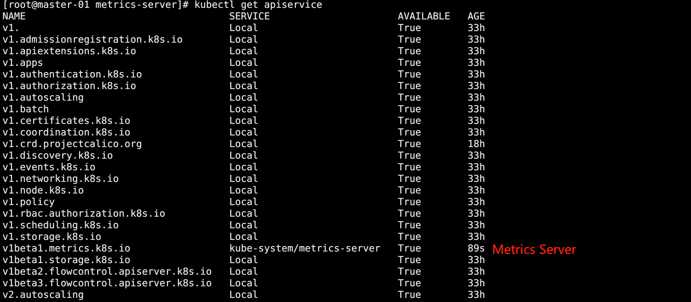
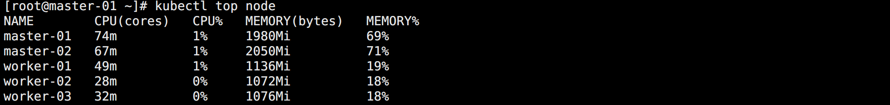
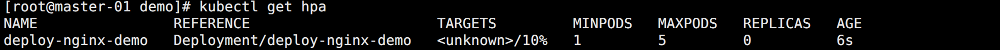
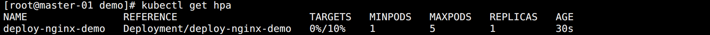
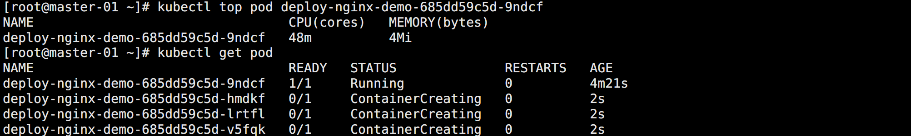

## HPA

使用 Deployment 的时候知道了可以通过 `kubectl scale` 的方式调整集群中 Pod 的副本数以满足业务的需求。

在生产环境中，应用的资源使用率通常都有高峰和低谷的时候，如何削峰填谷，提高集群的整体资源利用率，并且尽可能的减少人工干预。Kubernetes 提供了这样一种资源对象：`Horizontal Pod Autoscaling`，Pod 水平自动伸缩，简称 `HPA`。

HPA 通过监控分析控制器控制的所有 Pod 的负载变化情况来确定是否需要调整 Pod 的副本数量，其原理如下：


用户通过 `kubectl autoscale` 命令来创建一个 HPA 资源对象，该资源对象的 `HPA Controller` 会默认以 `30s` 轮询一次去查询指定的资源中的 Pod 资源使用率，并且与创建时设定的值和指标做对比，从而判断是否需要进行自动伸缩。

如果想要调整轮询时间，也可以通过 `kube-controller-manager` 的 `--horizontal-pod-autoscaler-sync-period` 参数进行调整。


## Metrics Server

Kubernetes 自 1.2 版本引入 HPA 机制，到 1.6 版本之前一直是通过 kubelet 来获取监控指标进行判断是否需要扩缩容。

从 1.6 版本开始，则必须通过 `API server`、`Heapseter` 或者 `kube-aggregator` 来获取监控指标。

> HPA 仅适用于 Deployment 和 ReplicaSet。

在 v1 版本中，HPA 仅支持根据 Pod 的 CPU 利用率扩缩容，需要通过 Heapster 提供 CPU 指标。

从 v1alpha 开始，HPA 增加了内存利用率和用户自定义的 metric 扩缩容。

在 HPA v2 过后，就需要安装 `Metrcis Server` 了。

Metrics Server 可以通过标准的 Kubernetes API 把监控数据暴露出来，然后通过 API 来访问想要获取的监控数据。

比如，用户直接请求 API Server 的接口：

> https://192.168.2.100:6443/apis/metrics.k8s.io/v1beta1/namespaces/<namespace-name\>/pods/\<pod-name\>

通过访问该 API，用户就可以获取到该 Pod 的资源数据，这些数据其实是由 kubelet 的 `Summary API` 采集而来。虽然看起来可以直接通过  API Server 的接口来获取资源监控数据，但这并不表示 Metrics Server 就是 API Server 的一部分。

该方法是通过 Kubernetes 提供的 `Aggregator` 汇聚插件来实现，Metrics Server 独立于 API Server 之外运行。


## 聚合 API

`Aggregator` 允许开发人员编写一个自己的服务，把这个服务注册到 Kubernetes 的 API Server 里面去，这样就可以像原生的 API Server 提供的 API 一样去使用自己的 API。

将开发的服务运行在 Kubernetes 集群中，然后 Kubernetes Aggregator 通过接口前缀将请求转发到对应的 Service，类似于 Nginx 的反向代理。

这样设计的好处在于：

- 增加了 API 的扩展性，开发人员可以编写自己的 API 服务来暴露想要的 API。
- 丰富了 API，通过允许开发人员将自己的 API 作为单独的服务公开，这样就无须社区繁杂的审查，合并代码，使得 Kubernetes 变得臃肿。
- 开发分阶段实验性 API，新的 API 可以在单独的聚合服务中开发，当它稳定之后，想要再合并到 API Server 就很容易了。
- 确保新 API 都遵循 Kubernetes 约定。


## 安装 Metrics Server

要使用 HPA，就需要在集群中安装 Metrics Server 服务，要安装 Metrics Server，就需要开启 Aggregator。


### 调整 API Server 参数

如果集群是通过 Kubeadm 搭建的，默认已经开启了，如果是二进制方式安装的集群，还需要单独配置 kube-apsierver 添加如下参数并重启：

```bash
--requestheader-client-ca-file=<path to aggregator CA cert>
--requestheader-allowed-names=aggregator
--requestheader-extra-headers-prefix=X-Remote-Extra-
--requestheader-group-headers=X-Remote-Group
--requestheader-username-headers=X-Remote-User
--proxy-client-cert-file=<path to aggregator proxy cert>
--proxy-client-key-file=<path to aggregator proxy key>
```

如果是按照我写的二进制安装方法，默认是已经配置了这些参数的。如果不是，可能需要单独再签发对应的证书，然后再进行配置。

如果 Kube-proxy 没有和 API Server 运行在同一台主机上，则需要增加 API Server 的启动参数：

```none
--enable-aggregator-routing=true
```


### 修改资源清单

Metrics Server 官方仓库地址：

> https://github.com/kubernetes-sigs/metrics-server

在任意 Master 节点下载最新的资源清单：

```bash
# 创建资源清单目录
cd /ezops/service/kubernetes/addons/
mkdir metrics-server
cd metrics-server/

# 下载资源清单
wget https://github.com/kubernetes-sigs/metrics-server/releases/latest/download/high-availability.yaml
mv high-availability.yaml metrics-server.yaml
```

需要对以下配置进行调整：

```yaml
apiVersion: apps/v1
kind: Deployment
...
spec:
  # 设置副本数   
  replicas: 3
...
      containers:
      - args:
        - --cert-dir=/tmp
        - --secure-port=4443
        - --kubelet-preferred-address-types=InternalIP,ExternalIP,Hostname
        - --kubelet-use-node-status-port
        - --metric-resolution=15s
        # 新增下面证书相关认证，1.25+ 中跳过认证好像有问题
        - --kubelet-insecure-tls
        # 这个证书是需要被挂载在容器中去，如果没配置证书会报错 x509
        - --requestheader-client-ca-file=/ezops/cert/kubernetes/front-proxy-ca.pem
        - --requestheader-username-headers=X-Remote-User
        - --requestheader-group-headers=X-Remote-Group
        - --requestheader-extra-headers-prefix=X-Remote-Extra-
        # 修改国内能访问的镜像地址
        # image: registry.k8s.io/metrics-server/metrics-server:v0.6.3
        image: bitnami/metrics-server:0.6.3
        ...
        volumeMounts:
        ...
        # 挂载证书目录，如果是 kubeadm 安装，则修改为 /etc/kubernetes/pki
        - name: ssl-path
          mountPath: /ezops/cert/kubernetes 
      ...
      volumes:
      ...
      # 新增证书目录 volume
      - name: ssl-path
        hostPath:
          path: /ezops/cert/kubernetes
---
# 如果是 Kubernetes 1.25+ 版本，需要将这里的 apiVersion 从 policy/v1beta1 更换为 policy/v1
# 否则会报错：no matches for kind "PodDisruptionBudget" in version "policy/v1beta1"
apiVersion: policy/v1
kind: PodDisruptionBudget
...
```


### 创建 Metrics Server

应用资源清单：

```bash
kubectl apply -f metrics-server.yaml
```

查看效果：

```bash
kubectl get apiservice
```

如图所示：



配置正常后就能使用 top 命令查看集群信息了：

```bash
kubectl top node
```

如图所示：




## 使用 HPA（命令行）

先创建一个 Deployment 用于测试：

```yaml
apiVersion: apps/v1
kind: Deployment
metadata:
  name: deploy-nginx-demo
spec:
  selector:
    matchLabels:
      app: nginx
  template:
    metadata:
      labels:
        app: nginx
    spec:
      containers:
      - name: nginx
        image: nginx
        ports:
        - containerPort: 80
```

创建完成会默认启动一个 Pod，然后基于该 Deployment 创建 HPA：

```bash
kubectl autoscale deployment deploy-nginx-demo --cpu-percent=10 --min=1 --max=5
```

参数说明：

* `--cpu-percent`：当 CPU 使用了大于 10% 的时候开始执行扩容集群。
* `--min`：指定最小副本数。
* `--max`：指定最大副本数。

如图所示：



此时 `TARGETS` 字段显示 `unknow` 是有问题的。

<br>

通过查看 Pod 报错信息可以看到：

> Warning  FailedGetResourceMetric       13s (x2 over 28s)  horizontal-pod-autoscaler  failed to get cpu utilization: missing request for cpu in container nginx of Pod deploy-nginx-demo-7f456874f4-h4fqd
>   Warning  FailedComputeMetricsReplicas  13s (x2 over 28s)  horizontal-pod-autoscaler  invalid metrics (1 invalid out of 1), first error is: failed to get cpu resource metric value: failed to get cpu utilization: missing request for cpu in container nginx of Pod deploy-nginx-demo-7f456874f4-h4fqd

原因在于定义资源清单的时候，没有配置资源限制。所以想要使用 HPA，必须要有资源限制。

调整资源清单添加配置：

```yaml
...
        resources:
          requests:
            cpu: 50m
            memory: 50Mi
          limits:
            cpu: 50m
            memory: 50Mi
        ports:
        - containerPort: 80
```

应用更新之后删除 HPA 重新创建，完成后再度查看：



此时 `TARGETS` 字段恢复正常。


## 测试 HPA

模拟访问 Nginx：

```bash
while true; do wget -q -O- 172.16.184.75;done
```

可以看到 CPU 飙升，新的 Pod 被创建：



最终一共运行 5 个副本，达到设置的 `--max` 的值。原因在于上面的请求一直请求的是同一个节点，即使扩容了，该节点的 CPU 并没有下降。

此时停止访问，CPU 会很快降下来，但是 Pod 并不会立即缩容，默认有 5 分钟观察期，这是一种保护机制，避免因为临时降低而反复创建删除 Pod。

想要修改 HPA 观察期时间，可以在 Controller Manager 中修改 `--horizontal-pod-autoscaler-downscale-stabilization`，默认 5 分钟。


## 使用 HPA（资源清单）

资源清单示例：

```yaml
apiVersion: autoscaling/v2
kind: HorizontalPodAutoscaler
metadata:
  name: hpa-nginx-demo
spec:
  # 指定 Deployment
  scaleTargetRef:
    apiVersion: apps/v1
    kind: Deployment
    name: deploy-nginx-demo
  # 最小副本数
  minReplicas: 1
  # 最大副本数
  maxReplicas: 5
  metrics:
  - type: Resource
    # 指定指标
    resource:
      name: cpu
      target:
      	# 使用率，支持 Utilization, Value, AverageValue
        type: Utilization
        averageUtilization: 10
```

注意：一个 Deployment 只能绑定一个 HPA。

除了 HPA 以外，还有 VPA，也就是垂直扩容，和 HPA 不同在于不是增加 Pod 而是在原有 Pod 身上增加资源配置。


