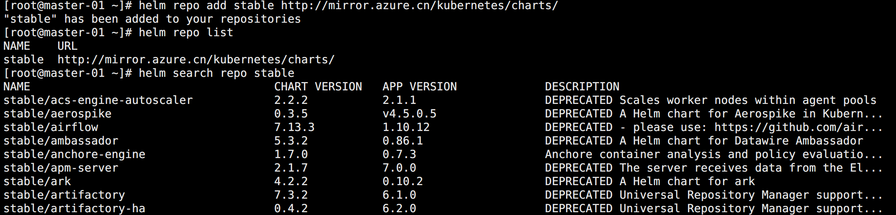
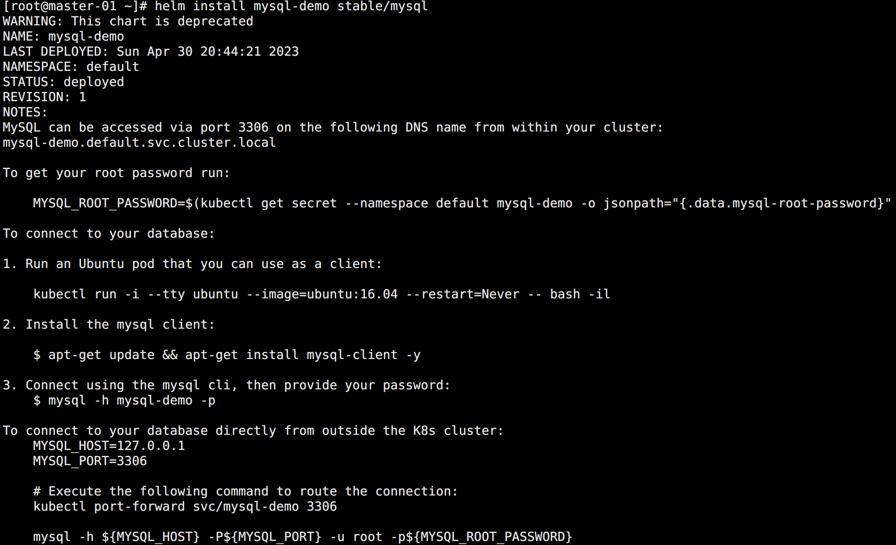
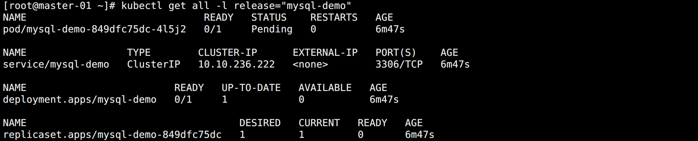
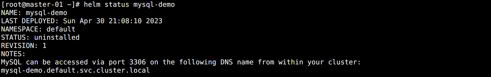
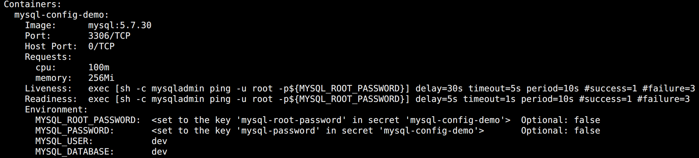
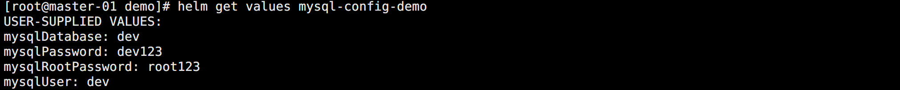

## Helm

Helm 可以帮助管理 Kubernetes 应用程序，其作用类似于 CentOS 的 yum。yum 安装 rpm 包，helm 安装 Chart 包。

对于越来越复杂的 Kubernetes 应用程序来说，如果单纯依靠手动维护应用程序的资源清单文件，成本是巨大的，此时 Helm 就解决了这方面的难题。

通过使用 Helm Charts，可以定义、安装和升级复杂的 Kubernetes 应用程序。


## 安装 Helm

安装前提：在需要使用 Helm 命令的节点上能够通过 kubectl 访问集群，Helm 其实就是读取的 kubeconfig 文件来访问集群。

同时由于 Helm V2 版本必须在 Kubernetes 集群中安装一个 Tiller 服务进行通信，这样大大降低了其安全性和可用性，所以在 V3 版本中移除了服务端，采用了通用的 Kubernetes CRD 资源来进行管理，这样就只需要连接上 Kubernetes 即可。

直接去 Github 下载即可，我这里采用的最新版 `3.11.3`。

```bash
# 创建安装包目录
cd /ezops/package/
mkdir helm
cd helm/

# 下载安装包，推荐使用华为镜像站
wget https://mirrors.huaweicloud.com/helm/v3.11.3/helm-v3.11.3-linux-amd64.tar.gz

# 解压安装
tar -zxf helm-v3.11.3-linux-amd64.tar.gz 
cd linux-amd64/
mv helm /usr/local/bin/

# 查看版本
helm version

# 添加命令补全
helm completion bash > /etc/bash_completion.d/helm

# 配置永久生效
cat >> /etc/profile << EOF
# Helm 命令补全
source /etc/bash_completion.d/helm
EOF
```

Helm 客户端安装完成后，就需要类似 yum 配置 yum 源一样进行仓库配置。

最常用的就是官方的 Helm stable charts 仓库，但由于国内网络问题，可以使用微软的 Charts 仓库代替：

```bash
# 添加名称为 stable 的仓库
helm repo add stable http://mirror.azure.cn/kubernetes/charts/

# 查看仓库列表
helm repo list

# 列出仓库中的包
helm search repo stable
```

如图所示：




## Chart

Helm 有多种方法来找到和安装 Chart 包，最简单的就是使用官方的 `stable` 这个仓库直接安装。


### 安装 Chart

在安装之前，可以先从仓库中将可用的 Charts 信息同步到本地，可以确保获取到最新的 Charts 列表：

```bash
# 同步信息
helm repo update

# 安装包
helm install mysql-demo stable/mysql
```

注意，安装命令的格式为：

```bash
helm install [NAME] [CHART] [flags]
```

如果安装没指定运行时候的名称，则会报错 `Error: INSTALLATION FAILED: must either provide a name or specify --generate-name`。可以通过 `--generate-name` 随机生成一个。

安装完成后会输出一些 MySQL 的安装信息：



`helm install` 命令可以从多个源进行安装：

- Chart 仓库（类似于上面的方法）
  - 示例：helm install mysql-demo stable/mysql
- 本地 Chart 压缩包
  - 示例：helm install foo-0.1.1.tgz
- 本地解压缩的 Chart 目录
  - 示例：helm install foo path/foo
- 在线的 URL
  - 示例：helm install foo https://example.com/charts/foo-1.2.3.tgz


### 查看 Chart 资源

安装成功的应用，它的所有资源清单都会有一个 `release` 标签，值为指定或随机生成的名称，可以通过它进行筛选查看它的所有资源：

```bash
kubectl get all -l release="mysql-demo"
```

如图所示：



运行一个 MySQL 服务，相当于创建了一个 Deployment 和一个 Service。

当然，默认是安装在 default 名称空间下的，如果想要指定其它名称空间，可以使用 `-n` 指定。


### 操作 Chart

以下是一些关于 Chart 的常用操作：

```bash
# 查看 Chart 的相关信息
helm show chart stable/mysql

# 查看所有安装的 Chart，-a 参数可以看到 uninstalled 状态的 Chart
helm ls -a

# 查看安装的 Chart 状态，输出的也就是 Chart 安装完成后输出的内容
helm status mysql-demo

# 删除/卸载 Chart
helm uninstall mysql-demo
```

特别注意：

> `uninstall` 命令会从 Kubernetes 中删除 release，也会删除与 release 相关的所有 Kubernetes 资源以及 release 历史记录。
>
> 如果想要保留 release 的历史记录，可以在删除的时候使用 `--keep-history` 参数，查看 status 的时候显示的状态会是 `uninstalled`，而不是找不到。

如图所示：



如果是 uninstalled 状态，还可以对它进行回滚，需要指定 `REVISION`：

```bash
helm rollback mysql-demo 1
```


## Chart 定制

直接使用命令安装的 Chart 都是使用的默认配置，这在日常使用中肯定是不满足需求的。此时就需要修改 Chart 的配置。

```bash
# 查看 Chart 包支持的参数设置
helm show values stable/mysql
```

输出的内容是一个 YAML，该配置是作者在定义的时候预留给用户自定义的。用户可以通过新建 value 文件，覆盖掉默认的配置。

示例，这里对默认的配置进行覆盖修改，新建一个 `mysql-config.yaml`：

```yaml
# root 密码
mysqlRootPassword: root123

# 创建 MySQL 用户
mysqlUser: dev
mysqlPassword: dev123

# 创建数据库
mysqlDatabase: dev
```

在安装的时候指定这个配置文件：

```bash
helm install mysql-config-demo stable/mysql -f mysql-config.yaml
```

完成后在 Pod 的信息中可以看到设置了几个环境变量：



<br>

在安装过程中，有两种方法可以传递配置数据：

- `--values（-f）`：指定一个 YAML 文件来覆盖 values 值，可以指定多个值。配置一般命名为 `values.yaml`。
- `--set`：在命令行上指定覆盖的配置。

如果同时使用这两个参数，`--values（-f）` 将被合并到具有更高优先级的 `--set`。使用 --set 指定的值将持久化在 ConfigMap 中。

<br>

可以查看运行的 Chart 的值：

```bash
helm get values mysql-config-demo
```

如图所示：



已设置的值也通过允许 `helm upgrade` 并指定 `--reset` 值来清除。

`--set` 的用法与 YAML 对应关系：

```bash
# 单个值，YAML 示例：
# name: dylan
--set name=dylan

# 多个值，YAML 示例：
# name: dylan
# age: 18
--set name=dylan,age=18

# 多层级，YAML 示例：
# info:
#   name: dylan
--set info.name=dylan

# 列表数组，YAML 示例：
# list:
#   - a
#   - b
--set list={a,b}

# 设置数组中的某个值，YAML 示例：
# info:
#   - name: user1
#     age: 18
--set info[0].age=18

# 特殊字符转义，YAML 示例：
# nodeSelector:
#   kubernetes.io/role: master
--set nodeSelector."kubernetes\.io/role"=master
```

可以看出 --set 很多时候对于复杂的结构是很难用，所有更推荐 YAML 的方式。


## 升级回滚

当新版本的 Chart 包发布的时候，可以使用 `helm upgrade` 命令来进行升级操作。

升级需要一个现有运行的 Chart，并根据提供的信息对其进行升级。

因为 Kubernetes charts 可能很大而且很复杂，Helm 会尝试以最小的侵入性进行升级，它只会更新自上一版本以来发生的变化：

```bash
# 升级
helm upgrade mysql-config-demo -f mysql-config.yaml stable/mysql

# 查看更新的 value
helm get values mysql-config-demo
```

每一次 upgrade，REVISION 的值就会 +1。

<br>

如果升级不符合预期，需要回滚到之前的版本，就需要执行下面的命令：

```bash
# 查看当前的版本
helm ls

# 查看历史版本
helm history mysql-config-demo

# 回滚到指定版本
helm rollback mysql-config-demo 2

# 查看之前的更新是否还在
helm get values mysql-config-demo
```

相当于发布了一个新版本，只是这个版本跟之前的版本一样。

<br>

除此之外，还可以指定一些选项来定制 install/upgrade/rollback 的一些行为，常用的参数有：

- `--timeout`：等待 Kubernetes 命令完成的时间，默认是 300（5分钟）。
- `--wait`：等到所有 Pods 和其它资源都就绪，才标记成功。将等待与 `--timeout` 一样长的时间，如果超时，则标记失败。
- `--no-hooks`：将会跳过命令的运行 hooks。
- `--recreate-pods`：仅适用于 upgrade 和 rollback，这个标志将导致重新创建所有的 Pods。

