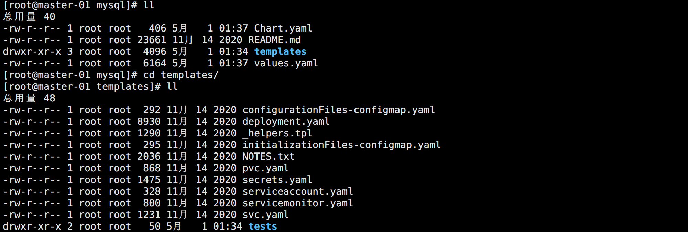
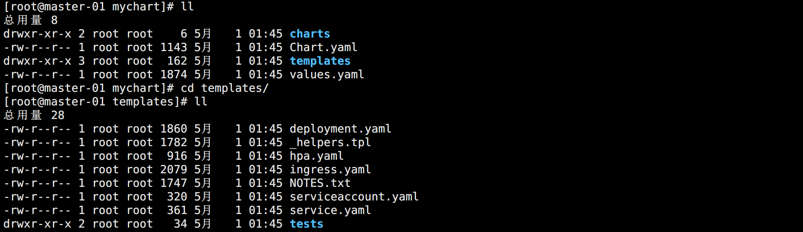

## Chart

Helm 使用一种名为 Chart 的包格式，一个 Chart 是描述一组相关的 Kubernetes 资源的文件集合。

Chart 是创建在特定目录下面的文件集合，然后可以将它们打包到一个版本化的存档中来部署。

其常规的目录结构为：

```bash
chart-name/
  Chart.yaml          # 包含当前 chart 信息的 YAML 文件
  LICENSE             # 可选：包含 chart 的 license 的文本文件
  README.md           # 可选：说明介绍文件
  values.yaml         # 当前 chart 的默认配置 values
  values.schema.json  # 可选: 一个作用在 values.yaml 文件上的 JSON 模式
  charts/             # 包含该 chart 依赖的所有 chart 的目录
  crds/               # Custom Resource Definitions
  templates/          # 模板目录，与 values 结合使用时，将渲染生成 Kubernetes 资源清单文件
  templates/NOTES.txt # 可选: 包含简短使用的文本文件
```


### Chart.yaml

对于一个 Chart 包来说 `Chart.yaml` 文件是必须的，它包含下面的这些字段：

```yaml
apiVersion: chart API 版本 (必须)，对于 Helm 3 以上的版本应该是 v2
name: chart 名 (必须)
version: SemVer 2版本 (必须)，比如设置为：1.2.3，则 chart 最终名称为 xxx-1.2.3.tgz
kubeVersion: 兼容的 Kubernetes 版本 (可选)
description: 一句话描述 (可选)
type: chart 类型 (可选)，可以定义两种类型：应用程序（application）和库（library）
keywords:
  - 当前项目关键字集合 (可选)
home: 当前项目的 URL (可选)
sources:
  - 当前项目源码 URL (可选)
dependencies: chart 依赖列表 (可选)
  - name: chart 名称 (nginx)
    version: chart 版本 ("1.2.3")
    repository: 字段是 chart 仓库的完整 URL，必须使用 helm repo add 在本地添加该 repo
    alias: 定义别名 (可选)
maintainers: (可选)
  - name: 维护者名字 (对每个 maintainer 是必须的)
    email: 维护者的 email (可选)
    url: 维护者 URL (可选)
icon: chart 的 SVG 或者 PNG 图标 URL (可选).
appVersion: 包含的应用程序版本 (可选). 比如 MySQL 5.7，这里可以设置为 5.7，该设置并不会影响包
deprecated: chart 是否已被弃用 (可选, boolean)
```


### LICENSE

LICENSE 是一个纯文本文件，其中包含 Chart 的许可证书。


### README.md

README.md 文件采用 Markdown 格式编写，一般用于介绍该 Chart 的用途，使用方法等。


### NOTES.txt

NOTES.txt 是一个纯文本文件，该文件将在安装后以及查看 release 状态的时候打印出来。常被用于显示使用说明。


### charts

一个 Chart 包可能会依赖许多其他 Chart。这些依赖可以使用 `Chart.yaml` 中的 dependencies 字段动态链接，也可以引入到 `charts/` 目录手动管理。

在 Charts.yaml 文件中，通过 dependencies 字段依赖 Chart，可使用 `helm dependency update` 进行更新。它会根据依赖项文件把指定的 Chart 包下载到 `charts/` 目录中。


### templates

Helm Chart 模板是用 `Go template` 语言进行编写的，另外还额外增加了 `Sprig` 库中的 50 个左右附加模板函数和一些其他 `专用函数`。

Go Template：

> https://golang.org/pkg/text/template/

Sprig 库：

> https://github.com/Masterminds/sprig

其它函数：

> https://helm.sh/docs/howto/charts_tips_and_tricks/

所有模板文件都存储在 Chart 的 `templates/` 目录下面，当 Helm 渲染 Chart 的时候，它将通过模板引擎传递该目录中的每个文件。

示例资源清单模板文件：

```yaml
apiVersion: apps/v1
kind: Deployment
metadata:
  name: deploy-chart-demo
spec:
  selector:
    matchLabels:
      app: nginx
  template:
    metadata:
      labels:
        app: nginx
    spec:
      containers:
      - name: nginx
        image: {{ .Values.ImageName }}:{{ .Values.ImageTag | default latest }}
        ports:
        - containerPort: {{ .Values.ServicePort }}
```

在模板资源清单中，可以通过 `.Values` 获取到 values.yaml（或者 --set）里面定义的 values 值。


### Values

template 模板资源清单获取 Values 的方式有两种：

- `values.yaml` 文件，包含默认的 values 值。
- 用户自定义包含 values 值的 YAML 文件或者 --set 设置的 values，在 `helm install` 的时候指定。

用户自定义 values 会覆盖 Chart 中 `values.yaml` 文件中相应的值。

> 任何未知的 `Chart.yaml` 字段都可能会被删除，导致在 Chart 对象内部无法访问他们，所以只推荐使用 values 文件来传递。

<br>

示例 values.yaml：

```yaml
name: dylan
age: 18
service:
  name: apache
  version: 1.0

config:
  port: 80

global:
  app: nginx
```

values.yaml 文件可以为 Chart 以及他的任何依赖项提供 values 值。通过 `.Values.name` 或者 `.Values.service.name` 获取对应的值。

global 可以设置一个全局的值，这意味着既可以通过 `.Values.global.app` 获取到值，也可以在 service  或者 config下面获取：`.Values.service.global.app` 或者 `.Values.config.global.app`。

values.shema.json 文件和 values.yaml 的用途一样，不过该文件时 JSON 格式的数据，而不是 YAML。


### crds

Kubernetes 提供了一种声明新类型的机制，使用 `CustomResourceDefinitions（CRDS）`，可以让 Kubernetes 开发人员声明自定义资源类型。

在 Helm 3 中，CRD 被视为一种特殊的对象，它们在 Chart 部署之前被安装，并且会受到一些限制。

CRD YAML 放在  `crds/` 目录下。多个 CRDS 可以放在同一个文件中，Helm 将尝试将 CRD 目录中的所有文件加载到 Kubernetes 中。

> CRD 文件不能模板化，它们必须是纯的 YAML 文件。

当 Helm 安装一个新的 Chart 的时候，它将会安装 CRDS，然后会暂停直到 API Server 提供 CRD 为止，然后才开始启动模板引擎，渲染其余的 Chart 模板，最后才将其安装到 Kubernetes 集群中。

所以 CRD 信息在 Helm 模板的 `.Capabilities` 对象中是可以获取到的，并且 Helm 模板可能会创建在 CRD 中声明的对象的新实例。

与 Kubernetes 中的大多数对象不同，CRDS 是全局安装的，所以 Helm 在管理 CRD 的时候会有一些限制：

- CRDS 不会重新安装，如果 Helm 确定 `crds/` 目录中的 CRD 已经存在（无论版本如何），Helm 都不会重新安装或升级。
- CRDS 不会在升级或回滚的时候安装，只会在安装操作的时候创建。
- CRDS 不会被删除，删除 CRD 会自动删除集群中所有 namespace 中的 CRDS 内容。

Helm 希望想要升级或删除 CRDS 的操作人员可以手动来仔细地操作。


## Chart 管理

用户可以使用目前仓库的 Chart 进行修改。比如这里以 MySQL 的 Chart 为例：

拉取 Chart 包然后解压根据自己需求修改：

```bash
helm pull stable/mysql
tar -zxf mysql-1.6.9.tgz 
cd mysql/
```

如图所示：



其实就是之前我们写的一些资源清单，然后将里面的也写具体配置项，加入逻辑判断，将 value 抽离出来放到 values.yaml 中。

<br>

除了修改现有的 Chart 包以外，还可以自己创建 Chart：

```bash
helm create mychart
```

如图所示：



该方法通过脚手架创建，可以看到默认是初始化了一些资源清单模板的，只需要对它进行修改即可。

<br>

Chart 包修改之后可以对它进行校验，打包，试运行：

```bash
# 格式检查
helm lint mychart

# 打包成压缩文件
helm package mychart

# 试运行
helm install mychart-demo mychart/ --dry-run

# 查看生成的资源清单是否符合预期
helm template mychart mychart/
```

template 如果有些数据要安装之后才初始化的就获取不到，`install --dry-run` 的方式可以。


## Chart 开发

以下是 Chart 开发中常用的一些语法和技巧。


### 内置对象

在模板中使用 `{{ .Release.xxx }}` 可以获取运行 Chart （也叫 release）的相关信息，除此之外 Chart 还包含以下常用内置对象：

- `Release`：该对象描述了 release 本身的相关信息
  - `Release.Name`：release 名称
  - `Release.Namespace`：release 安装到的命名空间
  - `Release.IsUpgrade`：如果当前操作是升级或回滚，是为 true
  - `Release.IsInstall`：如果当前操作是否是安装，是为 true
  - `Release.Revision`：release 的 revision 版本号，在安装时为 1，每次升级或回滚都会 +1
  - `Release.Service`：渲染当前模板的服务，在 Helm 上，实际上该值始终为 Helm
- `Values`：从 `values.yaml` 文件和用户提供的 values 文件传递到模板的 Values 值
- `Chart`：获取 `Chart.yaml` 文件的内容，该文件中的任何数据都可以访问
- `Files`：可以访问 Chart 中的所有非特殊文件，虽然无法使用它来访问模板文件，但是可以来访问 chart 中的其他文件。
  - `Files.Get`：用于根据名称获取文件（比如 `.Files.Get config.ini`）
  - `Files.GetBytes`：用于以 bytes 数组而不是字符串的形式来获取文件内容的函数
  - `Files.Glob`：用于返回名称于给定的 shell glob 模式匹配的文件列表
  - `Files.Lines`：可以逐行读取文件的函数，对于遍历文件中的每行内容很有用
  - `Files.AsSecrets`：将文件内容以 Base64 编码的字符串返回的函数
  - `Files.AsConfig`：将文件正文作为 YAML 字典返回的函数
- `Capabilities`：获取有关 Kubernetes 集群的信息的对象
  - `Capabilities.APIVersions`：支持的版本集合
  - `Capabilities.APIVersions.Has $version`：判断一个版本（比如 `batch/v1`）或资源（比如 `apps/v1/Deployment`）是否可用
  - `Capabilities.Kube.Version`：Kubernetes 的版本
  - `Capabilities.Kube`：是 Kubernetes 版本的缩写
  - `Capabilities.Kube.Major`：Kubernetes 主版本
  - `Capabilities.Kube.Minor`：Kubernetes 的次版本
- `Template`：当前正在执行的模板的相关信息
  - `Name`：当前模板的命名空间文件路径（比如 `mychart/templates/mytemplate.yaml`）
  - `BasePath`：当前 chart 的模板目录的命名空间路径（比如 `mychart/templates`）

更多具体用法可以参考官方文档：

> https://helm.sh/zh/docs/chart_template_guide/builtin_objects/


### 函数和管道

通过 Values 获取到的数据不一定就是需要的，可能需要经过一定的处理之后才能正常的使用。此时就需要使用到函数。

Helm 有60多种可用的函数，其中一些是由 Go 模板语言本身定义的，其他大多数都是 Sprig 模板库提供的，一般常用的也就是 Sprig 模板库的函数 。

同时，模板语言有一个强大的功能就是 `管道（Pipeline，流水线）`，它可以让我们一次使用多个函数。

使用示例：

```bash
# 创建一个 Chart

```


