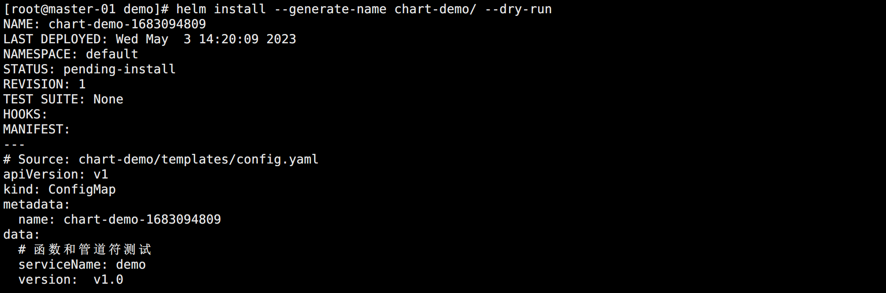
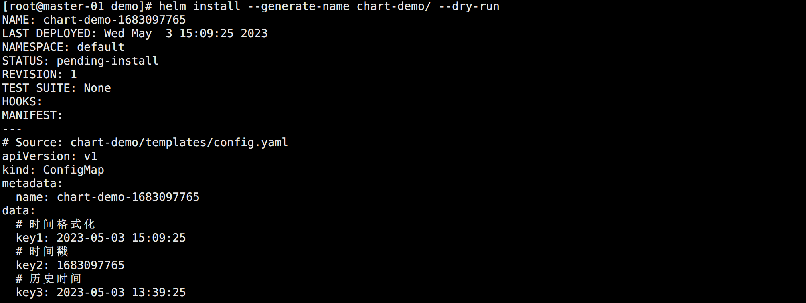
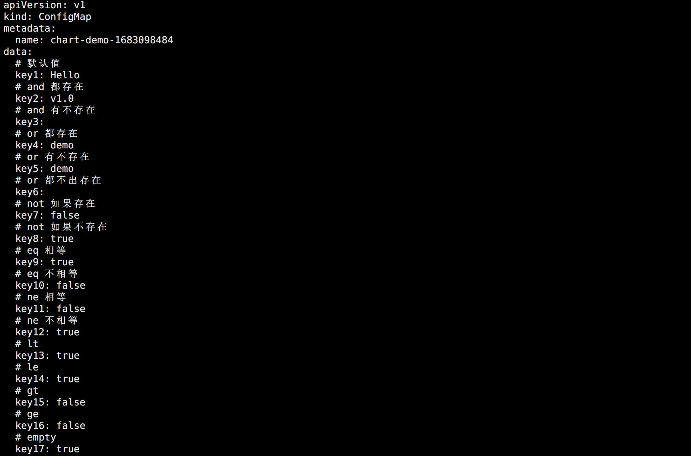
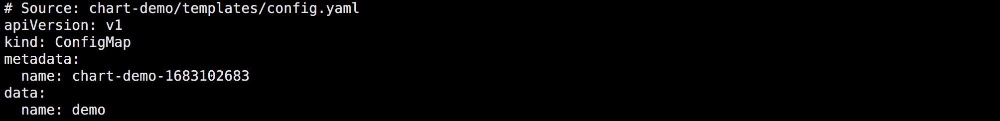
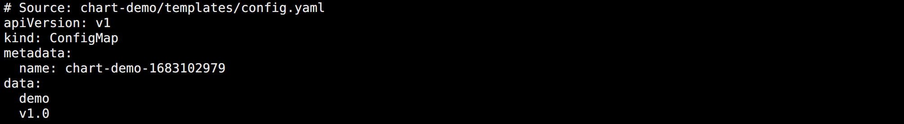
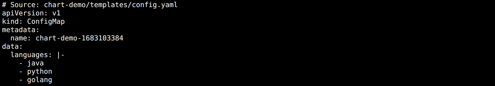

## 内置对象

在模板中使用 `{{ .Release.xxx }}` 可以获取运行 Chart （也叫 release）的相关信息，除此之外 Chart 还包含以下常用内置对象：

- `Release`：该对象描述了 release 本身的相关信息
  - `Release.Name`：release 名称
  - `Release.Namespace`：release 安装到的命名空间
  - `Release.IsUpgrade`：如果当前操作是升级或回滚，是为 true
  - `Release.IsInstall`：如果当前操作是否是安装，是为 true
  - `Release.Revision`：release 的 revision 版本号，在安装时为 1，每次升级或回滚都会 +1
  - `Release.Service`：渲染当前模板的服务，在 Helm 上，实际上该值始终为 Helm
- `Values`：从 `values.yaml` 文件和用户提供的 values 文件传递到模板的 Values 值
- `Chart`：获取 `Chart.yaml` 文件的内容，该文件中的任何数据都可以访问
- `Files`：可以访问 Chart 中的所有非特殊文件，虽然无法使用它来访问模板文件，但是可以来访问 chart 中的其他文件。
  - `Files.Get`：用于根据名称获取文件（比如 `.Files.Get config.ini`）
  - `Files.GetBytes`：用于以 bytes 数组而不是字符串的形式来获取文件内容的函数
  - `Files.Glob`：用于返回名称于给定的 shell glob 模式匹配的文件列表
  - `Files.Lines`：可以逐行读取文件的函数，对于遍历文件中的每行内容很有用
  - `Files.AsSecrets`：将文件内容以 Base64 编码的字符串返回的函数
  - `Files.AsConfig`：将文件正文作为 YAML 字典返回的函数
- `Capabilities`：获取有关 Kubernetes 集群的信息的对象
  - `Capabilities.APIVersions`：支持的版本集合
  - `Capabilities.APIVersions.Has $version`：判断一个版本（比如 `batch/v1`）或资源（比如 `apps/v1/Deployment`）是否可用
  - `Capabilities.Kube.Version`：Kubernetes 的版本
  - `Capabilities.Kube`：是 Kubernetes 版本的缩写
  - `Capabilities.Kube.Major`：Kubernetes 主版本
  - `Capabilities.Kube.Minor`：Kubernetes 的次版本
- `Template`：当前正在执行的模板的相关信息
  - `Name`：当前模板的命名空间文件路径（比如 `mychart/templates/mytemplate.yaml`）
  - `BasePath`：当前 chart 的模板目录的命名空间路径（比如 `mychart/templates`）

更多具体用法可以参考官方文档：

> https://helm.sh/zh/docs/chart_template_guide/builtin_objects/


## 函数和管道

通过 Values 获取到的数据不一定就是需要的，可能需要经过一定的处理之后才能正常的使用。此时就需要使用到函数。

Helm 有60多种可用的函数，其中一些是由 Go 模板语言本身定义的，其他大多数都是 Sprig 模板库提供的，一般常用的也就是 Sprig 模板库的函数 。

同时，模板语言有一个强大的功能就是 `管道（Pipeline，流水线）`，它可以让我们一次使用多个函数。

使用示例：

```bash
# 创建一个 Chart
helm create chart-demo

# 初始化配置
echo > chart-demo/values.yaml 
rm -rf chart-demo/templates/*
```

<br>

创建用于测试的 chart-demo/values.yaml：

```yaml
serviceName: demo
version: v1.0
dev:
  languages:
    - Java
    - Python
    - Golang
  users:
    - name: Dylan
      age: 18
    - name: Mark
      age: 20
```

<br>

创建资源清单 chart-demo/templates/config.yaml：

```yaml
apiVersion: v1
kind: ConfigMap
metadata:
  name: {{ .Release.Name }}
data:
  # 函数和管道符测试
  serviceName: {{ .Values.serviceName | default "hello" }}
  version: {{ .Values.version | default "v0.1" }}
```

<br>

测试查看：

```bash
# 检查错误
helm lint chart-demo/

# 试运行
helm install --generate-name chart-demo/ --dry-run
```

可以看到生成的资源清单：



可以看到 ConfigMap 的名称也获取到了 generate 生成的 release 名称。


## 常用函数

除了上面举例的 default 函数，还有其它的一些常用函数：


### 时间函数

`now / date`：当前时间，默认是一长串的时间，一般配合 date 格式化显示。

注意，date 格式化模板字符串使用的是 Golang 发布的时间 `2006-01-02 15:04:05`，记忆方法是 12345，只是 3 变成了 15 点。

<br>

使用示例：

```yaml
apiVersion: v1
kind: ConfigMap
metadata:
  name: {{ .Release.Name }}
data:
  # 时间格式化
  key1: {{ now | date "2006-01-02 15:04:05" }}
  # 时间戳
  key2: {{ now | unixEpoch }}
  # 历史时间
  key3: {{ now | date_modify "-1.5h" | date "2006-01-02 15:04:05" }}
```

试运行结果：




### 逻辑控制和流程函数

Helm 包括了需要逻辑和流控制函数，包括 and，coalesce，default，empty，eq，fail，ge，gt，le，lt，ne，not，or。

其中常用的包含以下几个：

* `default`：用于设置默认值。语法格式：`default "Hello"`
* `and`：对两个参数进行判断，如果都存在，则返回最后一个参数，如果有一个不存在，则返回空。语法格式：`and .Arg1 .Arg2`
* `or`：对两个参数进行判断，如果都不存在，则返回空，都存在则返回最后一个，否则谁存在返回谁。语法格式：`or .Arg1 .Arg2`
* `not`：返回布尔结果，如果不存在，取反则 true，如果存在，取反则为 false。语法格式：`not .Arg`
* `eq`：返回参数对比的的布尔结果，如果相同则为 true，否则 false。语法格式：`eq .Arg1 .Arg2`
* `ne`：返回参数对比的的布尔结果，如果不相同则为 true，否则 false。语法格式：`ne .Arg1 .Arg2`
* `lt（le）`：返回参数对比的的布尔结果，如果第一个参数小于（小于等于）第二个，则为 true，否则 false。语法格式：`lt .Arg1 .Arg2`
* `gt（大于等于）`：返回参数对比的的布尔结果，如果第一个参数大于（大于等于）第二个，则为 true，否则 false。语法格式：`gt .Arg1 .Arg2`
* `empty`：如果给定的值被认为是空的，则返回 true，否则 false。语法格式：`empty .Arg`

<br>

使用示例：

```yaml
apiVersion: v1
kind: ConfigMap
metadata:
  name: {{ .Release.Name }}
data:
  # 默认值
  key1: {{ .Values.serviceName1 | default "Hello" }}
  # and 都存在
  key2: {{ and .Values.serviceName .Values.version }}
  # and 有不存在
  key3: {{ and .Values.serviceName1 .Values.version }}
  # or 都存在
  key4: {{ or .Values.serviceName .Values.version }}
  # or 有不存在
  key5: {{ or .Values.serviceName .Values.version1 }}
  # or 都不出存在
  key6: {{ or .Values.serviceName1 .Values.version1 }}
  # not 如果存在
  key7: {{ not .Values.serviceName }}
  # not 如果不存在
  key8: {{ not .Values.serviceName1 }}
  # eq 相等
  key9: {{ eq .Values.serviceName .Values.serviceName }}
  # eq 不相等
  key10: {{ eq .Values.serviceName .Values.version }}
  # ne 相等
  key11: {{ ne .Values.serviceName .Values.serviceName }}
  # ne 不相等
  key12: {{ ne .Values.serviceName .Values.version }}
  # lt
  key13: {{ lt 1 2 }}
  # le
  key14: {{ le 1 1 }}
  # gt
  key15: {{ gt 1 2 }}
  # ge
  key16: {{ gt 1 1 }}
  # empty
  key17: {{ empty .Values.serviceName1 }}
```

试运行结果：




### 字符串函数

下面是常用的字符串操作函数：

* `print, println, printf`：三个都是用于拼接字符串，区别在于：
  * print：直接拼接。
  * println：拼接完成后后面会有个换行。
  * printf：格式化拼接，比如：`printf "%s has %d dogs." .Values.name .Values.number。如果熟悉 Go 的 print 这个就很简单，printf 常用的占位符包含：
    * `%s`：字符串
    * `%d`：十进制数字
    * `%b`：二进制数字
    * `%f`：小数
    * `%v`：默认格式的值
    * `%%`：字符串百分号
    * `%t`：布尔值
    * 其它

* `trim`：去除字符串两端的空格。语法格式：`trim " hello  "`
* `trimAll`：去除字符串中指定字符。语法格式：`trimAll "l" "hello"`
* `trimPrefix, trimSuffix`：去除字符串前缀（后缀）。语法格式：`trimPrefix "he" "hello"`
* `lower`：转为小写。语法格式：`lower "Hello"`
* `upper`：转为大写。语法格式：`upper "Hello"`
* `title`：转为首字母大写。语法格式：`title "hello world"`
* `untitle`：移除首字母大写。语法格式：`untitle "Hello world"`
* `repeat`：重复指定次数字符串。语法格式：`repeat 3 "Hello"`
* `substr`：字符串切割。语法格式：`substr 0 3 "Hello"`
* `nospace`：去掉所有空格。语法格式：`nospace "H e  l l o"`
* `trunc`：截断字符串。语法格式：`trunc 1 "Hello"`，从 1 坐标开始去掉后面，如果是 `-1`，则去掉 H。
* `abbrev`：使用省略号截断。语法格式：`abbrev 5 "Hello"`，省略号也算长度。
* `abbrevboth`：两边都使用省略号截断。语法格式：`abbrevboth 5 10 "1234 5678 9123"`
* `initials`：获取每个单词的首字母拼接。语法格式：`initials "hello world"`
* `randAlphaNum, randAlpha, randNumeric, and randAscii`：生成随机字符串。语法格式：`randNumeric 3`
  * `randAlphaNum`：使用 `0-9a-zA-Z`
  * `randAlpha`：使用 `a-zA-Z`
  * `randNumeric`：使用 `0-9`
  * `randAscii`：使用所有的可打印 ASCII 字符

* `contains`：判断 A 是否包含 B，返回布尔值。语法格式：`contains "Hello" "a"`
* `hasPrefix, hasSuffix`：判断是否包含指定前缀或者后缀。语法格式：`hasPrefix "cat" "catch"`
* `quote, squote`：字符串用双引号或者单引号括起来。
* `indent`： 以指定长度缩进给定字符串所在行，在对齐多行字符串时很有用。
* `nindent`：和indent函数一样，但可以在字符串开头添加新行。
* `replace`：替换。语法格式：`"I Am Henry VIII" | replace " " "-"`
* `snakecase`：将驼峰写法转换成蛇形写法。语法格式：`snakecase "FirstName"`
* `camelcase`：将字符串从蛇形写法转换成驼峰写法。语法格式：`camelcase "first_name"`
* `kebabcase`：将驼峰写法转换成烤串写法，中横线。语法格式：`kebabcase "FirstName"`
* `swapcase`：基于单词的算法切换字符串的大小写。

日常使用最多的其实就是字符串操作方法，想要了解更多函数可以查看官方文档：

> https://helm.sh/zh/docs/chart_template_guide/function_list/


## 流程控制

Helm 的模板语言提供了以下一些流程控制：

- `if/ else`：条件语句
- `with`：指定一个作用域范围
- `range`：提供类似于 `for each` 这样的循环样式

除此之外，还提供了一些声明和使用命名模板的操作：

- `define`：在模板内部声明一个新的命名模板
- `template`：导入一个命名模板
- `block`：声明了一种特殊的可填充模板区域


### if / else

条件判断语法模板：

```yaml
{{ if PIPELINE }}
  # todo
{{ else if PIPELINE }}
  # todo
{{ else }}
  # todo
{{ end }}
```

这里判断内容是管道，而不是一个 values 值。因为控制结构可以执行整个管道，而不仅仅是判断值。如果值为以下内容则为 false：

- 布尔 false
- 数字零
- 一个空字符串
- nil（empty 或者 null）
- 一个空集合（map、slice、tuple、dict、array）

在其他条件下，条件都为 true。

<br>

使用示例：

```yaml
apiVersion: v1
kind: ConfigMap
metadata:
  name: {{ .Release.Name }}
data:
  {{- if eq (upper .Values.serviceName) "DEMO" }}
  name: {{ .Values.serviceName }}
  {{- else }}
  name: Hello
  {{- end }}
```

需要注意的是，由于 if 这些语句也会占用一行，所有最后生成资源清单可能会存在很多空白行。可以在关键字前面添加 `-` 删除这些空白行。试运行结果：




### with

with 语法模板：

```yaml
{{ with PIPELINE }}
  # 限制范围
{{ end }}
```

with 被用于控制变量的作用域，然后重新用 `.` 调用就表示对当前作用域的引用。

<br>

使用示例：

```yaml
apiVersion: v1
kind: ConfigMap
metadata:
  name: {{ .Release.Name }}
data:
  {{- with .Values }}
  {{ .serviceName }}
  {{ .version }}
  {{- end }}
```

该方法可以方便复杂层级的使用，试运行结果：




### range

range 语法模板：

```yaml
{{ range PIPELINE }}
  # 循环
{{ end }}
```

Helm 得模板语言中，迭代集合得方法是使用 `range` 运算符。

<br>

使用示例：

```yaml
apiVersion: v1
kind: ConfigMap
metadata:
  name: {{ .Release.Name }}
data:
  languages: |-
  {{- range .Values.dev.languages }}
    - {{ . | lower }}
  {{- end }}
```

试运行结果：



也可以直接对循环：

```yaml
sizes: |-
  {{- range tuple "small" "medium" "large" }}
    - {{ . }}
  {{- end }}
```


## 变量

在模板中，变量的使用频率较低，但可以用他们来简化代码，以及更好地使用 `with` 和 `range`。

在前面使用  with 的时候，如果在内部使用 Release 或者其它外部的值得时候是会出错的。原因很简单，他不知道在 with 下面是用的作用域里面的值还是外部的值。为了解决这个问题，就需要使用变量来进行改进。

```yaml
apiVersion: v1
kind: ConfigMap
metadata:
  name: {{ .Release.Name }}
data:
  {{- $releaseName := .Release.Name }}
  {{- with .Values }}
  releaseName: {{ $releaseName }}
  serviceName: {{ .serviceName }}
  {{- end }} 
```

定义变量的方法有点类似 Golang 中的定义方法，只是需要一个 `$` 符号前缀。

同样在 range 循环中也可以用这个特性：

```yaml
apiVersion: v1
kind: ConfigMap
metadata:
  name: {{ .Release.Name }}
data: |-
  # 数组遍历
  {{- range $index, $value := .Values.dev.languages }}
  {{ $index }}:{{ $value }} 
  {{- end }}
  # 对象遍历
  {{- range $index, $data := .Values.dev.users }}
  {{- range $k, $v := $data }}
  {{ $k }}: {{ $v }}
  {{- end }}
  {{- end }}
```


## 模板

之前都是操作一个模板，有些复杂的需求可能需要操作多个模板文件。可以通过在一个文件中定义命名模板，然后在其他地方使用它们。

当使用命名模板时需要注意：

* 模板名称是全局的，如果声明两个相同名称的模板，则会使用最后被加载的模板。
* 由于子 Chart 中的模板是与顶级模板一起编译的，所以需要谨慎命名。

一种流行的命名约定是在每个定义的模板前添加 Chart 名称：`{{ define "chartdemo.labels" }}`，通过使用特定的 Chart 名作为前缀，可以避免由于两个不同的 Chart 实现了相同名称的模板而引起的冲突。

Helm 的模板语言允许创建命名的嵌入式模板，可以在其他位置进行访问。但是需要注意以下命名约定：

- `templates/` 中的大多数文件都被视为 Kubernetes 资源清单文件（NOTES.txt 除外）
- 以 `_` 开头命名的文件也不会被当做 Kubernetes 资源清单文件
- 下划线开头的文件不会被当做资源清单之外，还可以被其他 Chart 模板调用

`_` 开头的文件就是 Helm 中的 `partials` 文件，所以可以将命名模板定义在这些 `partials` 文件中，默认就是 `_helpers.tpl` 文件。

通过 define 创建命名模板：

```yaml
{{ define "MY.NAME" }}
  # 模板内容区域
{{ end }}
```

<br>

使用示例：

```bash
# 定义模板
{{ define "chart-demo.labels" }}
labels:
  app: nginx
  author: {{ .Values.serviceName }}
{{ end }}

# 资源清单
apiVersion: v1
kind: {{ .Release.Name }}
metadata:
  name: nginx
  # 引用模板
  {{- template "chart-demo.labels" . -}}
data:
  key: value
```

可以直接在资源清单中定义，并通过 template 调用它。

不过一般来说，Helm 中约定将这些模板统一放到一个 partials 文件中，通常就是 `_helpers.tpl` 文件中。

如果模板中需要使用到 values 或者预定义的数据，默认会出现获取不到值。原因在于作用域，想要解决这个问题，只需要在使用 template 调用的时候将其传过去即可。也就是在后面加个 `.` 。

```yaml
{{ template "chart-demo.labels" . }}
```

特别注意，在有些时候使用 template 的时候，如 ConfigMap 的 data 数据中。由于 template 只是一个动作，而不是一个函数，所以无法将模板调用的输出传递给其他函数，也就是不能使用管道符。

为了解决这个问题，引入了 `include` 导入模板的方式，该方式就可以利用函数进行二次调整格式，比如：

```yaml
{{ include "chart-demo.labels" . | indent 2 }}
```

在数据前面空两个格，实现数据 YAML 格式的合法性。通常在使用中也是推荐使用 include 而不是 template。


## 访问文件

有时候需要导入一个不是模板的文件并注入其内容，此时就需要用到 `.Files`。

Helm 提供了一个 `.Files` 对象对文件的访问，但在使用之前需要注意：

- 可以在 Helm Chart 中添加额外的文件，但这些文件也会被打包，由于 Kubernetes 对象的存储限制，Charts 必须小于 1M
- 由于一些安全原因，通过 `.Files` 对象无法访问某些文件
  - 无法访问 `templates/` 下面的文件
  - 无法访问使用 `.helmignore` 排除的文件
- Chart 不会保留 UNIX 模式的信息，所以，当使用 `.Files` 对象时，文件级别的权限不会对文件的可用性产生影响。

<br>

读取多个文件：

```yaml
apiVersion: v1
kind: ConfigMap
metadata:
  name: {{ .Release.Name }}
data:
  {{- $files := .Files }}
  {{- range tuple "f1.conf" "f2.conf" "f3.conf" }}
  # 文件名称作为 Key
  {{ . }}: |-
  	# 文件内容作为 Value
    {{ $files.Get . }}
  {{- end }}
```

<br>

ConfigMap 和 Secret 类型的数据：

```yaml
apiVersion: v1
kind: ConfigMap
metadata:
  name: {{ .Release.Name }}
data:
{{ (.Files.Glob "foo/*").AsConfig | indent 2 }}

---

apiVersion: v1
kind: Secret
metadata:
  name: {{ .Release.Name }}
type: Opaque
data:
{{ (.Files.Glob "bar/*").AsSecrets | indent 2 }}

---

apiVersion: v1
kind: Secret
metadata:
  name: {{ .Release.Name }}
type: Opaque
data:
  token: |-
    {{ .Files.Get "f1.config" | b64enc }}
```

<br>

逐行读取文件示例：

```yaml
apiVersion: v1
kind: ConfigMap
metadata:
  name: {{ .Release.Name }}
data:
  bar.txt: {{ range .Files.Lines "foo/bar.txt" }}
    {{ . }}{{ end }}
```


## NOTES.txt

在 chart 安装或者升级结束时，Helm 可以为用户打印出一些有用的信息，使用模板也可以自定义这些信息。

通过创建 `templates/NOTES.txt` 的纯文本文件，他将会具有所有常规模板的功能和可用对象。

使用示例：

```txt
Thank you for installing {{ .Chart.Name }}.

Your release is named {{ .Release.Name }}.

To learn more about the release, try:

  $ helm status {{ .Release.Name }}
  $ helm get {{ .Release.Name }}
```

用这种方式可以向用户提供一个有关如何使用其新安装的 Chart 的详细信息，强烈建议创建 `NOTES.txt` 文件，虽然这不是必须的。


## 子 Chart

上面的操作都是针对于一个 Chart 进行的，某些复杂的操作可能还需要一些依赖项目，也就是子 Chart，也叫 subcharts。

了解子 Chart 之前，需要了解子 Chart 相关的一些信息：

- 子 Chart 是独立的，这意味着子 Chart 不能显示依赖其父 Chart 
- 子 Chart 无法访问其父级的值
- 父 Chart 可以覆盖子 Chart 的值
- Helm 中有可以被所有 Chart 访问的全局值的概念

比如上面的 chart-demo 项目，可以去该项目下创建子 Chart：

```bash
cd chart-demo/charts/
helm create subchart-demo
echo > subchart-demo/values.yaml 
rm -rf subchart-demo/templates/*
```

此时可以在 subchart-demo 的 values.yaml 文件中添加值：

```yaml
name: subchart
```

<br>

通过父 Chart 的 values 覆盖子 Chart 中的值：

```yaml
subchart-demo:
  name: overvalue
```

通过 global 定义全局 value，这样父子都可以拿来直接使用。

父级 Chart 和子 Chart 共享模板，任何 Chart 中已定义的块都可以用于其他 Chart 。


## Chart Hook

Helm 也提供了一种 Hook 机制，可以允许 chart 开发人员在 release 生命周期的某些时间点进行干预。

比如，可以使用 hook 来进行下面的操作：

- 在加载任何 Chart 之前，在安装的时候加载 ConfigMap 或者 Secret
- 在安装新的 Chart 之前，执行一个 Job 来备份数据库，然后在升级后执行第二个 Job 还原数据
- 在删除 release 之前运行一个 Job，以在删除 release 之前适当地取消相关服务

Hooks 的工作方式类似于普通的模板，但是他们具有特殊的注解，这些注解使 Helm 可以用不同的方式来使用他们。

在 Helm 中定义了如下一些可供使用的 Hooks：

- 预安装 `pre-install`：在模板渲染后，Kubernetes 创建任何资源之前执行
- 安装后 `post-install`：在所有 Kubernetes 资源安装到集群后执行
- 预删除 `pre-delete`：在从 Kubernetes 删除任何资源之前执行删除请求
- 删除后 `post-delete`：删除所有 release 的资源后执行
- 升级前 `pre-upgrade`：在模板渲染后，但在任何资源升级之前执行
- 升级后 `post-upgrade`：在所有资源升级后执行
- 预回滚 `pre-rollback`：在模板渲染后，在任何资源回滚之前执行
- 回滚后 `post-rollback`：在修改所有资源后执行回滚请求
- 测试 `test`：在调用 Helm `test` 子命令的时候执行

<br>

Hooks 就是 Kubernetes 资源清单文件，在元数据部分带有一些特殊的注解，因为他们是模板文件，所以你可以使用普通模板所有的功能，包括读取 `.Values`、`.Release` 和 `.Template`。

```yaml
apiVersion: batch/v1
kind: Job
metadata:
  name: {{ .Release.Name }}
  labels:
    app.kubernetes.io/managed-by: {{ .Release.Service | quote }}
    app.kubernetes.io/instance: {{ .Release.Name | quote }}
    app.kubernetes.io/version: {{ .Chart.AppVersion }}
    helm.sh/chart: {{ .Chart.Name }}-{{ .Chart.Version }}
  annotations:
    # 因为添加了这个 hook，所以这个资源被定义为了 hook
    # 如果没有这行，则当前这个 Job 会被当成 release 的一部分内容。
    "helm.sh/hook": post-install
    "helm.sh/hook-weight": "-5"
    "helm.sh/hook-delete-policy": hook-succeeded
spec:
  template:
    metadata:
      name: {{ .Release.Name }}
      labels:
        app.kubernetes.io/managed-by: {{ .Release.Service | quote }}
        app.kubernetes.io/instance: {{ .Release.Name | quote }}
        helm.sh/chart: {{ .Chart.Name }}-{{ .Chart.Version }}"
    spec:
      restartPolicy: Never
      containers:
      - name: post-install-job
        image: "busybox:latest"
        command: ["/bin/sleep","{{ default "10" .Values.sleepTime }}"]
```

同时也可以属于多个 Hook：

```yaml
annotations:
  "helm.sh/hook": post-install,post-upgrade
```

hook 权重可以是正数也可以是负数，但是必须用字符串表示，当 Helm 开始执行特定种类的 hooks 的时候，它将以升序的方式对这些 hooks 进行排序。

同时，还可以定义确定何时删除相应 hook 资源的策略，hook 删除策略可以使用下面的注解进行定义：

```yaml
annotations:
  "helm.sh/hook-delete-policy": before-hook-creation,hook-succeeded
```

可以选择一个或多个已定义的注解：

- `before-hook-creation`：运行一个新的 hook 之前删除前面的资源（默认）
- `hook-succeeded`：hook 成功执行后删除资源
- `hook-failed`：hook 如果执行失败则删除资源

更多信息可以看官方文档：

> https://helm.sh/zh/docs/topics/charts_hooks/

