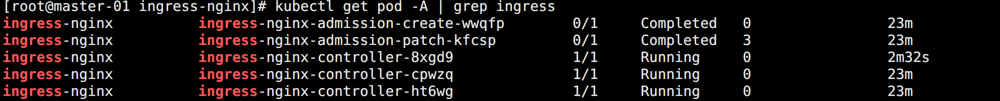
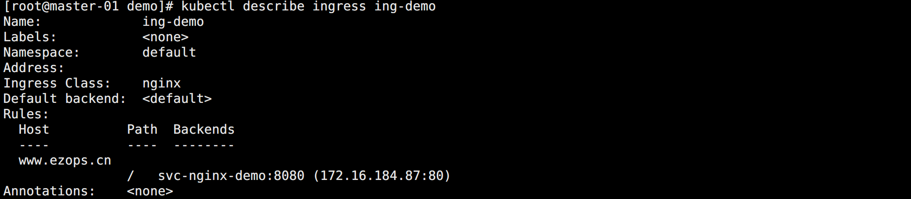
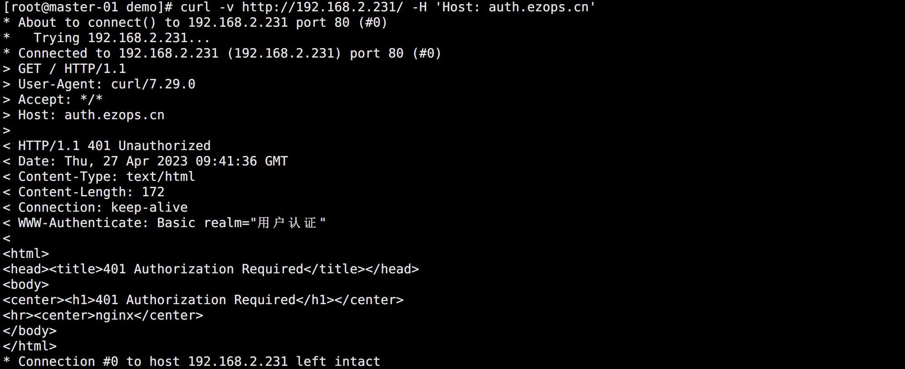
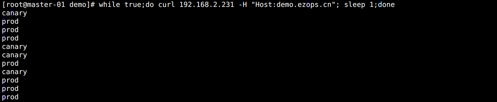
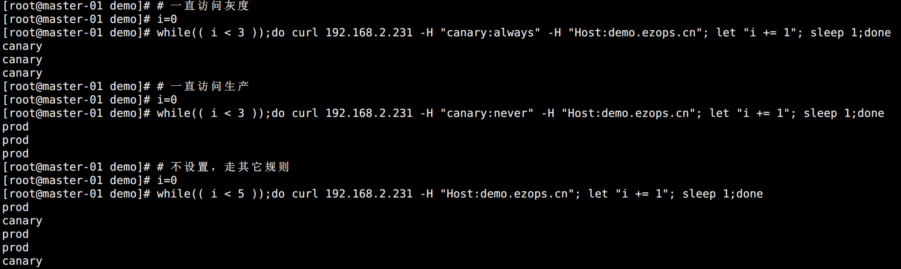
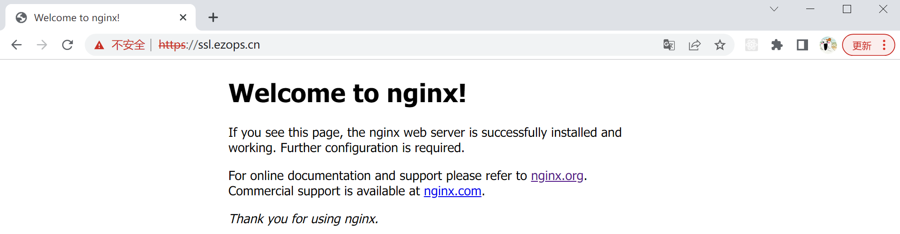

## ingress-nginx

Ingress 资源对象只是一个路由请求描述配置文件，要让其真正生效还需要对应的 Ingress 控制器才行，Ingress 控制器有很多，这里先介绍使用最多的 `ingress-nginx`，一个基于 Nginx 的 Ingress 控制器。

ingress-nginx 控制器主要是用来组装一个 `nginx.conf` 的配置文件，当配置文件发生任何变动的时候，就需要重新加载 Nginx 来生效。

Kubernetes 控制器使用控制循环模式来检查控制器中所需的状态是否已更新或是否需要变更，所以 ingress-nginx 需要使用集群中的不同对象来构建模型，比如 Ingress、Service、Endpoints、Secret、ConfigMap 等可以生成反映集群状态的配置文件的对象。

控制器需要一直 Watch 这些资源对象的变化，但是并没有办法知道特定的更改是否会影响到最终生成的 nginx.conf 配置文件，所以一旦 Watch 到了任何变化控制器都必须根据集群的状态重建一个新的模型，并将其与当前的模型进行比较：

* 如果模型相同，则就可以避免生成新的 Nginx 配置并触发重载。

* 如果模型不同，则检查模型的差异是否只和端点有关，如果是，则使用 HTTP POST 请求将新的端点列表发送到在 Nginx 内运行的 Lua 处理程序，并再次避免生成新的 Nginx 配置并触发重载。

* 如果不仅仅是端点的差异，那么就会基于新模型创建一个新的 Nginx 配置然后触发重载。

这样设计的好处在于能够避免不必要的重新加载，在高并发环境下，每一次重载的成本都是非常高的。

<br>

以下是一些需要重新加载的场景：

- 创建了新的 Ingress 资源。
- TLS 添加到现有 Ingress。
- 从 Ingress 中添加或删除 path 路径。
- Ingress、Service、Secret 被删除了。
- Ingress 的一些缺失引用对象变可用了，例如 Service 或 Secret。
- 更新了一个 Secret。

更多信息可以查看官方文档：

> https://kubernetes.github.io/ingress-nginx/


## 安装 Ingress-nginx

在生产应用中，ingress-nginx 一般都是给外网访问的，需要解析域名在上面，所以一般节点都是指定的特殊的节点，通常叫边缘节点（集群内部用来向集群外暴露服务能力的节点）。

下载资源清单：

```bash
# 创建目录
cd /ezops/service/kubernetes/addons/
mkdir ingress-nginx
cd ingress-nginx

# 使用代理下载
wget https://github.moeyy.xyz/https://raw.githubusercontent.com/kubernetes/ingress-nginx/controller-v1.7.0/deploy/static/provider/cloud/deploy.yaml
mv deploy.yaml ingress-nginx.yaml
```

<br>

给边缘节点打标签：

```bash
kubectl label nodes worker-01 ingressNode=true
kubectl label nodes worker-02 ingressNode=true
kubectl label nodes worker-03 ingressNode=true
```

<br>

修改资源启动的镜像，默认是 registry 国内拉不到：

```bash
sed -i "s#registry.k8s.io/ingress-nginx#dyrnq#g" ingress-nginx.yaml
sed -i "s#@sha256.*##g" ingress-nginx.yaml
```

<br>

修改资源清单部署类型：

```yaml
...
apiVersion: apps/v1
# 修改为指定节点的 DaemonSet
# kind: Deployment
kind: DaemonSet
...
  template:
    ...
    spec:
      # 设置 hostNetwork
      hostNetwork: true
      containers:
      ...
      # 修改 NodeSelector
      nodeSelector:
        # kubernetes.io/os: linux
        ingressNode: 'true'
...
```

修改完成后部署应用：

```bash
kubectl apply -f ingress-nginx.yaml
```

完成后如图所示：



注意，因为配置了 `hostNetwork` 的缘故，这三个节点的 `80` 和 `443` 端口会被监听。注意端口冲突。


## 使用示例

下面是一个完整使用 Ingress-nginx 的示例：

```yaml
apiVersion: apps/v1
kind: Deployment
metadata:
  name: deploy-nginx-demo
spec:
  selector:
    matchLabels:
      app: nginx
  template:
    metadata:
      labels:
        app: nginx
    spec:
      containers:
      - name: nginx
        image: nginx
        ports:
        - containerPort: 80

---

apiVersion: v1
kind: Service
metadata:
  name: svc-nginx-demo
spec:
  selector:
    app: nginx
  ports:
  - name: web
    port: 8080
    targetPort: 80

---

apiVersion: networking.k8s.io/v1
kind: Ingress
metadata:
  name: ing-demo
spec:
  # 指定控制器为 ingress-nginx
  ingressClassName: nginx
  rules:
  - host: www.ezops.cn
    http:
      paths:
      - pathType: Prefix
        path: "/"
        backend:
          service:
            name: svc-nginx-demo
            port: 
              number: 8080
```

创建后在本地添加 host 将域名解析到 nodeSelector 选定的节点 IP 上就可以看到访问了。

查看创建 ingress：



ingress 的核心工作原理就是将资源清单的配置解析成 nginx 的配置加入 nginx.conf 配置文件中并重载生效。

但如果只是这样使用 ingress-nginx，那么它的功能就太简单了。所有需要一些其它操作辅助完成更复杂的功能。

在 Ingress 的官方文档中有详细说明：

> https://kubernetes.github.io/ingress-nginx/examples/


## Basic Auth 示例

可以在 Ingress 对象上配置一些基本的 Auth 认证，比如 Basic Auth，可以用 `htpasswd` 生成一个密码文件来验证身份验证。参考文档：

> https://kubernetes.github.io/ingress-nginx/examples/auth/basic/


### 创建账户

创建密码认证的用户密码文件：

```bash
# 安装 htpasswd
yum -y install httpd-tools

# 生成账户密码文件
htpasswd -c auth admin
```

需要注意：

> 官方文档上面有提到，使用命令创建 Secret 文件名称必须为 auth，因为到时候 Secret 中要有 data.auth 这个 Key，否则会报错 503。当然如果是使用资源清单创建 Secret 则不需要。


### 创建 Secret

创建 Secret 保存文件内容：

```yaml
apiVersion: v1
kind: Secret
metadata:
  name: secret-nginx-basic-auth
type: Opaque
stringData:
  # 值为 auth 文件的内容
  auth: admin:$apr1$uR9F3I7S$FXUkiDLw6x98taZ3XxRA4/
```

也可以直接创建：

```bash
kubectl create secret generic secret-nginx-basic-auth --from-file=auth
```


### 创建 Ingress

添加 ingress 资源清单：

```bash
apiVersion: networking.k8s.io/v1
kind: Ingress
metadata:
  name: ing-basic-auth
  annotations:
    # 配置 nginx 认证类型
    nginx.ingress.kubernetes.io/auth-type: basic
    # 认证的 Secret 名称
    nginx.ingress.kubernetes.io/auth-secret: secret-nginx-basic-auth
    # 认证显示信息
    nginx.ingress.kubernetes.io/auth-realm: '用户认证'
spec:
  # 指定控制器
  ingressClassName: nginx
  rules:
  - host: auth.ezops.cn
    http:
      paths:
      - pathType: Prefix
        path: "/"
        backend:
          service:
            name: svc-nginx-demo
            port: 
              number: 8080
```

注意，配置信息都是在 `annotations` 中定义的，ingress-nginx 会识别这些内容，然后转换成 nginx.conf 的配置。


### 访问测试

创建完成后访问测试：

```bash
curl -v http://192.168.2.231/ -H "Host: auth.ezops.cn"
```

如图所示，需要用户认证：



可以使用用户密码登录再访问：

```bash
curl -v http://192.168.2.231/ -u "admin:admin" -H "Host: auth.ezops.cn"
```

除了 basic auth 应用之外，`External OAUTH Authentication` 也是很实用的功能，具体方法可以查看文档。


## Rewrite 示例

在使用 ingress 的时候，可能会有 rewrite 需求，实现方式可以参考官方文档：

> https://kubernetes.github.io/ingress-nginx/examples/rewrite/

Ingress 资源清单示例：

```yaml
apiVersion: networking.k8s.io/v1
kind: Ingress
metadata:
  name: ing-rewrite
  annotations:
    # 开启正则支持
    nginx.ingress.kubernetes.io/use-regex: "true"
    # rewrite 重定向的目标，rewrite 匹配的 $2
    nginx.ingress.kubernetes.io/rewrite-target: /$2
    # 访问 / 默认会重定向到 /api/，避免因为访问 / 因为没接口返回 404
    nginx.ingress.kubernetes.io/app-root: /api/
spec:
  ingressClassName: nginx
  rules:
  - host: rewrite.ezops.cn
    http:
      paths:
      - pathType: Prefix
        # $1 为 / 或者无，$2 为 URI 的其它部分
        path: "/api(/|$)(.*)"
        backend:
          service:
            name: svc-nginx-demo
            port: 
              number: 8080
```


## 灰度发布

在日常工作中常会用到滚动发布，灰度发布，蓝绿发布等。ingress-nginx 支持通过 Annotations 配置来实现不同场景下的灰度发布和测试，可以满足金丝雀发布、蓝绿部署与 A/B 测试等业务场景。参考文档：

> https://kubernetes.github.io/ingress-nginx/user-guide/nginx-configuration/annotations/#canary

ingress-nginx 的 Annotations 支持以下 4 种 Canary 规则：

- `nginx.ingress.kubernetes.io/canary-by-header`：基于 Request Header 的流量切分，适用于灰度发布与 A/B 测试。
  - 值为 always 时，请求将会被一直发送到 Canary。
  - 值为 never 时，请求不会被发送到 Canary。
  - 其它值时，将忽略该规则，并根据优先级将请求与其他金丝雀规则进行匹配。
- `nginx.ingress.kubernetes.io/canary-by-header-value`：用户自定义设置 Request Header 匹配的值。
  - 值为设置为此值时，它将被路由到 Canary。
  - 该规则必须与 canary-by-header 一起使用。
- `nginx.ingress.kubernetes.io/canary-by-cookie`：基于 cookie 的流量切分，适用于灰度发布与 A/B 测试。
  - 值为 always 时，请求将会被路由到 Canary。
  - 值为 never 时，请求不会被发送到 Canary。
  - 其它值时，将忽略该规则，并根据优先级将请求与其他金丝雀规则进行匹配。
- `nginx.ingress.kubernetes.io/canary-weight`：基于权重的流量切分，适用于蓝绿部署，权重范围 0 - 100。
  - 权重为 0，不会向 Canary 服务发送任何请求。
  - 权重为 100，所有请求都将被发送到 Canary。

> 需要注意的是金丝雀规则按优先顺序进行排序：`canary-by-header - > canary-by-cookie - > canary-weight`


## 灰度发布示例

在日常工作中常会用到的灰度发布示例。


### 生产环境

资源清单：

```yaml
apiVersion: apps/v1
kind: Deployment
metadata:
  name: deploy-nginx-prod-demo
spec:
  selector:
    matchLabels:
      env: prod
  template:
    metadata:
      labels:
        env: prod
    spec: 
      containers:
      - name: nginx
        image: nginx
        ports:
        - containerPort: 80
        lifecycle:
          postStart:
            exec:
              command: ["/bin/sh", "-c", "echo prod > /usr/share/nginx/html/index.html"]

---

apiVersion: v1
kind: Service
metadata:
  name: svc-nginx-prod-demo
spec:
  selector:
    env: prod
  ports:
  - port: 8080
    targetPort: 80

---

apiVersion: networking.k8s.io/v1
kind: Ingress
metadata:
  name: ing-nginx-prod-demo
spec:
  ingressClassName: nginx
  rules:
  - host: demo.ezops.cn
    http:
      paths:
      - pathType: Prefix
        path: "/"
        backend:
          service:
            name: svc-nginx-prod-demo
            port: 
              number: 8080
```

测试访问，返回 prod：

```bash
curl http://192.168.2.231 -H 'Host:demo.ezops.cn'
```


### 灰度环境

资源清单：

```yaml
apiVersion: apps/v1
kind: Deployment
metadata:
  name: deploy-nginx-canary-demo
spec:
  selector:
    matchLabels:
      env: canary
  template:
    metadata:
      labels:
        env: canary
    spec: 
      containers:
      - name: nginx
        image: nginx
        ports:
        - containerPort: 80
        lifecycle:
          postStart:
            exec:
              command: ["/bin/sh", "-c", "echo canary > /usr/share/nginx/html/index.html"]

---

apiVersion: v1
kind: Service
metadata:
  name: svc-nginx-canary-demo
spec:
  selector:
    env: canary
  ports:
  - port: 8080
    targetPort: 80
```

通过 Service 的 Cluster IP 方法返回 canary。


### 基于权重分流

基于权重的流量切分的典型应用场景就是蓝绿部署，可通过将权重设置为 0 或 100 来实现。

新增基于权重的 ingress 资源清单配置：

```yaml
apiVersion: networking.k8s.io/v1
kind: Ingress
metadata:
  name: ing-nginx-canary-demo
  annotations:
    # 要开启灰度发布机制，首先需要启用 Canary
    nginx.ingress.kubernetes.io/canary: "true"
    # 分配 30% 流量到当前 Canary 版本
    nginx.ingress.kubernetes.io/canary-weight: "30"
spec:
  ingressClassName: nginx
  rules:
  - host: demo.ezops.cn
    http:
      paths:
      - pathType: Prefix
        path: "/"
        backend:
          # 指定灰度 Service
          service:
            name: svc-nginx-canary-demo
            port: 
              number: 8080
```

访问测试：

```bash
while true;do curl 192.168.2.231 -H "Host:demo.ezops.cn"; sleep 1;done
```

如图所示：



请求数量的原因，canary 出现的可能达到了 40%，但是如果一直请求下去，结果会无限接近 30%。


### 基于 Request Header 分流

基于 Request Header 进行流量切分的典型应用场景即灰度发布或 A/B 测试场景。

修改上面的 ingress 资源清单：

```yaml
apiVersion: networking.k8s.io/v1
kind: Ingress
metadata:
  name: ing-nginx-canary-demo
  annotations:
    # 要开启灰度发布机制，首先需要启用 Canary
    nginx.ingress.kubernetes.io/canary: "true"
    # 基于 header 的流量切分
    nginx.ingress.kubernetes.io/canary-by-header: canary
    # 分配 30% 流量到当前 Canary 版本
    nginx.ingress.kubernetes.io/canary-weight: "30"
spec:
  ingressClassName: nginx
  rules:
  - host: demo.ezops.cn
    http:
      paths:
      - pathType: Prefix
        path: "/"
        backend:
          # 指定灰度 Service
          service:
            name: svc-nginx-canary-demo
            port: 
              number: 8080
```

由于 canary-by-header 优先级高于 canary-weight，所有不用管后者的配置。

访问测试：

```bash
# 一直访问灰度
i=0
while(( i < 3 ));do curl 192.168.2.231 -H "canary:always" -H "Host:demo.ezops.cn"; let "i += 1"; sleep 1;done

# 一直访问生产
i=0
while(( i < 3 ));do curl 192.168.2.231 -H "canary:never" -H "Host:demo.ezops.cn"; let "i += 1"; sleep 1;done

# 不设置，走其它规则
i=0
while(( i < 5 ));do curl 192.168.2.231 -H "Host:demo.ezops.cn"; let "i += 1"; sleep 1;done
```

如图所示：



特别注意：

> 因为该 ingress 配置中还有权重分流，所有当没指定 Header 的时候会通过权重规则走灰度环境。如果没配置权重规则，则标识灰度环境没任何匹配的规则，则没指定 Header 的时候，所有的请求只会走生产。

<br>

除了always 和 never 值，还支持自定义值：

```yaml
apiVersion: networking.k8s.io/v1
kind: Ingress
metadata:
  name: ing-nginx-canary-demo
  annotations:
    # 要开启灰度发布机制，首先需要启用 Canary
    nginx.ingress.kubernetes.io/canary: "true"
    # 基于 header 的流量切分
    nginx.ingress.kubernetes.io/canary-by-header: canary
    # 也可以指定 header 的值，此时 always 和 never 就属于其它值了，走其它规则
    nginx.ingress.kubernetes.io/canary-by-header-value: test
    # 分配 30% 流量到当前 Canary 版本
    nginx.ingress.kubernetes.io/canary-weight: "30"
...
```

特别注意：

> 当使用了 `canary-by-header-value` 的时候，设置的值就相当于 always 了，而原本的 alway 和 never 属于其他值了，不再匹配。


### 基于 Cookie 分流

和基于 Request Header 的 annotation 用法规则类似。

修改上面的 ingress 资源清单：

```yaml
apiVersion: networking.k8s.io/v1
kind: Ingress
metadata:
  name: ing-nginx-canary-demo
  annotations:
    # 要开启灰度发布机制，首先需要启用 Canary
    nginx.ingress.kubernetes.io/canary: "true"
    # 基于 header 的流量切分
    # nginx.ingress.kubernetes.io/canary-by-header: canary
    # 也可以指定 header 的值，此时 always 和 never 就属于其它值了，走其它规则
    # nginx.ingress.kubernetes.io/canary-by-header-value: test
    # 基于 cookie
    nginx.ingress.kubernetes.io/canary-by-cookie: "canary"
    # 分配 30% 流量到当前 Canary 版本
    nginx.ingress.kubernetes.io/canary-weight: "30"
spec:
  ingressClassName: nginx
  rules:
  - host: demo.ezops.cn
    http:
      paths:
      - pathType: Prefix
        path: "/"
        backend:
          # 指定灰度 Service
          service:
            name: svc-nginx-canary-demo
            port: 
              number: 8080
```

此时如果访问指定 Cookie 为 always，则会访问灰度版本，never 则访问灰度版本。没设置则走其它规则。

再次强调一下优先级：

> `canary-by-header -> canary-by-cookie -> canary-weight`


## HTTPS 示例

用 HTTPS 来访问就需要监听 443 端口，还需要 SSL 证书，这里通过 `openssl` 来创建一个自签名的证书进行测试：

```bash
openssl req -x509 -nodes -days 365 -newkey rsa:2048 -keyout ssl.ezops.cn.key -out ssl.ezops.cn.crt -subj "/CN=ssl.ezops.cn"
```

创建 Secret：

```yaml
kubectl create secret tls secret-tls --cert=ssl.ezops.cn.crt --key=ssl.ezops.cn.key
```

创建 ingress：

```yaml
apiVersion: networking.k8s.io/v1
kind: Ingress
metadata:
  name: ing-ssl-demo
spec:
  ingressClassName: nginx
  # 指定域名证书的 Secret
  tls:
  - hosts:
    - ssl.ezops.cn
    secretName: secret-tls
  rules:
  - host: ssl.ezops.cn
    http:
      paths:
      - pathType: Prefix
        path: "/"
        backend:
          service:
            name: svc-nginx-demo
            port: 
              number: 8080
```

配置 host 解析然后浏览器访问：



除了自签名证书或者购买正规机构的 CA 证书之外，还可以通过一些工具来自动生成合法的证书，比如：`cert-manager`

> https://cert-manager.io

cert-manager 是一个云原生证书管理开源项目，可以用于在 Kubernetes 集群中提供 HTTPS 证书并自动续期，支持 `Let's Encrypt/HashiCorp/Vault` 这些免费证书的签发。

在 Kubernetes 中，可以通过 Kubernetes Ingress 和 Let's Encrypt 实现外部服务的自动化 HTTPS。


## TCP / UDP 代理示例

由于在 Ingress 资源对象中默认时没有直接对 TCP 或 UDP 服务支持的。如果想要在 `ingress-nginx` 中提供支持，需要在控制器启动参数中添加 `--tcp-services-configmap` 和 `--udp-services-configmap` 标志指向一个 ConfigMap。

其中的 key 是要使用的外部端口，value 值是使用格式：`<namespace/service名称>:<service端口>:[PROXY]:[PROXY]`，端口可以使用端口号或者端口名称，最后两个字段是可选的，用于配置 PROXY 代理。


### 创建 Deployment

比如运行一个测试 redis 服务：

```yaml
apiVersion: apps/v1
kind: Deployment
metadata:
  name: deploy-redis-demo
spec:
  selector:
    matchLabels:
      app: redis
  template:
    metadata:
      labels:
        app: redis
    spec:
      containers:
      - name: redis
        image: redis
        ports:
        - containerPort: 6379
```


### 创建 Service

创建暴露 Deployment 的 Service：

```yaml
apiVersion: v1
kind: Service
metadata:
  name: svc-redis-demo
spec:
  selector:
    app: redis
  ports:
  - port: 6379
    targetPort: 6379
```


### 创建 ConfigMap

创建用于 ingress-nginx 使用的 ConfigMap：

```yaml
apiVersion: v1
kind: ConfigMap
metadata:
  name: ingress-nginx-tcp-service
  # 名称空间为 ingress-nginx 的名称空间
  namespace: ingress-nginx
data:
  16379: "default/svc-redis-demo:6379"
```


### 修改 ingress-nginx 资源清单

在 ingress-nginx 启动参数中添加如下配置：

```yaml
apiVersion: apps/v1
kind: DaemonSet
...
      containers:
      - args:
        ...
        - --tcp-services-configmap=$(POD_NAMESPACE)/ingress-nginx-tcp-service
...
```

重新部署之后可以查看到 ingress-nginx 部署的节点新监听了端口：`16379`

UDP 的配置方法类似，Nginx 从 1.9.13 版本开始提供 UDP 负载均衡。

可以新增一个 ConfigMap，然后通过启动参数：`--udp-services-configmap` 指定。


## 全局配置

默认的 ingress-nginx 在实际应用中可能无法满足我们的需求，需要对它的某些参数进行调整。

在 ingress-nginx 的资源清单中，有一个 ConfigMap 名为 `ingress-nginx-controller`，可以在它的 data 字段增加所需配置。

```yaml
apiVersion: v1
kind: ConfigMap
metadata:
  labels:
    app.kubernetes.io/component: controller
    app.kubernetes.io/instance: ingress-nginx
    app.kubernetes.io/name: ingress-nginx
    app.kubernetes.io/part-of: ingress-nginx
    app.kubernetes.io/version: 1.7.0
  name: ingress-nginx-controller
  namespace: ingress-nginx
data:
  allow-snippet-annotations: "true"
  large-client-header-buffers: "4 32k"
  proxy-connect-timeout: "10"
  proxy-read-timeout: "120"
  proxy-send-timeout: "120"
```

应用配置之后可以去 Pod 内查看配置是否生效：

```bash
kubectl exec -it ingress-nginx-controller-8xgd9 -n ingress-nginx -- cat /etc/nginx/nginx.conf | grep "large_client_header_buffers"
```

可以看到已经由默认的 `4 8k` 变成了 `4 32k`。

支持的全局参数可以参考文档：

> https://kubernetes.github.io/ingress-nginx/user-guide/nginx-configuration/configmap/

其它特殊的配置可以参考：

> https://kubernetes.github.io/ingress-nginx/user-guide/nginx-configuration/annotations/