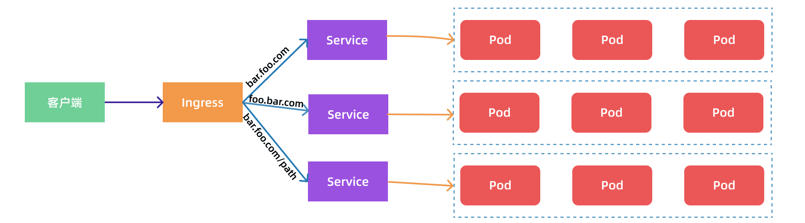

## Ingress

使用 `NodePort` 和 `LoadBlancer` 类型的 Service 可以把应用暴露给外部使用，这对于小规模的应用来说确实没多大问题，但当应用越来越多的时候就会发现对于 NodePort 的管理就会变得非常麻烦，特别是大量的端口管理。为此，Kubernetes 提供了一个专门用来暴露服务给外部用户的资源对象，那就是 `Ingress`，简称 `ing`。

Ingress 资源对象是 Kubernetes 内置定义的一个对象，用于将外部的请求转发到集群内不同的 Service 上。

其实就相当于 nginx、haproxy 等负载均衡代理服务器。但为啥不直接使用 Nginx？

原因在于：如果有新服务加入的时候怎么改 Nginx 配置。不可能每次都去手动更改或者滚动更新前端的 Nginx Pod 吧？那是不是在 Nginx 的基础上再加上一个服务发现的工具，比如 consul 这种就能实现呢？

是的，Ingress 实际上就是类似这样实现的，只是服务发现的功能是它自己实现的，不需要使用第三方的服务，通过 Ingress Controller 可以完成域名规则定义，路由信息的刷新等等。



Ingress 控制器可以理解为一个监听器，通过不断地监听 API Server，实时的感知后端 Service、Pod 的变化，当获取到变化后，再结合 Ingress 的配置，更新反向代理负载均衡器，达到服务发现的作用。


## 资源清单

示例资源清单：

```yaml
apiVersion: networking.k8s.io/v1
kind: Ingress
metadata:
  name: ing-demo
spec:
  rules:
  - host: www.ezops.cn
    http:
      paths:
      - pathType: Prefix
        path: "/"
        backend:
          service:
            name: svc-demo
            port: 
              number: 80
```

匹配请求 `www.ezops.cn` 的 `/` 路由，所有 `/*` 的入站请求，都会被 Ingress 转发至名为 svc-demo 的 Service 的 80 端口的 / 路径下。

> 单纯的 Ingress 资源并没啥用，想要正常使用还需要对应的 Ingress Controller，比如 ingress-nginx。整个 Ingress 其实就可以看成是 nginx.conf 配置。

<br>

查看支持的配置：

```bash
kubectl explain ingress.spec
```


## 属性说明

Ingress 资源对象中有几个重要的属性：`defaultBackend`、`ingressClassName`、`rules`、`tls`。

<br>

`rules` 属性是 Ingress 的核心配置，每个路由规则都需要在下面进行配置。

`spec.rules`：相当于 nginx 配置中的 server 虚拟主机。

* `host`：可选字段，用于指定域名，相当于 nginx 配置中的 server_name。
  * 如果没指定，那么该规则适用于通过指定 IP 地址的所有入站 HTTP 通信。
  * 如果提供了 host 域名，rules 则只会匹配该域名的相关请求。
  * host 主机名可以是精确匹配（例如 foo.bar.com），也可以是通配符匹配（例如 *.foo.com）。
* `http`：http 和 https 规则。
  * `paths`：相当于 nginx 配置中的 location 列表。
    * `path`：URI 前缀，相当于nginx 配置中 location 的匹配规则。
    * `pathType`：URI 类型，支持以下值：
      * `Exact`：精确匹配 URI 路径，且区分大小写。相当于 nginx 的 `location =` 
      * `Prefix`：基于以 `/` 分隔的 URI 路径前缀匹配，匹配区分大小写。相当于 nginx 的 `location ^~`
      * `ImplementationSpecific`：该路径类型的匹配方法取决于 `IngressClass`。
    * `backend`：后端配置。
      * `service`：指定 service 作为后端服务（常用）。
        * `name`：service 名称。
        * `port`：
          * `name`：Service 端口的名称。
          * `number`：Service 端口，和 name 二选一。
      * `resource`：和 Service 只能二选一，用于引入其它对象。
        * `apiGroup`：被引入资源的组。如果未指定，则指定的 Kind 必须位于核心 API 组中。对于第三方类型是必需的。
        * `kind`：资源对象类型。
        * `name`：资源对象名称。

<br>

关于 path 匹配规则示例：

| 类型   | 配置路径 | 请求路径      | 是否匹配 |
| ------ | -------- | ------------- | -------- |
| Exact  | /foo     | /foo/         | 否       |
| Exact  | /foo     | /foo          | 是       |
| Prefix | /        | 所有路径      | 是       |
| Prefix | /foo     | /foo，/foo/   | 是       |
| Prefix | /foo/    | /foo，/foo/   | 是       |
| Prefix | /a/b     | /a/bb         | 否       |
| Prefix | /a/b/    | /a/b          | 是       |
| Prefix | /a/b     | /a/b/，/a/b/c | 是       |

当多条匹配都满足的时候，会采用最长的匹配路径优先，如果仍然有两条同等的匹配路径，则精确路径类型优先于前缀路径类型。

<br>

`defaultBackend ` 用于配置默认的代理后端，类似于 nginx 配置中的 `location /`，当没有满足条件的才走该路由。

和 rules 一样，defaultBackend 支持两种方式配置：service 和 resouce。

<br>

`ingressClassName` 指定 Ingress 控制器，常见的 Ingress 控制器包含：`Ingress-nginx`，`Traefik`，`APISix`。

<br>

`tls` 用于指定 SSL 证书列表，一般结合 Secret  一起使用：

```yaml
apiVersion: v1
kind: Secret
metadata:
  name: secret-tls-demo
data:
  tls.crt: base64 编码的 cert
  tls.key: base64 编码的 key
type: kubernetes.io/tls
```

Ingress 资源清单：

```yaml
apiVersion: networking.k8s.io/v1
kind: Ingress
metadata:
  name: ing-tls-demo
spec:
  tls:
  - hosts:
      # 一个证书可以应用给多个域名
      - www.ezops.cn
      - blog.ezops.cn
    secretName: secret-tls-demo
  rules:
  - host: www.ezops.cn
    http:
      paths:
      - path: /
        pathType: Prefix
        backend:
          service:
            name: svc-demo
            port:
              number: 80
```

<br>

如果仅是创建 Ingress 资源，本身没有任何效果的。还需要配合 Ingress 控制器使用，例如 `ingress-nginx`。

目前可供大家使用的 Ingress 控制器有很多，比如：

* traefik
* nginx-controller
* Kubernetes Ingress Controller for Kong
* HAProxy Ingress controller 等

你也可以自己实现一个 Ingress 控制器，不过 traefik 和 ingress-nginx 已经比较完善了，traefik 的性能比 ingress-nginx 差，但是配置更简单。

同时，社区目前也在开发一组高配置能力的 API，被称为 `Gateway API`，也叫 `Service API`。

新 API 会提供一种 Ingress 的替代方案，但它的存在目的不是替代 Ingress，而是提供一种更具配置能力的新方案。


## IngressClass

Kubernetes 1.18 起，正式提供了一个 `IngressClass` 资源，作用与 `kubernetes.io/ingress.class` 注解类似，因为可能在集群中有多个 Ingress 控制器，可以通过该对象来定义我们的控制器。

示例资源清单：

```yaml
# IngressClass
apiVersion: networking.k8s.io/v1
kind: IngressClass
metadata:
  name: external-lb
spec:
  controller: nginx-ingress-internal-controller
  parameters:
    apiGroup: k8s.example.com
    kind: IngressParameters
    name: external-lb
    
---

# Ingress
apiVersion: networking.k8s.io/v1
kind: Ingress
metadata:
  name: ing-demo
spec:
  # 上面定义的 IngressClass 对象名称
  ingressClassName: external-lb
  defaultBackend:
    service:
      name: svc-demo
      port:
        number: 80
```

由于一个集群中可能有多个 Ingress 控制器，所以可以将一个特定的 `IngressClass` 对象标记为集群默认是 Ingress 类。

只需要将一个 IngressClass 资源的 `ingressclass.kubernetes.io/is-default-class` 注解设置为 true 即可，这样未指定 `ingressClassName` 字段的 Ingress 就会使用这个默认的 IngressClass。

