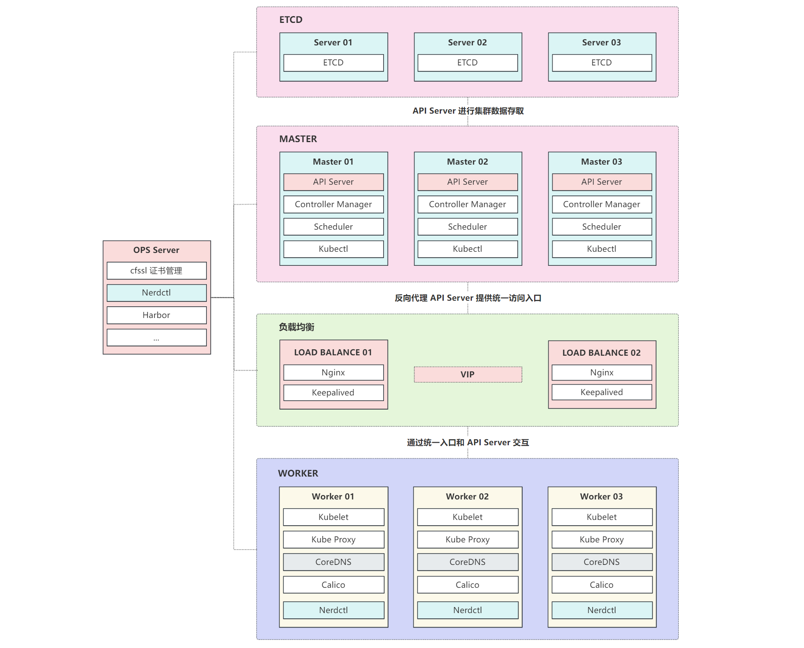

## 集群设计



由于本地机器没这么多资源，对服务器进行了部分精简，配置如下：

| 主机名    | IP            | 系统       | CPU  | 内存 | 磁盘 | 安装服务                                    |
| --------- | ------------- | ---------- | ---- | ---- | ---- | ------------------------------------------- |
| ops       | 192.168.2.201 | CentOS 7.9 | 4    | 4    | 30   | Nerdctl，Harbor，cfssl                      |
| slb-01    | 192.168.2.211 | CentOS 7.9 | 2    | 1    | 30   | Nginx，Keepalived                           |
| slb-02    | 192.168.2.212 | CentOS 7.9 | 2    | 1    | 30   | Nginx，Keepalived                           |
| master-01 | 192.168.2.221 | CentOS 7.9 | 4    | 3    | 30   | Nerdctl，Master / Worker 组件，Calico，ETCD |
| master-02 | 192.168.2.222 | CentOS 7.9 | 4    | 3    | 30   | Nerdctl，Master / Worker 组件，Calico，ETCD |
| master-03 | 192.168.2.223 | CentOS 7.9 | 4    | 3    | 30   | Nerdctl，Master / Worker 组件，Calico，ETCD |
| worker-01 | 192.168.2.231 | CentOS 7.9 | 4    | 4    | 30   | Nerdctl，Worker 组件，Calico，CoreDNS       |
| worker-02 | 192.168.2.232 | CentOS 7.9 | 4    | 4    | 30   | Nerdctl，Worker 组件，Calico，CoreDNS       |
| worker-03 | 192.168.2.233 | CentOS 7.9 | 4    | 4    | 30   | Nerdctl，Worker 组件，Calico，CoreDNS       |

服务器功能说明：

* `ops`：运维服务器，所有统一管理操作都在上面进行，同时还提供 Harbor 镜像仓库服务。
* `slb`：负载均衡服务器，由于本地没负载均衡服务，所有通过 Nginx TCP 代理 + Keepalived VIP 来实现统一入口。
* `master`：主节点，由于节点很少，Master 节点也充当 Worker 角色，同时 ETCD 也部署到该机器，节省机器。
* `worker`：工作节点，Worker 角色的服务，同时运行固定副本的 CoreDNS，用于集群内解析。
* 网络插件选择 `Calico`，容器运行时选择 `Containerd` 的 `Nerdctl`。
* 注意，本测试环境 Nginx + Keepalived 的 VIP 为：`192.168.2.100`


## 系统调优

### 关闭防火墙

执行服务器：`所有节点`

```bash
# 关闭防火墙
systemctl stop firewalld
systemctl disable firewalld
```


### 关闭 Selinux

执行服务器：`所有节点`

```bash
# 关闭 Selinux
sed -i "s#^SELINUX=.*#SELINUX=disabled#g" /etc/selinux/config
setenforce 0
```


### 关闭 Swap

执行服务器：`所有节点`

```bash
# 关闭 swap 分区，Swap 会影响性能
swapoff -a && sysctl -w vm.swappiness=0
sed -ri '/^[^#]*swap/s@^@#@' /etc/fstab
```


### 初始化目录

执行服务器：`所有节点`

```bash
# 服务器目录规划
mkdir -p /ezops/{service,package,backup,shell}
```

目录说明：

* `service`：用户服务安装目录。
* `package`：安装包存放目录。
* `backup`：数据备份目录。
* `shell`：用户脚本存放目录。


### 优化 SSH 登录

执行服务器：`所有节点`

```bash
# 禁用 SSH 时候 DNS 查询，加快连接速度
sed -i "s/#UseDNS yes/UseDNS no/g" /etc/ssh/sshd_config
```


### YUM 源配置（云服务不需要）

执行服务器：`所有节点`

```bash
# 备份旧的 yum 源
cd /etc/yum.repos.d/
mkdir backup-$(date +%F)
mv *repo backup-$(date +%F)

# 添加阿里云 yum 源
curl http://mirrors.aliyun.com/repo/Centos-7.repo -o ali.repo

# 安装 epel 源
yum -y install epel-release
yum clean all
yum makecache
```


### 基础依赖安装

执行服务器：`所有节点`

```bash
# 安装常用依赖
yum -y install gcc glibc gcc-c++ make cmake net-tools screen vim lrzsz tree dos2unix lsof \
    tcpdump bash-completion wget ntp setuptool openssl openssl-devel bind-utils traceroute \
    bash-completion bash-completion-extras unzip bzip2 bzip2-devel libevent libevent-devel \
    ntp expect pcre pcre-devel zlib zlib-devel jq psmisc yum-utils device-mapper-persistent-data \
    lvm2 git device-mapper-persistent-data bridge-utils container-selinux binutils-devel \
    ncurses ncurses-devel elfutils-libelf-devel ack zip unzip socat glib2 glib2-devel tcping

# 升级服务器
yum -y update
```


### 时间同步（云服务器不需要）

执行服务器：`所有节点`

```bash
# 安装服务，使用 chrony 代替 ntpdate
yum -y install chrony

# 设置时区
timedatectl set-timezone Asia/Shanghai

# 注释默认同步源
sed -i "s/^server.*$/# &/g" /etc/chrony.conf

# 配置阿里云时间同步源
cat >> /etc/chrony.conf << EOF
server ntp1.aliyun.com
server time1.aliyun.com
EOF

# 启动服务
systemctl start chronyd
systemctl enable chronyd
systemctl status chronyd

# 同步时间
chronyc makestep

# 查看系统时间
timedatectl
```


### 系统调优

执行服务器：`所有节点`

```bash
cat >> /etc/security/limits.conf << EOF
# 打开文件优化配置
* soft nofile 655360
* hard nofile 655350
* soft nproc 655350
* hard nproc 655350
* soft memlock unlimited
* hard memlock unlimited
EOF
```


### 内核升级

在 Kubernetes 的 Github 仓库中：

> https://github.com/kubernetes/kubernetes/blob/master/CHANGELOG/CHANGELOG-1.25.md

有提到关于内核版本的问题：

> Faster mount detection for linux kernel 5.10+ using openat2 speeding up pod churn rates. On Kernel versions less 5.10, it will fallback to using the original way of detecting mount points i.e by parsing /proc/mounts.

这意味着内核 5.10 版本以后会使用 openat2 进行更快的挂载检测。

同时，官方文档中关于 CGroup v2 也有提到，内部版本要高于 5.8：

> https://kubernetes.io/zh-cn/docs/concepts/architecture/cgroups/

所有本文选择了 `5.11.16` 版本，更新于 2021 年 4 月。如果想安装其它版本可以去下面网站下载：

> http://193.49.22.109/elrepo/kernel/el7/x86_64/RPMS/

<br>

内核升级所需安装包：

| 安装包          | 版本号  | 说明       | 下载地址                                                     |
| --------------- | ------- | ---------- | ------------------------------------------------------------ |
| kernel-ml       | 5.11.16 | Linux 内核 | [点击下载](http://193.49.22.109/elrepo/kernel/el7/x86_64/RPMS/kernel-ml-5.11.16-1.el7.elrepo.x86_64.rpm) |
| kernel-ml-devel | 5.11.16 | Linux 内核 | [点击下载](http://193.49.22.109/elrepo/kernel/el7/x86_64/RPMS/kernel-ml-devel-5.11.16-1.el7.elrepo.x86_64.rpm) |

<br>

执行服务器：`所有节点`

```bash
# 下载安装
mkdir /ezops/package/kernel
cd /ezops/package/kernel
wget http://193.49.22.109/elrepo/kernel/el7/x86_64/RPMS/kernel-ml-5.11.16-1.el7.elrepo.x86_64.rpm
wget http://193.49.22.109/elrepo/kernel/el7/x86_64/RPMS/kernel-ml-devel-5.11.16-1.el7.elrepo.x86_64.rpm
yum localinstall -y kernel-ml*

# 设置内核启动顺序
grub2-set-default 0 && grub2-mkconfig -o /etc/grub2.cfg

# 查看默认内核
grubby --default-kernel
```


### 安装 ipvsadm

执行服务器：`所有节点`

```bash
# 安装 ipvsadm
yum -y install ipvsadm ipset sysstat conntrack libseccomp

# 配置 ipvs 模块（内核 4.19 版本以前使用 nf_conntrack_ipv4，以后使用 nf_conntrack）
modprobe -- ip_vs
modprobe -- ip_vs_rr
modprobe -- ip_vs_wrr
modprobe -- ip_vs_sh
modprobe -- nf_conntrack

cat > /etc/modules-load.d/ipvs.conf << EOF
ip_vs
ip_vs_lc
ip_vs_wlc
ip_vs_rr
ip_vs_wrr
ip_vs_lblc
ip_vs_lblcr
ip_vs_dh
ip_vs_sh
ip_vs_fo
ip_vs_nq
ip_vs_sed
ip_vs_ftp
ip_vs_sh
nf_conntrack
ip_tables
ip_set
xt_set
ipt_set
ipt_rpfilter
ipt_REJECT
ipip
EOF

systemctl enable --now systemd-modules-load
```

节点通信需要用到 LVS，所有需要安装 `ipvsadm`。这里启动会报错，不影响。


### 内核调优

执行服务器：`所有节点`

```bash
cat >> /etc/sysctl.d/user.conf << EOF
# 内核调优
net.ipv4.ip_forward = 1
net.bridge.bridge-nf-call-iptables = 1
net.bridge.bridge-nf-call-ip6tables = 1
fs.may_detach_mounts = 1
vm.overcommit_memory=1
vm.panic_on_oom=0
fs.inotify.max_user_watches=89100
fs.file-max=52706963
fs.nr_open=52706963
net.netfilter.nf_conntrack_max=2310720
net.ipv4.tcp_keepalive_time = 600
net.ipv4.tcp_keepalive_probes = 3
net.ipv4.tcp_keepalive_intvl =15
net.ipv4.tcp_max_tw_buckets = 36000
net.ipv4.tcp_tw_reuse = 1
net.ipv4.tcp_max_orphans = 327680
net.ipv4.tcp_orphan_retries = 3
net.ipv4.tcp_syncookies = 1
net.ipv4.tcp_max_syn_backlog = 16384
net.ipv4.ip_conntrack_max = 65536
net.ipv4.tcp_timestamps = 0
net.core.somaxconn = 16384
EOF
```

完成后就可以重启服务器，虚拟机可以这个时候做个快照：

```bash
reboot
```

重启完成查看 ipvs 的配置效果：

```bash
lsmod | grep --color=auto -e ip_vs -e nf_conntrack
```


## 安装容器运行时

由于 Kubernetes 1.24 版本之后移除了 dockershim，所以直接使用 containerd 作为容器运行时。

安装所需安装包：

| 安装包       | 版本号 | 说明                                      | 下载地址                                                     |
| ------------ | ------ | ----------------------------------------- | ------------------------------------------------------------ |
| nerdctl-full | 1.3.1  | Nerdctl full 版本，包含 Containerd 等所有 | [点击下载](https://github.com/containerd/nerdctl/releases/download/v1.3.1/nerdctl-full-1.3.1-linux-amd64.tar.gz) |


### 安装 Nerdctl

执行服务器：`除了 slb-01，slb-02 之外所有节点`

```bash
# 更新 libseccomp，解决容器启动报错
rpm -e libseccomp-2.3.1-4.el7.x86_64 --nodeps
wget https://vault.centos.org/centos/8/BaseOS/x86_64/os/Packages/libseccomp-2.5.1-1.el8.x86_64.rpm
rpm -ivh libseccomp-2.5.1-1.el8.x86_64.rpm 

# 创建目录闭关下载安装文件
mkdir /ezops/package/nerdctl
cd /ezops/package/nerdctl
wget https://github.com/containerd/nerdctl/releases/download/v1.3.1/nerdctl-full-1.3.1-linux-amd64.tar.gz

# 解压安装
tar -C /usr/local -zxf nerdctl-full-1.3.1-linux-amd64.tar.gz

# 创建 Containerd 默认配置
mkdir /etc/containerd
containerd config default > /etc/containerd/config.toml

# 启动 Containerd
systemctl enable containerd --now

# 查看 Containerd 版本
ctr version

# 查看 Nerdctl 版本
nerdctl version
```


### 配置命令

执行服务器：`除了 slb-01，slb-02 之外所有节点`

```bash
# 配置别名
cat >> ~/.bashrc << EOF
# nerdctl 别名
alias docker=nerdctl
EOF

# 应用配置
source ~/.bashrc

# 配置自动补全
nerdctl completion bash > /etc/bash_completion.d/nerdctl
nerdctl completion bash > /etc/bash_completion.d/docker
sed -i "s#nerdctl#docker#g" /etc/bash_completion.d/docker

# 生效自动补全配置
source /etc/bash_completion.d/nerdctl
source /etc/bash_completion.d/docker
```


### 配置 Containerd 模块

执行服务器：`除了 slb-01，slb-02 之外所有节点`

```bash
# 配置模块
cat > /etc/modules-load.d/containerd.conf << EOF
overlay
br_netfilter
EOF

# 加载模块
modprobe -- overlay
modprobe -- br_netfilter
```


### 修改 CGroup

执行服务器：`除了 slb-01，slb-02 之外所有节点`

```bash
# 将 Cgroup 改为 Systemd
sed -i "s#SystemdCgroup = false#SystemdCgroup = true#g" /etc/containerd/config.toml

# 检查配置
grep "SystemdCgroup" /etc/containerd/config.toml
```

低版本可能没有 SystemdCgroup 配置，可以 vim 搜索 `containerd.runtimes.runc.options` 关键字，然后在下面添加一项：

```bash
SystemdCgroup = true
```


### 修改 Pause 镜像

执行服务器：`除了 slb-01，slb-02 之外所有节点`

```bash
# 替换镜像配置
sed -i "s#registry.k8s.io/pause:3.8#registry.cn-hangzhou.aliyuncs.com/google_containers/pause:3.8#g" /etc/containerd/config.toml

# 检查配置
grep "pause" /etc/containerd/config.toml
```

修改 `sandbox_image` 的 `Pause` 镜像地址的原因为，默认的镜像地址国内没法访问到的。

注意，pause 镜像需要看自己安装的版本实际情况进行替换。


### 配置 crictl

执行服务器：`除了 slb-01，slb-02 之外所有节点`

```bash
# 配置 crictl 客户端连接的运行时位置
cat > /etc/crictl.yaml << EOF
runtime-endpoint: unix:///run/containerd/containerd.sock
image-endpoint: unix:///run/containerd/containerd.sock
timeout: 10
debug: false
EOF
```

完成后重启 Containerd：

```bash
systemctl restart containerd
```


## 安装配置 Nginx（按需）

由于集群需要实现高可用功能，所以需要一个统一的 IP 作为入口。

对于本地环境，如果没负载均衡设备，推荐的方案就是 `Nginx + Keepalived` 的方式提供 `VIP` 实现负载均衡反向代理高可用。

对于云服务器，大部分是不支持 Keepalived 的，此时就需要用到公有云自带的负载均衡，如阿里云的 SLB，CLB，ALB，腾讯云的 ELB 等等。

如果选择阿里云，则需要注意以下问题：

1. 阿里云不能使用 VIP，要用 VIP 只能走 SLB。同时 SLB 内外网都需要收费。
2. 阿里云 SLB 不支持手动指定 IP 地址，在生成相关证书时需要注意。
3. 反代 HTTPS 的 API Server 只能用 SLB 的四层反代。
4. SLB 四层 TCP 反代不能直接反代到服务提供者上 API Server 上。因为 API Server 也会有请求访问 SLB，这样最终请求可能转发到本机，这在阿里云是不被允许的，会导致请求超时或者报错。只能先代理到另一个 ECS 上通过类似 Nginx 之类的再代理到 API Server。即 SLB（TCP）--> Nginx（TCP）--> API Server（HTTPS），注意 Nginx 和 API Server 不能是同一个机器。

既然有这么多问题，那阿里云直接建议上 `ACK`。


### 安装 Nginx

Nginx 所需安装包信息：

| 安装包                        | 版本号 | 说明                         | 下载地址                                                     |
| ----------------------------- | ------ | ---------------------------- | ------------------------------------------------------------ |
| nginx                         | 1.23.0 | 负载均衡，反向代理，TCP 代理 | [点击下载](https://nginx.org/download/nginx-1.23.0.tar.gz)   |
| openssl                       | 1.1.1q | 依赖                         | [点击下载](https://www.openssl.org/source/openssl-1.1.1q.tar.gz) |
| pcre                          | 8.45   | 依赖                         | [点击下载](https://udomain.dl.sourceforge.net/project/pcre/pcre/8.45/pcre-8.45.tar.gz) |
| zlib                          | 1.2.13 | 依赖                         | [点击下载](http://zlib.net/fossils/zlib-1.2.13.tar.gz)       |
| ngx_healthcheck_module        | master | 健康检查模块                 | [点击下载](https://github.com/zhouchangxun/ngx_healthcheck_module/archive/refs/heads/master.zip) |
| ngx_http_proxy_connect_module | master | 代理模块                     | [点击下载](https://github.com/chobits/ngx_http_proxy_connect_module/archive/refs/heads/master.zip) |
| ngx_http_status_code_counter  | master | 状态统计模块                 | [点击下载](https://github.com/kennon/ngx_http_status_code_counter/archive/refs/heads/master.zip) |

<br>

执行服务器：`slb-01、slb-02`

```bash
# 安装依赖
yum -y install zip unzip gcc gcc-c++ automake autoconf libtool make glibc gd-devel pcre-devel \
	libmcrypt-devel mhash-devel libxslt-devel libjpeg libjpeg-devel libpng libpng-devel \
	freetype freetype-devel libxml2 libxml2-devel glibc glibc-devel glib2 glib2-devel \
	bzip2 bzip2-devel ncurses ncurses-devel curl curl-devel e2fsprogs e2fsprogs-devel \
	krb5 krb5-devel libidn libidn-devel openssl openssl-devel libevent libevent-devel \
	GeoIP GeoIP-devel GeoIP-data httpd-tools patch zlib zlib-devel
	
# 创建安装包存放目录
mkdir /ezops/package/nginx
cd /ezops/package/nginx

# 下载安装包
wget https://nginx.org/download/nginx-1.23.0.tar.gz
wget https://www.openssl.org/source/openssl-1.1.1q.tar.gz
wget https://udomain.dl.sourceforge.net/project/pcre/pcre/8.45/pcre-8.45.tar.gz
wget http://zlib.net/fossils/zlib-1.2.13.tar.gz

# 下载模块
wget https://github.com/zhouchangxun/ngx_healthcheck_module/archive/refs/heads/master.zip -O ngx_healthcheck_module.zip
wget https://github.com/chobits/ngx_http_proxy_connect_module/archive/refs/heads/master.zip -O ngx_http_proxy_connect_module.zip
wget https://github.com/kennon/ngx_http_status_code_counter/archive/refs/heads/master.zip -O ngx_http_status_code_counter.zip

# 解压安装包
tar -zxf nginx-1.23.0.tar.gz 
tar -zxf pcre-8.45.tar.gz 
tar -zxf openssl-1.1.1q.tar.gz 
tar -zxf zlib-1.2.13.tar.gz 
unzip ngx_healthcheck_module.zip
unzip ngx_http_proxy_connect_module.zip
unzip ngx_http_status_code_counter.zip

# 打补丁
cd nginx-1.23.0/
patch -p1 < ../ngx_healthcheck_module-master/nginx_healthcheck_for_nginx_1.19+.patch
patch -p1 < ../ngx_http_proxy_connect_module-master/patch/proxy_connect_rewrite_102101.patch

# 安全优化，隐藏版本号
sed -i 's#"1.23.0"#"2.2"#g' src/core/nginx.h
sed -i 's#"nginx/"#"apache/"#g' src/core/nginx.h
sed -i 's#"NGINX"#"APACHE"#g' src/core/nginx.h
sed -i 's#"Server: nginx"#"Server: apache"#g' src/http/ngx_http_header_filter_module.c
sed -i '/"<hr><center>" NGINX_VER "<\/center>" CRLF/d' src/http/ngx_http_special_response.c
sed -i '/"<hr><center>" NGINX_VER_BUILD "<\/center>" CRLF/d' src/http/ngx_http_special_response.c
sed -i '/"<hr><center>nginx<\/center>" CRLF/d' src/http/ngx_http_special_response.c

# 编译安装
./configure --prefix=/ezops/service/nginx \
--user=root \
--group=root \
--with-http_stub_status_module \
--with-http_gzip_static_module \
--with-http_secure_link_module \
--with-http_flv_module \
--with-http_ssl_module \
--with-http_mp4_module \
--with-stream \
--with-http_realip_module \
--with-http_geoip_module \
--with-http_v2_module \
--with-http_sub_module \
--with-http_image_filter_module \
--with-pcre=/ezops/package/nginx/pcre-8.45 \
--with-openssl=/ezops/package/nginx/openssl-1.1.1q \
--with-zlib=/ezops/package/nginx/zlib-1.2.13 \
--add-module=/ezops/package/nginx/ngx_healthcheck_module-master \
--add-module=/ezops/package/nginx/ngx_http_proxy_connect_module-master \
--add-module=/ezops/package/nginx/ngx_http_status_code_counter-master

make && make install
```


### 优化 Nginx 主配置文件

执行服务器：`slb-01、slb-02`

```bash
cat > /ezops/service/nginx/conf/nginx.conf << EOF
# Worker运行用户
user  root;
# Worker线程数量，一般等于CPU数
worker_processes  auto;
# 默认错误日志文件
error_log  logs/error.log;
# 默认PID文件位置
pid        logs/nginx.pid;
# Worker打开文件数，影响并发，系统 limit 也会影响
worker_rlimit_nofile 65535;
# 最大并发数：worker_processes * worker_connections，反向代理除以 4
events {
    use epoll;
    worker_connections  65535;
}

# HTTP服务配置字段
http {
    # 允许的文件类型和默认的打开方式
    include       mime.types;
    default_type  application/octet-stream;
 
    # 默认的 access 日志输出格式
    log_format  main    '\$remote_addr \$remote_user [\$time_local] "\$request" '
                        '\$status \$body_bytes_sent "\$http_referer" '
                        '\$http_user_agent \$http_x_forwarded_for \$request_time \$upstream_response_time \$upstream_addr \$upstream_status';

    # 默认access日志输出位置
    access_log logs/access.log  main;
 
    # 配置多个域名的时候需要增大该值
    server_names_hash_bucket_size 128;
    variables_hash_max_size 4096;
    variables_hash_bucket_size 2048;
    
    # 这两个值限制header buffer 大小，超出大小报错414（处理request_line）/400（处理request_header）
    client_header_buffer_size 32k;
    large_client_header_buffers 4 32k;
    
    # 上传文件大小限制
    client_max_body_size 50m;
   
    # Fastcgi优化配置
    fastcgi_connect_timeout 300;
    fastcgi_send_timeout 300;
    fastcgi_read_timeout 300;
    fastcgi_buffer_size 64k;
    fastcgi_buffers 4 64k;
    fastcgi_busy_buffers_size 128k;
    fastcgi_temp_file_write_size 128k;
    fastcgi_param HTTP_PROXY "";
   
    # 隐藏后端服务器的相关参数
    proxy_hide_header X-Powered-By;
    proxy_hide_header X-Forwarded-For;
    proxy_hide_header X-AspNet-Version;
    proxy_hide_header X-AspNetMvc-Version;
    proxy_hide_header Via;
    proxy_hide_header X-Varnish;
    proxy_hide_header Server;

    # 后端服务器连接的超时时间
    proxy_connect_timeout 30s;
    # 连接成功后，等候后端服务器响应时间
    proxy_read_timeout 30s;
    # 后端服务器数据回传时间
    proxy_send_timeout 30s;
    
    # 开启压缩
    gzip          on;
    # 静态资源压缩
    gzip_static   on;
    # 客户端IE不压缩
    gzip_disable  "MSIE [1-6] .";
    # 响应头部标识
    gzip_vary     on;
    # 最小压缩文件大小
    gzip_min_length 1k;
    # 缓冲区个数和大小
    gzip_buffers    4 16k;
    # 压缩等级，越高压缩比越高，但是越吃CPU
    gzip_comp_level 5;
    # 压缩的文件类型
    gzip_types text/plain application/javascript application/x-javascript text/css application/xml text/javascript application/x-httpd-php image/jpeg image/gif image/png application/vnd.ms-fontobject font/ttf font/opentype font/x-woff image/svg+xml;
    # 针对压缩的协议版本
    gzip_http_version 1.1;
    
    # 虚拟主机配置目录
    include vhost/*.conf;

    # 防止恶意解析
    server {
        listen 80 default_server;
        server_name _;
        access_log off;
        return 444;
    }
}

# TCP/UDP代理配置段
stream {
    # TCP/UDP虚拟主机配置目录
    include tcp/*.conf;
}
EOF
```

创建配置所需目录：

```bash
mkdir /ezops/service/nginx/conf/{vhost,tcp,cert}
```


### 添加 API Server 代理配置

执行服务器：`slb-01、slb-02`

```bash
cat > /ezops/service/nginx/conf/tcp/apiserver.conf << EOF
# Kubernetes API Server TCP/UDP 代理
upstream KUBERNETES-APISERVER {
    hash \$remote_addr consistent;
    server 192.168.2.221:6443;
    server 192.168.2.222:6443;
    server 192.168.2.223:6443;
    check interval=5000 rise=2 fall=3 timeout=5000 default_down=true type=tcp;
}

server {
    listen 6443;
    proxy_connect_timeout 30s;
    proxy_timeout 300s;
    proxy_pass KUBERNETES-APISERVER;
}
EOF
```


### 添加状态查看配置

执行服务器：`slb-01、slb-02`

```bash
cat > /ezops/service/nginx/conf/vhost/status.conf << EOF
server {
    listen       10000;
    server_name  localhost;
    access_log  off;

    # 请求状态统计
    location = /nginx/status {
        stub_status on;
    }
    
    # 状态码统计
    location = /nginx/status/count {
        show_status_code_count on;
    }
    
    # 负载均衡状态
    location /nginx/upstream/status {
        healthcheck_status;
    }
    
    location / {
        return 403;
    }
}
EOF
```


### 启动服务

执行服务器：`slb-01、slb-02`

```bash
# 启动服务
/ezops/service/nginx/sbin/nginx -t
/ezops/service/nginx/sbin/nginx

# 添加开机启动
cat >> /etc/rc.local << EOF
# Nginx 开机启动
/ezops/service/nginx/sbin/nginx &
EOF

# 修改权限
chmod 755 /etc/rc.local
```

请求状态页面：

> http://192.168.2.211:10000/nginx/status

状态码统计页面：

> http://192.168.2.211:10000/nginx/status/count

Upstream 状态页面：

> http://192.168.2.211:10000/nginx/upstream/status


## 安装配置 Keepalived（按需）

Nginx 和 Keepalived 是配套使用的，如果有其他负载均衡器就不需要再安装这两个服务。

| 安装包     | 版本号 | 说明     | 下载地址                                                     |
| ---------- | ------ | -------- | ------------------------------------------------------------ |
| keepalived | 2.27   | 提供 VIP | [点击下载](https://www.keepalived.org/software/keepalived-2.2.7.tar.gz) |

<br>

### 安装 Keepalived

执行服务器：`slb-01 和 slb-02`

```bash
# 安装依赖
yum install -y ipvsadm popt popt-devel libnl libnl-devel libnl3-devel libnfnetlink libnfnetlink-devel \
	net-snmp-devel openssl openssl-devel
	
# 创建安装包存放目录
mkdir /ezops/package/keepalived
cd /ezops/package/keepalived

# 下载安装包并解压
wget https://www.keepalived.org/software/keepalived-2.2.7.tar.gz
tar -zxf keepalived-2.2.7.tar.gz

# 编译安装
cd keepalived-2.2.7/
./configure --prefix=/ezops/service/keepalived
make && make install
```


### 添加 Master 配置

执行服务器：`slb-01`

```bash
cat > /ezops/service/keepalived/etc/keepalived/keepalived.conf << EOF
! Configuration File for keepalived
#全局配置
global_defs {
   # 负载均衡标识，在局域网内应该是唯一的。一般为主机名。
   router_id $(hostname)
   script_user root
   enable_script_security
}

vrrp_script check_nginx {
    # 检测心跳执行的脚本
    script "/ezops/service/keepalived/etc/keepalived/nginx_process_check.sh"
    # 检测脚本执行间隔，单位：秒
    interval 5
    weight 2
}

#定义实例
vrrp_instance VI_1 {
    # 指定keepalived的角色，MASTER为主，BACKUP为备
    state BACKUP
    # 当前进行vrrp通讯的网络接口卡(当前centos的网卡)
    interface ens33
    # 指定VRRP实例ID(虚拟路由编号)，范围是0-255，主从要一致
    virtual_router_id 100
    # 优先级，数值越大，获取处理请求的优先级越高, 优先级高的将成为MASTER。
    priority 100
    # 指定发送VRRP通告的间隔，默认为1s(vrrp组播周期秒数)
    advert_int 1
    # 设置验证类型和密码，MASTER和BACKUP必须使用相同的密码才能正常通信
    authentication {
        # 指定认证方式。PASS简单密码认证(推荐),AH:IPSEC认证(不推荐)。
        auth_type PASS
        # 指定认证所使用的密码。最多8位。
        auth_pass k8spass
    }
    # 调用检测脚本
    track_script {
        check_nginx
    }
    # 定义虚拟ip(VIP)，可多设，每行一个
    virtual_ipaddress {
        192.168.2.100
    }
}
EOF
```


### 添加 Backup 配置

执行服务器：`slb-02`

```bash
cat > /ezops/service/keepalived/etc/keepalived/keepalived.conf << EOF
! Configuration File for keepalived
#全局配置
global_defs {
   # 负载均衡标识，在局域网内应该是唯一的。一般为主机名。
   router_id $(hostname)
   script_user root
   enable_script_security
}

vrrp_script check_nginx {
    # 检测心跳执行的脚本
    script "/ezops/service/keepalived/etc/keepalived/nginx_process_check.sh"
    # 检测脚本执行间隔，单位：秒
    interval 5
    weight 2
}

#定义实例
vrrp_instance VI_1 {
    # 指定keepalived的角色，MASTER为主，BACKUP为备
    state BACKUP
    # 当前进行vrrp通讯的网络接口卡(当前centos的网卡)
    interface ens33
    # 指定VRRP实例ID(虚拟路由编号)，范围是0-255，主从要一致
    virtual_router_id 100
    # 优先级，数值越大，获取处理请求的优先级越高, 优先级高的将成为MASTER。
    priority 100
    # 指定发送VRRP通告的间隔，默认为1s(vrrp组播周期秒数)
    advert_int 1
    # 设置验证类型和密码，MASTER和BACKUP必须使用相同的密码才能正常通信
    authentication {
        # 指定认证方式。PASS简单密码认证(推荐),AH:IPSEC认证(不推荐)。
        auth_type PASS
        # 指定认证所使用的密码。最多8位。
        auth_pass k8spass
    }
    # 调用检测脚本
    track_script {
        check_nginx
    }
    # 定义虚拟ip(VIP)，可多设，每行一个
    virtual_ipaddress {
        192.168.2.100
    }
}
EOF
```


### 添加检测脚本

执行服务器：`slb-01 和 slb-02`

```bash
cat > /ezops/service/keepalived/etc/keepalived/nginx_process_check.sh << EOF
#!/bin/bash

# Nginx 进程检测脚本
echo "\$(date) 开始检测 Nginx 状态..." >> /tmp/keepalived.log
err=0

# 三次进程检测
for k in \$(seq 1 3);do
    process_count=\$(ps -ef | grep "nginx: master process" | grep -v "grep" | wc -l)
    if [[ \$process_count == 0 ]]; then
        err=\$(expr \$err + 1)
        sleep 1
        continue
    else
        err=0
        break
    fi
done

# 判断检测结果
if [[ \$err != "0" ]];then
    echo "\$(date) Nginx 进程检测异常，开始停止 Keepalived ..." >> /tmp/keepalived.log
    /usr/bin/systemctl stop keepalived
    exit 1
else
    exit 0
fi
EOF

# 修改权限
chmod +x /ezops/service/keepalived/etc/keepalived/nginx_process_check.sh
```

有两个地方需要特别注意：

1. 脚本中判断进程是否存活的关键字一定要跟脚本名称区分开，否则可能造成手动执行脚本没问题，但是 keepalived 一直不停止。
2. keepalived 对该脚本的权限控制非常严格，权限不对会在日志中提示以下问题，并且不执行脚本：

> Keepalived_vrrp[11241]: Unsafe permissions found for script 'xxx'.
> Keepalived_vrrp[11241]: Disabling track script xxx due to insecure

详细信息可以查看官方 Github 仓库的说明：

> https://github.com/acassen/keepalived/issues/1372


### 添加启动配置

执行服务器：`slb-01 和 slb-02`

```bash
cat > /etc/systemd/system/keepalived.service << EOF
[Unit]
Description=LVS and VRRP High Availability Monitor
After=network-online.target syslog.target 
Wants=network-online.target 

[Service]
Type=forking
PIDFile=/run/keepalived.pid
KillMode=process
EnvironmentFile=-/ezops/service/keepalived/etc/sysconfig/keepalived
ExecStart=/ezops/service/keepalived/sbin/keepalived -f /ezops/service/keepalived/etc/keepalived/keepalived.conf \$KEEPALIVED_OPTIONS
ExecReload=/bin/kill -HUP \$MAINPID

[Install]
WantedBy=multi-user.target
EOF
```

启动服务：

```bash
systemctl daemon-reload
systemctl enable --now keepalived
```

查看服务器 IP 地址，可以发现 `192.168.2.100` 这个 VIP 已经绑定到 `slb-01` 上面了。

此时停止 `slb-01` 上的 nginx 服务，过一会儿发现 keepalived 也跟着停止，VIP 已经漂移到 `slb-02` 上。


