## 二进制安装

区别于使用 kubeadm 部署集群时所有核心组件都托管在集群上。二进制安装则采用守护进程的方式直接将各个组件运行在宿主机，生产环境更为推荐。

对于生产环境，不推荐在 Master 节点再安装 kubelet、kube-proxy 以及容器运行时 Containerd，使得它同时也是 Worker 节点运行。但是测试环境由于机器有限，为了使得集群看起来节点不那么少，可以也安装上用于测试。

在执行安装之前，请确保你的所有服务器已经完成了集群安装初始化操作。


## 证书签发环境

Kubernetes 集群各组件之间的通信都会涉及证书验证，在使用 Kubeadm 安装集群的时候就遇到因为证书有效期问题，各种替换处理。所以在二进制安装签发证书的时候，尽可能证书做到一劳永逸。同时，证书的签发也是整个 Kubernetes 集群二进制安装中最难的部分。

下载 cfssl 相关文件，具体不同版本可以去 Github 下载，本文编写的时候最新版本为 `1.6.4` ：

> https://github.com/cloudflare/cfssl/releases

<br>

执行服务器：`ops`

```bash
# 下载相关文件
wget https://github.com/cloudflare/cfssl/releases/download/v1.6.4/cfssl_1.6.4_linux_amd64 -O /usr/bin/cfssl
wget https://github.com/cloudflare/cfssl/releases/download/v1.6.4/cfssl-certinfo_1.6.4_linux_amd64 -O /usr/bin/cfssl-certinfo
wget https://github.com/cloudflare/cfssl/releases/download/v1.6.4/cfssljson_1.6.4_linux_amd64 -O /usr/bin/cfssl-json

# 修改权限
chmod 755 /usr/bin/cfssl*
```

文件说明：

- cfssl：证书签发工具。
- cfssl-json：将 json 格式的证书信息转换成文件格式。
- cfssl-certinfo：验证证书信息。


## 签发 CA 根证书

CA 根证书是签发其他证书的基础，在使用 kubeadm 安装集群查看证书的有效期的时候是能看到有三个 CA 证书：

- ca
- etcd-ca
- front-proxy-ca

它们的有效期都是 10 年。为了做到二进制安装也更贴近官方最佳实践，本文的规划也是如此。

同时，对于证书的签发，有两个非常重要的注意事项：

1. 证书有效期：二进制安装由于证书签发是有用户自己决定的，所以推荐尽可能签长一点，一劳永逸。
2. IP 白名单：某些证书是需要绑定 IP 地址的，为了方便后期的节点扩容，可以在 `hosts` 字段多配置一些 IP 用作备用。

不管是 Master 节点还是 Worker 节点都是需要保存证书的，在 kubeadm 安装的集群中，证书都被保存在了 /etc/kubernetes/pki 下面。二进制安装环境为了对证书有更好的管理，使用我这里通过自定义的目录存储所需的证书。

执行服务器：`所有服务器`

```bash
# 创建存放证书目录
mkdir -p /ezops/cert/kubernetes
cd /ezops/cert/kubernetes
```


### Kubernetes CA

创建 Kubernetes 证书签发的 CA 根证书 JSON 配置文件。

执行服务器：`ops`

```bash
cat > ca-csr.json << EOF
{
    "CN": "kubernetes",
    "key": {
        "algo": "rsa",
        "size": 2048
    },
    "names": [
        {
            "C": "CN",
            "ST": "GD",
            "L": "SZ",
            "O": "kubernetes",
            "OU": "devops"
        }
    ],
    "ca": {
        "expiry": "876000h"
    }
}
EOF
```

生成证书：

```bash
cfssl gencert -initca ca-csr.json | cfssl-json -bare ca
```


### ETCD CA

创建 ETCD 证书签发的 CA 根证书 JSON 配置文件。

执行服务器：`ops`

```bash
cat > etcd-ca-csr.json << EOF
{
    "CN": "etcd",
    "key": {
        "algo": "rsa",
        "size": 2048
    },
    "names": [
        {
            "C": "CN",
            "ST": "GD",
            "L": "SZ",
            "O": "etcd",
            "OU": "devops"
        }
    ],
    "ca": {
        "expiry": "876000h"
    }
}
EOF
```

生成证书：

```bash
cfssl gencert -initca etcd-ca-csr.json | cfssl-json -bare etcd-ca
```


### front-proxy CA

创建 front-proxy 证书签发的 CA 根证书 JSON 配置文件。

执行服务器：`ops`

```bash
cat > front-proxy-ca-csr.json << EOF
{
    "CN": "kubernetes",
    "key": {
        "algo": "rsa",
        "size": 2048
    },
    "ca": {
        "expiry": "876000h"
    }
}
EOF
```

生成证书：

```bash
cfssl gencert -initca front-proxy-ca-csr.json | cfssl-json -bare front-proxy-ca
```


### 通用配置

创建证书创建的基本配置，属于公共配置内容，用于简化后面证书签发的配置。

执行服务器：`ops`

```bash
cat > ca-config.json << EOF
{
    "signing": {
        "default": {
            "expiry": "876000h"
        },
        "profiles": {
            "kubernetes": {
                "usages": [
                    "signing",
                    "key encipherment",
                    "server auth",
                    "client auth"
                ],
                "expiry": "876000h"
            }
        }
    }
}
EOF
```

CA 证书签发结果如图所示：

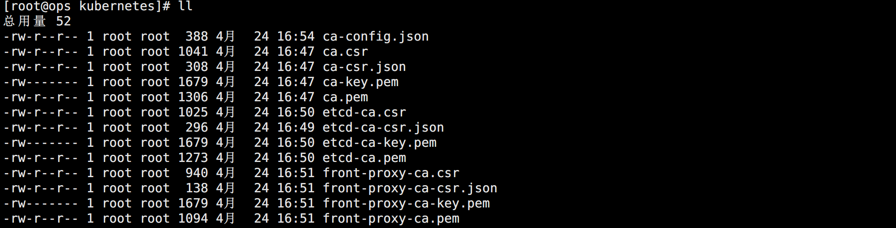


### 参数说明

在 JSON 配置中有几个字段需要特别关注一下：

- `CN`：Common Name，所有 csr 文件都必须有字段，对于不同证书，一般拥有不同的含义。
  - 普通 SSL 证书，一般为网站域名。
  - 代码签名证书，一般为申请单位名称。
  - 客户端证书，一般为证书申请者的姓名。
  - 在 Kubernetes 集群中，apiserver 会从证书中提取该字段作为请求的用户名，所以在定义的时候需要注意。
- `O`：Organization，apiserver 会从证书中提取该字段作为请求用户所属的组。
- `expiry`：证书有效期，`876000h` 表示 100 年。


## 部署 ETCD 集群

Kubernetes 的所有状态信息都会存储在 ETCD 中，所有该服务尤为关键，一定要高可用部署。


### 证书签发

创建用于证书签发的 JSON 配置文件。

执行服务器：`ops`

```bash
cat > etcd-csr.json << EOF
{
    "CN": "etcd",
    "hosts": [
        "127.0.0.1",
        "192.168.2.221",
        "192.168.2.222",
        "192.168.2.223",
        "192.168.2.224",
        "192.168.2.225"
    ],
    "key": {
        "algo": "rsa",
        "size": 2048
    },
    "names": [{
        "C": "CN",
        "ST": "GD",
        "L": "SZ",
        "O": "etcd",
        "OU": "devops"
    }]
}
EOF
```

生成证书：

```bash
cfssl gencert -ca=etcd-ca.pem -ca-key=etcd-ca-key.pem -config=ca-config.json -profile=kubernetes etcd-csr.json | cfssl-json -bare etcd
```

这里用到了证书生成的通用配置 `ca-config.json`，并获取了它的 `kubernetes` 字段定义的信息。

如图所示：

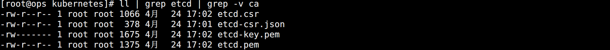


### 证书有效期

查看证书的有效期：

```bash
cfssl-certinfo -cert etcd.pem | grep not_after
```

`not_after` 字段定义了证书的最后有效时间，可以看到是 100 年以后。

也可以使用 openssl 直接看证书有效期：

```bash
openssl x509 -in etcd.pem -noout -dates
```


### 分发证书

由于三个 master 节点都需要安装 ETCD 服务，所有三台机器都要将证书分发过去。

执行服务器：`ops`

```bash
scp etcd* root@192.168.2.221:/ezops/cert/kubernetes/
scp etcd* root@192.168.2.222:/ezops/cert/kubernetes/
scp etcd* root@192.168.2.223:/ezops/cert/kubernetes/
```


### 安装 ETCD

从 Kubernetes v1.26 官方 CHANGELOG 中可以看到它已经支持 ETCD v3.5.5 版本了：

> https://github.com/kubernetes/kubernetes/blob/master/CHANGELOG/CHANGELOG-1.26.md

可以从 ETCD 的代码仓库中下载对应版本：

> https://github.com/etcd-io/etcd/releases

<br>

执行服务器：`所有 Master`

```bash
# 创建安装包目录
mkdir /ezops/package/etcd
cd /ezops/package/etcd

# 下载解压安装
wget https://github.com/etcd-io/etcd/releases/download/v3.5.5/etcd-v3.5.5-linux-amd64.tar.gz
tar -zxf etcd-v3.5.5-linux-amd64.tar.gz
mv etcd-v3.5.5-linux-amd64 /ezops/service/etcd

# 创建服务所需目录并整理文件
cd /ezops/service/etcd/
mkdir data conf logs docs bin
mv *md Documentation docs/
mv etcd* bin/

# 添加环境变量
cat >> /etc/profile << EOF
# ETCD 环境变量
export ETCD_HOME="/ezops/service/etcd"
export PATH=\$PATH:\$ETCD_HOME/bin
EOF

# 生效
source /etc/profile

# 查看版本
etcd --version
```


### 集群配置

添加 ETCD 主配置文件。

执行服务器：`所有 Master`

```bash
# 本机 IP
IP=$(ip a | grep "192.168.2" | awk '{print $2}' | cut -d "/" -f 1)

cat > /ezops/service/etcd/conf/etcd.yml << EOF
name: etcd-$(hostname)
data-dir: /ezops/service/etcd/data
listen-client-urls: https://${IP}:2379,https://127.0.0.1:2379
advertise-client-urls: https://${IP}:2379,https://127.0.0.1:2379
listen-peer-urls: https://${IP}:2380
initial-advertise-peer-urls: https://${IP}:2380
initial-cluster: etcd-master-01=https://192.168.2.221:2380,etcd-master-02=https://192.168.2.222:2380,etcd-master-03=https://192.168.2.223:2380
initial-cluster-token: KubernetesToken
initial-cluster-state: new
client-transport-security:
  cert-file: /ezops/cert/kubernetes/etcd.pem
  key-file: /ezops/cert/kubernetes/etcd-key.pem
  trusted-ca-file: /ezops/cert/kubernetes/etcd-ca.pem
  client-cert-auth: true
peer-transport-security:
  cert-file: /ezops/cert/kubernetes/etcd.pem
  key-file: /ezops/cert/kubernetes/etcd-key.pem
  trusted-ca-file: /ezops/cert/kubernetes/etcd-ca.pem
  client-cert-auth: true
EOF
```

有几个值得注意的地方：

- `name`：节点在集群中的名称，和 `initial-cluster` 字段中的名称要对应，而且在集群中要唯一。
- `initial-cluster`：ETCD 集群节点属于静态发现，所以所有节点都要写上去。
- `initial-cluster-state`：指示本次是否为新建集群。`new` 为新建，`existing` 表示集群已经存在。
- IP：注意不同节点监听的 IP 是不同的，根据自己需求改为自己的 IP。
- 证书：需要配置 ETCD 自己的证书和这个证书对应的 CA 证书。


### 启动配置

添加服务启动 Service 文件。

执行服务器：`所有 Master`

```bash
cat > /etc/systemd/system/etcd.service << EOF
[Unit]
Description=Etcd Server
After=network.target
After=network-online.target
Wants=network-online.target

[Service]
Type=notify
WorkingDirectory=/ezops/service/etcd
ExecStart=/ezops/service/etcd/bin/etcd --config-file=/ezops/service/etcd/conf/etcd.yml
Restart=on-failure
LimitNOFILE=65536

[Install]
WantedBy=multi-user.target
EOF
```

启动服务：

```bash
systemctl daemon-reload
systemctl enable --now etcd
systemctl status etcd
```

注意：

> 如果只启动一个 etcd 节点服务是无法启动的，会一直卡住，至少启动两个节点集群才能正常。


### 优化配置

为了方便使用 ETCD 管理命令，可以设置命令别名。

执行服务器：`所有 Master`

```bash
cat >> /etc/profile << EOF
# ETCD 变量
export ETCDCTL_API=3
alias etcdctl='etcdctl --endpoints=https://127.0.0.1:2379 --cacert=/ezops/cert/kubernetes/etcd-ca.pem --cert=/ezops/cert/kubernetes/etcd.pem --key=/ezops/cert/kubernetes/etcd-key.pem'
EOF

source /etc/profile
```

同时，为了后续集群故障时候重新启动，需要将配置文件中的 `new` 改成 `existing`。

```bash
sed -i "s#new#existing#g" /ezops/service/etcd/conf/etcd.yml
```

<br>

查看集群状态：

```bash
etcdctl endpoint status --cluster -w table | grep -v "127.0.0.1"
```

如图所示：

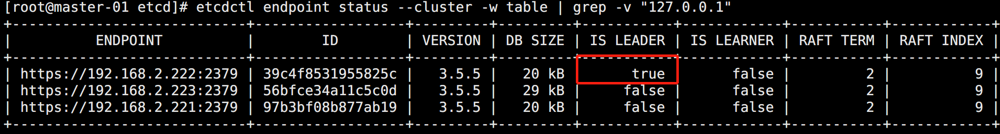

到此，ETCD 高可用集群部署完成！


## 部署 Kubernetes

Kubernetes 本身是 Go 语言开发，所以只需要直接下载安装包解压配置后就能直接使用。

可以去 Github CHANGELOG 中找到对应版本提供的二进制下载地址：

> https://github.com/kubernetes/kubernetes/blob/master/CHANGELOG/CHANGELOG-1.26.md#server-binaries-2

安装包主要分为两种，Server 和 Node。其中 Server 安装包包含了所有 Master 和 Worker 的核心组件，而 Node 只包含 Worker 节点所需组件。可以都部署 Server 包，只启动需要的服务即可。本文选择将其区分部署。


### 安装 Master

执行服务器：`所有 Master 和 ops`

```bash
# 创建安装包目录
mkdir /ezops/package/kubernetes
cd /ezops/package/kubernetes

# 下载安装包
wget https://dl.k8s.io/v1.26.0/kubernetes-server-linux-amd64.tar.gz

# 解压安装
tar -zxf kubernetes-server-linux-amd64.tar.gz
mv kubernetes /ezops/service/

# 删除无用文件
cd /ezops/service/kubernetes/
rm -rf kubernetes-src.tar.gz LICENSES/
cd server/bin/
rm -f *_tag *tar

# 创建相关目录
mkdir -p /ezops/service/kubernetes/server/{logs,conf}
mkdir -p /ezops/service/kubernetes/manifests

# 添加环境变量
cat >> /etc/profile << EOF
# Kubernetes
export KUBERNETES_HOME=/ezops/service/kubernetes
export PATH=\$KUBERNETES_HOME/server/bin:\$PATH
EOF

# 配置生效
source /etc/profile

# 查看安装结果
kubectl version

# 切换到证书目录
cd /ezops/cert/kubernetes/
```


### 安装 Worker

执行服务器：`所有 Worker`

```bash
# 创建安装包目录
mkdir /ezops/package/kubernetes
cd /ezops/package/kubernetes

# 下载安装包
wget https://dl.k8s.io/v1.26.2/kubernetes-node-linux-amd64.tar.gz

# 解压安装
tar -zxf kubernetes-node-linux-amd64.tar.gz
mv kubernetes /ezops/service/

# 删除无用文件
cd /ezops/service/kubernetes/
rm -rf kubernetes-src.tar.gz LICENSES/

# 创建相关目录
mkdir -p /ezops/service/kubernetes/node/{logs,conf}
mkdir -p /ezops/service/kubernetes/manifests

# 添加环境变量
cat >> /etc/profile << EOF
# Kubernetes
export KUBERNETES_HOME=/ezops/service/kubernetes
export PATH=\$KUBERNETES_HOME/node/bin:\$PATH
EOF

# 配置生效
source /etc/profile

# 查看安装结果
kubelet --version

# 切换到证书目录
cd /ezops/cert/kubernetes/
```


## 配置 API Server

API Server 是 Kubernetes 的核心组件，所有 Kubernetes 组件之间的通信都需要它，同时还负责和 ETCD 进行通信。


### 签发 API Server 证书

创建用于生成证书的 JSON 配置文件。

执行服务器：`ops`

```bash
cat > kube-apiserver-csr.json << EOF
{
    "CN": "kube-apiserver",
    "hosts": [
        "127.0.0.1",
        "192.168.2.100",
        "192.168.2.221",
        "192.168.2.222",
        "192.168.2.223",
        "192.168.2.224",
        "192.168.2.225",
        "10.10.0.1",
        "kubernetes",
        "kubernetes.default",
        "kubernetes.default.svc",
        "kubernetes.default.svc.cluster",
        "kubernetes.default.svc.cluster.local"
    ],
    "key": {
        "algo": "rsa",
        "size": 2048
    },
    "names": [{
        "C": "CN",
        "ST": "GD",
        "L": "SZ",
        "O": "kubernetes",
        "OU": "devops"
    }]
}
EOF
```

API Server 证书的 hosts 需要包含：

- Master 节点 IP，备用 IP，SLB IP，为了以后扩容可以不配置几个 IP。
- Service 网段的第一个 IP。
- Kubernetes 自带的一些解析地址。

生成证书：

```bash
cfssl gencert -ca=ca.pem -ca-key=ca-key.pem -config=ca-config.json -profile=kubernetes kube-apiserver-csr.json | cfssl-json -bare kube-apiserver
```

如图所示：

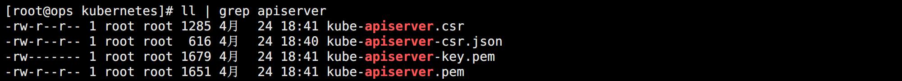


### 签发聚合证书

该证书用于控制第三方组件使用集群的时候的权限管理。

执行服务器：`ops`

```bash
cat > front-proxy-client-csr.json << EOF
{
    "CN": "front-proxy-client",
    "key": {
        "algo": "rsa",
        "size": 2048
    }
}
EOF
```

聚合证书的 CA 证书是之前生成的 font-proxy CA 证书。

生成证书：

```bash
cfssl gencert -ca=front-proxy-ca.pem -ca-key=front-proxy-ca-key.pem -config=ca-config.json -profile=kubernetes front-proxy-client-csr.json | cfssl-json -bare front-proxy-client
```

由于没有配置 hosts，会有告警提示，忽略即可：

> 2023/04/24 18:46:16 [WARNING] This certificate lacks a "hosts" field. This makes it unsuitable for
> websites. For more information see the Baseline Requirements for the Issuance and Management
> of Publicly-Trusted Certificates, v.1.1.6, from the CA/Browser Forum (https://cabforum.org);
> specifically, section 10.2.3 ("Information Requirements").

生成的证书如图所示：

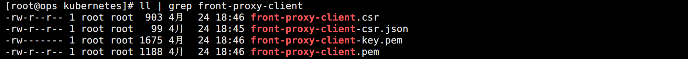


### 签发 admin 证书

该证书用于生成管理员权限的 kubeconfig，这里主要是给 Kubectl 使用。

执行服务器：`ops`

```bash
cat > admin-csr.json << EOF
{
    "CN": "admin",
    "hosts": [],
    "key": {
        "algo": "rsa",
        "size": 2048
    },
    "names": [{
        "C": "CN",
        "ST": "GD",
        "L": "SZ",
        "O": "system:masters",
        "OU": "devops"
    }]
}
EOF
```

API Server 使用 RBAC 对客户端授权时内部定义了一些 `RoleBindings`，如 `system:masters` 绑定 `cluster-admin`，该角色拥有 API Server的所有权限。该证书通过 O 指定了角色的 Group，也就有了 API Server 的管理员权限。

生成证书：

```bash
cfssl gencert -ca=ca.pem -ca-key=ca-key.pem -config=ca-config.json -profile=kubernetes admin-csr.json | cfssl-json -bare admin
```

由于该证书涉及到高可用集群的角色等配置，还需要生成 `kubeconfig` 文件：

```bash
# set-cluster：设置一个集群项，高可用集群使用 VIP 代理的 API Server 地址
kubectl config set-cluster kubernetes --certificate-authority=/ezops/cert/kubernetes/ca.pem --embed-certs=true --server=https://192.168.2.100:6443 --kubeconfig=/ezops/cert/kubernetes/admin.kubeconfig

# set-credentials 设置一个用户项
kubectl config set-credentials kubernetes-admin --client-certificate=/ezops/cert/kubernetes/admin.pem --client-key=/ezops/cert/kubernetes/admin-key.pem --embed-certs=true --kubeconfig=/ezops/cert/kubernetes/admin.kubeconfig

# 设置一个环境项，一个上下文
kubectl config set-context kubernetes-admin@kubernetes --cluster=kubernetes --user=kubernetes-admin --kubeconfig=/ezops/cert/kubernetes/admin.kubeconfig

# 使用某个环境当做默认环境
kubectl config use-context kubernetes-admin@kubernetes --kubeconfig=/ezops/cert/kubernetes/admin.kubeconfig
```

生成的证书如图所示：

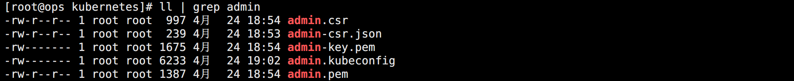


### 创建 SA

生成公钥和私有，用于 Kubelet 连接 API Server 的配置使用。

执行服务器：`ops`

```bash
openssl genrsa -out /ezops/cert/kubernetes/sa.key 2048
openssl rsa -in /ezops/cert/kubernetes/sa.key -pubout -out /ezops/cert/kubernetes/sa.pub
```

查看生成的文件：


### 分发 API Server 证书

将所有生成的证书分发到所有 Master 节点。

执行服务器：`ops`

```bash
scp * root@192.168.2.221:/ezops/cert/kubernetes/
scp * root@192.168.2.222:/ezops/cert/kubernetes/
scp * root@192.168.2.223:/ezops/cert/kubernetes/
```


### 启动 API Server

执行服务器：`所有 Master`

```bash
# 定义变量
IP=$(ip a | grep "192.168.2" | awk '{print $2}' | cut -d "/" -f 1)
KUBERNETES_BASE_PATH="/ezops/service/kubernetes"
KUBERNETES_CERT_PATH="/ezops/cert/kubernetes"

# 添加启动配置文件
cat > ${KUBERNETES_BASE_PATH}/server/conf/kube-apiserver.service << EOF
[Unit]
Description=Kubernetes API Server
Documentation=https://github.com/kubernetes/kubernetes
After=network.target

[Service]
ExecStart=${KUBERNETES_BASE_PATH}/server/bin/kube-apiserver \\
  --v=2 \\
  --allow-privileged=true \\
  --bind-address=0.0.0.0 \\
  --secure-port=6443 \\
  --advertise-address=${IP} \\
  --service-cluster-ip-range=10.10.0.0/16 \\
  --service-node-port-range=30000-50000 \\
  --etcd-servers=https://192.168.2.221:2379,https://192.168.2.222:2379,https://192.168.2.223:2379 \\
  --etcd-cafile=${KUBERNETES_CERT_PATH}/etcd-ca.pem \\
  --etcd-certfile=${KUBERNETES_CERT_PATH}/etcd.pem \\
  --etcd-keyfile=${KUBERNETES_CERT_PATH}/etcd-key.pem \\
  --client-ca-file=${KUBERNETES_CERT_PATH}/ca.pem \\
  --tls-cert-file=${KUBERNETES_CERT_PATH}/kube-apiserver.pem \\
  --tls-private-key-file=${KUBERNETES_CERT_PATH}/kube-apiserver-key.pem \\
  --kubelet-client-certificate=${KUBERNETES_CERT_PATH}/kube-apiserver.pem \\
  --kubelet-client-key=${KUBERNETES_CERT_PATH}/kube-apiserver-key.pem \\
  --service-account-key-file=${KUBERNETES_CERT_PATH}/sa.pub \\
  --service-account-signing-key-file=${KUBERNETES_CERT_PATH}/sa.key \\
  --service-account-issuer=https://kubernetes.default.svc.cluster.local \\
  --kubelet-preferred-address-types=InternalIP,ExternalIP,Hostname \\
  --enable-admission-plugins=NamespaceLifecycle,LimitRanger,ServiceAccount,DefaultStorageClass,DefaultTolerationSeconds,NodeRestriction,ResourceQuota \\
  --authorization-mode=Node,RBAC \\
  --enable-bootstrap-token-auth=true \\
  --feature-gates=LegacyServiceAccountTokenNoAutoGeneration=false \\
  --enable-aggregator-routing=true \\
  --requestheader-client-ca-file=${KUBERNETES_CERT_PATH}/front-proxy-ca.pem \\
  --proxy-client-cert-file=${KUBERNETES_CERT_PATH}/front-proxy-client.pem \\
  --proxy-client-key-file=${KUBERNETES_CERT_PATH}/front-proxy-client-key.pem \\
  --requestheader-allowed-names=aggregator \\
  --requestheader-group-headers=X-Remote-Group \\
  --requestheader-extra-headers-prefix=X-Remote-Extra- \\
  --requestheader-username-headers=X-Remote-User
Restart=on-failure
RestartSec=10s
LimitNOFILE=65535

[Install]
WantedBy=multi-user.target
EOF

# 创建软链接
ln -s ${KUBERNETES_BASE_PATH}/server/conf/kube-apiserver.service /etc/systemd/system/kube-apiserver.service

# 启动服务
systemctl daemon-reload
systemctl enable --now kube-apiserver
systemctl status kube-apiserver
```

到此，API Server 配置完成！


## 配置 Controller Manager

Controller Manager 的作用在于监控整个集群的状态，并确保集群处于预期的工作状态。


### 签发 Controller Manager 证书

创建用于生成证书的 JSON 配置文件。

执行服务器：`ops`

```bash
cat > kube-controller-manager-csr.json << EOF
{
    "CN": "system:kube-controller-manager",
    "hosts": [],
    "key": {
        "algo": "rsa",
        "size": 2048
    },
    "names": [{
        "C": "CN",
        "ST": "GD",
        "L": "SZ",
        "O": "system:kube-controller-manager",
        "OU": "devops"
    }]
}
EOF
```

生成证书：

```bash
cfssl gencert -ca=ca.pem -ca-key=ca-key.pem -config=ca-config.json -profile=kubernetes kube-controller-manager-csr.json | cfssl-json -bare kube-controller-manager
```

由于该证书涉及到高可用集群的角色等配置，还需要生成 `kubeconfig` 文件：

```bash
# set-cluster：设置一个集群项，高可用集群使用 VIP 代理的 API Server 地址
kubectl config set-cluster kubernetes --certificate-authority=/ezops/cert/kubernetes/ca.pem --embed-certs=true --server=https://192.168.2.100:6443 --kubeconfig=/ezops/cert/kubernetes/kube-controller-manager.kubeconfig

# set-credentials 设置一个用户项
kubectl config set-credentials system:kube-controller-manager --client-certificate=/ezops/cert/kubernetes/kube-controller-manager.pem --client-key=/ezops/cert/kubernetes/kube-controller-manager-key.pem --embed-certs=true --kubeconfig=/ezops/cert/kubernetes/kube-controller-manager.kubeconfig

# 设置一个环境项，一个上下文
kubectl config set-context system:kube-controller-manager@kubernetes --cluster=kubernetes --user=system:kube-controller-manager --kubeconfig=/ezops/cert/kubernetes/kube-controller-manager.kubeconfig

# 使用某个环境当做默认环境
kubectl config use-context system:kube-controller-manager@kubernetes --kubeconfig=/ezops/cert/kubernetes/kube-controller-manager.kubeconfig
```

生成证书如图所示：

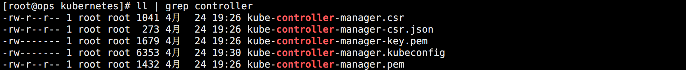


### 分发 Controller Manager 证书

将所有生成的 Controller Manager 证书分发到所有 Master 节点。

执行服务器：`ops`

```bash
scp kube-controller-manager* root@192.168.2.221:/ezops/cert/kubernetes/
scp kube-controller-manager* root@192.168.2.222:/ezops/cert/kubernetes/
scp kube-controller-manager* root@192.168.2.223:/ezops/cert/kubernetes/
```


### 启动 Controller Manager

执行服务器：`所有 Master`

```bash
# 定义变量
IP=$(ip a | grep "192.168.2" | awk '{print $2}' | cut -d "/" -f 1)
KUBERNETES_BASE_PATH="/ezops/service/kubernetes"
KUBERNETES_CERT_PATH="/ezops/cert/kubernetes"

# 添加启动配置文件
cat > ${KUBERNETES_BASE_PATH}/server/conf/kube-controller-manager.service << EOF
[Unit]
Description=Kubernetes Controller Manager
Documentation=https://github.com/kubernetes/kubernetes
After=network.target

[Service]
ExecStart=${KUBERNETES_BASE_PATH}/server/bin/kube-controller-manager \\
  --cluster-signing-duration=876000h0m0s \\
  --feature-gates=RotateKubeletServerCertificate=true \\
  --feature-gates=LegacyServiceAccountTokenNoAutoGeneration=false \\
  --bind-address=0.0.0.0 \\
  --root-ca-file=${KUBERNETES_CERT_PATH}/ca.pem \\
  --cluster-signing-cert-file=${KUBERNETES_CERT_PATH}/ca.pem \\
  --cluster-signing-key-file=${KUBERNETES_CERT_PATH}/ca-key.pem \\
  --service-account-private-key-file=${KUBERNETES_CERT_PATH}/sa.key \\
  --kubeconfig=${KUBERNETES_CERT_PATH}/kube-controller-manager.kubeconfig \\
  --leader-elect=true \\
  --use-service-account-credentials=true \\
  --node-monitor-grace-period=40s \\
  --node-monitor-period=5s \\
  --pod-eviction-timeout=2m0s \\
  --controllers=*,bootstrapsigner,tokencleaner \\
  --allocate-node-cidrs=true \\
  --cluster-cidr=172.16.0.0/16 \\
  --requestheader-client-ca-file=${KUBERNETES_CERT_PATH}/front-proxy-ca.pem \\
  --node-cidr-mask-size=24
Restart=always
RestartSec=10s

[Install]
WantedBy=multi-user.target
EOF

# 创建启动文件软连接
ln -s ${KUBERNETES_BASE_PATH}/server/conf/kube-controller-manager.service /etc/systemd/system/kube-controller-manager.service

# 启动服务
systemctl daemon-reload
systemctl enable --now kube-controller-manager
systemctl status kube-controller-manager
```

到此，Controller Manager 配置完成！


## 配置 Scheduler

Scheduler 主要用于完成集群中 Pod 的调度。


### 签发 Scheduler 证书

创建用于生成证书的 JSON 配置文件。

执行服务器：`ops`

```bash
cat > kube-scheduler-csr.json << EOF
{
    "CN": "system:kube-scheduler",
    "hosts": [],
    "key": {
        "algo": "rsa",
        "size": 2048
    },
    "names": [{
        "C": "CN",
        "ST": "GD",
        "L": "SZ",
        "O": "system:kube-scheduler",
        "OU": "ops"
    }]
}
EOF
```

生成证书：

```bash
cfssl gencert -ca=ca.pem -ca-key=ca-key.pem -config=ca-config.json -profile=kubernetes kube-scheduler-csr.json | cfssl-json -bare kube-scheduler
```

由于该证书涉及到高可用集群的角色等配置，还需要生成 `kubeconfig` 文件：

```bash
# set-cluster：设置一个集群项，高可用集群使用 VIP 代理的 API Server 地址
kubectl config set-cluster kubernetes --certificate-authority=/ezops/cert/kubernetes/ca.pem --embed-certs=true --server=https://192.168.2.100:6443 --kubeconfig=/ezops/cert/kubernetes/kube-scheduler.kubeconfig

# set-credentials 设置一个用户项
kubectl config set-credentials system:kube-scheduler --client-certificate=/ezops/cert/kubernetes/kube-scheduler.pem --client-key=/ezops/cert/kubernetes/kube-scheduler-key.pem --embed-certs=true  --kubeconfig=/ezops/cert/kubernetes/kube-scheduler.kubeconfig

# 设置一个环境项，一个上下文
kubectl config set-context system:kube-scheduler@kubernetes --cluster=kubernetes --user=system:kube-scheduler --kubeconfig=/ezops/cert/kubernetes/kube-scheduler.kubeconfig

# 使用某个环境当做默认环境
kubectl config use-context system:kube-scheduler@kubernetes --kubeconfig=/ezops/cert/kubernetes/kube-scheduler.kubeconfig
```

生成证书如图所示：

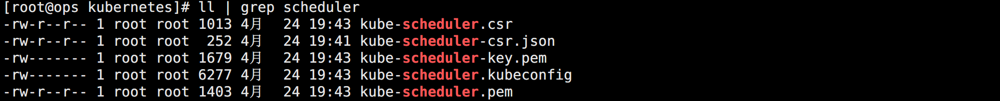


### 分发 Scheduler 证书

将所有生成的 Scheduler 证书分发到所有 Master 节点。

执行服务器：`ops`

```bash
scp kube-scheduler* root@192.168.2.221:/ezops/cert/kubernetes/
scp kube-scheduler* root@192.168.2.222:/ezops/cert/kubernetes/
scp kube-scheduler* root@192.168.2.223:/ezops/cert/kubernetes/
```


### 启动 Scheduler

执行服务器：`所有 Master`

```bash
# 定义变量
IP=$(ip a | grep "192.168.2" | awk '{print $2}' | cut -d "/" -f 1)
KUBERNETES_BASE_PATH="/ezops/service/kubernetes"
KUBERNETES_CERT_PATH="/ezops/cert/kubernetes"

# 添加启动配置文件
cat > ${KUBERNETES_BASE_PATH}/server/conf/kube-scheduler.service << EOF
[Unit]
Description=Kubernetes Scheduler
Documentation=https://github.com/kubernetes/kubernetes
After=network.target

[Service]
ExecStart=${KUBERNETES_BASE_PATH}/server/bin/kube-scheduler \\
  --leader-elect=true \\
  --authentication-kubeconfig=${KUBERNETES_CERT_PATH}/kube-scheduler.kubeconfig \\
  --authorization-kubeconfig=${KUBERNETES_CERT_PATH}/kube-scheduler.kubeconfig \\
  --kubeconfig=${KUBERNETES_CERT_PATH}/kube-scheduler.kubeconfig

Restart=always
RestartSec=10s

[Install]
WantedBy=multi-user.target
EOF

# 创建启动文件软连接
ln -s ${KUBERNETES_BASE_PATH}/server/conf/kube-scheduler.service /etc/systemd/system/kube-scheduler.service

# 启动服务
systemctl daemon-reload
systemctl enable --now kube-scheduler
systemctl status kube-scheduler
```

到此，Scheduler 配置完成！


## 配置 Kubectl

需要配置指定 Kubectl 所使用的证书地址，也就是之前创建的 `admin.kubeconfig` 文件。

执行服务器：`所有 Master`

```bash
# 配置 kubeconfig
cd /ezops/cert/kubernetes
mkdir ~/.kube
cp admin.kubeconfig ~/.kube/config

# 配置命令补全
kubectl completion bash > /usr/share/bash-completion/kubectl_completion
source /usr/share/bash-completion/kubectl_completion
echo "# Kubectl 命令补全" >> /etc/profile
echo "source /usr/share/bash-completion/kubectl_completion" >> /etc/profile

# 查看集群状态
kubectl get cs
```

如图所示：

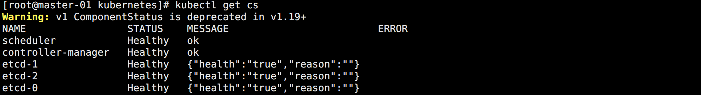


## 配置 TLS Bootstrapping

在一个 Kubernetes 集群中，Worker 节点上的组件（kubelet 和 kube-proxy）需要与 Kubernetes 控制平面（Master）组件通信，尤其是 kube-apiserver。 为了通信的安全性， 需要使用到节点上的客户端 TLS 证书。

但是客户端很多，又很难有通用的 TSL 证书直接使用，如果每一次加节点都需要重新生成证书，那维护将变得非常麻烦。

为了简化这一过程，从 1.4 版本开始，Kubernetes 引入了一个证书请求和签名 API。

> https://kubernetes.io/zh-cn/docs/reference/access-authn-authz/kubelet-tls-bootstrapping/

<br>

采用 TLS bootstrapping 生成证书的大致简化流程如下：

- 管理员通过 API Server 生成一个 bootstrap token 并将它写入到 kubeconfig 文件中。
- Kubelet 通过 --bootstrap-kubeconfig 启动参数指定 kubeconfig 文件，然后调用 API Server 的 API 接口，生成自己所需的服务器和客户端证书。
- 证书生成后，Kubelet 采用生成的证书和 API Server 进行通信，并删除本地的 kubeconfig 文件，避免 bootstrap token 泄漏。

想要启动该功能，只需要在 API Server 中启动参数中添加 `--enable-bootstrap-token-auth`，并创建一个 Kubelet 访问的 bootstrap token secret 即可。

> https://kubernetes.io/zh-cn/docs/reference/access-authn-authz/bootstrap-tokens/

<br>

在任意 Master 节点上生成需要的资源清单。

执行服务器：`master-01`

```bash
cat > /ezops/cert/kubernetes/bootstrap.secret.yaml <<EOF
apiVersion: v1
kind: Secret
metadata:
  name: bootstrap-token-c8ad9c
  namespace: kube-system
type: bootstrap.kubernetes.io/token
stringData:
  description: "The default bootstrap token generated by 'kubelet '."
  token-id: c8ad9c
  token-secret: 2e4d610cf3e7426e
  usage-bootstrap-authentication: "true"
  usage-bootstrap-signing: "true"
  auth-extra-groups:  system:bootstrappers:default-node-token,system:bootstrappers:worker,system:bootstrappers:ingress
---
apiVersion: rbac.authorization.k8s.io/v1
kind: ClusterRoleBinding
metadata:
  name: kubelet-bootstrap
roleRef:
  apiGroup: rbac.authorization.k8s.io
  kind: ClusterRole
  name: system:node-bootstrapper
subjects:
- apiGroup: rbac.authorization.k8s.io
  kind: Group
  name: system:bootstrappers:default-node-token
---
apiVersion: rbac.authorization.k8s.io/v1
kind: ClusterRoleBinding
metadata:
  name: node-autoapprove-bootstrap
roleRef:
  apiGroup: rbac.authorization.k8s.io
  kind: ClusterRole
  name: system:certificates.k8s.io:certificatesigningrequests:nodeclient
subjects:
- apiGroup: rbac.authorization.k8s.io
  kind: Group
  name: system:bootstrappers:default-node-token
---
apiVersion: rbac.authorization.k8s.io/v1
kind: ClusterRoleBinding
metadata:
  name: node-autoapprove-certificate-rotation
roleRef:
  apiGroup: rbac.authorization.k8s.io
  kind: ClusterRole
  name: system:certificates.k8s.io:certificatesigningrequests:selfnodeclient
subjects:
- apiGroup: rbac.authorization.k8s.io
  kind: Group
  name: system:nodes
---
apiVersion: rbac.authorization.k8s.io/v1
kind: ClusterRole
metadata:
  annotations:
    rbac.authorization.kubernetes.io/autoupdate: "true"
  labels:
    kubernetes.io/bootstrapping: rbac-defaults
  name: system:kube-apiserver-to-kubelet
rules:
  - apiGroups:
      - ""
    resources:
      - nodes/proxy
      - nodes/stats
      - nodes/log
      - nodes/spec
      - nodes/metrics
    verbs:
      - "*"
---
apiVersion: rbac.authorization.k8s.io/v1
kind: ClusterRoleBinding
metadata:
  name: system:kube-apiserver
  namespace: ""
roleRef:
  apiGroup: rbac.authorization.k8s.io
  kind: ClusterRole
  name: system:kube-apiserver-to-kubelet
subjects:
  - apiGroup: rbac.authorization.k8s.io
    kind: User
    name: kube-apiserver
EOF
```

创建资源：

```bash
kubectl create -f bootstrap.secret.yaml
```

<br>

生成 `kubelet-bootstrap.kubeconfig`。

执行服务器：`ops`

```bash
cd /ezops/cert/kubernetes

# 生成 kubeconfig
kubectl config set-cluster kubernetes --certificate-authority=/ezops/cert/kubernetes/ca.pem --embed-certs=true --server=https://192.168.2.100:6443 --kubeconfig=/ezops/cert/kubernetes/kubelet-bootstrap.kubeconfig

# 注意，这里 Token 会用到资源清单中配置的
kubectl config set-credentials tls-bootstrap-token-user --token=c8ad9c.2e4d610cf3e7426e --kubeconfig=/ezops/cert/kubernetes/kubelet-bootstrap.kubeconfig

kubectl config set-context tls-bootstrap-token-user@kubernetes --cluster=kubernetes --user=tls-bootstrap-token-user --kubeconfig=/ezops/cert/kubernetes/kubelet-bootstrap.kubeconfig

kubectl config use-context tls-bootstrap-token-user@kubernetes --kubeconfig=/ezops/cert/kubernetes/kubelet-bootstrap.kubeconfig
```


## 配置 Kubelet

Kubelet 通过和 API Server 进行通信，负责工作节点上容器和镜像的所有管理工作。


### 添加 Kubelet 主配置

执行服务器：`ops`

```bash
cat > kubelet.yaml << EOF
apiVersion: kubelet.config.k8s.io/v1beta1
kind: KubeletConfiguration
address: 0.0.0.0
port: 10250
readOnlyPort: 10255
authentication:
  anonymous:
    enabled: false
  webhook:
    cacheTTL: 2m0s
    enabled: true
  x509:
    clientCAFile: /ezops/cert/kubernetes/ca.pem
authorization:
  mode: Webhook
  webhook:
    cacheAuthorizedTTL: 5m0s
    cacheUnauthorizedTTL: 30s
cgroupDriver: systemd
cgroupsPerQOS: true
# CoreDNS 使用 Service 网段的 IP，后面会单独配置
clusterDNS:
- 10.10.10.10
clusterDomain: cluster.local
containerLogMaxFiles: 5
containerLogMaxSize: 10Mi
contentType: application/vnd.kubernetes.protobuf
cpuCFSQuota: true
cpuManagerPolicy: none
cpuManagerReconcilePeriod: 10s
enableControllerAttachDetach: true
enableDebuggingHandlers: true
enforceNodeAllocatable:
- pods
eventBurst: 10
eventRecordQPS: 5
evictionHard:
  imagefs.available: 15%
  memory.available: 100Mi
  nodefs.available: 10%
  nodefs.inodesFree: 5%
evictionPressureTransitionPeriod: 5m0s
failSwapOn: true
fileCheckFrequency: 20s
hairpinMode: promiscuous-bridge
healthzBindAddress: 127.0.0.1
healthzPort: 10248
httpCheckFrequency: 20s
imageGCHighThresholdPercent: 85
imageGCLowThresholdPercent: 80
imageMinimumGCAge: 2m0s
iptablesDropBit: 15
iptablesMasqueradeBit: 14
kubeAPIBurst: 10
kubeAPIQPS: 5
makeIPTablesUtilChains: true
maxOpenFiles: 1000000
maxPods: 110
nodeStatusUpdateFrequency: 10s
oomScoreAdj: -999
podPidsLimit: -1
registryBurst: 10
registryPullQPS: 5
resolvConf: /etc/resolv.conf
rotateCertificates: true
runtimeRequestTimeout: 2m0s
serializeImagePulls: true
staticPodPath: /ezops/service/kubernetes/manifests
streamingConnectionIdleTimeout: 4h0m0s
syncFrequency: 1m0s
volumeStatsAggPeriod: 1m0s
EOF
```


### 添加 Kubelet 启动

执行服务器：`ops`

```bash
cat > kubelet.service << EOF
[Unit]
Description=Kubernetes Kubelet
Documentation=https://github.com/kubernetes/kubernetes

[Service]
ExecStart=/ezops/service/kubernetes/ROLE_NAME/bin/kubelet \\
    --cert-dir=/ezops/cert/kubernetes \\
    --bootstrap-kubeconfig=/ezops/cert/kubernetes/kubelet-bootstrap.kubeconfig \\
    --kubeconfig=/ezops/cert/kubernetes/kubelet.kubeconfig \\
    --config=/ezops/service/kubernetes/ROLE_NAME/conf/kubelet.yaml \\
    --feature-gates=RotateKubeletServerCertificate=true \\
    --rotate-certificates \\
    --node-labels=node.kubernetes.io/node='' \\
    --container-runtime=remote \\
    --runtime-request-timeout=15m \\
    --container-runtime-endpoint=unix:///run/containerd/containerd.sock
Restart=always
StartLimitInterval=0
RestartSec=10

[Install]
WantedBy=multi-user.target
EOF
```

注意，因为本环境 Master 节点也要运行 Worker 节点的工作，所以也需要配置 Kubelet 和 Kube-proxy。但是 Server 包和 Node 包的目录结构不同，所以配置文件中加了个 `ROLE_NAME` 占位符，实际使用的时候要替换掉。


### 分发 Kubelet 配置

执行服务器：`ops`

```bash
# Master
scp kubelet* ca.pem front-proxy-ca.pem root@192.168.2.221:/ezops/cert/kubernetes/
scp kubelet* ca.pem front-proxy-ca.pem root@192.168.2.222:/ezops/cert/kubernetes/
scp kubelet* ca.pem front-proxy-ca.pem root@192.168.2.223:/ezops/cert/kubernetes/

# Worker
scp kubelet* ca.pem front-proxy-ca.pem root@192.168.2.231:/ezops/cert/kubernetes/
scp kubelet* ca.pem front-proxy-ca.pem root@192.168.2.232:/ezops/cert/kubernetes/
scp kubelet* ca.pem front-proxy-ca.pem root@192.168.2.233:/ezops/cert/kubernetes/
```


### 调整 Kubelet 目录

Master 节点的目录结构调整。

执行服务器：`所有 Master`

```bash
# 修改配置
cd /ezops/cert/kubernetes
sed -i "s#ROLE_NAME#server#g" kubelet.service
mv kubelet.service kubelet.yaml /ezops/service/kubernetes/server/conf/
ln -s /ezops/service/kubernetes/server/conf/kubelet.service /etc/systemd/system/kubelet.service
```

<br>

Worker 节点的目录结构调整。

执行服务器：`所有 Worker`

```bash
# 修改配置
cd /ezops/cert/kubernetes
sed -i "s#ROLE_NAME#node#g" kubelet.service
mv kubelet.service kubelet.yaml /ezops/service/kubernetes/node/conf/
ln -s /ezops/service/kubernetes/node/conf/kubelet.service /etc/systemd/system/kubelet.service
```


### 启动 Kubelet

执行服务器：`所有 Master 和 Worker`

```bash
systemctl daemon-reload
systemctl enable --now kubelet
systemctl status kubelet
```

此时会自动从 Master 中生成 kubelet.kubeconfig 等证书，如图所示：

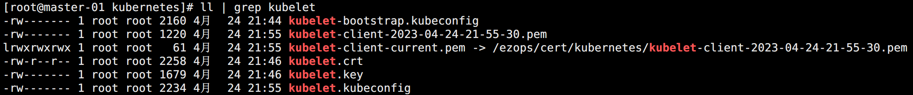

<br>

查看集群节点信息。

执行服务器：`master-01`

```bash
kubectl get nodes
```

如图所示：

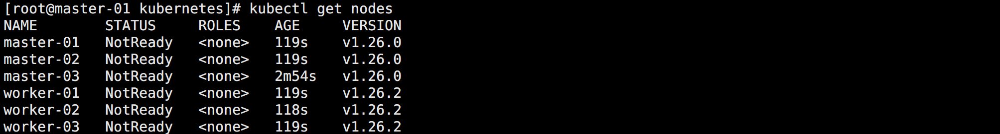

<br>

由于本文配置了自动允许加入集群，如果没配置还需要手动确认节点加入集群：

```bash
# 查看申请
kubectl get csr

# 同意申请
kubectl certificate approve 申请名称
```


