## Kubeadm

kubeadm 是 Kubernetes 社区提供的集群构建工具，它能够以最佳实践的方式部署一个最小化的可用 Kubernetes 集群。

但是 kubeadm 在设计上并未安装网络解决方案，所以需要用户自行安装第三方符合 `CNI` 的网络解决方案，如 flanal，calico，canal 等。

常见的 Kubernetes 集群的运行模式有三种：

1. 独立组件模式：各组件直接以守护进程方式运行，如二进制部署。
2. 静态 Pod 模式：各组件以静态 Pod 运行在 Master 节点，kubelet 和容器运行时以守护进程运行所有节点，kube-proxy 以 DaemonSet 形式托管在集群。
3. 自托管（self-hosted）模式：和第二种类似，但各组件都运行为 Pod 对象（非静态），且这些 Pod 对象都以 DaemonSet 形式托管在集群。

kubeadm 能够部署第二种和第三种运行方式。一般用于测试环境部署使用，生产环境更推荐二进制安装，更容易排查问题。

如果是云服务器，那么更建议使用云托管的 Kubernetes 集群。

在执行安装之前，请确保你的所有服务器已经完成了集群安装初始化操作。


## 安装 Kubeadm（YUM）

执行服务器：`所有 master 和 worker 节点`

```bash
cat > /etc/yum.repos.d/kubernetes.repo << EOF
[kubernetes]
name=Kubernetes
baseurl=http://mirrors.aliyun.com/kubernetes/yum/repos/kubernetes-el7-x86_64
enabled=1
gpgcheck=0
repo_gpgcheck=0
gpgkey=http://mirrors.aliyun.com/kubernetes/yum/doc/yum-key.gpg http://mirrors.aliyun.com/kubernetes/yum/doc/rpm-package-key.gpg
EOF
```

此时查看支持的 kubeadm 版本：

```bash
yum list kubeadm.x86_64 --showduplicates
```

在写本文的时候最新版本支持到了 `1.27.1`，一般安装大版本  `1.27.0` 就行。

所有节点安装 kubeadm：

```bash
yum -y install kubeadm-1.27.0-0 kubelet-1.27.0-0 kubectl-1.27.0-0
```

但是可能会因为网络问题，下载可能会很慢，可以使用第二种方式。


## 安装 Kubeadm（RPM）

可以直接去阿里云仓库里面下载：

> http://mirrors.aliyun.com/kubernetes/yum/repos/kubernetes-el7-x86_64/Packages

也可以通过下面的链接进行下载，本文选择安装 Kubeadm `1.26.0` 版本：

| 包名                   | 版本     | 下载地址                                                     |
| ---------------------- | -------- | ------------------------------------------------------------ |
| kubeadm                | 1.26.0-0 | [点击下载](http://mirrors.aliyun.com/kubernetes/yum/repos/kubernetes-el7-x86_64/Packages/da58cbf31a0337a968e5a06cfcc00eee420cc2df8930ea817ed2a4227bd81d48-kubeadm-1.26.0-0.x86_64.rpm) |
| kubectl                | 1.26.0-0 | [点击下载](http://mirrors.aliyun.com/kubernetes/yum/repos/kubernetes-el7-x86_64/Packages/23e112935127da08ffd1c32c392cbf62346305ee97ba6c5d070cda422945e4ff-kubectl-1.26.0-0.x86_64.rpm) |
| kubelet                | 1.26.0-0 | [点击下载](http://mirrors.aliyun.com/kubernetes/yum/repos/kubernetes-el7-x86_64/Packages/9be8590c2de60e249f40726e979a3a7a046320079bc41d330834de74f5399383-kubelet-1.26.0-0.x86_64.rpm) |
| cri-tools（依赖）      | 1.26.0-0 | [点击下载](http://mirrors.aliyun.com/kubernetes/yum/repos/kubernetes-el7-x86_64/Packages/3f5ba2b53701ac9102ea7c7ab2ca6616a8cd5966591a77577585fde1c434ef74-cri-tools-1.26.0-0.x86_64.rpm) |
| kubernetes-cni（依赖） | 1.2.0-0  | [点击下载](http://mirrors.aliyun.com/kubernetes/yum/repos/kubernetes-el7-x86_64/Packages/0f2a2afd740d476ad77c508847bad1f559afc2425816c1f2ce4432a62dfe0b9d-kubernetes-cni-1.2.0-0.x86_64.rpm) |

<br>

执行服务器：`所有 master 和 worker 节点`

```bash
# 创建 rpm 包存放目录
mkdir /ezops/package/kubeadm
cd /ezops/package/kubeadm/

# 下载安装包
wget http://mirrors.aliyun.com/kubernetes/yum/repos/kubernetes-el7-x86_64/Packages/da58cbf31a0337a968e5a06cfcc00eee420cc2df8930ea817ed2a4227bd81d48-kubeadm-1.26.0-0.x86_64.rpm -O kubeadm-1.26.0-0.x86_64.rpm
wget http://mirrors.aliyun.com/kubernetes/yum/repos/kubernetes-el7-x86_64/Packages/23e112935127da08ffd1c32c392cbf62346305ee97ba6c5d070cda422945e4ff-kubectl-1.26.0-0.x86_64.rpm -O kubectl-1.26.0-0.x86_64.rpm
wget http://mirrors.aliyun.com/kubernetes/yum/repos/kubernetes-el7-x86_64/Packages/9be8590c2de60e249f40726e979a3a7a046320079bc41d330834de74f5399383-kubelet-1.26.0-0.x86_64.rpm -O kubelet-1.26.0-0.x86_64.rpm
wget http://mirrors.aliyun.com/kubernetes/yum/repos/kubernetes-el7-x86_64/Packages/3f5ba2b53701ac9102ea7c7ab2ca6616a8cd5966591a77577585fde1c434ef74-cri-tools-1.26.0-0.x86_64.rpm -O cri-tools-1.26.0-0.x86_64.rpm
wget http://mirrors.aliyun.com/kubernetes/yum/repos/kubernetes-el7-x86_64/Packages/0f2a2afd740d476ad77c508847bad1f559afc2425816c1f2ce4432a62dfe0b9d-kubernetes-cni-1.2.0-0.x86_64.rpm -O kubernetes-cni-1.2.0-0.x86_64.rpm

# 本地安装
yum -y localinstall kube* cri*
```


## 配置 Kubelet

执行服务器：`所有 master 和 worker 节点`

```bash
cat >/etc/sysconfig/kubelet<<EOF
KUBELET_KUBEADM_ARGS="--container-runtime=remote --runtime-request-timeout=15m --container-runtime-endpoint=unix:///run/containerd/containerd.sock"
EOF
```

启动 Kubelet：

```bash
systemctl enable --now kubelet
systemctl status kubelet
```

由于集群还未初始化，所以默认是起不来的，不用管。


## 集群初始化

### 创建配置目录

执行服务器：`所有 master`

```bash
# 创建配置存放目录
mkdir /ezops/service/kubeadm
cd /ezops/service/kubeadm/
```


### 创建配置文件

集群初始化只需要在任意 master 节点上执行即可。

执行服务器：`master-01`

```bash
# 创建初始化配置文件
cat > kubeadm-config-old.yaml << EOF
apiVersion: kubeadm.k8s.io/v1beta2
bootstrapTokens:
- groups:
  - system:bootstrappers:kubeadm:default-node-token
  # 加入集群的 Token
  token: 7t2weq.bjbawausm0jaxury
  # 加入集群的 Token 有效期
  ttl: 24h0m0s
  usages:
  - signing
  - authentication
kind: InitConfiguration
localAPIEndpoint:
  # 本机地址，这里只支持 IP
  advertiseAddress: 192.168.2.221
  # API Server 监听端口
  bindPort: 6443
nodeRegistration:
  # Containerd socket 文件地址
  criSocket: unix:///var/run/containerd/containerd.sock
  # 本机名称，需要能够解析通信
  name: master-01
  taints:
  - effect: NoSchedule
    key: node-role.kubernetes.io/control-plane
---
apiServer:
  certSANs:
  # VIP 地址，如果只有一个节点就写 IP 地址即可
  - 192.168.2.100
  timeoutForControlPlane: 4m0s
apiVersion: kubeadm.k8s.io/v1beta2
# 证书存放目录
certificatesDir: /etc/kubernetes/pki
# 集群名称
clusterName: kubernetes
# 配置高可用集群，使用可 Nginx SLB 代理了 API Server 端口
controlPlaneEndpoint: 192.168.2.100:6443
controllerManager: {}
dns:
  type: CoreDNS
etcd:
  local:
    dataDir: /var/lib/etcd
# 指定国内的镜像仓库
imageRepository: registry.cn-hangzhou.aliyuncs.com/google_containers
kind: ClusterConfiguration
# 该版本需要和 kubeadm 一致
kubernetesVersion: v1.26.0
networking:
  dnsDomain: cluster.local
  # Pod 网段（可用IP个数 65534，172.16.0.1 - 172.16.255.254）
  podSubnet: 172.16.0.0/16
  # Service 网段，注意不能和自己的网络冲突（可用IP个数 65534，10.10.0.1 - 10.10.255.254）
  serviceSubnet: 10.10.0.0/16
scheduler: {}
EOF
```

需要注意的是，上面的配置需要根据自己的实际情况进行调整。

如果 Pod 网段和 Service 网段不知道怎么划分，可以参考以下网站：

> http://tools.jb51.net/aideddesign/ip_net_calc/

生成当前版本配置：

```bash
kubeadm config migrate --old-config kubeadm-config-old.yaml --new-config kubeadm-config-new.yaml
```

通过 scp 将该配置文件分发到其它 master 节点：

```bash
scp kubeadm-config-new.yaml root@192.168.2.222:/ezops/service/kubeadm
scp kubeadm-config-new.yaml root@192.168.2.223:/ezops/service/kubeadm
```

注意，如果服务器之间没有做免密登录，需要逐条执行。


### 预先拉取镜像

为了方便后续的部署，可以事先将所需要的镜像手动拉取下来。

执行服务器：`所有 master`

```bash
kubeadm config images pull --config /ezops/service/kubeadm/kubeadm-config-new.yaml
```

该命令会拉取以下镜像：

* registry.cn-hangzhou.aliyuncs.com/google_containers/kube-apiserver:v1.26.0
* registry.cn-hangzhou.aliyuncs.com/google_containers/kube-controller-manager:v1.26.0
* registry.cn-hangzhou.aliyuncs.com/google_containers/kube-scheduler:v1.26.0
* registry.cn-hangzhou.aliyuncs.com/google_containers/kube-proxy:v1.26.0
* registry.cn-hangzhou.aliyuncs.com/google_containers/pause:3.9
* registry.cn-hangzhou.aliyuncs.com/google_containers/etcd:3.5.6-0
* registry.cn-hangzhou.aliyuncs.com/google_containers/coredns:v1.9.3

拉取完成后可以查看拉取好的镜像，注意 containerd 中拉取的镜像是有命名空间的：

```bash
nerdctl -n k8s.io image ls
```


### 执行初始化

执行服务器：`master-01`

```bash
kubeadm init --config /ezops/service/kubeadm/kubeadm-config-new.yaml --upload-certs
```

初始化完成后会有如下提示：

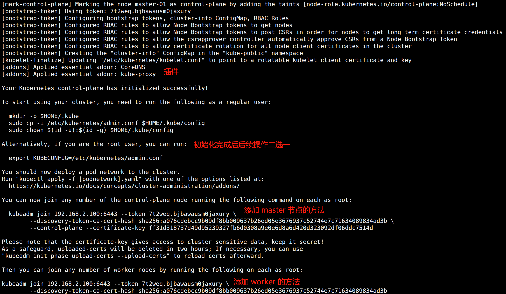

此时会涉及到几个重要的目录：

- Kubelet 配置文件目录：/var/lib/kubelet
- Kubernetes 配置文件目录：/etc/kubernetes
- Kubernetes master 组件配置文件目录：/etc/kubernetes/manifests
- Kubernetes 证书目录：/etc/kubernetes/pki


### 失败处理办法

如果初始化失败，可以通过本机的 `/var/log/messages` 排错。

比如出现错误：

> failed to get sandbox image "registry.k8s.io/pause:3.9":

这可能是在安装配置 Containerd 的时候没有修改它默认配置里面的 pause 镜像地址，导致一致访问 k8s.io 这个国内无法访问的域名导致。

找到错误之后可以执行下面命令进行清理初始化内容，清理完成后修复错误重新初始化：

```bash
kubeadm reset -f
ipvsadm --clear
rm -rf ~/.kube
```


### 执行后续配置

执行服务器：`master-01`

```bash
# 配置配置文件变量，Kubernetes 会通过该变量找对应的文件 
cat >> /etc/profile << EOF
# Kubeadm 配置
export KUBECONFIG=/etc/kubernetes/admin.conf
EOF

# 生效配置
source /etc/profile
```

查看集群节点和 Pod 信息：

```bash
kubectl get nodes
kubectl get pods -A
```

如图所示：

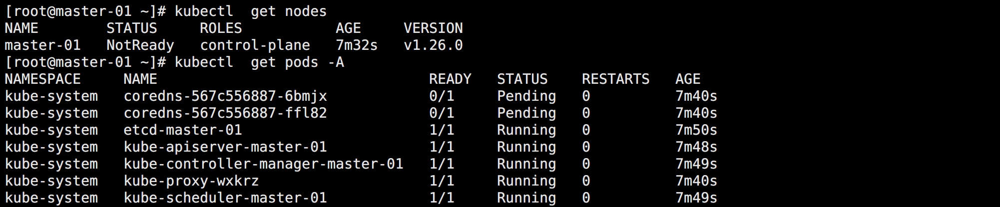

此时节点的 NotReady 和 CoreDNS 的 Pending 状态都属于正常现象，因为缺少网络插件，后面装上就好了。


## 加入 Master 节点

执行服务器：`master-02 和 master-03`

```bash
kubeadm join 192.168.2.100:6443 --token 7t2weq.bjbawausm0jaxury \
	--discovery-token-ca-cert-hash sha256:a076cdebcc9b09df8bb009637b26ed05e3676937c52744e7c71634089834ad3b \
	--control-plane --certificate-key ff31d318737d49d95239327fb6d0308a9e0e6d8a6d420d323092df06ddc7514d
```

执行初始化时候生成的加入 Master 节点的命令。

完成后执行后续操作：

```bash
# 配置配置文件变量，Kubernetes 会通过该变量找对应的文件 
cat >> /etc/profile << EOF
# Kubeadm 配置
export KUBECONFIG=/etc/kubernetes/admin.conf
EOF

# 生效配置
source /etc/profile
```

完成后如图所示：

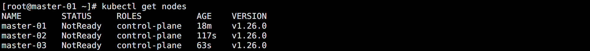

此时 nginx 配置的 stream status 状态页所有 API Server 都正常了。


## 加入 Worker 节点

执行服务器：`所有 Worker 节点`

```bash
kubeadm join 192.168.2.100:6443 --token 7t2weq.bjbawausm0jaxury \
	--discovery-token-ca-cert-hash sha256:a076cdebcc9b09df8bb009637b26ed05e3676937c52744e7c71634089834ad3b
```

可以看到当前的节点和 Pod 状态：

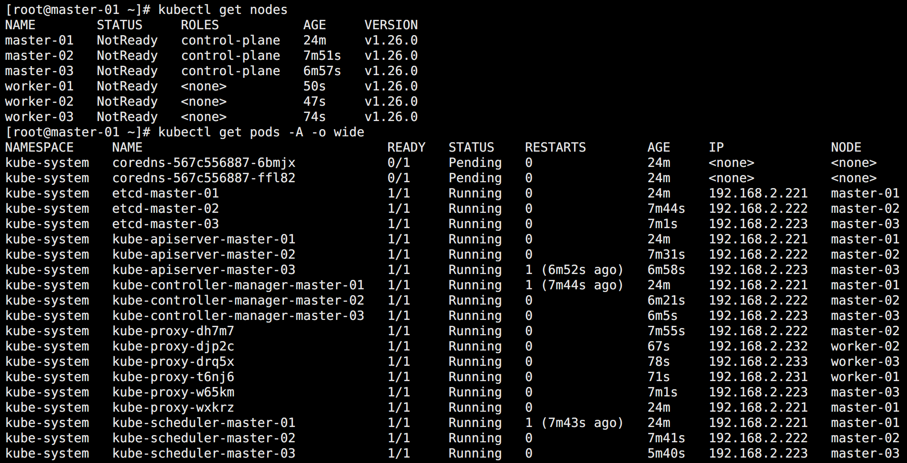

在 Worker 节点加入集群成功后，本地的 Kubelet 也会被拉起。


## 网络插件 Calico

`Calico` 是一个纯三层的数据中心网络方案，可以直接利用数据中心的网络结构（无论是 L2 或者 L3），不需要额外的 NAT，隧道或者 Overlay Network。与 OpenStack、Kubernetes、AWS、GCE 等 IaaS 和容器平台都有良好的集成。

Calico 通过在每一个计算节点利用 Linux Kernel 实现了一个高效的 vRouter 来负责数据转发，每个 vRouter 再通过 BGP 协议负责把自己上运行的 workload 的路由信息向整个 Calico 网络内传播。

小规模部署可以直接互联，大规模下可通过指定的 BGP route reflector 来完成。最终保证了所有 workload 之间的流量都是通过 IP 路由方式完成。

此外，Calico 基于 iptables 提供了丰富而灵活的网络 Policy，为 Workload 提供了多租户隔离、安全组以及其他可达性限制等功能。

> https://projectcalico.docs.tigera.io/about/about-calico

本文编写的时 Calico 最新版本为 `3.25`，通过官方文档可以看到其对 Kubernetes 版本的支持情况，如果版本不对可能会出现问题：

> https://projectcalico.docs.tigera.io/getting-started/kubernetes/requirements

官方文档有这样的说明：

> 由于 Kubernetes API 的变化，Calico v3.25 将无法在 Kubernetes v1.15 或更低版本上运行。v1.16-v1.18 可能有效，但不再进行测试。较新的版本也可能有效，但我们建议升级到针对较新的 Kubernetes 版本测试过的 Calico 版本。

Calico 的安装只需要在任意 Master 节点执行即可，这里选择在 master-01 上面执行。

<br>

执行服务器：`master-01`

```bash
cd /ezops/service/kubeadm/
wget https://projectcalico.docs.tigera.io/archive/v3.25/manifests/calico.yaml
kubectl apply -f calico.yaml
```

由于网络问题，拉取镜像的过程可能会比较耗时。完成后如图所示：

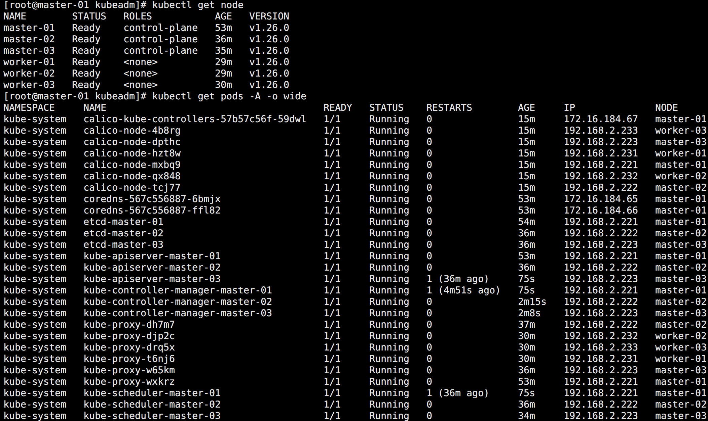


## 开启自动生成 Token

从 v1.24.0 开始，ServiceAccount 不再自动生成 Secret。如果你还想要自动生成 Secret，那么可以给 kube-controller-manager 配置特性 `LegacyServiceAccountTokenNoAutoGeneration=false`。

参考文档：

> https://kubernetes.feisky.xyz/concepts/objects/serviceaccount

执行服务器：`所有 Master 节点`

```bash
sed -i "13a \    - --feature-gates=LegacyServiceAccountTokenNoAutoGeneration=false" /etc/kubernetes/manifests/kube-controller-manager.yaml
```

修改完成后 K8S 集群会自动滚动更新 kube-controller-manager，不需要重启。


## 修改 Kube Proxy 模式

通过命令查看 kube-proxy 的模式：

```bash
curl 127.0.0.1:10249/proxyMode
```

可以看到其模式为 `iptables`，需要将其改为 `ipvs`。

执行服务器：`master-01`

```bash
kubectl edit cm kube-proxy -n kube-system
```

找到 mode 配置，修改：

```bash
mode: ipvs
```

更新配置：

```bash
kubectl patch daemonset kube-proxy -p "{\"spec\":{\"template\":{\"metadata\":{\"annotations\":{\"date\":\"`date +'%s'`\"}}}}}" -n kube-system
```

再度通过 curl 查看发现已经是 ipvs 了。

到此 kubeadm 安装的 Kubernetes 集群，包括简单的初始化调优配置已经完成。


## 证书有效期问题

通过 kubeadm 安装的 Kubernetes 集群的证书有效期为 1 年，可以使用相关命令查看证书的有效期：

```bash
kubeadm certs check-expiration
```

如图所示：

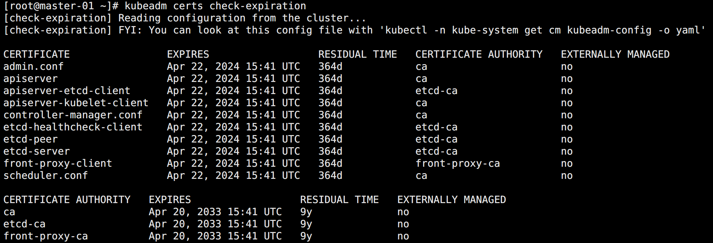

到除了 ca 证书，其他证书的有效期都是一年。如果证书到期，则整个集群都会挂掉。

解决这个问题的办法一般有两种：

1. 如果还没有安装集群，可以通过修改源码设置证书有效期。
2. 如果集群已经运行，可以通过重新签发有效期更长的证书。


## 更新证书（直接）

为了更新的安全性，更新之前可以将所有 Master 节点的配置目录做一个备份：

```bash
cp -r /etc/kubernetes /etc/kubernetes_$(date +%F)
cp -r /var/lib/etcd /var/lib/etcd_$(date +%F)
```

通过执行证书更新命令查看：

```bash
kubeadm certs renew --help
```

可以看到证书更新是支持更新所有证书，也可以是更新单个服务的证书。

```bash
# 所有 Master 节点更新所有证书
kubeadm certs renew all
systemctl restart kubelet
```

如图所示：

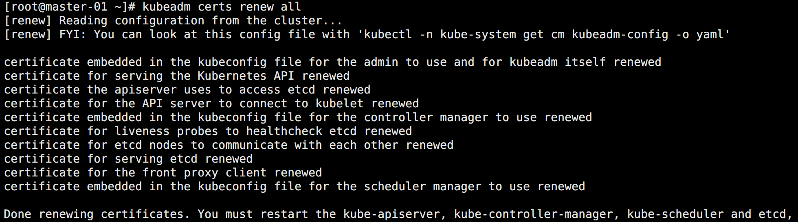

如图所示，系统系统更新证书以后还需要重启对应服务才能生效：

```bash
# 重启组件
for i in $(kubectl get pods -A | grep -E "etcd|kube-apiserver|kube-controller-manager|kube-scheduler" | awk '{print $2}');do
    kubectl delete pod $i -n kube-system
    sleep 3
done
```

特别注意：

> 由于在初始化 Master 集群的时候采用的是设置环境变量 `export KUBECONFIG=/etc/kubernetes/admin.conf` 的方法，不需要再更新该文件。如果不是该方法，还需要使用新的 admin.conf 替换掉复制的 `/root/.kube/config` 配置文件。


## 更新证书（源码）

在安装的集群的时候，建议用户直接通过修改源码对 kubeadm 证书有效期设置先进行修改，然后再初始化集群。


### 修改源码配置

执行服务器：`ops`

```bash
# 下载 Kubernetes 源码指定版本
mkdir /ezops/package/kubernetes
cd /ezops/package/kubernetes
wget https://github.com/kubernetes/kubernetes/archive/refs/tags/v1.26.0.zip

# 解压
unzip v1.26.0.zip && rm -f v1.26.0.zip
cd kubernetes-1.26.0/
```

<br>

需要修改的文件一共有两个：

* `staging/src/k8s.io/client-go/util/cert/cert.go`

搜索关键字 `NewSelfSignedCACert` 找到方法，里面有定义 `now.Add(duration365d * 10).UTC(),` 10 年，改成 100 年：

```bash
NotAfter:              now.Add(duration365d * 100).UTC(),
```

* `cmd/kubeadm/app/constants/constants.go`

搜索关键字 `CertificateValidity`，可以找到定义的常量 `CertificateValidity = time.Hour * 24 * 365`，改为 100 年。

```bash
CertificateValidity = time.Hour * 24 * 365 * 100
```


### 安装打包环境

执行服务器：`ops`

```bash
# 查看所需要的 go 版本
cat build/build-image/cross/VERSION

# 下载 go，选择相近的小版本也可以
mkdir /ezops/package/go
cd /ezops/package/go
wget https://golang.google.cn/dl/go1.20.1.linux-amd64.tar.gz
tar -zxf go1.20.1.linux-amd64.tar.gz
mv go /ezops/env/
mkdir /ezops/env/gopath

# 配置环境变量
cat >> /etc/profile << EOF
# go 配置
export GOROOT=/ezops/env/go
export GOPATH=/ezops/env/gopath
export PATH=\$PATH:\$GOROOT/bin
EOF

#生效
source /etc/profile

# 查看安装结果
go version
```


### 编译打包

执行服务器：`ops`

```bash
# 指定只编译 Kubeadm
cd /ezops/package/kubernetes/kubernetes-1.26.0/
make all WHAT=cmd/kubeadm GOFLAGS=-v
```

编译完成后会在 `_output/local/bin/linux/amd64/kubeadm` 目录下生成 kubeadm 的二进制文件。


### 更新 Kubeadm

执行服务器：`所有 Master 节点`

```bash
# 备份 kubeadm
mv /usr/bin/kubeadm /usr/bin/kubeadm_$(date +%F)
```

<br>

 执行服务器：`ops`

```bash
# 发送 kubeadm 文件
cd _output/local/bin/linux/amd64/
scp kubeadm root@192.168.2.221:/usr/bin/
scp kubeadm root@192.168.2.222:/usr/bin/
scp kubeadm root@192.168.2.223:/usr/bin/
```


### 更新证书

执行服务器：`所有 Master`

```bash
# 证书更新
kubeadm certs renew all

# 重启 Kubelet
systemctl restart kubelet
```

<br>

重启组件，执行服务器：`master-01`

```bash
# 重启组件
for i in $(kubectl get pods -A | grep -E "etcd|kube-apiserver|kube-controller-manager|kube-scheduler" | awk '{print $2}');do
    kubectl delete pod $i -n kube-system
    sleep 3
done
```

<br>

查看证书有效期：

```bash
kubeadm certs check-expiration
```

如图所示：

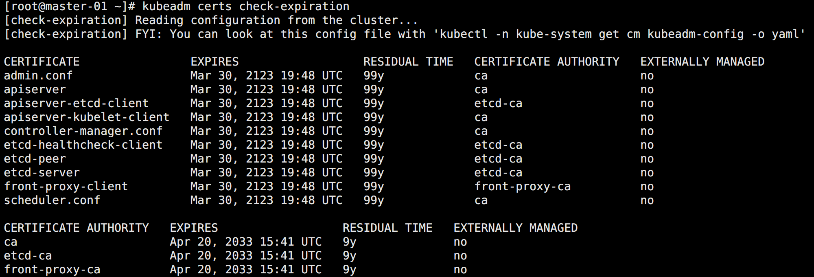

可以看到，除了 ca 证书，其它的都变成了 100 年，如果想让 CA 证书也变成一百年，则需要重新初始化集群。


## 删除节点

有些时候某些机器出现问题可能需要将其下掉，或者在初始化节点的时候信息初始化的有问题需要重新加入，这时候就涉及到删除节点的问题。具体删除办法如下，Master 节点和 Worker 节点都一样。

执行服务器：`master-01`

```bash
# 先将节点标记为不可调度的维护模式
kubectl drain master-03 --delete-local-data --ignore-daemonsets --force
kubectl drain worker-03 --delete-local-data --ignore-daemonsets --force
```

查看标记效果：

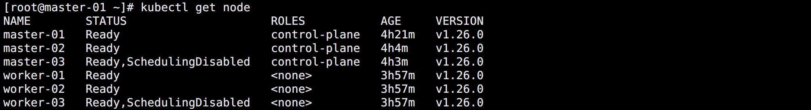

可以看到节点都处于不可调度 `SchedulingDisabled` 状态。

<br>

如果此时又想恢复节点，则使用命令：

```bash
# 恢复不可调度节点
kubectl uncordon master-03
kubectl uncordon worker-03
```

<br>

从集群中删除标记节点：

```bash
# 删除节点
kubectl delete nodes master-03
kubectl delete nodes worker-03
```

<br>

在被删除的节点上清空数据：

```bash
# 重置节点
kubeadm reset -f

# 清除数据
ipvsadm --clear
rm -rf ~/.kube
rm -rf /var/lib/etcd
rm -rf /etc/kubernetes

# 关闭 kubelet
systemctl stop kubelet
```


## 添加节点命令

集群不是一下就搭建完整的，后续会涉及到添加节点的情况，此时就需要用到节点加入集群的命令。但是集群命令 Token 有效期只有 24 小时，过了这个期限就需要重新生成。


### 手动生成命令

执行服务器：`master-01`

查看现有的 Token 列表：

```bash
kubeadm token list
```

<br>

创建 Token：

```bash
kubeadm token create
```

如图所示：

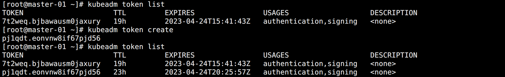

其中 pj 开头的 Token 就是新创建的，有效期也是 24 小时。

<br>

除了 Token，如果是 Worker 节点加入集群，还需要根据 CA 证书生成的 `--discovery-token-ca-cert-hash` CA 证书 Hash 值：

```bash
openssl x509 -pubkey -in /etc/kubernetes/pki/ca.crt | openssl rsa -pubin -outform der 2>/dev/null | openssl dgst -sha256 -hex | sed 's/^.* //'
```

完整的 Woker 节点加入集群的命令如下：

> kubeadm join 192.168.2.100:6443 --token <Token地址> --discovery-token-ca-cert-hash sha256:<生成的Hash值>


### 自动生成命令

上面的生产步骤太复杂，如果只是 Worker 节点加入集群，可以直接一步生成。

执行服务器：`master-01`

```bash
kubeadm token create --print-join-command
```

测试将 `worker-03` 加回集群，执行服务器：`worker-03`

```
kubeadm join 192.168.2.100:6443 --token fhjary.3gmshr09dqh4wi5e --discovery-token-ca-cert-hash sha256:a076cdebcc9b09df8bb009637b26ed05e3676937c52744e7c71634089834ad3b
```

结果如图所示：

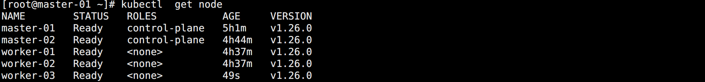


### 生成 Master 命令

Master 节点加入集群除了需要 Worker 节点加入集群的参数，还需要 `--certificate-key` 新生成的证书 Key。

执行服务器：`master-01`

```bash
kubeadm init --config /ezops/service/kubeadm/kubeadm-config-new.yaml phase upload-certs --upload-certs
```

如图所示：

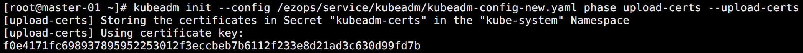

然后拼接命令：

> kubeadm join 192.168.2.100:6443 --token <Token地址> --discovery-token-ca-cert-hash sha256:<生成的Hash值> --control-plane --certificate-key <生成的Key>

<br>

测试将 master-03 加回集群：

```bash
kubeadm join 192.168.2.100:6443 --token fhjary.3gmshr09dqh4wi5e --discovery-token-ca-cert-hash sha256:a076cdebcc9b09df8bb009637b26ed05e3676937c52744e7c71634089834ad3b --control-plane --certificate-key f0e4171fc698937895952253012f3eccbeb7b6112f233e8d21ad3c630d99fd7b
```

可以发现出现报错：

>[check-etcd] Checking that the etcd cluster is healthy
>error execution phase check-etcd: etcd cluster is not healthy: failed to dial endpoint https://192.168.2.223:2379 with maintenance client: context deadline exceeded
>To see the stack trace of this error execute with --v=5 or higher

原因在于该节点是被踢掉的 Master 节点，etcd 中已经保存了它的信息。如果是全新的节点就不会存在这个问题。


### 解决 Master 添加失败问题

执行服务器：`master-01`

```bash
# 登录集群的任意 ETCD Pod
kubectl exec -n kube-system -it etcd-master-01 -- sh
```

查看 ETCD 集群信息：

```bash
# Pod 中设置登录 ETCD 的命令
export ETCDCTL_API=3
alias etcdctl='etcdctl --endpoints=https://127.0.0.1:2379 --cacert=/etc/kubernetes/pki/etcd/ca.crt --cert=/etc/kubernetes/pki/etcd/server.crt --key=/etc/kubernetes/pki/etcd/server.key'

# 查看集群节点列表
etcdctl member list
```

如图所示：

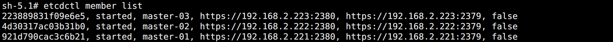

删掉 master-03：

```bash
# 删除节点
etcdctl member remove 223889831f09e6e5
```

<br>

此时再次清空新的 master-03 节点数据，然后加入 Mater 节点则没问题了。

执行服务器：`master-03`

```bash
kubeadm reset -f

# 清除数据
ipvsadm --clear
rm -rf ~/.kube
rm -rf /var/lib/etcd
rm -rf /etc/kubernetes

# 关闭 kubelet
systemctl stop kubelet
```

需要注意的时候 `--certificate-key` 的有效期很短，如果过期重新生成就行。

