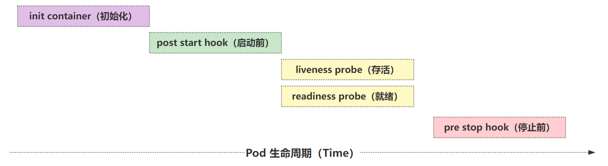
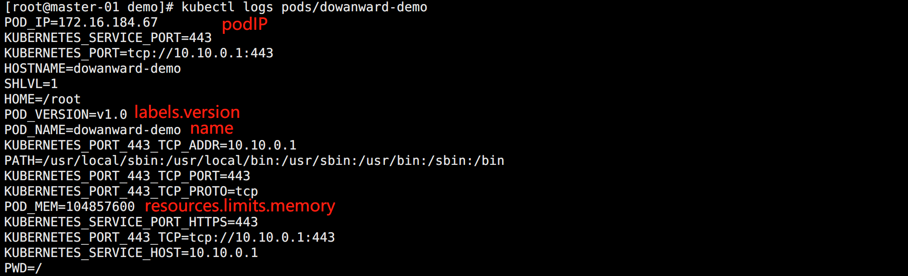
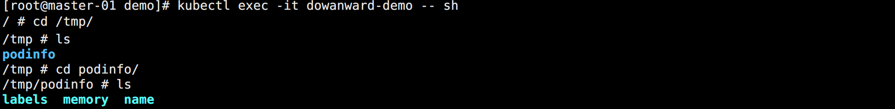

## Pod


> Pod 是 Kubernetes 最基本的调度单元。

在一个复杂的系统中，往往某些应用的关系是非常密切的，它们需要共享某些资源。如果都运行在同一个容器内，会面临一个问题，容器运行时的管理进程是 PID=1 的进程，如果容器以多进程运行，那么里面的某些进程挂了，就会成为僵尸进程，没办法进行管理。而且这也不是容器所推荐的每个容器只运行一个进程的运行方式。

但是如果将这些容器拆开，它们就可能被调度到不同的节点，此时想要共享某些东西就会变得非常麻烦。所以此时就需要一个更高级的结构来将这个容器做个整合，这个结构就是 Pod。

Pod 的目的就是：保证关系紧密的容器始终运行在相同的节点。


## Pod 原理

Pod 只是一个概念，真正实现这样功能的还是 Linux 容器的 Namespace 和 Cgroup。Pod 被创建出来其实是一组共享了一些资源的容器而已。


### Pod 网络共享

Pod 被创建出来实质就是一组共享了一些资源的容器而已。它们共享了一组相同的 Network Namespace，其实现原理为：

一个新创建的容器可以通过 `--net=container:容器名称` 这个参数来使用和其它容器相同的 Network Namespace。

但这样的容器存在一个问题：容器的运行有先后顺序。

为了解决这个问题，Pod 引入了第三个容器 `Infra`（其实就是之前安装的时候看到的镜像 `pause` 启动的容器），这个容器永远都是最先启动的，这样只需要让其它容器的网络加入该容器即可。所以，一个 Pod 中无论如何都至少两个容器。

Infra 容器占用的系统资源非常少，但是这个镜像默认是谷歌的，国内无法下载。所以在部署应用的时候 Pod 状态可能一直处于 `Pending` 状态或者直接报 `sandbox image` 相关错误，大部分都是因为这个镜像拉不下来。


Infra 容器共享了 IP、端口范围等，容器之间的进程可以通过 lo 网卡设备进行通信，这意味着：

- 容器之间是可以直接使用 localhost 进行通信。
- 所有容器的网络设备信息都是和 Infra 容器完全一样的。
- 同一个 Pod 下面的容器运行的多个进程不能绑定相同的端口。
- Pod 的生命周期只跟 Infra 容器一致，而与容器 A 和 B 无关。


### Pod 文件共享

默认情况下容器的文件系统是互相隔离的，要实现共享只需要在 Pod 的顶层声明一个 Volume，然后在需要共享这个 Volume 的容器中声明挂载即可。


这个方式是 Kubernetes 中一个非常重要的设计模式：`sidecar` 的常用方式。

典型的应用场景就是容器日志收集，比如应用的日志被输出到容器的 /var/log 目录，此时可以把 Pod 声明的 Volume 挂载到容器的 /var/log 目录上，然后在这个 Pod 里面同时运行一个 sidecar 容器，挂载相同的 Volume 到自己容器的 /var/log （或其他）目录上，这样这个 sidecar 容器就只需要从自己 /var/log 目录下面不断消费日志发送到 Elasticsearch 中存储起来即可。

除此之外，使用更多的还是利用 Pod 中的所有容器共享同一个 Network Namespace 这个特性，这样就可以把 Pod 网络相关的配置和管理也可以交给一个 sidecar 容器来完成，完全不需要去干涉用户容器，这个特性在 `Service Mesh`（服务网格）中应用非常广泛，典型的应用就是 `Istio`。


## Pod 状态

Pod 的状态可能取值：

- 挂起（`Pending`）：Pod 信息已经提交给了集群，但是还没有被调度器调度到合适的节点或者 Pod 里的镜像正在下载。
- 运行中（`Running`）：该 Pod 已经绑定到了一个节点上，Pod 中所有的容器都已被创建。至少有一个容器正在运行，或者正处于启动或重启状态。
- 成功（`Succeeded`）：Pod 中的所有容器都被成功终止，并且不会再重启。
- 失败（`Failed`）：Pod 中的所有容器都已终止了，并且至少有一个容器是因为失败终止。也就是说，容器以非 `0` 状态退出或者被系统终止。
- 未知（`Unknown`）：因为某些原因无法取得 Pod 的状态，通常是因为与 Pod 所在主机通信失败导致的。


## 重启策略

通过 `restartPolicy` 可以设置 Pod 中所有容器的重启策略：

- `Always`：默认，容器挂掉就重启。
- `Never`：无论如何都不重启。
- `OnFailure`：运行失败才重启。

通过 kubelet 重新启动的退出容器将以指数增加延迟（10s，20s，40s…）重新启动，上限为 5 分钟，并在成功执行 10 分钟后重置。

不同类型的的控制器适用不同的 Pod 重启策略：

- Job：适用于一次性任务，如批量计算，任务结束后 Pod 会被此类控制器清除。Job 的重启策略只能是 OnFailure 或 Never。
- ReplicaSet、Deployment：此类控制器希望 Pod 一直运行下去，它们的重启策略一般 Always。
- DaemonSet：每个节点上启动一个 Pod，重启策略也适合 Always。


## 生命周期



一个 Pod 的完整生命周期包含：`Init Container`、`Pod Hook`、`健康检查`。


### Init Container

`Init Container` 是用来做初始化工作的容器，可以是一个或多个，如果是多个，这些容器就会按定义的顺序依次执行。

在一个 Pod 里，所有容器是共享数据卷和 Network Namespace 的，所以 Init Container 里面产生的数据可以被主容器使用到。

Init Container 独立于主容器之外，只有所有的 Init Container 执行完之后，主容器才会被启动。

初始化容器的应用场景：

- 等待其它模块 Ready：常用于解决服务之间的依赖问题。
  - 比如一个 Web 服务依赖于另外一个数据库服务，但在启动 Web 服务时，并不能保证依赖的这个数据库服务就已经启动起来，所以可能会出现一段时间内 Web 服务连接数据库异常。
  - 解决办法：在 Web 服务的 Pod 中使用一个 Init Container，让它去检查数据库是否已经准备好，准备好过后主容器的 Web 服务才被启动。
- 初始化配置：
  - 比如集群里检测所有已经存在的成员节点，为主容器准备好集群的配置信息，这样主容器起来后就能用这个配置信息加入集群。
- 其它场景：
  - 比如将 Pod 注册到一个中央数据库、配置中心等。

<br>

Init Container 资源清单示例：

```yaml
apiVersion: v1
kind: Pod
metadata:
  name: init-demo
spec:
  # 数据卷
  volumes:
    - name: v-web
      hostPath:
        path: /data/web
  # 初始化容器
  initContainers:
    - name: busybox
      image: busybox
      args: ["/bin/sh", "-c", "echo 'Hello World' > /web/index.html"]
      volumeMounts:
        - name: v-web
          mountPath: /web
  # 容器
  containers:
  - name: nginx
    image: nginx:latest
    ports:
      - containerPort: 80
    volumeMounts:
      - name: v-web
        mountPath: /usr/share/nginx/html
```

该初始化容器实现了在 nginx 容器之前将默认的 HTML 内容进行修改。


### Pod Hook

Kubernetes 为 Pod 的容器提供了生命周期钩子，就是 `Pod Hook`。

Pod Hook 由 kubelet 发起，当容器中的进程启动前或者容器中的进程终止之前运行。

Kubernetes 为提供了两种钩子函数：

- `PostStart`：容器创建后立即执行。但并不能保证钩子在容器 ENTRYPOINT 之前运行，因为没有参数传递给处理程序。
  - 主要用于资源部署、环境准备等。
  - 如果钩子花费太长时间以至于不能运行或者挂起，容器将不能达到 running 状态。
- `PreStop`：容器终止之前立即被调用。它是阻塞的，意味着它是同步的，所以它必须在删除容器的调用发出之前完成。
  - 主要用于优雅关闭应用程序、通知其他系统等。
  - 如果钩子在执行期间挂起，Pod 阶段将停留在 running 状态并且永不会达到 failed 状态。

如果 PostStart 或 PreStop 钩子失败， 它会杀死容器。所以应该让钩子函数尽可能的轻量。当然有时候长时间运行命令是合理的， 比如在停止容器之前预先保存状态。

<br>

另外有三种方式来实现上面的钩子函数：

- `exec`：用于执行一段特定的命令，不过要注意的是该命令消耗的资源会被计入容器。
- `httpGet`：对容器上的特定的端点执行 HTTP 请求。
- `tcpSocket`：指定 TCP 端口发起请求。

通过 PostStart 可以实现容器的某些初始化功能。

通过 preStop 可以实现优雅的终止容器中运行的程序。

<br>

Pod Hook 资源清单示例：

```yaml
apiVersion: v1
kind: Pod
metadata:
  name: hook-demo
spec:
  volumes:
    - name: v-hook
      hostPath:
        path: /data/hook
  containers:
  - name: nginx
    image: nginx
    ports:
      - containerPort: 80
    volumeMounts:
      - name: v-hook
        mountPath: /hook
    # 生命周期设置
    lifecycle:
      # 容器运行前，但是不能保证在容器执行启动命令之前
      postStart:
        exec:
          command: ["/bin/sh", -c, "echo 'postStart' >> /hook/hook.log"]
      # 容器退出前
      preStop:
        exec:
          command: ["/bin/sh", -c, "echo 'preStop...' >> /hook/hook.log"]
```


### 健康检查

在 Kubernetes 集群中，可以通过配置 `liveness probe（存活探针）` 和 `readiness probe（就绪探针）` 来影响容器的生命周期。

- `livenessProbe`：存活探针，kubelet 通过它来确定应用程序是否还活着。
  - 一般而言，程序崩溃 Kubernetes 就会立刻知道，然后重启。
  - 但是也有特殊情况，程序没挂，但是服务已经存在问题了。此时就需要存活探针来进行判断。
- `readinessProbe`：就绪探针，kubelet 通过它来确定容器是否已经准备好开始工作。
  - 只有 Pod 中的所有容器都处于就绪状态的时，kubelet 才会认定该 Pod 处于就绪状态。
  - 如果 Pod 处于非就绪状态，系统会将它从 Service 的 Endpoints 列表中移除，这样流量就不会被路由到这个 Pod。

<br>

和 Pod Hook 一样，健康检查探针也支持下面几种配置方式：

- `exec`：执行一段命令。
- `http`：检测某个 http 请求
- `tcpSocket`：在指定端口上打开容器的套接字，如果可以建立连接，容器则被认为是健康的，实际上就是检查端口。

<br>

健康检测资源清单示例：

```yaml
apiVersion: v1
kind: Pod
metadata:
  name: health-demo
spec:
  containers:
  - name: busybox
    image: busybox
    args:
      - "/bin/sh"
      - "-c"
      - "echo 'Hello' > /opt/health.txt;sleep 30;rm -f /opt/health.txt;sleep 300"
    # 存活性检测
    livenessProbe:
      exec:
        command: ["/bin/sh", "-c", "cat /opt/health.txt"]
      # 检测设置
      initialDelaySeconds: 5
      periodSeconds: 5
      failureThreshold: 3
      successThreshold: 1
      timeoutSeconds: 1
    # 就绪性检测
    readinessProbe:
      exec:
        command: ["/bin/sh", "-c", "cat /opt/health.txt"]
```

常用参数说明：

- `initialDelaySeconds`：第一次探测延时时间，某些 Pod 启动完成会很慢，可以增加检测开始的延时，避免一直失败一直重启。
- `periodSeconds`：每次检测的时间间隔。
- `failureThreshold`：指定连续监测失败的次数，只有连续次数都失败才认为失败。
- `successThreshold`：探测失败后，最少连续探测成功多少次才被认定为成功，默认是 1，但是如果是 liveness 则必须是 1。
- `timeoutSeconds`：探测超时时间，默认 1 秒。


## 资源配置

Pod 除了需要对生命周期进行配置，还需要对其资源使用进行限制，比如分配的 CPU、内存等资源。

Linux 的 CGroup 可以对容器的资源进行限制，所以 Pod 也可以应用这个特性，达到资源配置的目的。


### CPU

计算机里 CPU 的资源是按 `时间片` 的方式来进行分配的，系统里的每一个操作都需要 CPU 的处理，所以，哪个任务要是申请的 CPU 时间片越多，那么它得到的 CPU 资源就越多。

在 CGroup 中对于 CPU 资源的单位换算如下：

```bash
1 CPU = 1000 millicpu（1 Core = 1000m）
```

这里的 `m` 是毫、毫核的意思，将一个 cpu 内核抽象化，分成 1000 等份。每一份即为一个 millicore，即千分之一个核，毫核。

Kubernetes 集群中的每个节点都可以通过操作系统的命令来确认本节点的 CPU 内核数量，然后将这个数量乘以 1000，得到的就是节点总 CPU 总毫数。

比如一个 4 核的机器，CPU 总毫核数为：4*1000=4000m

如果想要使用单核的 10 分之一，则需要将限制设置为：1000*0.1=100m

<br>

在 Pod 中，可以通过设置 `spec.containers.resources` 下面的两个参数来限制和请求 CPU 资源：

- `limits.cpu`：CPU 上限值，可以短暂超过，容器也不会被停止。（真正的用于资源限制的配置）
- `requests.cpu`：CPU 请求值，Kubernetes 调度算法里的依据值。（用于集群调度使用的资源）

需要注意，如果 requests.cpu 设置的值大于集群里每个节点的可供使用的 CPU 总毫数，那么这个 Pod 将无法调度。

如果需要保证某个应用的优先级很高，也就是资源吃紧的情况下最后再杀掉这个 Pod，那么可以把你 requests 和 limits 的值设置成一致。

> CPU 资源是可压缩资源，也就是容器达到了这个设定的上限后，容器性能会下降，但是不会终止或退出。


### 内存

内存资源控制，内存的单位换算都比较简单：

```bash
1 MiB = 1024 KiB
```

在 Kubernetes 里一般用的是 `Mi` 单位，后面加 `B` 资源清单可能会报错，当然也可以使用 `Ki、Gi` 甚至 `Pi`。

> `MiB ≠ MB`，MB 是十进制单位，MiB 是二进制，平时使用的 MB 等于 1024KB，其实 `1MB=1000KB`，`1MiB` 才等于 `1024KiB`。
>
> 中间带字母 i 的是国际电工协会（IEC）定的，走 1024 乘积，KB、MB、GB 是国际单位制，走 1000 乘积。

另外需要注意：

> 内存是不可压缩性资源，如果容器使用内存资源到达了上限，那么会 `OOM`，造成内存溢出，容器就会终止和退出。


### 示例

资源配置资源清单示例：

```yaml
apiVersion: v1
kind: Pod
metadata:
  name: limit-demo
spec:
  containers:
  - name: nginx
    image: nginx
    # 资源限制
    resources:
      # 实际使用限制
      limits:
        memory: "128Mi"
        cpu: "500m"
      # 调度时候限制
      requests:
        memory: "128Mi"
        cpu: "500m"
    ports:
      - containerPort: 80
```

由于配置了 CGroup v2，所有容器的 CGroup 配置文件在运行宿主机的 `/sys/fs/cgroup/kubepods.slice/` 目录下。

其中 `memory.max` 为内存限制，`cpu.max` 为 CPU 限制。


## 静态 Pod

Kubernetes 中除了经常使用到的普通 Pod 以外，还有一种特殊的 Pod，叫做 `Static Pod（静态 Pod）`。

静态 Pod 直接由节点上的 kubelet 进程来管理，不通过 master 节点上的 apiserver。无法与 Deployment 或 DaemonSet 等控制器进行关联，它由 kubelet 进程自己来监控，当 pod 崩溃时会重启，kubelet 也无法对他们进行健康检查。

静态 pod 始终绑定在某一个 kubelet 上，并且始终运行在同一个节点上。kubelet 会自动为每一个静态 pod 在 Kubernetes 的 apiserver 上创建一个镜像 Pod，因此可以在 apiserver 中查询到该 pod，但是不能通过 apiserver 进行控制（例如不能删除）。

使用 kubeadm 安装的 Kubernetes 机器就使用了静态 Pod 的特性。

创建静态 Pod 有两种方式：`配置文件` 和 `HTTP`


### 配置文件方式

使用示例 `/ezops/service/kubernetes/manifests/static-pod.yaml`：

```yaml
apiVersion: v1
kind: Pod
metadata:
  name: static-pod-demo
spec:
  containers:
    - name: nginx
      image: nginx
      ports:
        - containerPort: 80
```

在安装 kubelet 的时候有指定一个参数：`staticPodPath: /ezops/service/kubernetes/manifests`，放在这个目录下的资源清单 kubelet 会自动定时扫描，有新增就会创建 Pod，有改变就会自动更新 Pod。

删除静态 Pod 的方法就是删除目录下对应的配置文件。


### HTTP 方式

HTTP 创建方式一般不会使用，需要设置 kubelet 的 `--manifest-url=` 参数。

kubelet 会周期地从 `–manifest-url=` 参数指定的地址下载文件，并且把它翻译成 JSON/YAML 格式的 pod 定义。此后的操作方式与配置创建方式相同，kubelet 会不时地重新下载该文件，当文件变化时对应地终止或启动静态 pod。


## Downward API

前面测试的时候有简单的用到 Volume 数据卷的定义 `hostPath` 的方式。除此之外，还支持很多 volume，可以通过资源清单查看：

```bash
kubectl explain pod.spec.volumes
```

其中有一种特别的模式，就是 `Downward API`。

该模式和其他模式不一样的地方在于：

> Downward API 不是为了存放容器的数据，也不是用来进行容器和宿主机的数据交换的，而是让 Pod 里的容器能够直接获取到这个 Pod 对象本身的一些信息。

目前 Downward API 提供了两种方式用于将 Pod 的信息注入到容器内部：

- `环境变量`：用于单个变量，可以将 Pod 信息和容器信息直接注入容器内部
- `Volume 挂载`：将 Pod 信息生成为文件，直接挂载到容器内部中去

 

### 环境变量

示例资源清单：

```yaml
apiVersion: v1
kind: Pod
metadata:
  name: dowanward-demo
  namespace: default
  labels:
    version: v1.0
spec:
  containers:
  - name: busybox
    image: busybox
    args: ["/bin/sh", "-c", "env"]
    resources:
      requests:
        cpu: "500m"
        memory: "100Mi"
      limits:
        cpu: "500m"
        memory: "100Mi"
    env:
      # Pod 名称
      - name: POD_NAME
        valueFrom:
          fieldRef:
            fieldPath: metadata.name
      # Pod 标签
      - name: POD_VERSION
        valueFrom:
          fieldRef:
            fieldPath: metadata.labels['version']
      # Pod 运行之后的信息
      - name: POD_IP
        valueFrom:
          fieldRef:
            fieldPath: status.podIP
      # Resource 信息
      - name: POD_MEM
        valueFrom:
          resourceFieldRef:
            resource: limits.memory
```

需要注意

> 在获取 label 这类用户自定义的标签的时候，由于它不是 Kubernetes 强制定义的关键字，所有不能直接用 `.` 获取它的值，而是需要 `[LABEL_NAME]` 去获取，如果会 golang 的话就知道，这是获取一个 `map[string]interface{}` 类型中某个不确定的 key/value 方式。

除了使用 `fieldRef` 获取 Pod 的基本信息外，还可以通过 `resourceFieldRef` 去获取容器的资源请求和资源限制信息。

运行之后通过查看 Pod 日志查看输出：

```bash
kubectl logs pods/dowanward-demo
```

如图所示：



打印 Pod 的环境变量可以看到很多系统自动添加的变量，Kubernetes 会把当前命名空间下面的 Service 信息通过环境变量的形式注入到 Pod 中去。


### Volume 挂载

除了环境变量方式，Volume 挂载的方式也可以去获取 Pod 的基本信息。然后将它挂载到 Pod 内的文件中。

示例资源清单：

```yaml
apiVersion: v1
kind: Pod
metadata:
  name: dowanward-demo
  namespace: default
  labels:
    version: v1.0
spec:
  volumes:
    - name: v-podinfo
      downwardAPI:
        items:
          - path: labels
            fieldRef:
              fieldPath: metadata.labels
          - path: name
            fieldRef:
              fieldPath: metadata.name
          - path: memory
            resourceFieldRef:
              # 需要指定容器
              containerName: busybox
              resource: limits.memory
  containers:
  - name: busybox
    image: busybox
    args: ["/bin/sh", "-c", "sleep 300"]
    resources:
      requests:
        cpu: "500m"
        memory: "100Mi"
      limits:
        cpu: "500m"
        memory: "100Mi"
    volumeMounts:
      - name: v-podinfo
        mountPath: /tmp/podinfo
```

如图所示：



资源的配置信息都被挂载到了指定的目录，每一项都是一个单独的文件。

<br>

需要注意：

> Downward API 能够获取到的信息，一定是 Pod 里的容器进程启动之前就能够确定下来的信息。而如果你想要获取 Pod 容器运行后才会出现的信息，比如，容器进程的 PID，则应该考虑在 Pod 里定义一个 sidecar 容器来获取。

在实际应用中，如果你的应用有获取 Pod 的基本信息的需求，一般可以利用 Downward API 来获取基本信息，然后编写一个启动脚本或者利用 initContainer 将 Pod 的信息注入到容器中。


## Pod 配置清单

一个包含了常用的配置的 Pod 配置清单示例：

```yaml
# 必选，API 的版本号
apiVersion: v1
# 必选，类型
kind: Pod
# 必选，元数据
metadata:
  # 必选，符合 RFC 1035 规范的 Pod 名称
  name: nginx-demo
  # 可选，Pod 所在的命名空间，不指定默认为 default
  namespace: default
  # 可选，标签，一般用于 Selector
  labels:
    app: nginx
  # 可选，注释，常用于记录信息，说明相关的内容
  annotations:
    author: Dylan
    version: v1.0
# 必选，用于定义容器的详细信息 
spec:
  # 可选，容器重启策略，默认为 Always
  restartPolicy: Always
  # 可选，共享存储卷列表
  volumes:
    # 可选，共享卷类型，空
    - name: v-emptydir
      emptyDir: {}
    # 可选，共享卷类型，本机目录
    - name: v-hostpath  
      hostPath:
        path: /opt
    # 可选，downwardAPI
    - name: v-downwardapi
      downwardAPI:
        items:
          - path: labels
            fieldRef:
              fieldPath: metadata.labels
          - path: memory
            resourceFieldRef:
              # 需要指定容器
              containerName: nginx
              resource: limits.memory

  # 可选，初始化容器
  initContainers:
    - name: busybox
      image: busybox
      command: [/bin/sh, -c, "echo 'Hello World' > /opt/index.html"]
      volumeMounts:
        - name: v-hostpath
          mountPath: /opt

  # 必选，容器列表
  containers:
    # 必选，符合 RFC 1035 规范的容器名称
    - name: nginx
      # 必选，容器所用的镜像的地址
      image: nginx:1.7.9
      # 可选，镜像拉取策略，支持 Alway，IfNotPresent，Never
      imagePullPolicy: IfNotPresent
      # 可选，容器启动执行的命令，也可以使用 args
      command:
        - nginx  
        - -g
        - "daemon off;"
      # 可选，容器的工作目录  
      workingDir: /usr/share/nginx/html
      # 可选，存储卷配置
      volumeMounts:
        # 存储卷名称
        - name: v-hostpath
          # 挂载目录
          mountPath: /usr/share/nginx/html
          # 只读
          readOnly: true
        # 挂载 Downward API
        - name: v-downwardapi
          mountPath: /tmp/downwardapi
      # 可选，容器需要暴露的端口号列表    
      ports:
        # 端口名称
        - name: http-port
          # 端口号
          containerPort: 80
          # 端口协议，默认TCP
          protocol: TCP
      # 可选，环境变量配置    
      env:
        # 变量名
        - name: TZ
          value: Asia/Shanghai
        - name: LANG
          value: zh_CN.utf8
        # Downward API 环境变量配置方式
        - name: POD_NAME
          valueFrom:
            fieldRef:
              fieldPath: metadata.name
        - name: POD_APP
          valueFrom:
            fieldRef:
              fieldPath: metadata.labels['app']
        - name: POD_IP
          valueFrom:
            fieldRef:
              fieldPath: status.podIP
        - name: POD_MEMORY
          valueFrom:
            resourceFieldRef:
              containerName: nginx
              resource: limits.memory
      # 可选，资源限制和资源请求限制
      resources:
        # 最大限制设置
        limits:
          cpu: 1000m
          memory: 1024Mi
        # 启动所需的资源  
        requests:
          cpu: 100m
          memory: 512Mi
      # 可选，就绪状态检查    
      readinessProbe:
        # HTTP 检测方式
        httpGet:
          # 检查协议
          scheme: HTTP
          # 检查端口
          port: 80
          # 检查路径
          path: /
          # 请求头
          httpHeaders:
            - name: REQ-USER
              value: root
      # 可选，存活状态检查
      livenessProbe:
        # exec 检测方式，只能一种
        exec:
          command: 
            - cat
            - /health
        # 端口检测方式  
        # tcpSocket:
        #   port: 80
        # 初始化时间  
        initialDelaySeconds: 60
        # 超时时间
        timeoutSeconds: 2
        # 检测间隔
        periodSeconds: 5
        # 检查成功为1次表示成功
        successThreshold: 1
        # 检测失败3次表示失败
        failureThreshold: 3
```

