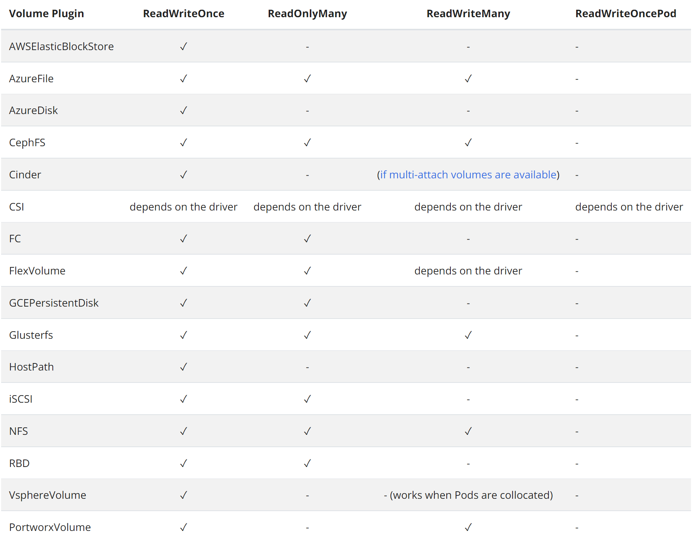
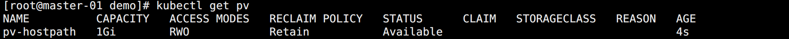
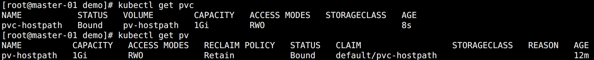
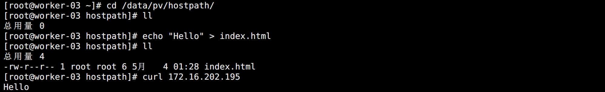
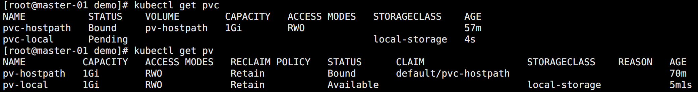
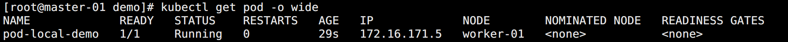
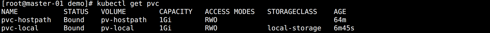
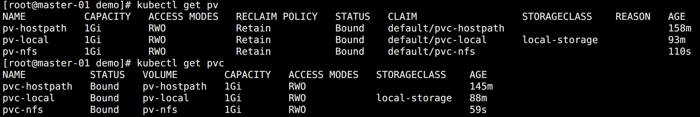
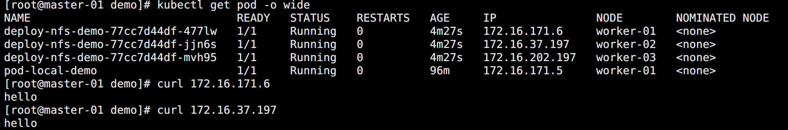
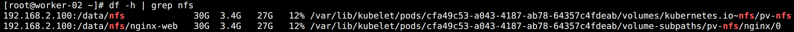

## 存储

前面有通过 `hostPath` 或者 `emptyDir` 的方式来持久化数据，但这样的方式都有本地局限性的问题。所以，为了保障在容器重建后，依然可以使用之前的数据，网络存储可能才是更优的选择。

为了让用户更加方便的管理存储，Kubernetes 引入了 PV 和 PVC 两个重要的资源对象。

`PV` （`PersistentVolume`，持久化卷），是对底层共享存储的一种抽象，由管理员进行创建和配置，它和具体的底层的共享存储技术的实现方式有关。比如 Ceph、GlusterFS、NFS、hostPath 等，都是通过插件机制完成与共享存储的对接。

`PVC` （`PersistentVolumeClaim`，持久化卷声明），PVC 是用户存储的一种声明，PVC 和 Pod 比较类似，Pod 消耗的是节点，PVC 消耗的是 PV 资源，Pod 可以请求 CPU 和内存，而 PVC 可以请求特定的存储空间和访问模式。对于真正使用存储的用户不需要关心底层的存储实现细节，只需要直接使用 PVC 即可。

但是通过 PVC 请求到一定的存储空间也很有可能不足以满足应用对于存储设备的各种需求，而且不同的应用程序对于存储性能的要求可能也不尽相同，比如读写速度、并发性能等，为了解决这一问题，Kubernetes 又引入了一个新的资源对象：`StorageClass`。

通过 StorageClass 的定义，管理员可以将存储资源定义为某种类型的资源，比如快速存储、慢速存储等。

用户根据 StorageClass 的描述就可以非常直观的知道各种存储资源的具体特性了，这样就可以根据应用的特性去申请合适的存储资源，此外 StorageClass 还可以自动生成 PV，免去了每次手动创建的麻烦。


## hostPath

`hostPath` 使用节点上的文件或目录来模拟附带网络的存储。一般用于测试使用，生产尽可能选择网络存储资源，比如 NFS 或 Ceph。

对于普通的 Pod，并不会始终调度到某个节点上。想要数据一直都在，就得使用 nodeSelector，但这样显然就大大降低了应用的容错性。当然 DaemonSet 是可以的。


### 创建 PV

创建 PV 资源清单进行测试：

```yaml
apiVersion: v1
kind: PersistentVolume
metadata:
  name: pv-hostpath
spec:
  capacity:
    storage: 1Gi
  accessModes:
    - ReadWriteOnce
  hostPath:
    path: /data/pv/hostpath
```

配置参数说明：

* `hostPath`：指定 PV 类型，配置为本机的 `/data/pv/hostpath` 目录作为可供挂载到 Pod 的目录。
* `capacity.storage`：指定存储能力，分配的磁盘空间为 1G。

- `accessModes`（访问模式）：描述用户应用对存储资源的访问权限，包括下面几种方式：
  - ReadWriteOnce（RWO）：读写权限，但是只能被单个节点挂载。
  - ReadOnlyMany（ROX）：只读权限，可以被多个节点挂载。
  - ReadWriteMany（RWX）：读写权限，可以被多个节点挂载。

<br>

一些 PV 可能支持多种访问模式，但是在挂载的时候只能使用一种访问模式，多种访问模式是不会生效的。



<br>

查看此时的 PV 情况：



其中有一项 `RECLAIM POLICY`，这个值可以通过 PV 的 `persistentVolumeReclaimPolicy`（回收策略）属性来进行配置，目前支持三种策略：

- Retain（保留）：保留数据，需要管理员手工清理数据。
- Recycle（回收）：清除 PV 中的数据，效果相当于执行 rm -rf /thevoluem/*。
- Delete（删除）：与 PV 相连的后端存储完成 volume 的删除操作，当然这常见于云服务商的存储服务。

特别注意：

* 目前只有 NFS 和 HostPath 两种类型支持回收策略，当然一般来说还是设置为 `Retain` 这种策略保险一点。

* Recycle 策略会通过运行一个 busybox 容器来执行数据删除命令，但默认镜像是：`gcr.io/google_containers/busybox:latest`，一般情况下是拉取不到的，如果需要调整配置，需要增加 Controller Manager 启动参数：`--pv-recycler-pod-template-filepath-hostpath` 来进行配置。

关于 PV 的状态，实际上描述的是 PV 的生命周期的某个阶段，一个 PV 的生命周期中，可能会处于 4 种不同的阶段：

- Available（可用）：表示可用状态，还未被任何 PVC 绑定。
- Bound（已绑定）：表示 PV 已经被 PVC 绑定。
- Released（已释放）：PVC 被删除，但是资源还未被集群重新声明。
- Failed（失败）： 表示该 PV 的自动回收失败。


### 创建 PVC

创建 PVC 资源清单：

```yaml
apiVersion: v1
kind: PersistentVolumeClaim
metadata:
  name: pvc-hostpath
spec:
  resources:
    requests:
      storage: 1Gi
  accessModes:
    - ReadWriteOnce
  volumeName: pv-hostpath
```

如图所示：



可以看到此时的 pv 已经变成了 Bound 绑定状态。


### 使用 PVC

创建 Pod 使用 PVC：

```yaml
apiVersion: v1
kind: Pod
metadata:
  name: pod-demo
spec:
  containers:
  - name: nginx
    image: nginx
    ports:
      - containerPort: 80
    volumeMounts:
      - name: web
        mountPath: /usr/share/nginx/html
  # 声明 PVC volume
  volumes:
    - name: web
      persistentVolumeClaim:
        claimName: pvc-hostpath
```

查看 Pod 运行的节点的 hostPath 信息：



默认会自动创建 PV 声明的时候的 hostPath 目录，但是是空的，可以自己添加 nginx 的 index.html 然后通过 Pod IP 访问 nginx 测试。

此时删除 Pod，该目录下的数据会被保留，这样就实现了数据持久化。但该持久化只有该节点可用，下次创建 Pod 可能会在其它节点，就用不到了。

使用 PV 和 PVC 的好处在于，用户在使用 Pod 做数据持久化的时候，不需要再关心底层的存储是怎样实现的，反正都是配置 PVC。


## Local PV

hostPath 存在 Pod 不能随便漂移，需要固定到一个节点上的局限。但它也有好处，因为 PV 直接使用本地磁盘，它的读写性能相比于大多数远程存储来说，要好得多。这对于一些对磁盘 IO 要求比较高的应用，比如 ETCD 就非常实用。

不过，相比正常的 PV，hostPath 的节点一旦宕机数据就可能丢失，这要求着使用 hostPath 的应用必须具备数据备份和恢复的能力。

所以在 hostPath 的基础上，Kubernetes 依靠 PV、PVC 实现了一个新的特性：`Local Persistent Volume`，也就是 `Local PV`。

Local PV 实现的功能非常类似于 hostPath 加上 `nodeAffinity`。接下来将通过一个示例进行说明。

<br>

在节点 worker-01 上创建一个目录，用于作为数据存储目录。

```bash
mkdir -p /data/pv/local
```

在生产使用中，为了保障数据的安全性，该目录一般是一块额外挂载在宿主机的磁盘或者块设备。

创建一个 PV：

```yaml
apiVersion: v1
kind: PersistentVolume
metadata:
  name: pv-local
spec:
  capacity:
    storage: 1Gi
  accessModes:
    - ReadWriteOnce
  # 指定 storageClass
  storageClassName: local-storage
  # Local PV 的设置
  local:
    path: /data/pv/local
  # 节点亲和性
  nodeAffinity:
    required:
      nodeSelectorTerms:
        - matchExpressions:
            - key: kubernetes.io/hostname
              operator: In
              values:
                - "worker-01"
```

和 hostPath PV 不同，这里定义了一个 `local` 字段，表明它是一个 Local PV。并通过 path 字段，指定 PV 对应的本地磁盘的路径。

通过在 PV 的定义里添加节点亲和性配置，意味着如果 Pod 要想使用这个 PV，那它就必须运行在 worker-01 节点上。

<br>

如果按照正常的流程，这时候就应该创建 PVC，但是 Local PV 不是这样。而是需要创建 `StorageClass`，并设置延时绑定：

```yaml
apiVersion: storage.k8s.io/v1
kind: StorageClass
metadata:
  name: local-storage
provisioner: kubernetes.io/no-provisioner
volumeBindingMode: WaitForFirstConsumer
```

因为在 PV 中设置一个 `storageClassName`，所有这里需要创建对应的 StorageClass。

<br>

此时再去创建 PVC：

```yaml
apiVersion: v1
kind: PersistentVolumeClaim
metadata:
  name: pvc-local
spec:
  resources:
    requests:
      storage: 1Gi
  accessModes:
    - ReadWriteOnce
  storageClassName: local-storage
```

和 hostPath 也不一样，不是指定 volume 名称，而是指定 StorageClass 名称做绑定。

创建完成之后，查看 PVC 的状态是 `Pending`，因为有延时设置：



<br>

创建 Pod：

```yaml
apiVersion: v1
kind: Pod
metadata:
  name: pod-local-demo
spec:
  containers:
  - name: ngixn
    image: nginx
    ports:
      - containerPort: 80
    volumeMounts:
      - name: web
        mountPath: /usr/share/nginx/html
  volumes:
    - name: web
      persistentVolumeClaim:
        claimName: pvc-local
```

运行后如图所示：



可以看到 Pod 被默认调度到了 worker-01 节点，再度查看 PVC：



此时 PVC 也恢复成了 Bound 状态。

<br>

通过 Local PV 示例可以得出以下几个结论：

* Local PV 的 PV 目录实现必须存在，否则 Pod 调度的时候会出错。
* Local PV 的 Pod 的调度方式和传统的调度方式不一样，调度器必须能够知道所有节点与 Local PV 对应的磁盘的关联关系，然后根据这个信息来调度 Pod，也就是在调度的时候考虑 Volume 的分布。
* Local PV 可以保证 Pod 始终能够被正确地调度到它所请求的 Local PV 所在的节点上面。

不过说到底，不管是 hostPath 还是 Local PV，都不是生产乃至有测试使用的推荐方式，起个 demo 玩玩还行。


## NFS

NFS 属于最简单，成本最低的网络存储。但是性能不是很优秀，测试的话可以用用。

下面是 NFS 的配置示例：

通过在 `192.168.2.100` 负载均衡机器上部署一个 NFS 服务端提供数据挂载服务。

```bash
# 安装
yum -y install nfs-utils rpcbind

# 创建共享的目录
mkdir -p /data/nfs

# 配置 NFS 目录
cat > /etc/exports << EOF
/data/nfs *(rw,sync,no_root_squash)
EOF

# 启动服务
systemctl  start rpcbind
systemctl  start nfs

# 开机启动
systemctl enable rpcbind
systemctl enable nfs

# 查看状态
rpcinfo -p | grep nfs

# 查看挂载点
showmount -e 192.168.2.100
```

将该服务器的 /data/nfs 作为数据挂载点提供给其它服务器使用。

<br>

所有 Kubernetes 节点安装 NFS：

```bash
# 安装
yum -y install nfs-utils rpcbind

# 查看提供的 NFS 挂载点
showmount -e 192.168.2.100
```

完成后 NFS 的基础环境就搭建完成，接下来就是配合 PV 使用。

<br>

创建 PV 和 PVC 资源清单：

```yaml
apiVersion: v1
kind: PersistentVolume
metadata:
  name: pv-nfs
spec:
  capacity:
    storage: 1Gi
  accessModes:
    - ReadWriteOnce
  mountOptions:
    - hard
    - nfsvers=4.1
  nfs:
    path: /data/nfs
    server: 192.168.2.100

---

apiVersion: v1
kind: PersistentVolumeClaim
metadata:
  name: pvc-nfs
spec:
  resources:
    requests:
      storage: 1Gi
  accessModes:
    - ReadWriteOnce
  volumeName: pv-nfs
```

创建完成如图所示：



<br>

创建 Deployment 使用该 PVC：

```yaml
apiVersion: apps/v1
kind: Deployment
metadata:
  name: deploy-nfs-demo
spec:
  replicas: 3
  selector:
    matchLabels:
      app: nginx
  template:
    metadata:
      labels:
        app: nginx
    spec:
      containers:
      - name: nginx
        image: nginx
        ports:
        - containerPort: 80
        volumeMounts:
          - name: web
            subPath: nginx-web
            mountPath: /usr/share/nginx/html
      volumes:
        - name: web
          persistentVolumeClaim:
            claimName: pvc-nfs
```

在 mount 的时候新增了 `subPath`，这样在多个服务都挂载在同一个 NFS 的时候便于区分，完成后 nfs 目录会创建 `subPath` 这个目录。

往 nfs 目录中添加 index.html 文件访问测试：



去节点部署的宿主机也可以看到实际的 NFS 挂载情况：



这样就实现了网络级别的文件共享。但是 NFS 的性能不咋行，生产中不建议直接使用。

上面的示例中需要手动去创建 PV 来和 PVC 进行绑定，有的场景下面需要自动创建 PV，这个时候就需要使用到 StorageClass，并且需要一个对应的 provisioner 来自动创建 PV。比如使用 NFS 存储，则可以使用 nfs-subdir-external-provisioner 这个 Provisioner。它使用现有的和已配置的NFS 服务器来支持通过 PVC 动态配置 PV，持久卷配置为 `${namespace}-${pvcName}-${pvName}`，但是按照需要用到 Helm Chart，所以后面再说。

