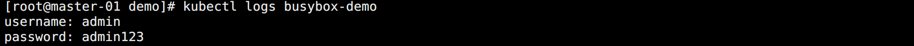

## ConfigMap

为了方便配置的热更新，在传统的开发过程中，一般都会引入一个第三方的配置中心服务，如阿里的 nacos，携程的 Apollo 等。

Kubernetes 自生也提供了一个类似实现这种功能的资源对象：`ConfigMap`，简称 `cm`。


### 资源清单示例

创建一个 ConfigMap 资源清单示例：

```yaml
apiVersion: v1
kind: ConfigMap
metadata:
  name: cm-demo
data:
  name: "demo"
  port: "8080"
  demo.conf: |
    mysql.user="root"
    mysql.password="123"
    redis.password="456"
  demo.yaml: |
    mysql:
      user: root
      password: 123
    redis:
      password: 456
```

配置清单说明：

* 前两项是单个属性配置，以 Key / Value 的格式定义。
* 后面两个字段中的可以看成是两个配置文件，其中的 `|` 的作用在于，保留下面属性的换行符和每行相对于第一行的缩进，多余的缩进和行尾的空白都会被删除。说到底就是保留数据格式，这对于 YAML 这样的配置很重要。
* 除了使用 `|` 输入多行内容，还有使用 `>` 标识折叠。和 `|` 的区别在于只有空白行才会被识别成换行。

<br>

还可以使用竖线和加号或者减号进行配合使用，`+` 表示保留文字块末尾的换行，`-` 表示删除字符串末尾的换行。

```yaml
config: |
  "hello"
# Json 格式：{"config": "hello\n"}  
  
config: |-
  "hello"
# Json 格式：{"config": "hello"}  

config: |+
  "hello"
  
# Json 格式：{"config": "hello\n\n"}
# 有几个换行则加几个
```

<br>
执行创建并查看：

```bash
kubectl apply -f cm.yaml
kubectl describe cm cm-demo
```

如图所示：


### 创建 ConfigMap

创建 ConfigMap 的主要方式有三种：

```bash
# 命令行创建
kubectl create configmap cm-demo --from-literal=key1=value1 --from-literal=key2=value2

# 指定目录创建
kubectl create configmap cm-demo --from-file=/path/dir

# 指定文件创建
kubectl create configmap cm-demo --from-file=key1=/path/dir/file1.txt --from-file=key2=/path/dir/file2.txt
```


### 使用 ConfigMap（环境变量）

在环境变量中使用 ConfigMap：

```yaml
apiVersion: v1
kind: Pod
metadata:
  name: busybox-demo
spec:
  containers:
  - name: busybox
    image: busybox
    env:
      - name: CM_NAME
        valueFrom:
          configMapKeyRef:
            name: cm-demo
            key: name
      - name: CM_PORT
        valueFrom:
          configMapKeyRef:
            name: cm-demo
            key: port
      - name: CM_CONFIG
        valueFrom:
          configMapKeyRef:
            name: cm-demo
            key: demo.conf
      - name: CM_YAML
        valueFrom:
          configMapKeyRef:
            name: cm-demo
            key: demo.yaml
    args: ["/bin/sh", "-c", "env"]
```

查看 Pod 日志输出：

```bash
kubectl logs busybox-demo
```

如图所示：


可以看到，对于配置文件类型依旧被当成一个值赋值给了环境变量。


### 使用 ConfigMap（数据卷挂载）

ConfigMap 在实际使用中大多数时候都是整个配置文件直接塞进去。比如 Prometheus 的配置文件这种。

所以同一可以将 ConfigMap 中的配置以文件的方式挂载到 Pod 中。

```yaml
apiVersion: v1
kind: Pod
metadata:
  name: busybox-demo
spec:
  containers:
  - name: busybox
    image: busybox
    args: ["/bin/sh", "-c", "cd /data/config && cat demo.conf && cat demo.yaml"]
    volumeMounts:
      - name: v-cm-demo
        mountPath: /data/config
  volumes:
    - name: v-cm-demo
      configMap:
        name: cm-demo
        items:
          - key: demo.conf
            # 定义挂载之后的文件名
            path: demo.conf
          - key: demo.yaml
            # 定义挂载之后的文件名
            path: demo.yaml
```

创建后查看日志如图所示：


当使用数据卷的方式挂载到 Pod 中，此时更新 ConfigMap，挂载的数据也是会跟着热更新。

> 只有通过 Kubernetes API 创建的 Pod 才能使用 ConfigMap，其他方式创建的（比如静态 Pod）不能使用，同时 ConfigMap 文件大小限制为 `1MB`（ETCD 的要求）。


## Secret

ConfigMap 一般用于存储非安全的配置信息，原因在于 ConfigMap 使用的是明文的方式存储，通过 describe 就能直接看到。

这用来保存密码等对象显然是不合理的。此时就需要另外一个对象帮忙完成，那就是 `Secret`。

Secret 主要包含了以下几种类型：

* `Opaque`：base64 编码的 Secret，主要用来存储密码，密钥等。但数据可以通过 `base64 -d` 解码得到，加密性很弱。
* `kubernetes.io/dockercfg`：`~/dockercfg` 文件的序列化形式。
* `kubernetes.io/dockerconfigjson`：用来存储私有 docker registry 的认证信息，`~/.docker/config.json` 文件的序列号形式。
* `kubernetes.io/service-account-token`：ServiceAccount 在创建时，Kubernetes 会默认创建一个对应的 Secret 对象，Pod 如果使用 ServiceAccount，对应的 Secret 会自动的挂载到 Pod 的 `/run/secret/kubernetes.io/serviceaccount` 中。
* `kubernetes.io/ssh-auth`：用于 SSH 身份认证的凭据。
* `kubernetes.io/basic-auth`：用于基本身份认证的凭据。
* `bootstrap.kubernetes.io/token`：用于节点接入集群校验的 Secret。

上面是 Secret 对象内置的几种类型，通过 Secret 的 type 字段设置，也可以定义自己的 Secret 类型。如果 type 字段为空，则使用默认的 `Opaque` 类型。


### Opaque

Secret 资源对象包含 2 个键值对：

* `data`：用于存储 base64 编码的任意数。

* `stringData`：为了方便 secret 使用未编码的字符串。

<br>

使用示例：

```bash
# 通过 base64 加密两个数据
echo -n admin | base64
echo -n admin123 | base64
```

如图所示：


使用 data 的方式创建 Secret：

```yaml
apiVersion: v1
kind: Secret
metadata:
  name: secret-demo1
type: Opaque
data:
  username: YWRtaW4=
  password: YWRtaW4xMjM=
```

使用 stringData 的方式创建 Secret：

```yaml
apiVersion: v1
kind: Secret
metadata:
  name: secret-demo2
type: Opaque
stringData:
  username: admin
  password: admin123
```

查看创建结果：


查看配置信息：


可以看到两种方式创建的 Serect 的  value 部分都不会直接显示。

如果想要获取内容，可以将其输出为 yaml 就能看到，不过都是 base64 之后的值，然后通过 base64 解密。


base64 解密方法：

```bash
echo -n YWRtaW4xMjM= | base64 -d
```

<br>

注意，如果 Secret 需要加密的 Key/Value 很多，那么可以直接将它看成一个整体，和 ConfigMap 定义文件一样。例如：

```yaml
apiVersion: v1
kind: Secret
metadata:
  name: secret-demo3
type: Opaque
stringData:
  config.yaml: |
    username: admin
    password: admin123
```

这样所以配置会被当成一个整体加密。如图所示：


### 使用 Secret（环境变量）

和 ConfigMap 一样，也可以在环境变量中直接使用 Secret 内容。

```yaml
apiVersion: v1
kind: Pod
metadata:
  name: busybox-demo
spec:
  containers:
  - name: busybox
    image: busybox
    env:
      - name: SRT_USERNAME
        valueFrom:
          secretKeyRef:
            name: secret-demo1
            key: username
      - name: SRT_PASSWORD
        valueFrom:
          secretKeyRef:
            name: secret-demo1
            key: password
    args: ["/bin/sh", "-c", "env"]
```

创建后结果如图所示：


可以看到 Pod 中拿到的值已经被解析成明文了。


### 使用 Secret（数据卷挂载）

同样的，Secret 也支持像 ConfigMap 一样挂载数据卷的方式将配置挂载到 Pod 中。

```yaml
apiVersion: v1
kind: Pod
metadata:
  name: busybox-demo
spec:
  containers:
  - name: busybox
    image: busybox
    args: ["/bin/sh", "-c", "cd /data/config && cat config.yaml"]
    volumeMounts:
      - name: v-secret-demo
        mountPath: /data/config
  volumes:
    - name: v-secret-demo
      secret:
        secretName: secret-demo3
        items:
          - key: config.yaml
            path: config.yaml
```

查看如图所示：




### kubernetes.io/dockerconfigjson

该类型的 Secret 主要用于存放 Docker registry 的认证信息，命令格式为：

```bash
kubectl create secret docker-registry NAME --docker-username=user --docker-password=password --docker-email=email [--docker-server=string] [--from-file=[key=]source]
```

多了一个关键字：`docker-registry`，标识这是用来创建特定类型的 Secret。使用示例：

```bash
# 命令行创建
kubectl create secret docker-registry secret-demo4 --docker-server="hub.docker.com" --docker-username="dylan" --docker-password="123456" --docker-email="1214966109@qq.com"

# 从文件创建
kubectl create secret docker-registry secret-demo5 --from-file=.dockerconfigjson=/root/.docker/config.json

# 或者另一种方式
kubectl create secret generic secret-demo6 --from-file=.dockerconfigjson=/root/.docker/config.json --type=kubernetes.io/dockerconfigjson
```

当从私有仓库中拉取镜像的时候就需要用到认证，可以在资源清单中配置：

```yaml
apiVersion: v1
kind: Pod
metadata:
  name: pod-demo
spec:
  containers:
  - name: demo
    image: hub.docker.com/imageDemo:v1.0
  imagePullSecrets:
    - name: secret-demo4
```

特别注意：

> `ImagePullSecrets` 与 Secret 不同，因为 Secret 可以挂载到 Pod 中，但是 ImagePullSecrets 只能由 Kubelet 访问。

除了该方法设置 ImagePullSecrets 的方式访问私有仓库获取镜像以外，还可以通过 ServiceAccount 中设置 ImagePullSecrets 然后自动为使用了该 SA 的 Pod 注入配置信息。


### kubernetes.io/basic-auth

该类型用来存放用于基本身份认证所需的凭据信息，使用这种 Secret 类型时，Secret 的 data（或 stringData）字段中一般会包含以下两个键：

* username：用于身份认证的用户名。
* password：用于身份认证的密码或令牌。

可以和创建 Opaque 一样通过 data 字段或者 stringData 字段定义。 

```yaml
apiVersion: v1
kind: Secret
metadata:
  name: secret-demo7
type: kubernetes.io/basic-auth
stringData:
  username: admin
  password: admin123
```

提供基本身份认证类型的 Secret 也仅仅是出于用户方便性和分类管理考虑，也可以使用 Opaque 类型来代替。


### kubernetes.io/ssh-auth

该类型用来存放 SSH 身份认证中所需要的凭据，使用这种 Secret 类型时，Secret 的 data（或 stringData）字段中一般会提供一个 `ssh-privatekey` 键值对，作为要使用的 SSH 凭据。

```yaml
apiVersion: v1
kind: Secret
metadata:
  name: secret-demo8
type: kubernetes.io/ssh-auth
data:
  ssh-privatekey: |
          MIIEpQIBAAKCAQEAulqb...
```

提供 SSH 身份认证类型的 Secret 也仅仅是出于用户方便性和分类管理考虑，也可以使用 Opaque 类型来代替。


### kubernetes.io/tls

该类型用来存放证书及其相关密钥。常用于给 Ingress 资源校验 TLS 链接，使用此类型的 Secret 时，Secret 的 data （或 stringData）字段必须包含 `tls.key` 和 `tls.crt` 主键。

```yaml
apiVersion: v1
kind: Secret
metadata:
  name: secret-demo9
type: kubernetes.io/tls
data:
  tls.crt: |
        MIIC2DCCAcCgAwIBAgIBATANBgkqh ...
  tls.key: |
        MIIEpgIBAAKCAQEA7yn3bRHQ5FHMQ ...
```

提供 TLS 类型的 Secret 也仅仅是出于用户方便性和分类管理考虑，也可以使用 Opaque 类型来代替。

当使用 kubectl 来创建 TLS Secret 时，可以通过命令指定证书来直接创建更为方便：

```bash
kubectl create secret tls secret-demo9 --cert=/path/cert --key=/path/key
```

需要注意的是用于 `--cert` 的公钥证书必须是 `.PEM` 编码的 （Base64 编码的 DER 格式），且与 `--key` 所给定的私钥匹配，私钥必须是通常所说的 PEM 私钥格式，且未加密。

对这两个文件而言，PEM 格式数据的第一行和最后一行（`--------BEGIN CERTIFICATE-----` 和 `-------END CERTIFICATE----`）都不会包含在其中。


### kubernetes.io/service-account-token

`ServiceAccount` 是 Pod 和集群 API Server 通讯的访问凭证。`kubernetes.io/service-account-token` 这种类型就是主要给 ServiceAccount 使用。ServiceAccount 在创建时会默认创建对应的 Secret。当然，新版本已经需要添加相应的配置了。

查看任意一个 Pod：

```bash
kubectl get pod pod-demo -o yaml
```

可以看到：

* 当创建 Pod 的时候，如果没有指定 ServiceAccount，Pod 则会使用默认名称空间中名称为 default 的 ServiceAccount。
* volumes 字段中有一个 `projected` 类型的 volume 被挂载到了 `/var/run/secrets/kubernetes.io/serviceaccount`，该类型的 volume 可以同时挂载多个来源的数据。默认挂载了 configMap，downwardAPI，serviceAccountToken。

更多信息由于需要等到学习了 ServiceAccount 的时候才能搞得清楚。


## 不可变配置

如果某个 Pod 已经在通过环境变量使用某 Secret，对该 Secret 的更新不会被容器马上看见，除非容器被重启，当然也可以使用一些第三方的解决方案在 Secret 发生变化时触发容器重启。

在 Kubernetes v1.21 版本提供了不可变的 Secret 和 ConfigMap 的可选配置 `stable`，对于大量使用 Secret 或 ConfigMap 的集群时，禁止变更具有以下好处：

- 可以防止意外更新导致应用程序中断。
- 通过标记为不可变来关闭 API Server 对其的 watch 操作，从而显著降低 API Server 的负载，提升集群性能。

配置方法：

```yaml
apiVersion: v1
kind: Secret
metadata:
  ...
data:
  ...
# 标记为不可变
immutable: true
```

一旦 Secret 或 ConfigMap 被标记为不可更改，撤销此操作或更改 data 字段的内容都是不允许的，只能删除并重新创建这个 Secret。

现有的 Pod 将继续使用已删除 Secret 的挂载点，所以 Pod 也需要重启。


## Secret vs ConfigMap

相同点：

* k/v 形式
* 属于特定的命名空间
* 可以导出到环境变量
* 可以通过目录/文件形式挂载
* 通过 volume 挂载的配置信息均可热更新

<br>

不同点：

* Secret 可以被 ServerAccount 关联。
* Secret 可以存储 docker register 的鉴权信息，用在 ImagePullSecret 参数中，用于拉取私有仓库的镜像。
* Secret 支持 Base64 加密。
* Secret 有多种分类，而 ConfigMap 不区分类型。

<br>

> 同样 Secret 文件大小限制为 1MB（ETCD 的要求），Secret 虽然采用 Base64 编码，但还是可以很方便解码获取到原始信息，所以对于非常重要的数据还是需要慎重考虑，可以考虑使用 Vault 来进行加密管理。


