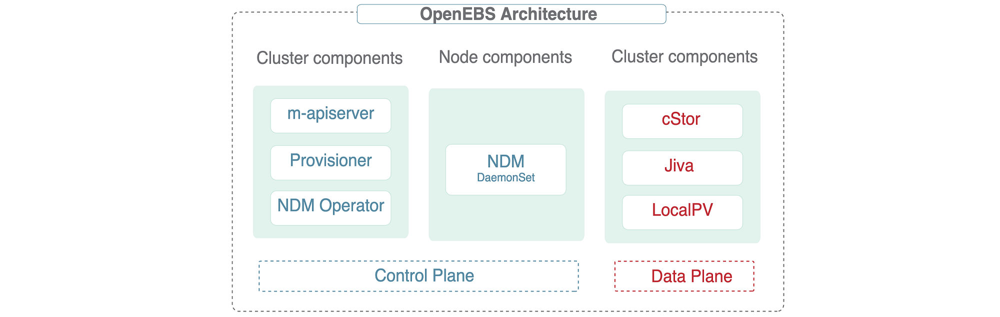
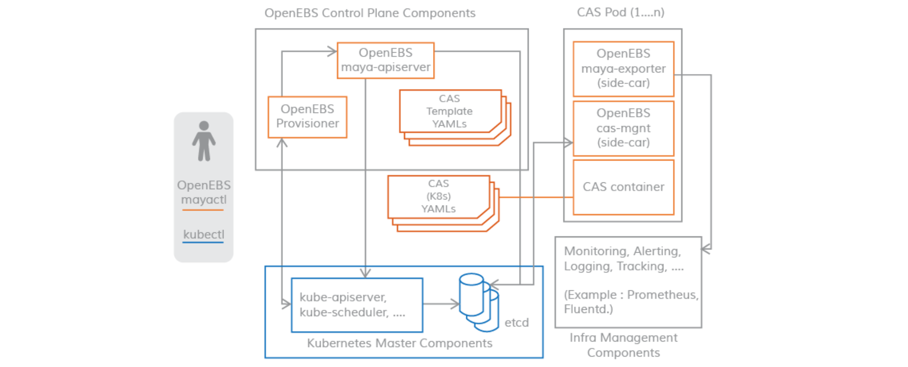
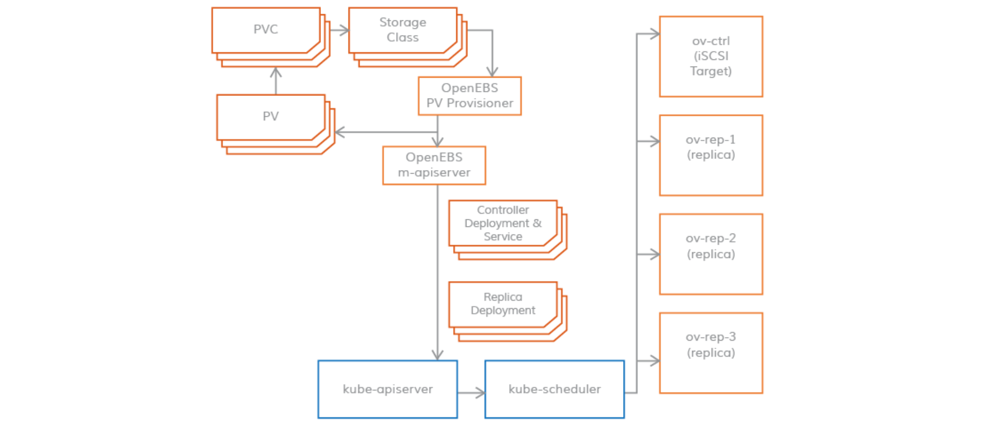
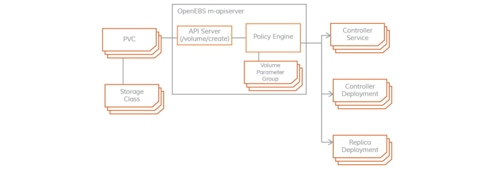
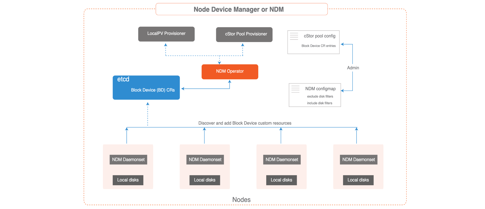
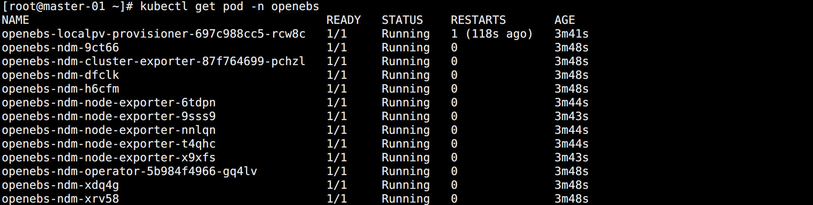
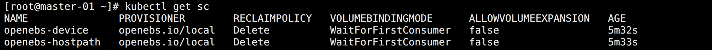
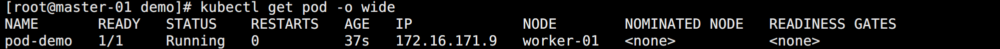
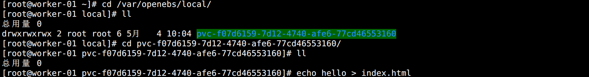

## OpenEBS

OpenEBS 是一种模拟了 AWS 的 EBS、阿里云的云盘等块存储实现的基于容器的存储开源软件。是一种基于 CAS（Container Attached Storage）理念的容器解决方案。其核心理念是存储和应用一样采用微服务架构，并通过 Kubernetes 来做资源编排。其架构实现上，每个卷的 Controller 都是一个单独的 Pod，且与应用 Pod 在同一个节点，卷的数据使用多个 Pod 进行管理。



OpenEBS 的组件可以分为以下几类：

- 控制平面组件：管理 OpenEBS 卷容器，通常会用到容器编排软件的功能。
- 数据平面组件：为应用程序提供数据存储，包含 Jiva 和 cStor 两个存储后端。
- 节点磁盘管理器：发现、监控和管理连接到 Kubernetes 节点的媒体。
- 整合其它云原生工具：与 Prometheus、Grafana、Fluentd 和 Jaeger 进行整合。


## 控制平面

OpenEBS 集群的控制平面（Control Plane）被称为 `Maya`，负责供应和操作数据卷，如快照、克隆、创建执行存储策略等。

控制平面 Maya 实现了创建超融合的 OpenEBS，并将其挂载到 Kubernetes 调度引擎上，用来扩展系统的存储功能。

控制平面也是基于微服务的，通过不同的组件实现存储管理功能、监控、容器编排插件等功能。如下图所示：




### PV Provisioner

该组件作为一个 Pod 运行，主要用于做供应决策。它是一个动态供应器，属于标准的 Kubernetes 外部存储插件。



开发者用所需的卷参数构建一个请求，选择合适的存储类，然后 OpenEBS PV 动态供应器通过 `Maya-apiserver` 与集群的 API Server 进行交互，最终通过 Kubelet，在适当的节点上为卷控制器 Pod 和卷复制 Pod 创建部署规范。同时，用户可以使用 PVC 规范中的注解来控制容量 Pod 的调度。

目前，OpenEBS PV Provisioner 只支持一种类型的绑定，即 `iSCSI`。


### Maya Apiserver

Maya-apiserver 也叫 `m-apiserver`，作为一个 Pod 运行，主要用于暴露了存储 REST API。



除此之外，m-apiserver 还负责以下几个工作：

* 创建创建卷 Pod 所需的部署规范文件。
  * 在生成这些规范文件后，调用 API Server 来相应地调度 Pod。
* 在 OpenEBS PV Provisioner 的卷供应结束时，创建 Kubernetes PV 对象，并挂载到应用 Pod 上。
  * 该 PV 对象由控制器 Pod 托管，控制器 Pod 又由一组位于不同节点的副本 Pod 支持，控制器 Pod 和副本 Pod 也是数据平面的一部分。
* 卷策略管理。
  * OpenEBS 提供了规范用于表达策略，m-apiserver 会解释 YAML 规范，将其转换为可执行组件，通过卷管理 Sidecar 来执行。


### Exporter  Sidecar

Exporter  是每个存储控制器 Pod（cStor/Jiva）的 Sidecar。这些 Sidecar 将控制平面与数据平面连接起来，以获取统计数据，比如：

* volume 读/写延迟
* 读/写 IOPS
* 读/写块大小
* 容量统计


### Volume Mgmt Sidecar

Volume Mgmt  Sidecar 用于将控制器配置参数和卷策略传递给数据平面的卷控制器 Pod，以及将副本配置参数和数据保护参数传递给卷副本 Pod。


## 数据平面

OpenEBS 持久化存储卷通过 Kubernetes 的 PV 来创建，使用 iSCSI 来实现，数据保存在节点上或者云存储中。数据卷完全独立于用户的应用的生命周期来管理，和 Kuberentes 中 PV 的思路一致。

目前，OpenEBS 提供了两个可以轻松插入的存储引擎： `Jiva` 和 `cStor`。这两个存储引擎都完全运行在 Linux 用户空间中，并且基于微服务架构。


### Jiva

Jiva 存储引擎是基于 Rancher 的 LongHorn 和 gotgt 开发的，采用 GO 语言编写，运行在用户空间。

LongHorn 控制器将传入的 IO 同步复制到 LongHorn 复制器上。复制器考虑以 Linux 稀疏文件为基础，进行动态供应、快照、重建等存储功能。


### cStor

cStor 数据引擎是用 C 语言编写的，具有高性能的 iSCSI 目标和 `Copy-On-Write` 块系统，可提供数据完整性、数据弹性和时间点快照和克隆。

cStor 具有池功能，可将节点上的磁盘以镜像式或 RAIDZ 模式聚合，以提供更大的容量和性能单位。


### OpenEBS Local PV

对于那些不需要存储级复制的应用，Local PV 能提供更高的性能。

OpenEBS Local PV 与 Kubernetes Local PV 类似，只不过它是由 OpenEBS 控制平面动态调配的，就像其他常规 PV 一样。

OpenEBS Local PV 有两种类型：

* 主机路径 Local PV：指的是主机上的一个子目录。
* 设备 Local PV：节点上的一个被发现的磁盘（直接连接或网络连接）。

OpenEBS 引入了一个 Local PV 供应器，用于根据 PVC 和存储类规范中的一些标准选择匹配的磁盘或主机路径。


## 节点磁盘管理器

`Node Disk Manager (NDM)` 填补了使用 Kubernetes 管理有状态应用的持久性存储所需的工具链中的空白。

容器时代的架构必须以自动化的方式服务于应用和应用开发者，提供跨环境的弹性和一致性。这意味着存储栈本身必须非常灵活，以便 Kubernetes 和云原生生态系统中的其他软件可以轻松使用这个栈。

NDM 在 Kubernetes 的存储栈中起到了基础性的作用，它将不同的磁盘统一起来，并通过将它们识别为 Kubernetes 对象来提供部分池化的能力。同时， NDM 还可以发现、供应、监控和管理底层磁盘，这样 Kubernetes PV 供应器（如 OpenEBS 和其他存储系统和Prometheus）可以管理磁盘子系统。




## 安装 OpenEBS

由于 OpenEBS 通过 iSCSI 协议提供存储支持，因此，需要在所有 Kubernetes 节点上都安装 iSCSI 客户端（启动器）。

```bash
# 安装 iscsi
yum -y install iscsi-initiator-utils

# 查看 InitiatorName 是否正常配置
cat /etc/iscsi/initiatorname.iscsi

# 启动查看状态
systemctl enable --now iscsid
systemctl status iscsid.service
```

直接安装：

```bash
kubectl apply -f https://openebs.github.io/charts/openebs-operator.yaml
```

安装完成后 Pod 如下：



同时还创建了以下 StorageClass：



默认安装完成之后只有 hostpath 和 device 两种，想要使用其它的，可以使用下面资源清单：

- [OpenEBS Commons Operator](https://github.com/openebs/charts/blob/gh-pages/openebs-operator.yaml)
- [OpenEBS cStor](https://github.com/openebs/charts/blob/gh-pages/cstor-operator.yaml)
- [OpenEBS Jiva](https://github.com/openebs/charts/blob/gh-pages/jiva-operator.yaml)
- [OpenEBS Hostpath](https://github.com/openebs/charts/blob/gh-pages/hostpath-operator.yaml)
- [OpenEBS Hostpath and Device](https://github.com/openebs/charts/blob/gh-pages/openebs-operator-lite.yaml)
- [OpenEBS LVM Local PV](https://github.com/openebs/charts/blob/gh-pages/lvm-operator.yaml)
- [OpenEBS ZFS Local PV](https://github.com/openebs/charts/blob/gh-pages/zfs-operator.yaml)
- [OpenEBS NFS PV](https://github.com/openebs/charts/blob/gh-pages/nfs-operator.yaml)


## 测试 OpenEBS

注意，通过默认资源清单安装后的 hostpath 数据存放目录为：`/var/openebs/local`，可以根据实际需求进行调整。

创建测试 PVC：

```yaml
apiVersion: v1
kind: PersistentVolumeClaim
metadata:
  name: pvc-openebs-hostpath
spec:
 # 指定类型
  storageClassName: openebs-hostpath
  resources:
    requests:
      storage: 1Gi
  accessModes:
    - ReadWriteOnce
```

此时 PVC 会处于 Pending 状态，这是因为对应的 StorageClass 是延迟绑定模式，所以需要等到 Pod 消费这个 PVC 后才会去绑定。

<br>

创建 Pod：

```yaml
apiVersion: v1
kind: Pod
metadata:
  name: pod-demo
spec:
  volumes:
    - name: web
      persistentVolumeClaim:
        claimName: pvc-openebs-hostpath
  containers:
  - name: nginx
    image: nginx
    ports:
      - containerPort: 80
    volumeMounts:
      - name: web
        mountPath: /usr/share/nginx/html
```

创建完成查看调度到的节点：



查看宿主机目录并创建用于访问测试的文件：



通过 Pod IP 访问 nginx 可以看到数据能够被访问。Pod 容器中的数据持久化到 Local PV 对应的目录成功。但需要注意：

> StorageClass 默认的数据回收策略是 Delete，所以如果将 PVC 删掉后数据会自动删除，可以通过 Velero 这样的工具来进行备份还原。


