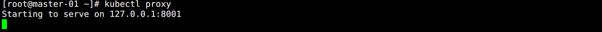

## API 对象

Kubernetes API 是一个以 JSON 为主要序列化方式的 HTTP 服务，也支持 Protocol Buffers 序列化方式。

它主要用于集群内部组件间的通信。为了可扩展性，Kubernetes 在不同的 API 路径（比如 `/api/v1` 或者 `/apis/batch`）下面支持了多个 API 版本，不同的 API 版本意味着不同级别的稳定性和支持：

- Alpha 级别：例如 `v1alpha1` 默认情况下是被禁用的，可以随时删除对功能的支持，所以要慎用。
- Beta 级别：例如 `v2beta1` 默认情况下是启用的，表示代码已经经过了很好的测试，但是对象的语义可能会在随后的版本中以不兼容的方式更改。
- 稳定级别：比如 `v1` 表示已经是稳定版本了，也会出现在后续的很多版本中。

<br>

在 Kubernetes 集群中，一个 API 对象在 Etcd 里的完整资源路径是由：`Group（API 组）`、`Version（API 版本）`和 `Resource（API 资源类型）`三个部分组成。

通过这样的结构，整个 Kubernetes 里的所有 API 对象大致如下：


<br>

通过命令可以看到当前集群的信息：

```bash
kubectl get --raw  /
```

如图所示：


Kubernetes 的 API 对象的组织方式可以分为三类：

* 核心组（新版本是 `/api/v1` ，历史版本可能是 `/apis/core/v1`）
* 命名组（路径 `/apis/$NAME/$VERSION`）
* 系统范围内的实体，比如 `/metrics` 等

<br>

以之前创建的资源清单为例，job 和 cronJob 的 `apiVersion` 是 `batch/v1`，那么查看对应的接口：

```bash
kubectl get --raw /apis/batch/v1 | python -m json.tool
```

`python -m json.tool` 的作用在于将 JSON 格式化输出。内容如下：

```json
{
    "apiVersion": "v1",
    "groupVersion": "batch/v1",
    "kind": "APIResourceList",
    "resources": [
        {
            "categories": [
                "all"
            ],
            "kind": "CronJob",
            "name": "cronjobs",
        ...
    ]
}
```

测试接口：

```bash
# 直接访问 API Server 需要证书，可以开启代理
kubectl proxy
```

此时会监听 master 本机的 `8001` 端口，如图所示：



此时新开一个终端，然后测试接口：

```bash
# 直接 HTTP 访问 API Server
curl 127.0.0.1:8001/apis/batch/v1
```

响应的内容和上面看到的一样：


Kubernetes API 支持通过标准 HTTP `POST`、`PUT`、`DELETE` 和 `GET` 在指定 PATH 路径上创建、更新、删除和检索操作，并使用 JSON 作为默认的数据交互格式。

以创建一个资源清单为例：

```yaml
apiVersion: apps/v1
kind: Deployment
```

一个完整的 API 包含三个部分：

* `Deployment` 就是这个 API 对象的资源类型（Resource）
* `apps` 就是它的组（Group）
* `v1` 就是它的版本（Version）

API Group、Version 和 Resource 三者组合就能唯一标识一个 API 对象，API Server 在启动的时候会监听这些 URL，然后把对应的请求传递给了对应的控制器进行处理。


## RBAC

Kubernetes 所有资源对象都是模型化的 API 对象，允许对它执行 `CRUD` 操作。想要对它们就行管理，需要了解以下概念：

* `Rule`：规则，规则是一组属于不同 API Group 资源上的一组操作的集合。
* `Role` 和 `ClusterRole`：角色和集群角色，这两个对象都包含 Rules 元素，二者的区别在于：
  * Role 中定义的规则只适用于单个命名空间，和 namespace 关联。
  * ClusterRole 是集群范围内的，定义的规则不受命名空间的约束。
  * Role 和 ClusterRole 在 Kubernetes 中都被定义为集群内部的 API 资源，和 Pod、Deployment 这些对象类似，都是集群的资源对象，所以同样的可以使用 YAML 文件来描述，用 Kubectl 工具来管理。
* `Subject`：主题，对应集群中尝试操作的对象，集群中定义了 3 种类型的主题资源：
  * `User Account`：用户，由外部独立服务进行管理，管理员进行私钥的分配，用户可以使用 KeyStone 或者 Goolge 帐号，甚至一个用户名和密码的文件列表也可以。对于用户的管理，集群内部没有一个关联的资源对象，所以用户不能通过集群内部的 API 来进行管理。
  * `Group`：组，这是用来关联多个账户，集群中有一些默认创建的组，比如 cluster-admin。
  * `Service Account`：服务账户，前面 Secret 的时候有说过。通过 Kubernetes API 来管理的一些用户帐号，和 namespace 进行关联，适用于集群内部运行的应用程序通过 API 来完成权限认证。只要在集群内部进行权限操作，都需要使用到 ServiceAccount。

- `RoleBinding` 和 `ClusterRoleBinding`：角色绑定和集群角色绑定，把声明的 Subject 和 Role 进行绑定的过程（给某个用户绑定上操作的权限），二者的区别也是作用范围的区别：
  - RoleBinding 只会影响到当前 namespace 下面的资源操作权限
  - ClusterRoleBinding 会影响到所有的 namespace。


## 访问指定 namespace 的用户

创建一个 User Account 只能访问 `dev` 名称空间，用户信息如下：

* 用户名：hello
* 组：dev


### 创建 User Account

Kubernetes 没有 User Account 的 API 对象，但是可以利用管理员分配给你的一个私钥就可以创建了：

```bash
# 创建一个私钥
openssl genrsa -out hello.key 2048
```

如图所示：


<br>

使用私钥创建一个证书签名请求文件：`dev.csr`，在 `-subj` 参数中指定用户名和组（`CN` 用户名，`O` 组）：

```bash
openssl req -new -key hello.key -out hello.csr -subj "/CN=hello/O=dev"
```

如图所示：


<br>

使用 Kubernetes 的 CA 证书批准 User Account 证书：

```bash
openssl x509 -req -in hello.csr -CA /ezops/cert/kubernetes/ca.pem -CAkey /ezops/cert/kubernetes/ca-key.pem -CAcreateserial -out hello.crt -days 365
```

生成最终的证书有效期为 365 天，如图所示：


<br>

使用创建的证书文件和私钥文件在集群中创建新的凭证和上下文（Context）:

```bash
# 创建用户
kubectl config set-credentials hello --client-certificate=hello.crt --client-key=hello.key

# 为用户设置新的 Context
kubectl config set-context hello-context --cluster=kubernetes --namespace=dev --user=hello
```

如图所示：


到这里，用户 `hello` 就已经创建成功了，但是该用户目前还没有定义任何操作的权限。


### 创建角色

创建一个角色，允许操作 Pod，Deployment，ReplicaSet：

```yaml
apiVersion: rbac.authorization.k8s.io/v1
kind: Role
metadata:
  name: dev-role
  namespace: dev
rules:
  - apiGroups:
      - ""
      - "apps"
    resources:
      - "pods"
      - "replicasets"
      - "deployments"
    # 如果是所有，直接写 * 也可以
    verbs:
      - "get"
      - "list"
      - "watch"
      - "create"
      - "update"
      - "patch"
      - "delete"
```

配置说明：

* 因为 Pod 属于 core 组，所有用 `""` 表示。replicasets 和 deployments 属于 `apps` 组。
* `verbs` 配置对这些对象支持的操作，如果是所有操作，直接写 `*` 即可。


### 创建角色绑定

将 Role 和 User Account 进行绑定，这样就拥有了对应的权限。

```yaml
apiVersion: rbac.authorization.k8s.io/v1
kind: RoleBinding
metadata:
  name: dev-rolebinding
  namespace: dev
subjects:
- kind: User
  name: hello
  apiGroup: ""
roleRef:
  kind: Role
  name: dev-role
  # 留空字符串也可以，则使用当前的 apiGroup
  apiGroup: rbac.authorization.k8s.io
```


### 测试

使用 hello 用户的上下文 Context 进行名称空间的管理：

```bash
# 查看 Pod
kubectl get pods --context=hello-context

# 创建 Pod
kubectl run nginx --image=nginx --context=hello-context

# 查看 Pod
kubectl get pods --context=hello-context
```

如图所示：


可以看到，Pod 被默认创建到了 dev 名称空间中。

<br>

测试获取所有资源对象：

```bash
kubectl get all --context=hello-context
```

如图所示：


除了授权的资源对象，其它的都是 Forbidden。

测试查看 defalut 名称空间中的资源：

```bash
kubectl get pod -n default --context=hello-context
```

如图所示：


依然是没权限的。这样就实现了一个只限制访问某个 namespace 的用户。


## 访问指定 namespace 的 SA

上面提到 subjects 下面除了支持 User，Group，还支持 Service Account。

测试创建一个 Service Account 只能操作 prod 名称空间下的 Pod，ReplcaSet，Deployment。

创建一个 Service Account：

```bash
kubectl create namespace prod
kubectl create sa world-sa -n prod
```

此时 prod 名称空间下也会生成一个和 world-sa 对应的 Secret。

<br>

创建一个 Role：

```yaml
apiVersion: rbac.authorization.k8s.io/v1
kind: Role
metadata:
  name: world-sa-role
  namespace: prod
rules:
  # 为了更好测试，就不给 replicaset 和 deployment 创建的权限了
  - apiGroups: [""]
    resources: ["pods"]
    verbs: ["get", "watch", "list", "create", "update", "patch", "delete"]
  - apiGroups: ["apps"]
    resources: ["replicasets", "deployments"]
    verbs: ["get", "list", "watch"]
```

<br>

创建一个 RoleBinding：

```yaml
kind: RoleBinding
apiVersion: rbac.authorization.k8s.io/v1
metadata:
  name: world-sa-rolebinding
  namespace: prod
subjects:
- kind: ServiceAccount
  name: world-sa
  namespace: prod
roleRef:
  kind: Role
  name: world-sa-role
  apiGroup: rbac.authorization.k8s.io
```

<br>

使用之前部署的 Dashboard 验证权限是否正确：

```bash
# 获取 SA 创建的 Secret
kubectl get secrets -n prod

# 生产 base64 的 Token
kubectl get secret world-sa-token-zd256 -o jsonpath={.data.token} -n prod |base64 -d
```

使用获取的 Token 登录 Dashboard：


可以看到在默认 default 名称空间下，全是报错，提示 Forbidden。

<br>

此时在 prod 名称空间下创建一个 Pod：

```bash
kubectl run nginx --image=nginx -n prod
```

如图所示：


只有 Pod，ReplcaSet，Deployment 的能查看，其它的都不行。只有 Pod 的能创建和删除。


## 访问全局的 SA

如果想要全部都能访问和管理，其实就相当于集群的管理员，上面创建的都是单个名称空间的角色。接下来谈谈整个集群的角色。

查看系统已经创建的集群角色：

```bash
kubectl get clusterrole
```

如图所示：


有非常多的 ClusterRole，但是有一个很总要，那就是 `cluster-admin`，集群管理员角色。

这个角色因为权限很高，使用的时候一定要注意，能不用记录尽量不用。

<br>

创建一个 SA，名称空间就用 Dashboard 的名称空间：

```bash
kubectl create sa dashboard-sa -n kubernetes-dashboard
```

<br>

创建角色绑定，将这个 SA 和 cluster-admin 做绑定：

```yaml
kind: ClusterRoleBinding
apiVersion: rbac.authorization.k8s.io/v1
metadata:
  name: dashboard-sa-clusterrolebinding
  namespace: kubernetes-dashboard
subjects:
- kind: ServiceAccount
  name: dashboard-sa
  namespace: kubernetes-dashboard
roleRef:
  kind: ClusterRole
  name: cluster-admin
  apiGroup: rbac.authorization.k8s.io
```

<br>

创建完成后获取 Secret：

```bash
kubectl get secret -n kubernetes-dashboard
```

如图所示：


生成 Token：

```bash
# 生产 base64 的 Token
kubectl get secret dashboard-sa-token-wkg99 -o jsonpath={.data.token} -n kubernetes-dashboard |base64 -d
```

将获取到的 Token 登录 Dashboard：


