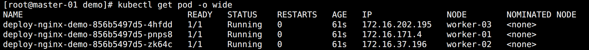
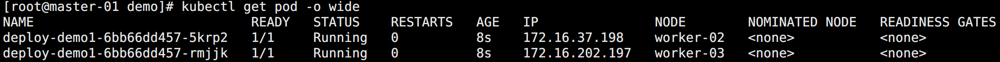
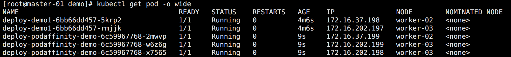
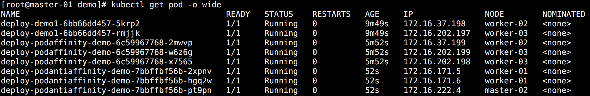
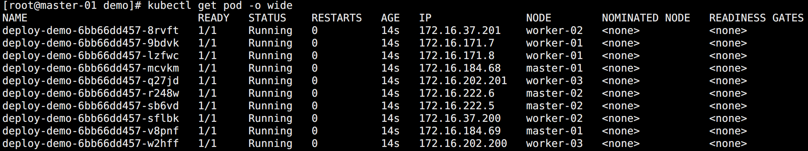
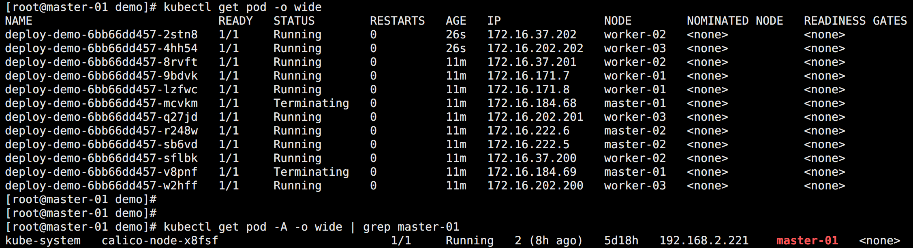
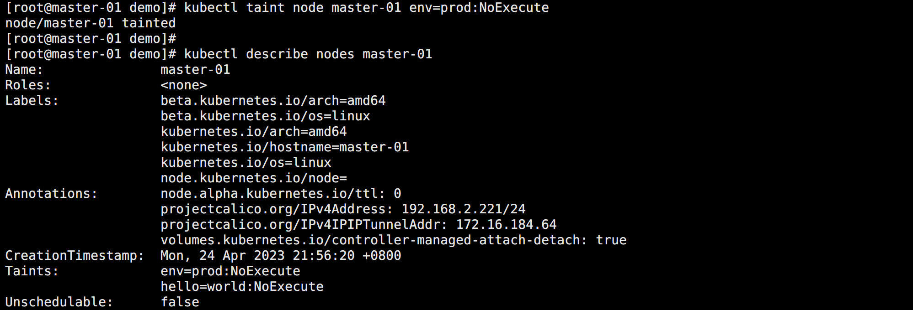
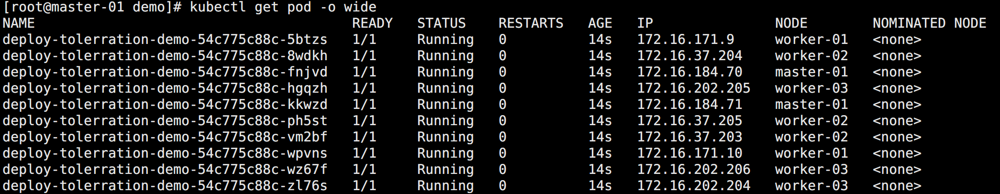

## 调度器

`Scheduler` 是 kubernetes 的核心组件之一，主要负责整个集群资源的调度功能，根据特定的调度算法和策略，将 Pod 调度到最优的工作节点上面去，从而更加合理、更加充分的利用集群的资源。

默认情况下，Scheduler 提供的默认调度器能够满足绝大多数的要求。但在实际的应用中，可能用户会比 Kubernetes 更加了解自己的应用，比如希望一个 Pod 只能运行在特定的几个节点上，或者这几个节点只能用来运行特定类型的应用，这就需要调度器能够可控。

调度主要分为以下几个部分：

- 预选过程（Predicates）：
  - 遍历全部节点，过滤掉不满足条件的节点。
  - 如果所有的节点都不满足条件，那么 Pod 将会一直处于 Pending 状态。在这期间调度器会不断的重试，直到有节点满足条件。
- 优选过程（Priorities）：
  - 再次对节点进行筛选，如果有多个节点都满足条件，那么系统会按照节点的优先级大小对节点进行排序，最后选择优先级最高的节点来部署应用。

如果中间任何一步骤有错误，就直接返回错误。

在一个集群中，满足一个 Pod 调度请求的所有节点称之为 `可调度 Node`。

调度器将这个调度决定告知 `API Server` 的这个过程叫做 `绑定`。


## 调度器调优

Kubernetes 1.12 版本添加了一个新的功能，允许调度器在找到一定数量的可调度节点之后就停止继续寻找可调度节点。

该功能能提高调度器在大规模集群下的调度性能，这个数值是集群规模的百分比，这个百分比通过 `percentageOfNodesToScore` 参数来进行配置，其值的范围在 1 到 100 之间，最大值就是 100%，如果设置为 0 就代表没有提供这个参数配置。

Kubernetes 1.14 版本又加入了一个特性，在该参数没有被用户配置的情况下，调度器会根据集群的规模自动设置一个集群比例，然后通过这个比例筛选一定数量的可调度节点进入打分阶段。该特性使用线性公式计算出集群比例，比如 100 个节点的集群下会取 50%，在 5000节点的集群下取 10%，这个自动设置的参数的最低值是 5%，换句话说，调度器至少会对集群中 5% 的节点进行打分，除非用户将该参数设置的低于 5。

特别注意：

> 当集群中的可调度节点少于 50 个时，调度器仍然会去检查所有节点，因为可调度节点太少，不足以停止调度器最初的过滤选择。
>
> 如果想要关掉这个范围参数，可以将 `percentageOfNodesToScore` 值设置成 100。

当集群规模较小时，这个设置对调度器性能提升并不明显，但是在超过 1000 个 Node 的集群中，将调优参数设置为一个较低的值可以很明显的提升调度器性能。

不过值得注意的是，该参数设置后可能会导致只有集群中少数节点被选为可调度节点，很多 Node 都没有进入到打分阶段，这样就会造成一种后果，一个本来可以在打分阶段得分很高的 Node 甚至都不能进入打分阶段。

出于这个原因，这个参数不应该被设置成一个很低的值，通常的做法是不会将这个参数的值设置的低于 10，很低的参数值一般在调度器的吞吐量很高且对 Node 的打分不重要的情况下才使用。换句话说，只有当你更倾向于在可调度节点中任意选择一个 Node 来运行这个 Pod 时，才使用很低的参数设置。


## Pod 调度优先级

与前面的调度优选策略中的优先级不同，前面所讲的优先级指的是节点优先级，而这里是 Pod 的优先级，高优先级的 Pod 会优先被调度，或者在资源不足的情况牺牲低优先级的 Pod，以便于重要的 Pod 能够得到资源部署。

要定义 Pod 优先级，就需要先定义 `PriorityClass` 对象，该对象没有 Namespace 的限制：

```yaml
apiVersion: v1
kind: PriorityClass
metadata:
  name: high-priority
value: 1000000
globalDefault: false
```

参数说明：

- value 为 32 位整数的优先级，该值越大，优先级越高
- globalDefault 用于未配置 PriorityClassName 的 Pod，整个集群中应该只有一个 `PriorityClass` 将其设置为 true。

然后通过在 Pod 的 `spec.priorityClassName` 中指定已定义的 `PriorityClass` 名称即可：

```yaml
apiVersion: v1
kind: Pod
metadata:
  name: nginx
spec:
  containers:
  - name: nginx
    image: nginx:latest
  priorityClassName: high-priority
```

当节点没有足够的资源供调度器调度 Pod，导致 Pod 处于 pending 时，抢占（preemption）逻辑就会被触发，抢占会尝试从一个节点删除低优先级的 Pod，从而释放资源使高优先级的 Pod 得到节点资源进行部署。

这意味着如果想要使用 Pod 优先级策略，就需要对自己的服务进行重要等级划分。比如有个默认优先级，有个低于默认的优先级，有多个高于默认优先级的优先级。


## nodeSelector

一般情况下 Pod 是通过集群的自动调度策略来选择节点的，但有时候需要更加细粒度的去控制 Pod 的调度。

比如希望一些机器学习的应用只跑在有 GPU 的节点上，服务之间交流比较频繁能调度到同一个的节点上。这就需要使用一些调度方式来控制 Pod 的调度了，主要有两个概念：`亲和性` 和 `反亲和性`。

亲和性又分成：

* `节点亲和性（nodeAffinity）`
* `Pod 亲和性（podAffinity）`

在了解亲和性之前，先来了解一个非常常用的调度方式：`nodeSelector`。在使用 Deployment 的时候就知道了通过 selector 去对 Pod 的 label 标签进行筛选，所以 nodeSelector 其实就是对节点的标签进行筛选。

查看节点的标签：

```bash
kubectl get node --show-labels
```

在之前的使用 ingress-nginx 以 DaemonSet 部署的时候已经通过 label 命令给节点打过标签，并通过 nodeSelector 对节点进行筛选。

示例资源清单：

```yaml
apiVersion: v1
kind: Pod
metadata:
  name: pod-nodeselector
spec:
  # 节点选择器
  nodeSelector:
    kubernetes.io/hostname: "worker-03"
  containers:
  - name: nginx
    image: nginx:latest
    ports:
      - containerPort: 80
```


## 亲和性和反亲和性调度

在实际的生产环境中，往往需要根据自己的一些实际需求来控制 Pod 的调度，这就需要用到：

* `nodeAffinity（节点亲和性）`
* `podAffinity（pod 亲和性）`
* `podAntiAffinity（pod 反亲和性）`

亲和性调度可以分成软策略和硬策略两种方式:

- 软策略：如果现在没有满足调度要求的节点，Pod 就会忽略这条规则，继续完成调度过程。
- 硬策略：如果没有满足条件的节点的话，就不断重试直到满足条件为止。

对于亲和性和反亲和性都有这两种规则可以设置：

* 软策略：`preferredDuringSchedulingIgnoredDuringExecution`
* 硬策略：`requiredDuringSchedulingIgnoredDuringExecution`


## 节点亲和性

节点亲和性（nodeAffinity）主要是用来控制 Pod 要部署在哪些节点上，以及不能部署在哪些节点上，它可以进行一些简单的逻辑组合，不只是简单的相等匹配。

示例资源清单：

```yaml
apiVersion: apps/v1
kind: Deployment
metadata:
  name: deploy-nginx-demo
spec:
  replicas: 3
  selector:
    matchLabels:
      app: nginx
  template:
    metadata:
      labels:
        app: nginx
    spec:
      containers:
      - name: nginx
        image: nginx:latest
        ports:
        - containerPort: 80
      affinity:
        # 节点亲和性
        nodeAffinity:
          # 硬策略
          requiredDuringSchedulingIgnoredDuringExecution:
            nodeSelectorTerms:
              - matchExpressions:
                  - key: kubernetes.io/hostname
                    operator: NotIn
                    values:
                      - "master-01"
                      - "master-02"
          # 软策略
          preferredDuringSchedulingIgnoredDuringExecution:
            - weight: 1
              preference:
                matchExpressions:
                  - key: role
                    operator: In
                    values:
                      - "worker"
```

如图所示：



这里的匹配逻辑是 label 标签的值在某个列表中，目前提供的操作符有下面的几种：

- `In`：label 的值在某个列表中
- `NotIn`：label 的值不在某个列表中
- `Gt`：label 的值大于某个值
- `Lt`：label 的值小于某个值
- `Exists`：某个 label 存在，不需要 values
- `DoesNotExist`：某个 label 不存在，不需要 values

但是需要注意：

> 如果 `nodeSelectorTerms` 下面有多个选项的话，满足任何一个条件就可以。
>
> 如果 `matchExpressions` 下面有多个选项的话，则必须同时满足这些条件才能正常调度 Pod。


## Pod 亲和性

Pod 亲和性（podAffinity）主要解决 Pod 可以和哪些 Pod 部署在同一个拓扑域中的问题（拓扑域用主机标签实现，可以是单个主机，也可以是多个主机组成的 cluster、zone 等等）。

而 Pod 反亲和性主要是解决 Pod 不能和哪些 Pod 部署在同一个拓扑域中的问题，用于处理的 Pod 与 Pod 之间的关系。

比如一个 Pod 在一个节点上，那么另外一个也得在这个节点，或者一个 Pod 在节点上，那么另外一个 Pod 就不想在同一个节点上。

由于这里只有一个集群，并没有区域或者机房的概念，所以直接使用主机名来作为拓扑域，把 Pod 创建在同一个主机上面。

先创建一个 Deployment：

```yaml
apiVersion: apps/v1
kind: Deployment
metadata:
  name: deploy-demo1
spec:
  replicas: 2
  selector:
    matchLabels:
      app: busybox
  template:
    metadata:
      labels:
        app: busybox
    spec:
      containers:
      - name: busybox
        image: busybox:latest
        command: ["/bin/sh", "-c", "sleep 3600"]
```

查看调度的节点：



<br>

创建 Pod 亲和性资源清单：

```yaml
apiVersion: apps/v1
kind: Deployment
metadata:
  name: deploy-podaffinity-demo
spec:
  replicas: 3
  selector:
    matchLabels:
      app: nginx-podaffinity
  template:
    metadata:
      labels:
        app: nginx-podaffinity
    spec:
      containers:
      - name: nginx
        image: nginx
        ports:
        - containerPort: 80
      affinity:
        podAffinity:
          requiredDuringSchedulingIgnoredDuringExecution:
            - labelSelector:
                matchExpressions:
                  - key: app
                    operator: In
                    values:
                      - "busybox"
              topologyKey: kubernetes.io/hostname
```

如图所示：



可以看到新的 Pod 调度的节点和第一个 Deployment 调度的节点相同。

因为是硬策略，如果删掉第一个 Deployment，重新调度下面的 Deployment，那么 Pod 会处于 Pending 状态。

同时在配置的时候需要通过参数 `topologyKey` 指定拓扑域，这里使用的是 `kubernetes.io/hostname`，意思是当前调度的 Pod 要和目标的 Pod 处于同一个主机上面，因为要处于同一个拓扑域下面。

如果把拓扑域改成 `beta.kubernetes.io/os`，默认所有节点都有 `beta.kubernetes.io/os=linux` 的标签，那么所有节点都在同一个拓扑域中，则 Pod 可以被调度到任何一个节点。


## Pod 反亲和性

Pod 反亲和性（podAntiAffinity）则是反着来的，比如一个节点上运行了某个 Pod，那么希望新的 Pod 则不调度到这个节点上面去。

创建 Pod 反亲和性资源清单：

```yaml
apiVersion: apps/v1
kind: Deployment
metadata:
  name: deploy-podantiaffinity-demo
spec:
  replicas: 3
  selector:
    matchLabels:
      app: nginx-podantiaffinity
  template:
    metadata:
      labels:
        app: nginx-podantiaffinity
    spec:
      containers:
      - name: nginx
        image: nginx
        ports:
        - containerPort: 80
      affinity:
        podAntiAffinity:
          requiredDuringSchedulingIgnoredDuringExecution:
            - labelSelector:
                matchExpressions:
                  - key: app
                    operator: In
                    values:
                      - "busybox"
              topologyKey: kubernetes.io/hostname
```

如图所示：



可以看到被调度到了除了 busybox 部署以外的其他节点。


## 污点 taint

在生产中往往会存在这个的场景：

* Master 节点除了 Kubernetes master 组件之外不希望调度其它 Pod 到这个上面来。
* 新增节点没经过测试不希望先把 Pod 调度过来。
* 节点进入维护状态，需要自动将上面的 Pod 迁移到其它节点。
* 特殊节点，只允许某些 Pod 被调度到这个上面。

对于 `nodeAffinity`，无论是硬策略还是软策略方式，都是调度 Pod 到预期节点上。而 `污点（Taints）` 恰好与之相反，如果一个节点标记为 Taints ，除非 Pod 也被标识为可以容忍污点节点，否则该 Taints 节点不会被调度 Pod。

创建污点的语法：

```bash
kubectl taint nodes <节点名称> Key=Value:EFFECT
```

Key / Value 的作用在于唯一标识这条污点规则。

其中 EFFECT 支持：

* `NoSchedule`：禁止调度到该节点，已经在该节点上的 Pod 不受影响。
* `NoExecute`：禁止调度到该节点，如果不符合这个污点，会立马被驱逐（或在一段时间后）。
* `PreferNoSchedule`：尽量避免将 Pod 调度到指定的节点上，如果没有更合适的节点，可以部署到该节点。

下面是一些常见的使用场景，先准备一批用于测试的 Pod，在所有节点都有调度：



<br>

场景 1：Master 只允许运行集群组件。

```bash
kubectl taint node master-01 hello=world:NoExecute
```

可以看到 master-01 上面的 Pod 逐渐被驱逐：



最终保留下了系统组件 calico 等 Pod，因为这些 Pod 是有配置污点容忍的。

再添加一条污点规则，然后查看节点信息：



可以发现一个节点是可以配置多个污点规则，在 `Taints` 字段可以看到。

<br>

场景 2：新增节点没经过测试不希望先把 Pod 调度过来。

```bash
kubectl taint node master-01 node-role=new-node:NoExecute
# 或者
kubectl taint node master-01 node-role=new-node:NoSchedule
```

<br>

场景 3：节点进入维护状态，需要自动将上面的 Pod 迁移到其它节点。

```bash
kubectl taint node master-01 node-role=new-node:NoExecute
```

当然，还可以使用之前二进制安装的时候将节点配置成不可调度：

```bash
# 先将节点标记为不可调度的维护模式
kubectl drain master-01 --delete-local-data --ignore-daemonsets --force
```

<br>

场景 4：特殊节点，只允许某些 Pod 被调度到这个上面。

```bash
kubectl taint node worker-01 isSSD=ture:PreferNoSchedule
```

<br>

除了用户配置的污点以外，Kubernetes 还内置了一些污点：

* node.kubernetes.io/not-ready：节点未准备好，相当于节点状态 Ready 的值为 False。
* node.kubernetes.io/unreachable：Node Controller 访问不到节点，相当于节点状态 Ready 的值为 Unknown。
* node.kubernetes.io/out-of-disk：节点磁盘耗尽。
* node.kubernetes.io/memory-pressure：节点存在内存压力。
* node.kubernetes.io/disk-pressure：节点存在磁盘压力。
* node.kubernetes.io/network-unavailable：节点网络不可达。
* node.kubernetes.io/unschedulable：节点不可调度。
* node.cloudprovider.kubernetes.io/uninitialized：如果 Kubelet 启动时指定了一个外部的 cloudprovider，它将给当前节点添加一个 Taint 将其标记为不可用。在 cloud-controller-manager 的一个 controller 初始化这个节点后，Kubelet 将删除这个 Taint。

<br>

如果想要删除污点标记，则可以执行：

```bash
kubectl taint node master-01 role=master:NoExecute-
```

在对应污点后面加个 `-` 就是删除，跟删除标签的方法类似。


## 容忍 Toleration

容忍测试，创建污点：

```yaml
# 给 Master 打上污点，两个节点打不同的污点
kubectl taint node master-01 role=master:NoSchedule
kubectl taint node master-02 role=master:NoExecute
```

创建容忍：

```yaml
apiVersion: apps/v1
kind: Deployment
metadata:
  name: deploy-tolerration-demo
spec:
  replicas: 10
  selector:
    matchLabels:
      app: nginx
  template:
    metadata:
      labels:
        app: nginx
    spec:
      containers:
      - name: nginx
        image: nginx
        ports:
        - containerPort: 80
      # 匹配 master-01 的污点规则
      tolerations:
        - key: role
          operator: Equal
          value: master
          effect: NoSchedule
```

创建查看：



可以看到因为配置了 master-01 的容忍，所以 master-01 即使打上污点也能被调度。而 master-02 不被调度。

对于 `tolerations` 属性的写法，其中的 key、value、effect 与 Node 的 Taint 设置需保持一致， 对于 operator 需要注意：

- 如果值是 `Exists`，则 value 属性可省略。
- 如果的值是 `Equal`，则表示其 key 与 value 之间的关系是等于。
- 如果不指定 operator，则默认值为 `Equal`。

另外，还有两个特殊值：

- 空的 key 如果再配合 `Exists` 就能匹配所有的 key 与 value，也就是是能容忍所有节点的所有 Taints。
- 空的 effect 匹配所有的 effect。


