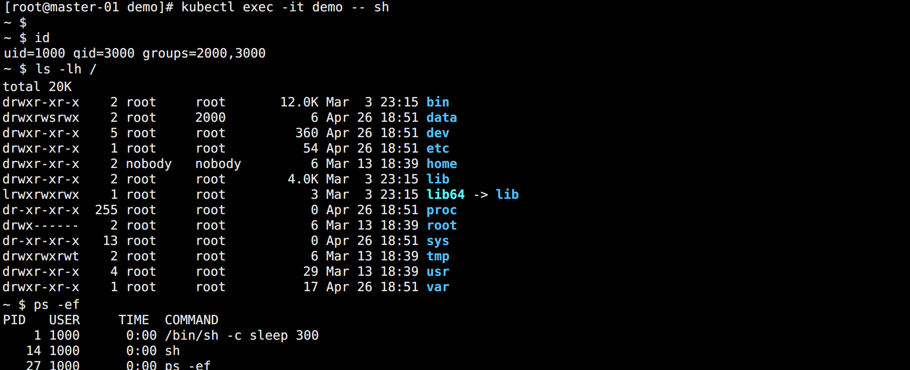

## Security Context

在运行一个容器的时候，可能需要使用 `sysctl` 命令来修改内核参数，但是 systcl 需要容器拥有超级权限才可以使用，在 Docker 容器启动的时候可以加上 `--privileged` 参数来使用特权模式。那么在 Kubernetes 中应该如何来使用呢？

这时候就需要使用到 Kubernetes 中的 `Security Context`，也就是常说的安全上下文。

Kubernetes 提供了三种配置 Security Context 级别的方法：

- `Container-level Security Context`：仅应用到指定的容器。
- `Pod-level Security Context`：应用到 Pod 内所有容器以及 Volume。
- `Pod Security Policies（PSP，废弃）`：应用到集群内部所有 Pod 以及 Volume。

<br>

可以用下面几种方式来设置 Security Context：

- 访问权限控制：根据用户 ID（UID）和组 ID（GID）来限制对资源（比如：文件）的访问权限。
- SELinux：为对象分配 SELinux 标签。
- 以 privileged（特权）模式运行。
- `Linux Capabilities`：给某个特定的进程超级权限，而不用给 root 用户所有的 privileged 权限。
- AppArmor：使用程序文件来限制单个程序的权限。
- Seccomp：过滤容器中进程的系统调用（system call）。
- AllowPrivilegeEscalation（允许特权扩大）：此项配置是一个布尔值，定义了一个进程是否可以比其父进程获得更多的特权，直接效果是，容器的进程上是否被设置 `no_new_privs` 标记。当出现如下情况时，AllowPrivilegeEscalation 的值始终为 true：
  - 容器以 privileged 模式运行
  - 容器拥有 CAP_SYS_ADMIN 的 Linux Capability


## Pod 设置 Security Context

只需要在 Pod 定义的资源清单文件中添加 `securityContext` 字段即可：

```yaml
apiVersion: v1
kind: Pod
metadata:
  name: demo
spec:
  volumes:
    - name: demo
      emptyDir: {}
  # 设置 Pod 的 securityContext
  securityContext:
    runAsUser: 1000
    runAsGroup: 3000
    fsGroup: 2000
  containers:
  - name: busybox
    image: busybox
    command: ["/bin/sh", "-c", "sleep 300"]
    volumeMounts:
      - name: demo
        mountPath: /data
    # 设置容器的 securityContext，可以覆盖 Pod 的设置    
    securityContext:
      allowPrivilegeEscalation: false
```

配置说明：

- `runAsUser`：指定 Pod 中所有容器的进程都以 UID 1000 的身份运行。
- `runAsGroup`：指定 Pod 中所有容器的进程都以 GID 3000 的身份运行。
  - 如果省略该字段，容器进程的 GID 为 0，也就是 root。
  - 容器中创建的文件，其所有者为 UID 1000，GID 3000。
- `fsGroup`：指定 Pod 的 fsGroup 为 2000
  - 数据卷的所有者以及在该数据卷下创建的任何文件，其 GID 都为 2000。

<br>

运行 Pod 查看效果：



id 查看到当前登录用户，组信息都变成 Security Context 设置。同时挂载的目录所属组也是设置的 fsGroup。运行的进行用户也是设置 runAsUser。


## Linux Capabilities

在 Linux 2.2 版本之前，当内核对进程进行权限验证的时候，Linux 将进程划分为两类：特权进程（UID=0，也就是超级用户）和非特权进程（UID!=0），特权进程拥有所有的内核权限，而非特权进程则根据进程凭证（effective UID, effective GID，supplementary group 等）进行权限检查。

以 `passwd` 命令为例，修改用户密码需要具有 root 权限，而普通用户是没有这个权限的。但普通用户又可以修改自己的密码，这是怎么回事呢？

在 Linux 的权限控制机制中，有一类比较特殊的权限设置，比如 SUID，允许用户以可执行文件的 owner 的权限来运行可执行文件。因为程序文件 `/bin/passwd` 被设置了 `SUID` 标识，所以普通用户在执行 passwd 命令时，进程是以 passwd 的所有者，也就是 root 用户的身份运行，从而就可以修改密码了。

但是使用 SUID 却带来了新的安全隐患，当运行设置了 SUID 的命令时，通常只是需要很小一部分的特权，但是 SUID 却给了它 root 具有的全部权限，一旦该命令出现漏洞，是不是就很容易被利用了。

为此 Linux 引入了 `Capabilities` 机制来对 root 权限进行了更加细粒度的控制，实现按需进行授权，这样就大大减小了系统的安全隐患。

从内核 2.2 开始，Linux 将传统上与超级用户 root 关联的特权划分为不同的单元，称为 capabilites。Capabilites 每个单元都可以独立启用和禁用。

这样当系统在作权限检查的时候就变成了：

在执行特权操作时，如果进程的有效身份不是 root，就去检查是否具有该特权操作所对应的 capabilites，并以此决定是否可以进行该特权操作。想要知道具体支持哪些特权，可以查看官方文档：

> https://man7.org/linux/man-pages/man7/capabilities.7.html

这部分内同太繁琐，只需要知道一些常用的即可。

