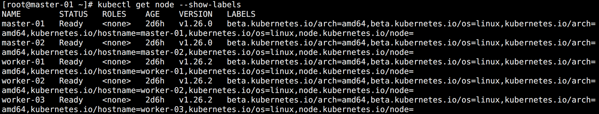
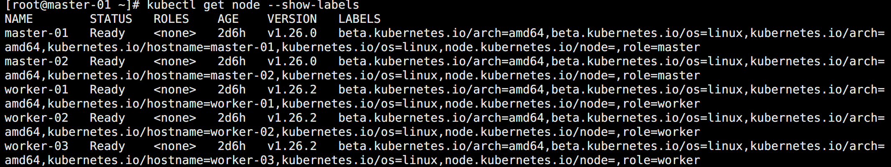
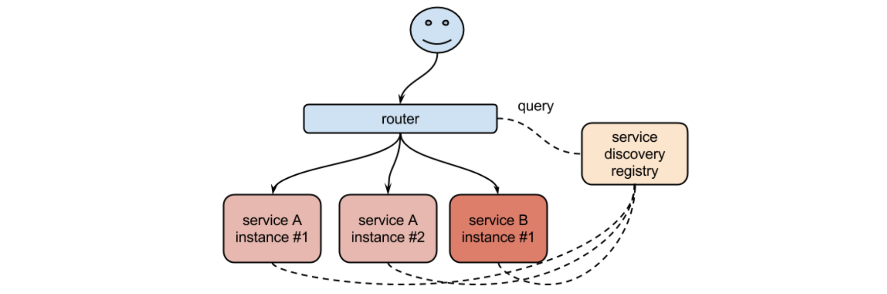
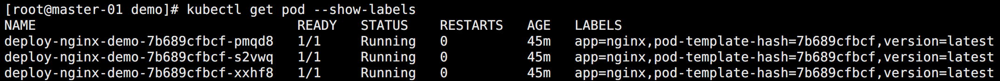
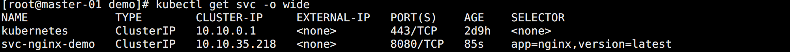
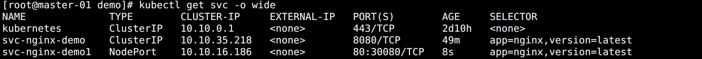
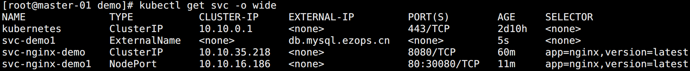
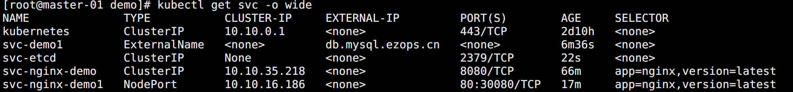

## 标签选择器

在某些使用场景中，可能会遇到将访问部署到指定的节点情况。为了区分这部分节点，一般会选择给这些节点打上特定的标签，在部署的时候通过标签选择器（`Label Selector`）来限制部署的节点。


### 查看标签

查看节点的标签：

```bash
# 查看节点的标签
kubectl get node --show-labels
```

使用 `--show-lables` 也可以用来查看 Pod 的标签。



其中 `kubernetes.io/os=linux` 标签是一个常用的标签，如果集群包括多种系统，该标签可以用来标识系统。


### 添加标签

给节点打标签：

```bash
kubectl label nodes master-01 role=master
kubectl label nodes master-02 role=master
kubectl label nodes worker-01 role=worker
kubectl label nodes worker-02 role=worker
kubectl label nodes worker-03 role=worker
```

查看打的标签：




### 标签过滤

通过标签过滤节点：

```bash
# 筛选含有指定标签的节点
kubectl get node --show-labels -l role

# 筛选指定标签为指定值的节点
kubectl get node --show-labels -l role=master

# 多条件过滤
kubectl get node --show-labels -l role=master,kubernetes.io/os=linux

# 多条件过滤
kubectl get node --show-labels -l "role in (master,worker)"

# 过滤取反
kubectl get node --show-labels -l role!=worker
```


### 修改/删除标签

修改标签：

```bash
kubectl label node worker-03 role=node --overwrite
```

其实跟添加 label 的命令时一样的，但是标签已经存在，不加 `--overwrite` 参数，则会提示报错：

> error: 'role' already has a value (worker), and --overwrite is false

<br>

删除标签：

```bash
kubectl label node worker-03 role-
```

只需要在标签名称后面跟一个 `-` 则可以删除指定标签。


## Service

在直接使用 Pod 或者 Deployment 等控制器的时候发现一个问题：应然如何将服务暴露给用户访问？

用 IP 显然是不合适的。一是因为 Pod 可能会挂掉或更新发生重建，Pod IP 会发生变化。二是如果采用多副本部署，岂不意味着需要暴露多个访问地址，而且还有如何实现负载均衡的问题。

对于这种问题，在没有使用 Kubernetes 之前，可以选择安装一个 Nginx 反向代理后端多节点，但是这在 IP 可能会变化的环境是没法配置的。于是便有了注册中心的概念，让服务启动后自动注册到注册中心，然后调度的时候通过访问固定的注册中心获取到最新的端点进行代理。常见的注册中心有 Consul，Zookeeper，ETCD 等。



为解决这些问题，Kubernetes 提供了这样的一个资源对象：`Service`，简称 `svc`。

Service 是一种抽象的对象，它定义了一组 Pod 的逻辑集合和一个用于访问它们的策略，通过 Label Selector 来决定下面包含的 Pod 集合。

在使用 Service 之前需要明白一个概念，在 Kubernetes 中存在三类 IP：

* `Node IP`：宿主机自己的 IP 地址。
* `Pod IP`：Pod 运行时被分配的 IP 地址，在创建 Kubernetes 集群的时候有定义它的网段。
* `Cluster IP`：Service 使用的 IP 地址，在创建 Kubernetes 集群的时候有定义它的网段。

集群外部的机器想要访问集群内部的服务，只能通过 Node IP 进行访问。

Cluster IP 是一个虚拟 IP，仅仅作用于 Service 这个对象，由 Kubernetes 自己进行管理和分配地址。


## Kube-proxy

Kube-proxy 运行在每一个 Node 上面，负责为 Service 实现一种 VIP 的代理形式。它支持两种模式：

* `iptables`：默认模式，该模式下，kube-proxy 会 watch API Server 对 Service 对象和 Endpoints 对象的添加和移除。通过 iptable 规则将请求重定向到 Service 代理的集合中的某一个 Pod 上面。并且配合 `Pod readiness 探针` 验证 Pod 是否正常，保障服务的可用性。

* `ipvs`：该模式下，kube-proxy 会 watch Kubernetes 服务和端点，调用 `netlink` 接口创建 IPVS 规则， 并定期将 IPVS 规则与 Kubernetes 服务和端点同步。访问服务时，IPVS 将流量定向到后端 Pod 之一。IPVS 代理模式基于类似于 iptables 模式的 netfilter 钩子函数，但是使用哈希表作为基础数据结构，并且在内核空间中工作。所以与 iptables 模式相比，IPVS 模式下的重定向通信的延迟更短，并且在同步代理规则时具有更好的性能。同时，IPVS 模式还支持更高的网络流量吞吐量。所以一般会将 Kube-proxy 的模式改成 ipvs。但是如果节点不满足 IPVS 的运行条件，模式会自动降级为 iptables。

<br>

IPVS 提供了更多选项来平衡后端 Pod 的流量，默认是 `rr`：

  - rr：round-robin
  - lc：least connection
  - dh：destination hashing
  - sh：source hashing
  - sed：shortest expected delay
  - nq：never queue

可以通过 Kube-proxy 中配置 `–ipvs-scheduler` 参数进行修改。


## Service 类型

在定义 Service 的时候可以指定一个自己需要的类型，默认为 `ClusterIP`，常用的 Service 类型如下：

- `ClusterIP`：通过 Cluster IP 暴露服务，服务只能在集群内部访问。
- `Headless Service`：只有解析，没 Cluster IP 的 Service，前面 StatefulSet 的时候有用到过。
- `NodePort`：通过每个 Node 节点上的 IP 和端口暴露服务。Node 本地并不会映射的监听端口，因为采用的是 ipvs 内核转发，当请求到达服务器指定端口的时候，会将请求路由到对应 Service。用户在集群外也可以通过 NodeIP + 端口访问集群部署的服务。
- `LoadBalancer`：使用云提供商的负载均衡器向外部暴露服务。外部负载均衡器可以路由到 NodePort 服务和 ClusterIP 服务。
- `ExternalName`：通过返回 `CNAME` 和它的值，可以将服务映射到 `externalName` 字段的内容。


### 创建 Deployment

在使用 Service 之前，先创建一个 Deployment 用于代理测试：

```yaml
apiVersion: apps/v1
kind: Deployment
metadata:
  name: deploy-nginx-demo
spec:
  replicas: 3
  selector:
    matchLabels:
      app: nginx
      version: latest
  template:
    metadata:
      labels:
        app: nginx
        version: latest
    spec:
      containers:
      - name: nginx
        image: nginx
        ports:
        - containerPort: 80
```

如图所示：




### ClusterIP

Service 资源清单示例：

```yaml
apiVersion: v1
kind: Service
metadata:
  name: svc-nginx-demo
spec:
  type: ClusterIP
  selector:
    app: nginx
    version: latest
  ports:
  # Service 暴露的端口
  - port: 8080
    # Pod 暴露的端口
    targetPort: 80
    protocol: TCP
```

创建结果如图所示：



每一个名称空间下都会有一个叫做 `kubernetes` 的 Service。

在定义 Deployment 的时候给 port 定义了 name 字段，那么 Service 资源中的 targetPort 字段就可以直接写 name 字段的内容，而不一定是特定的端口。另外，Service 是支持 TCP，UDP 协议的，如果没定义默认为 TCP。

Kubernetes 集群内的 Pod 和宿主机都可以通过 Cluster IP + Port 的方式访问到该 Service 代理的服务。

但是 Service 可能会更新重建，Cluster IP 可能发生改变。为此，Pod 中推荐使用 `Service名称.名称空间.svc.cluster.local` 的解析访问指定的 Service。其中 `.svc.cluster.local` 可以省略掉。要是同一名称空间，名称空间也可以省略掉。集群的 CoreDNS 都会做相关的解析。这样就保证了 Pod 中无论你 Cluster IP 怎么变，请求的地址都不需要变。


### NodePort

如果设置 type 的值为 NodePort，Kubernetes master 将从给定的端口范围内分配一个端口，每个 Node 都将从该端口代理到 Service。如果不指定端口会随机生成一个端口。

```yaml
apiVersion: v1
kind: Service
metadata:
  name: svc-nginx-demo1
spec:
  type: NodePort
  selector:
    app: nginx
    version: latest
  ports:
  - protocol: TCP
    # Service 端口
    port: 80
    # Pod 端口
    targetPort: 80
    # Node 端口
    nodePort: 30080
```

如图所示：



用户可以通过 Service IP + Service 端口访问，也可以任意节点 IP + nodePort 访问。

需要注意的是，在安装 API Server 的时候配置了 `--service-node-port-range=30000-50000`，所以端口是有范围限制的。


### ExternalName

ExternalName 是 Service 的特例，它没有 Selector，也没有定义任何的端口和 Endpoint。常用于将集群外部的服务，以别名的方式向集群内部提供服务。

```yaml
apiVersion: v1
kind: Service
metadata:
  name: svc-demo1
spec:
  type: ExternalName
  externalName: db.mysql.ezops.cn
```

比如现有一个 mysql 服务，访问地址为：`db.mysql.ezops.cn`

为了统一集群内访问地址，使用 Service 做个转发，类似于 CNAME 解析。当请求 `svc-demo1.default.svc.cluster.local` 这个地址的的时候转发到 `db.mysql.ezops.cn` 上。

这样做的好处在于，即使后期这个数据库的连接地址变了，也不用更新应用程序中的数据库地址配置，只需要修改这个 Service 即可。




### Headless Service

除了通过 ExternalName 将集群外部服务配置进集群以外，通过学习 StatefulSet 控制器的时候提到了 Headless Service 也能做到。

通过自定义 Endpoints 来创建 Service，设置 `clusterIP=None` 的 Headless Service。

比如将 ETCD 访问引入集群中：

```yaml
apiVersion: v1
kind: Service
metadata:
  name: svc-etcd
spec:
  type: ClusterIP
  clusterIP: None
  ports:
  - port: 2379

---

apiVersion: v1
kind: Endpoints
metadata:
  # 名称必须和 Service 一致
  name: svc-etcd
subsets:
  - addresses:
    - ip: 192.168.2.221
    - ip: 192.168.2.222
    ports:
    - port: 2379
```

如图所示：



此时在集群中就可以通过 Service 的解析地址访问到集群外的 ETCD 服务了。


### LoadBalancer

一般只有云平台才支持 LoadBalancer，如果脱离云平台，想要在自己的私有网络中的 Kubernetes 集群也能体验到 LoadBalabcer，可以使用 `MetalLB`，`PureLB` 或者 `OpenELB`。

三者的对比可以查看文档：

> https://blog.csdn.net/easylife206/article/details/124463983


## 获取客户端 IP（了解）

当集群内的客户端连接到服务的时候，Pod 是可以获取到客户端的 IP 地址的，但是当外部请求通过节点路由连接时，由于对数据包执行了源网络地址转换（SNAT），因此数据包的源 IP 地址会发生变化，后端的 Pod 无法看到实际的客户端 IP，这对于 nginx 这类服务是不合适的。

为了解决这个问题，Service 提供了参数：

```yaml
spec:
  externalTrafficPolicy: Local
```

通过这个参数，能够让外部请求的 IP 只能是拥有部署了后端节点的 IP，如果请求的 Node IP 上面没有部署该服务，则请求会失败。

如果非要实现这个功能，可以通过定义 Pod 的 `spec` 的时候通过 `nodeSelector` 让服务只部署到确定节点上。再通过对应的节点来访问。

