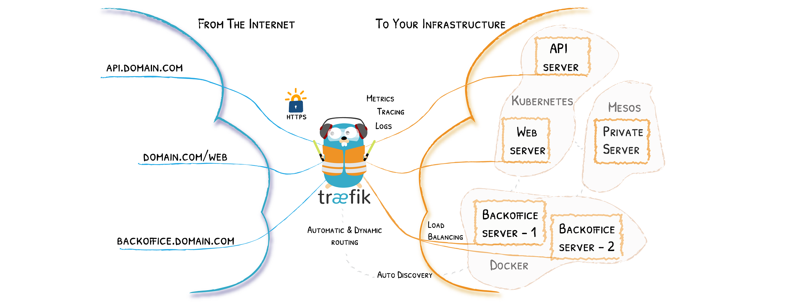
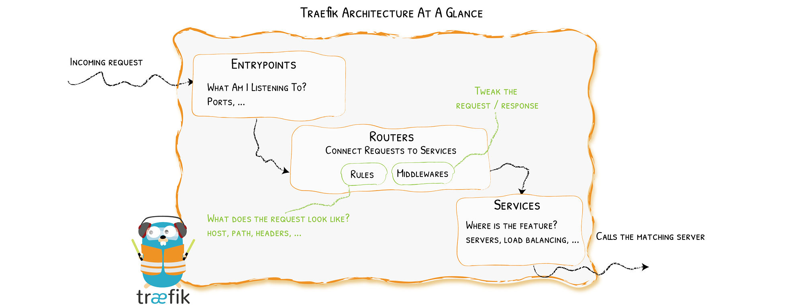

## Traefik

`Traefik` 是一个开源的可以使服务发布变得轻松的边缘路由器。它负责接收你系统的请求，然后使用合适的组件来对这些请求进行处理。



Traefik 兼容所有主流的集群技术，比如 Kubernetes，Docker，Docker Swarm，AWS，Mesos，Marathon，等等，并且可以同时处理多种方式。使用 Traefik，不需要维护或者同步一个独立的配置文件。因为一切都会自动配置，实时操作（无需重新启动，不会中断连接）。你可以花更多的时间在系统的开发和新功能上面，而不是在配置和维护工作状态上面。


## 核心概念

Traefik 是一个边缘路由器，是平台的入口，拦截并路由每个传入的请求。

它知道所有的逻辑和规则，这些规则确定哪些服务处理哪些请求。传统的反向代理需要一个配置文件，其中包含路由到你服务的所有可能路由，而 Traefik 会实时检测服务并自动更新路由规则，可以自动服务发现。



当启动 Traefik 时，需要定义 `entrypoints`（入口点），根据连接到这些 entrypoints 的 `路由` 来分析传入的请求，查看他们是否与一组 `规则` 相匹配，如果匹配，则路由可能会将请求通过一系列 `中间件` 转换过后再转发到你的 `服务` 上去。

在了解 Traefik 之前有几个核心概念需要了解：

- `Providers`：用来自动发现平台上的服务，可以是编排工具、容器引擎或者 key-value 存储等，比如 Docker、Kubernetes。
- `Entrypoints`：监听传入的流量（端口等），是网络入口，定义了接收请求的端口（HTTP 或者 TCP）。
- `Routers`：分析请求（host, path, headers, SSL, …），负责将传入请求连接到可以处理这些请求的服务上去。
- `Services`：将请求转发给你的应用（load balancing, …），负责配置如何获取最终将处理传入请求的实际服务。
- `Middlewares`：中间件，用来修改请求或者根据请求来做出一些判断（authentication, rate limiting, headers, ...），中间件被附件到路由上，是一种在请求发送到你的服务之前（或者在服务的响应发送到客户端之前）调整请求的一种方法。


## 安装 Traefik

Traefik 2.X 版本和之前的 1.X 版本不兼容，推荐使用功能更加强大的 2.X 版本。

Traefik 中的配置有两种方式：

- 动态配置：完全动态的路由配置
- 静态配置：在 Traefik 中有三种方式定义静态配置：
  - 在配置文件中
  - 在命令行参数中
  - 通过环境变量传递

Traefik 官方提供了 Docker，二进制，Kubernetes helm 的安装方式。

由于本文采用 helm 的安装方式，如果不清楚 helm 用法的，建议先去看 helm 部分的内容。

```bash
# 拉代码
cd /ezops/service/kubernetes/addons/
git clone https://github.com/traefik/traefik-helm-chart
cd traefik-helm-chart
```


